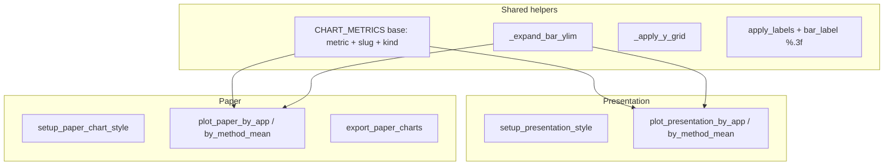

# Paper Column Charts

## Goal

Generate the **same 8 charts** as presentation (4 metrics × by-app / by-method-mean), with **identical data and bar values**, but formatting suited for a **single `\columnwidth` figure** in the mwart two-column A4 paper (~**3.35 in / 8.5 cm** wide).

| # | Metric | By-app (unaggregated) | By-method (averaged) |
|---|--------|----------------------|----------------------|
| 1–2 | `average_change_impact` | Aplikacja × methods | Metoda, mean over apps |
| 3–4 | `dep_avg` | same | same |
| 5–6 | `node_f1` | same | same |
| 7–8 | `edge_f1` | same | same |

**Output (user choice):**
- PDF → [`tex/assets/`](tex/assets/) (for `\includegraphics[width=\columnwidth]{...}`)
- PNG → [`code/notebooks/output/paper/`](code/notebooks/output/paper/) (notebook preview)

## Formatting spec (paper vs presentation)

| Aspect | Presentation (keep as-is) | Paper (new) |
|--------|---------------------------|-------------|
| Context | `talk` | **`paper`** |
| Font | Verdana sans-serif | **Serif** (`DejaVu Serif` / `serif` fallback) |
| Width | 12.0″ by-app / 3.2″ by-method | **Both ~3.35″** (column fit) |
| Height | 4.2″ | **~2.6–2.8″** (compact, room for bottom legend on by-app) |
| Grid | major + minor Y | **same** (`_apply_y_grid`) |
| Despine | `trim=True` | **none** (standard seaborn axes, matches existing [`export_charts.py`](code/notebooks/export_charts.py)) |
| Y ticks | `%.2f` | **same** |
| Bar labels | `%.3f` | **same** |
| Bar groups | default width | **tighter** (`width≈0.65`, optional `gap` tweak on seaborn ≥0.13) |
| Legend (by-app) | right, no frame | **below**, **horizontal** (`ncol=3`), **`frameon=True`** |
| Y labels | single line | **two lines** with hint |

**Y-axis labels:**

- **Structural** (`average_change_impact`, `dep_avg`):
  - Line 1: metric name + `\n(mniej = lepiej)`
  - `dep_avg`: line 1 text **`Dependency degree`** in **bold** (not “Maintainability Index”)
  - `average_change_impact`: `Change Impact` (normal weight; no italic unless you prefer parity with slides)
- **F1** (`node_f1`, `edge_f1`):
  - `F1 (usługi)\n(więcej = lepiej)` / `F1 (krawędzie)\n(więcej = lepiej)`

**Axis titles:** keep Polish **`Aplikacja`** / **`Metoda`** and existing `SHORT_LABELS` (`eShop`, ETS, etc.).

## Architecture

Refactor shared mechanics in [`code/notebooks/_experiment_viz.py`](code/notebooks/_experiment_viz.py) so presentation and paper do not duplicate plotting logic:



### 1. Shared metric registry

Replace presentation-only `PRESENTATION_METRICS` with a base list reused by both modes:

```python
CHART_METRICS = [
    {"metric": "average_change_impact", "slug": "change_impact", "kind": "structural"},
    {"metric": "dep_avg", "slug": "dependency_degree", "kind": "structural"},
    {"metric": "node_f1", "slug": "node_f1", "kind": "f1"},
    {"metric": "edge_f1", "slug": "edge_f1", "kind": "f1"},
]
```

Presentation keeps its display names via a small mapper; paper builds multiline y-labels from `kind` + metric.

Rename `_expand_presentation_ylim` → **`_expand_bar_ylim`** (used by both).

### 2. Paper style + layout constants

Add near presentation block in [`_experiment_viz.py`](code/notebooks/_experiment_viz.py):

```python
PAPER_WIDTH = 3.35      # ≈ \columnwidth on A4 twocolumn
PAPER_HEIGHT = 2.7
PAPER_DPI = 200         # PNG preview; PDF vector
PAPER_BAR_WIDTH = 0.65
PAPER_BAR_LABEL_SIZE = 6
PAPER_MARGIN_LEFT = 0.22   # room for two-line y-label
PAPER_MARGIN_BOTTOM = 0.28 # by-app with legend below
PAPER_MARGIN_BOTTOM_COMPACT = 0.20  # by-method, no legend
```

- **`setup_paper_chart_style()`**: `sns.set_theme(style="whitegrid", context="paper")`, Set2 palette, serif rcParams (`font.family: serif`, tick/label sizes ~8–9 pt tuned after first render).
- **`_set_paper_ylabel(ax, spec)`**: sets two-line label; applies **`fontweight="bold"`** only for `dep_avg` main line; hint line regular weight (single `set_ylabel` with bold whole label is acceptable fallback if mixed-weight proves fragile—prefer split styling via `ax.yaxis.label` + fontsize only on hint if needed).
- **`_finalize_paper_layout(fig, ax, *, legend_below=False)`**: horizontal x labels; by-app calls legend relocation:

```python
ax.legend(loc="upper center", bbox_to_anchor=(0.5, -0.18), ncol=3, frameon=True)
fig.subplots_adjust(bottom=0.32, left=0.22, right=0.98, top=0.95)
```

- Reuse **`_expand_bar_ylim`** after bar labels so values stay below top y-tick (same headroom logic as presentation).

### 3. Paper plot functions

Mirror presentation API:

- `plot_paper_by_app(df, spec, short_labels, save_base=None)`
- `plot_paper_by_method_mean(df, spec, short_labels, save_base=None)`
- `render_paper_charts(df, short_labels)` — inline notebook display
- `export_paper_charts(df, short_labels, pdf_dir, png_dir=None)` — writes 8 stems:

```
change_impact_by_app
change_impact_by_method_mean
dependency_degree_by_app
dependency_degree_by_method_mean
node_f1_by_app
node_f1_by_method_mean
edge_f1_by_app
edge_f1_by_method_mean
```

Filenames: `{slug}_by_app.pdf` / `.png` and `{slug}_by_method_mean.pdf` / `.png`.

`savefig(..., bbox_inches="tight", dpi=PAPER_DPI)` for PNG; PDF to `tex/assets/`.

### 4. Export script

New [`code/notebooks/export_paper_charts.py`](code/notebooks/export_paper_charts.py) (parallel to [`export_presentation_charts.py`](code/notebooks/export_presentation_charts.py)):

- `MPLBACKEND=Agg`
- Reuse `SHORT_LABELS` from presentation export
- `setup_paper_chart_style()`
- `export_paper_charts(df, SHORT_LABELS, pdf_dir=../../tex/assets, png_dir=output/paper)`

Run:

```bash
cd code && uv run python -m notebooks.export_paper_charts
```

### 5. Notebook cell

Add a cell after the presentation export cell in [`experiment_results.ipynb`](code/notebooks/experiment_results.ipynb):

```python
from _experiment_viz import render_paper_charts, export_paper_charts, setup_paper_chart_style
setup_paper_chart_style()
render_paper_charts(df, SHORT_LABELS)
export_paper_charts(df, SHORT_LABELS, Path("../../tex/assets"), Path("output/paper"))
```

### 6. Verification

1. Export script produces **8 PDFs** in `tex/assets/` and **8 PNGs** in `output/paper/`.
2. Spot-check values match presentation exports (same `df`, no averaging on by-app).
3. Visual check at `\columnwidth`:
   - no overlapping bar labels / x ticks
   - legend below by-app charts, framed, 3 entries in one row
   - y-ticks at 2 decimals; bar tops at 3 decimals
   - serif font, paper context scale
4. Compile sanity: one figure in LaTeX with `\includegraphics[width=\columnwidth]{change_impact_by_method_mean}` (optional manual check; **no tex edits in scope** unless you ask).

## Notes

- Existing [`fig_depavg_method.pdf`](tex/assets/) etc. remain until `00-intro.tex` is updated to reference the new 8 filenames—out of scope unless requested.
- Presentation code path stays unchanged except shared helper rename/extraction.
