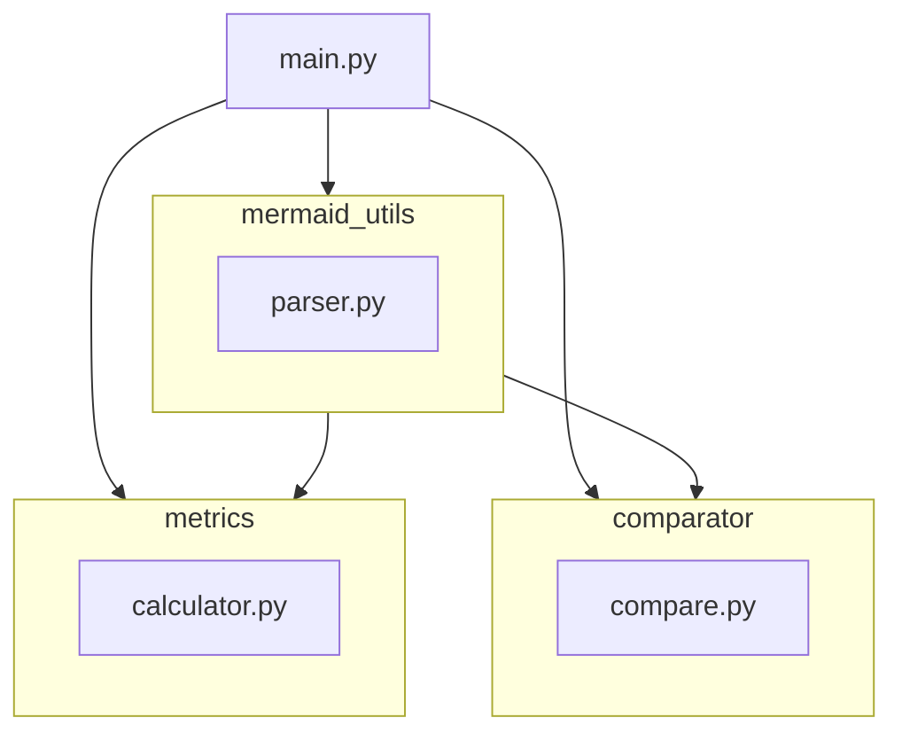

# Architecture Metrics & Comparator

A Python tool for computing quality metrics and comparing AI-generated software
architecture diagrams encoded as [Mermaid](https://mermaid.js.org/) flowcharts.

---

## Prerequisites

| Requirement | Version |
|-------------|---------|
| Python      | $\geq$ 3.11  |
| Node.js     | any LTS (required by `mermaid-parser-py`) |
| [uv](https://docs.astral.sh/uv/) | latest |

> **Why Node.js?** The `mermaid-parser-py` dependency bundles the original
> MermaidJS parser and calls it via PythonMonkey. Node.js must be on your
> `PATH` before running any command that parses `.mmd` files.

---

## Installation

```bash
# from the code/ directory
uv sync
```

This creates a `.venv` virtual environment and installs all runtime and
development dependencies declared in `pyproject.toml`.

---

## Running the tests

```bash
uv run pytest
```

Expected output: **50 passed**.

- `tests/test_parser.py` — Mermaid parsing (requires Node.js)
- `tests/test_metrics.py` — DepAvg, ACI (pure Python, no Node.js)
- `tests/test_comparator.py` — precision/recall (pure Python, no Node.js)

To run only the Node.js-free tests:

```bash
uv run pytest tests/test_metrics.py tests/test_comparator.py
```

---

## CLI usage

```
python main.py <mode> <args>
```

### `metrics` — compute architecture quality metrics

```bash
python main.py metrics path/to/diagram.mmd
```

Parses the Mermaid flowchart and prints two metrics as JSON:

```json
{
  "dep_avg": 1.0,
  "average_change_impact": 0.111
}
```

### `compare` — compare a generated architecture against a base

```bash
python main.py compare path/to/base.mmd path/to/generated.mmd
```

Prints precision and recall for both nodes and edges, plus raw counts:

```json
{
  "node_precision": 1.0,
  "node_recall": 0.75,
  "edge_precision": 1.0,
  "edge_recall": 0.666,
  "base_node_count": 4,
  "generated_node_count": 3,
  "common_node_count": 3,
  "base_edge_count": 3,
  "generated_edge_count": 2,
  "common_edge_count": 2
}
```

### Example `.mmd` file

```
flowchart TD
    Gateway[API Gateway] --> Auth[Auth Service]
    Gateway --> Catalog[Catalog Service]
    Catalog --> DB[Database]
```

---

## Metrics reference

All metrics treat the architecture as a **directed graph** where nodes are
components and edges are dependencies. Scenarios are auto-simulated: one
scenario per component, where that component is the origin of a change.

### DepAvg — Average Dependency Degree

Measures mean coupling per component.

$$
\text{DepAvg} = \frac{1}{|C|} \sum_{k \in C} d_k 
$$

where \(d_k\) is the number of *outgoing* edges (dependencies) of component \(k\).
A lower value indicates less coupling and potentially better modularity.

### ACI — Average Change Impact

Approximates how far a change ripples through the architecture.  For each
component \(i\), every component *transitively reachable* from it (direct and
indirect dependents) is counted as affected (\(c_i\)).

$$
\text{ACI} = \frac{1}{C} \cdot \frac{1}{N} \sum_{i=1}^{N} c_i = \frac{1}{C^2} \sum_{i=1}^{C} c_i \quad (N = C) 
$$

A lower ACI means changes are better localised.

---

## Comparison metrics

Based on the *Reference Service Graph* approach: treat the base architecture
as ground truth and measure how well the generated architecture recovers it.

| Metric | Formula |
|--------|---------|
| **Precision** | $\lvert gen \cap base \rvert / \lvert gen \rvert$ — fraction of generated elements that are also in the reference |
| **Recall** | $\lvert gen \cap base \rvert / \lvert base \rvert$ — fraction of reference elements that were generated |

Both **nodes** (components) and **edges** (dependencies) are evaluated
separately.  Node matching is case-insensitive.

---

## Package structure




## Data
-  HotelPricingSystem
    - [Architecture](../submodules/HotelPricingSystem/Design/Architecture.md)
    - [Domain model](../submodules/HotelPricingSystem/Design/DomainModel.md)
- Pitstop
    - [General arch docs](../submodules/pitstop/docs/arc42/arc42.md)
    - [Scopes](../submodules/pitstop/docs/arc42/01-introduction-and-goals.md)
    - [constraints](../submodules/pitstop/docs/arc42/02-architecture-constraints.md)
- EventTicketSystem
    - [Architecture & architectural drivers](../submodules/EventTicketSystem/Design/Architecture.md)
