# Event Ticket Booking System — Architecture Document

## Table of Contents

1. [Introduction](#1-introduction)
2. [Context Diagram](#2-context-diagram)
3. [Architectural Drivers](#3-architectural-drivers)
   - [3.1 User Stories](#31-user-stories)
   - [3.2 Quality Attribute Scenarios](#32-quality-attribute-scenarios)
   - [3.3 Architectural Concerns](#33-architectural-concerns)
   - [3.4 Constraints](#34-constraints)
4. [Domain Model](#4-domain-model)
   - [4.1 Requirements Consistency Review](#41-requirements-consistency-review)
   - [4.2 Bounded Contexts](#42-bounded-contexts)
   - [4.3 Domain Model Class Diagram](#43-domain-model-class-diagram)
   - [4.4 Domain Elements Description](#44-domain-elements-description)
   - [4.5 Cross-Context Integration Summary](#45-cross-context-integration-summary)
5. [Container Diagram](#5-container-diagram)
   - [5.1 Diagram](#51-diagram)
   - [5.2 Container Descriptions](#52-container-descriptions)
6. [Component Diagrams](#6-component-diagrams)
7. [Sequence Diagrams](#7-sequence-diagrams)
   - [7.1 Iteration 1 — Core System Structure and External Identity Integration](#71-iteration-1--core-system-structure-and-external-identity-integration)
   - [7.2 Iteration 2 — Event Management and Basic Search](#72-iteration-2--event-management-and-basic-search)
   - [7.3 Iteration 3 — Ticket Inventory and Order Management](#73-iteration-3--ticket-inventory-and-order-management)
   - [7.4 Iteration 4 — Payment Processing and Ticket Generation](#74-iteration-4--payment-processing-and-ticket-generation)
8. [Interfaces](#8-interfaces)
9. [Design Decisions](#9-design-decisions)

---

## 1. Introduction

This document describes the software architecture of the **Event Ticket Booking System**, a modern, scalable platform that enables event attendees to browse, purchase, and manage tickets and allows event organisers to create, manage, and monitor events.

The document is produced following the **Attribute-Driven Design (ADD 3.0)** process, which drives architectural decisions from a prioritised set of architectural drivers: user stories, quality attribute scenarios, architectural concerns, and constraints. The final architecture is based on a **microservices** style, where each bounded context identified through Domain-Driven Design corresponds to one or more independently deployable services.

The document is structured to support incremental development across four iterations as defined in the Iteration Plan. It uses the **C4 model** as the primary notation for structural views (context, container, and component diagrams), and **UML sequence diagrams** for behavioural views. Design decisions are recorded in a decision log in section 9.

The intended audience is the development team, architects, and technical stakeholders responsible for building and maintaining the system.

---

## 2. Context Diagram

The context diagram below positions the Event Ticket Booking System within its environment. It shows the system as a single black box and captures all external actors and systems that interact with it, together with the nature of each interaction. This level of abstraction is useful for agreeing on system scope and for identifying integration points that will become architectural concerns in later sections.

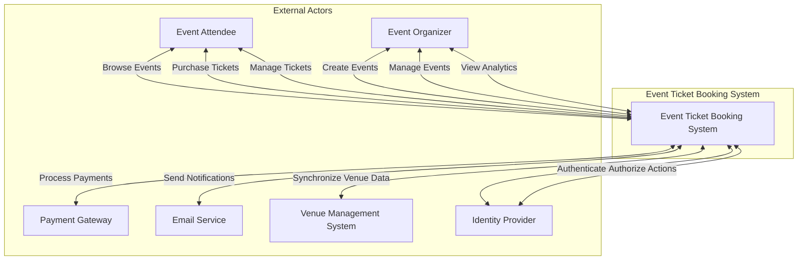

### External Actors

| Actor | Description |
|-------|-------------|
| Event Attendee | Individual users who browse, purchase, and manage event tickets |
| Event Organizer | Users who create and manage events, view analytics, and handle ticket sales |
| Payment Gateway | External service that processes financial transactions and payments |
| Email Service | External service that handles delivery of email notifications and communications |
| Venue Management System | External system that manages venue information, seating arrangements, and capacity |
| Identity Provider | External service that handles user authentication, authorisation, and identity management |

---

## 3. Architectural Drivers

This section summarises the complete set of architectural drivers that shape the system design. Drivers are divided into user stories (functional requirements), quality attribute scenarios (non-functional requirements), architectural concerns (cross-cutting operational and governance requirements), and constraints (non-negotiable boundary conditions).

### 3.1 User Stories

| ID | User Story | Feature | Priority |
|----|------------|---------|----------|
| US001 | User Registration | F1 — User Authentication | High |
| US002 | Email Verification | F1 — User Authentication | High |
| US003 | User Login | F1 — User Authentication | High |
| US004 | Password Reset | F1 — User Authentication | High |
| US005 | Event Creation | F2 — Event Management | High |
| US006 | Event Editing | F2 — Event Management | Medium |
| US007 | Event Listing Display | F2 — Event Management | High |
| US008 | Event Status Management | F2 — Event Management | Medium |
| US009 | Inventory Creation | F3 — Ticket Inventory Management | High |
| US010 | Inventory Updates | F3 — Ticket Inventory Management | High |
| US011 | Inventory Reporting | F3 — Ticket Inventory Management | Medium |
| US012 | Ticket Selection | F4 — Ticket Purchase | High |
| US013 | Payment Processing | F4 — Ticket Purchase | High |
| US014 | Order Confirmation | F4 — Ticket Purchase | High |
| US015 | Ticket Generation | F5 — Digital Ticket Generation | High |
| US016 | Ticket Delivery | F5 — Digital Ticket Generation | High |
| US017 | Ticket Management | F5 — Digital Ticket Generation | Medium |
| US018 | Basic Event Search | F8 — Event Search and Discovery | High |
| US019 | Advanced Event Filtering | F8 — Event Search and Discovery | Medium |
| US020 | Event Discovery | F8 — Event Search and Discovery | Low |
| US021 | User Notifications | F15 — Email Notifications | Medium |
| US022 | Event Organizer Notifications | F15 — Email Notifications | Medium |
| US023 | Notification Preferences | F15 — Email Notifications | Low |

### 3.2 Quality Attribute Scenarios

| ID | Scenario | Quality Attribute | Business Priority | Technical Priority |
|----|----------|------------------|-------------------|--------------------|
| QAS001 | High-Concurrency Ticket Purchase — 1 000+ concurrent users, < 2 s response, 0 overselling | Performance | High | High |
| QAS002 | Search Response Time — results within 500 ms for 99 % of queries on 1 M+ event dataset | Performance | High | Medium |
| QAS003 | Payment Data Protection — all card data encrypted in transit and at rest, PCI-DSS compliant | Security | High | High |
| QAS004 | Authentication Security — account locked after 5 failed attempts, IP blocked after 20 | Security | High | High |
| QAS005 | Event Creation Load — 100+ concurrent event creation requests without degradation | Scalability | Medium | Medium |
| QAS006 | Database Scaling — 10 000+ concurrent DB connections, read replicas for read operations | Scalability | High | High |
| QAS007 | Transaction Integrity — no partial transactions; every transaction completes or rolls back | Reliability | High | High |
| QAS008 | Data Consistency — no inventory overselling, all services converge on consistent state | Reliability | High | High |
| QAS009 | Mobile Responsiveness — UI adapts to all screen sizes, touch-optimised navigation | Usability | High | Medium |
| QAS010 | Error Handling — clear, actionable, non-technical error messages for all failure modes | Usability | High | Medium |
| QAS011 | Code Deployment — deployment within 5 min, rollback within 2 min | Maintainability | Medium | Medium |
| QAS012 | Monitoring and Debugging — all critical operations logged, root-cause analysis within 1 h | Maintainability | High | Medium |
| QAS013 | Payment Gateway Integration — API changes accommodated within 24 h without disruption | Interoperability | High | High |
| QAS014 | External Service Integration — service API changes handled within 48 h | Interoperability | Medium | Medium |
| QAS015 | System Recovery from Failure — recovery within 30 s, no data loss | Availability | High | High |
| QAS016 | Scheduled Maintenance — system operational during maintenance, max 5 min read-only | Availability | Medium | Medium |
| QAS017 | Automated Testing — suite runs < 10 min, > 80 % coverage, catches 95 % regressions | Testability | High | Medium |
| QAS018 | Integration Testing — integration tests run < 15 min, all external calls mockable | Testability | High | Medium |
| QAS019 | Feature Addition — new features addable without downtime, existing features unaffected | Modifiability | Medium | Medium |
| QAS020 | Configuration Changes — config changes applied within 1 min, no restart | Modifiability | Medium | Low |
| QAS021 | Zero-Downtime Deployment — rolling update within 10 min, no session interruption | Deployability | High | High |
| QAS022 | Environment Consistency — identical config management across dev/staging/prod | Deployability | High | High |
| QAS023 | Feature Flag Management — flags toggled within 1 min, propagated within 30 s | Deployability | High | Medium |
| QAS024 | Configuration Management — config propagated within 30 s, 30-day history, instant rollback | Deployability | High | Medium |
| QAS025 | Deployment Verification — health checks complete within 2 min, error rate < 0.1 % | Deployability | High | Medium |

### 3.3 Architectural Concerns

| ID | Concern | Category | Priority |
|----|---------|----------|----------|
| C001.1.1 | Data retention policies | Data Management | Medium |
| C001.1.2 | Data archiving strategies | Data Management | Medium |
| C001.1.3 | Data cleanup procedures | Data Management | Medium |
| C001.2.1 | Data migration strategy | Data Management | Medium |
| C001.2.2 | Backward compatibility | Data Management | High |
| C001.2.3 | Data validation | Data Management | High |
| C001.3.1 | Backup frequency and retention | Data Management | High |
| C001.3.2 | RPO and RTO | Data Management | High |
| C001.3.3 | Geographic distribution | Data Management | Medium |
| C002.1.1 | Third-party service failure handling | Integration | High |
| C002.1.2 | Rate limiting and quota management | Integration | High |
| C002.1.3 | Fallback mechanisms | Integration | High |
| C002.1.4 | Version management | Integration | Medium |
| C002.2.1 | API versioning strategy | Integration | High |
| C002.2.2 | Backward compatibility | Integration | High |
| C002.2.3 | API documentation | Integration | Medium |
| C002.2.4 | API gateway configuration | Integration | High |
| C003.1.1 | Encryption standards | Security | High |
| C003.1.2 | Key management | Security | High |
| C003.1.3 | Secure storage | Security | High |
| C003.1.4 | Data masking | Security | Medium |
| C003.2.1 | RBAC implementation | Security | High |
| C003.2.2 | Permission granularity | Security | High |
| C003.2.3 | Audit logging | Security | High |
| C003.2.4 | Session management | Security | High |
| C003.3.1 | GDPR compliance | Security / Compliance | High |
| C003.3.2 | Data residency | Security / Compliance | High |
| C003.3.3 | Compliance reporting | Security / Compliance | Medium |
| C003.3.4 | Data subject access | Security / Compliance | Medium |
| C004.1.1 | Logging standards | Operations | High |
| C004.1.2 | Metrics collection | Operations | High |
| C004.1.3 | Alerting thresholds | Operations | High |
| C004.1.4 | Distributed tracing | Operations | Medium |
| C004.2.1 | Disaster recovery site | Operations | High |
| C004.2.2 | Failover procedures | Operations | High |
| C004.2.3 | Business continuity | Operations | High |
| C004.2.4 | Geographic redundancy | Operations | Medium |
| C004.3.1 | Resource scaling | Operations | High |
| C004.3.2 | Cost optimization | Operations | Medium |
| C004.3.3 | Performance baseline | Operations | High |
| C004.3.4 | Load testing | Operations | High |
| C005.1.1 | Microservice boundaries | Development | High |
| C005.1.2 | Shared code management | Development | Medium |
| C005.1.3 | Dependency management | Development | High |
| C005.1.4 | Code reuse | Development | Medium |
| C005.2.1 | Branching strategy | Development | Medium |
| C005.2.2 | Code review | Development | Medium |
| C005.2.3 | CI pipeline | Development | High |
| C005.2.4 | Environment management | Development | High |
| C005.3.1 | Technical debt tracking | Development | Medium |
| C005.3.2 | Refactoring priorities | Development | Medium |
| C005.3.3 | Legacy integration | Development | Low |
| C005.3.4 | Documentation | Development | Medium |
| C006.1.1 | Business impact analysis | Business | High |
| C006.1.2 | Critical process identification | Business | High |
| C006.1.3 | SLAs | Business | High |
| C006.1.4 | Business metrics | Business | Medium |
| C006.2.1 | Cost allocation | Business | Medium |
| C006.2.2 | Resource optimization | Business | Medium |
| C006.2.3 | Budget forecasting | Business | Low |
| C006.2.4 | Cost monitoring | Business | Medium |
| C006.3.1 | Vendor selection | Business | Medium |
| C006.3.2 | Vendor performance | Business | Medium |
| C006.3.3 | Contract management | Business | Low |
| C006.3.4 | Service level monitoring | Business | Medium |
| C007.1.1 | Industry compliance | Compliance / Legal | High |
| C007.1.2 | Data protection regulations | Compliance / Legal | High |
| C007.1.3 | Financial regulations | Compliance / Legal | High |
| C007.1.4 | Reporting requirements | Compliance / Legal | Medium |
| C007.2.1 | Terms of service | Compliance / Legal | Medium |
| C007.2.2 | Privacy policy | Compliance / Legal | High |
| C007.2.3 | Intellectual property | Compliance / Legal | Low |
| C007.2.4 | Contract management | Compliance / Legal | Low |
| C008.1.1 | Technology upgrade strategy | Future-Proofing | Medium |
| C008.1.2 | Deprecation policies | Future-Proofing | Medium |
| C008.1.3 | Technology radar | Future-Proofing | Low |
| C008.1.4 | Innovation adoption | Future-Proofing | Low |
| C008.2.1 | Business model adaptability | Future-Proofing | Medium |
| C008.2.2 | Feature expansion | Future-Proofing | Medium |
| C008.2.3 | Market expansion | Future-Proofing | Low |
| C008.2.4 | Partnership integration | Future-Proofing | Low |
| C009.1.1 | WCAG compliance | User Experience | High |
| C009.1.2 | Assistive technology | User Experience | Medium |
| C009.1.3 | Internationalization | User Experience | Medium |
| C009.1.4 | User preferences | User Experience | Medium |
| C009.2.1 | Loading state management | User Experience | High |
| C009.2.2 | Progressive enhancement | User Experience | Medium |
| C009.2.3 | Offline capability | User Experience | Medium |
| C009.2.4 | Error state handling | User Experience | High |
| C010.1.1 | Test environment | Testing | High |
| C010.1.2 | Test data management | Testing | High |
| C010.1.3 | Test automation | Testing | High |
| C010.1.4 | Performance testing | Testing | High |
| C010.2.1 | Quality gates | Testing | High |
| C010.2.2 | Code quality metrics | Testing | Medium |
| C010.2.3 | Security scanning | Testing | High |
| C010.2.4 | Dependency management | Testing | High |

### 3.4 Constraints

Constraints are non-negotiable conditions imposed on the architecture from outside the project. They cannot be traded off against other drivers.

| ID | Constraint | Source |
|----|-----------|--------|
| CON001 | The system must be accessible via web browsers on desktop and mobile devices, and via native iOS and Android applications. | Business / Vision |
| CON002 | The architecture must be based on microservices; monolithic deployment is not permitted. | Architectural mandate |
| CON003 | User authentication and identity management must be delegated to an external Identity Provider (IdP). The system must not store raw passwords. | Security mandate |
| CON004 | All payment processing must be handled through an external Payment Gateway. Raw payment card data must never be stored in system databases. PCI-DSS compliance is required. | Financial regulation / C007.1.3 |
| CON005 | The system must comply with GDPR and applicable data protection regulations for all personal data. | Legal / C003.3.1 |
| CON006 | All inter-service and client-to-service communication must use versioned APIs exposed through an API Gateway. | C002.2.1, C002.2.4 |
| CON007 | Venue data must be sourced from the external Venue Management System; the internal system must not maintain a primary authoritative copy of venue records. | Integration mandate |
| CON008 | All public APIs must enforce authentication via JWT tokens issued by the Identity Provider. | Security mandate |

---

## 4. Domain Model

This section presents the domain model derived using Domain-Driven Design (DDD) from the architectural drivers identified in section 3. The model defines the eight bounded contexts of the system, each of which maps directly to a microservice boundary. It establishes the shared language (ubiquitous language) within each context and the integration contracts (domain events) between them.

### 4.1 Requirements Consistency Review

Before establishing the domain model, the architectural drivers were reviewed for consistency and completeness.

| # | Observation | Assessment |
|---|-------------|------------|
| 1 | The Architecture document references internal sections 9.x in sequence diagram descriptions, but those sections are absent from the document. | **Minor gap** — referenced design decisions exist as implied intent and must be documented explicitly in section 9 of this document during subsequent iterations. |
| 2 | US018 (Basic Event Search, High priority) has no sequence diagram, despite being a high-priority user story. | **Gap** — addressed in section 7.2.3 of this document. |
| 3 | QAS007 (Transaction Integrity) describes "ACID properties in a distributed environment" achieved via the Saga pattern. The Saga pattern provides eventual consistency with compensating transactions, not strict ACID. | **Conceptual imprecision** — the implementation intent is sound; the documentation language has been corrected throughout this document. |
| 4 | The Delivery Service and Notification Service share overlapping responsibility for post-purchase communication in the sequence diagrams. | **Clarification** — formalised in the domain model: the Notification bounded context owns user-facing communication preferences and dispatch; the Ticket bounded context owns delivery records. |
| 5 | Features F6 (Ticket Transfer) and F7 (Ticket Resale) appear in the vision but have no user stories or QAS assigned. | **Acceptable for MVP** — extension points are preserved in the domain model. |
| 6 | High-priority user stories are fully covered by high-priority QAS entries and the security/compliance concerns align with the payment and authentication flows. | **Consistent** — no contradictions found between the priority tables. |

### 4.2 Bounded Contexts

The system is decomposed into eight bounded contexts, each corresponding to a microservice (or small cluster of microservices). Bounded contexts define the linguistic and ownership boundaries within which domain concepts carry their precise meaning.

| Bounded Context | Responsibility | Core Driving Concerns |
|-----------------|----------------|-----------------------|
| **Identity & Access (IAM)** | User registration, authentication, authorisation, session management | US001–US004, QAS004, C003.2.x |
| **Event Management** | Lifecycle of events from creation to completion, venue information | US005–US008, QAS005, C005.1.1 |
| **Inventory Management** | Ticket types, stock levels, reservations, optimistic locking | US009–US012, QAS001, QAS008, C001.2.3 |
| **Order Management** | Purchase flow orchestration, Saga coordination, order lifecycle | US012–US014, QAS007, C001.3.x |
| **Payment** | Payment processing, PCI-DSS compliance, refunds, circuit-breaker integration | US013, QAS003, QAS013, C003.1.x, C007.1.3 |
| **Ticket** | Digital ticket generation, QR codes, delivery records | US015–US017, C003.1.1 |
| **Notification** | User notifications, organiser notifications, channel preferences | US021–US023, C009.2.x |
| **Search** | Read-model projections of events for fast discovery and filtering | US018–US020, QAS002 |

### 4.3 Domain Model Class Diagram

The diagram below represents all eight bounded contexts. Stereotype annotations distinguish Aggregate Roots (`<<AR>>`), Entities (`<<Entity>>`), Value Objects (`<<VO>>`), Domain Events (`<<DomainEvent>>`), and Enumerations (`<<Enumeration>>`). Relationships between bounded contexts are shown as dashed dependencies labelled with the domain event that crosses the context boundary.

```mermaid
classDiagram
    %% ─────────────────────────────────────────────
    %% BOUNDED CONTEXT: Identity & Access (IAM)
    %% ─────────────────────────────────────────────
    namespace IAM {
        class User {
            <<AR>>
            +UserId userId
            +Email email
            +UserStatus status
            +List~Role~ roles
            +DateTime createdAt
            +DateTime updatedAt
            +register()
            +verifyEmail()
            +lock()
            +unlock()
        }
        class UserProfile {
            <<Entity>>
            +ProfileId profileId
            +UserId userId
            +String firstName
            +String lastName
            +PhoneNumber phoneNumber
            +NotificationPreferences preferences
        }
        class Email {
            <<VO>>
            +String address
            +Boolean verified
        }
        class Role {
            <<Enumeration>>
            ATTENDEE
            ORGANIZER
            ADMIN
        }
        class UserStatus {
            <<Enumeration>>
            PENDING_VERIFICATION
            ACTIVE
            LOCKED
            SUSPENDED
        }
        class UserRegistered {
            <<DomainEvent>>
            +UserId userId
            +Email email
            +DateTime occurredAt
        }
        class AccountLocked {
            <<DomainEvent>>
            +UserId userId
            +String reason
            +DateTime occurredAt
        }
    }

    User "1" *-- "1" UserProfile : owns
    User "1" *-- "1" Email : identified by
    User "1" o-- "1..*" Role : assigned
    User --> UserRegistered : publishes
    User --> AccountLocked : publishes

    %% ─────────────────────────────────────────────
    %% BOUNDED CONTEXT: Event Management
    %% ─────────────────────────────────────────────
    namespace EventMgmt {
        class Event {
            <<AR>>
            +EventId eventId
            +UserId organizerId
            +String title
            +String description
            +EventStatus status
            +EventCategory category
            +VenueInfo venue
            +TimeSlot timeSlot
            +DateTime createdAt
            +publish()
            +cancel()
            +complete()
        }
        class VenueInfo {
            <<VO>>
            +String venueId
            +String name
            +Address address
            +Integer capacity
        }
        class TimeSlot {
            <<VO>>
            +DateTime startDateTime
            +DateTime endDateTime
        }
        class Address {
            <<VO>>
            +String street
            +String city
            +String country
            +String postalCode
        }
        class EventStatus {
            <<Enumeration>>
            DRAFT
            PUBLISHED
            SOLD_OUT
            CANCELLED
            COMPLETED
        }
        class EventCategory {
            <<Enumeration>>
            CONCERT
            SPORTS
            THEATER
            CONFERENCE
            FESTIVAL
            OTHER
        }
        class EventCreated {
            <<DomainEvent>>
            +EventId eventId
            +String title
            +EventCategory category
            +DateTime occurredAt
        }
        class EventPublished {
            <<DomainEvent>>
            +EventId eventId
            +DateTime occurredAt
        }
        class EventCancelled {
            <<DomainEvent>>
            +EventId eventId
            +String reason
            +DateTime occurredAt
        }
    }

    Event "1" *-- "1" VenueInfo : located at
    Event "1" *-- "1" TimeSlot : scheduled in
    VenueInfo "1" *-- "1" Address : at
    Event --> EventCreated : publishes
    Event --> EventPublished : publishes
    Event --> EventCancelled : publishes

    %% ─────────────────────────────────────────────
    %% BOUNDED CONTEXT: Inventory Management
    %% ─────────────────────────────────────────────
    namespace InventoryMgmt {
        class TicketInventory {
            <<AR>>
            +InventoryId inventoryId
            +EventId eventId
            +List~TicketType~ ticketTypes
            +Long version
            +reserve(typeId, qty)
            +release(reservationId)
            +confirm(reservationId)
        }
        class TicketType {
            <<Entity>>
            +TicketTypeId typeId
            +String name
            +String description
            +Money price
            +Integer totalQuantity
            +Integer availableQuantity
            +Integer reservedQuantity
        }
        class Reservation {
            <<Entity>>
            +ReservationId reservationId
            +TicketTypeId ticketTypeId
            +UserId userId
            +Integer quantity
            +DateTime expiresAt
            +ReservationStatus status
        }
        class Money {
            <<VO>>
            +BigDecimal amount
            +Currency currency
        }
        class ReservationStatus {
            <<Enumeration>>
            PENDING
            CONFIRMED
            EXPIRED
            CANCELLED
        }
        class InventoryReserved {
            <<DomainEvent>>
            +ReservationId reservationId
            +EventId eventId
            +TicketTypeId ticketTypeId
            +Integer quantity
            +DateTime occurredAt
        }
        class InventoryUpdated {
            <<DomainEvent>>
            +InventoryId inventoryId
            +EventId eventId
            +DateTime occurredAt
        }
        class ReservationExpired {
            <<DomainEvent>>
            +ReservationId reservationId
            +DateTime occurredAt
        }
    }

    TicketInventory "1" *-- "1..*" TicketType : contains
    TicketInventory "1" *-- "0..*" Reservation : tracks
    TicketType "1" *-- "1" Money : priced as
    TicketInventory --> InventoryReserved : publishes
    TicketInventory --> InventoryUpdated : publishes
    TicketInventory --> ReservationExpired : publishes

    %% ─────────────────────────────────────────────
    %% BOUNDED CONTEXT: Order Management
    %% ─────────────────────────────────────────────
    namespace OrderMgmt {
        class Order {
            <<AR>>
            +OrderId orderId
            +UserId userId
            +EventId eventId
            +ReservationId reservationId
            +List~OrderItem~ items
            +OrderStatus status
            +Money totalAmount
            +DateTime createdAt
            +confirm()
            +cancel()
            +refund()
        }
        class OrderItem {
            <<Entity>>
            +OrderItemId itemId
            +TicketTypeId ticketTypeId
            +String ticketTypeName
            +Integer quantity
            +Money unitPrice
            +Money subtotal
        }
        class OrderStatus {
            <<Enumeration>>
            PENDING_PAYMENT
            CONFIRMED
            CANCELLED
            REFUNDED
        }
        class OrderCreated {
            <<DomainEvent>>
            +OrderId orderId
            +UserId userId
            +EventId eventId
            +Money totalAmount
            +DateTime occurredAt
        }
        class OrderConfirmed {
            <<DomainEvent>>
            +OrderId orderId
            +DateTime occurredAt
        }
        class OrderCancelled {
            <<DomainEvent>>
            +OrderId orderId
            +String reason
            +DateTime occurredAt
        }
    }

    Order "1" *-- "1..*" OrderItem : contains
    Order "1" *-- "1" Money : totals
    OrderItem "1" *-- "1" Money : unit price
    Order --> OrderCreated : publishes
    Order --> OrderConfirmed : publishes
    Order --> OrderCancelled : publishes

    %% ─────────────────────────────────────────────
    %% BOUNDED CONTEXT: Payment
    %% ─────────────────────────────────────────────
    namespace PaymentCtx {
        class Payment {
            <<AR>>
            +PaymentId paymentId
            +OrderId orderId
            +UserId userId
            +Money amount
            +PaymentStatus status
            +PaymentMethod method
            +String maskedReference
            +DateTime processedAt
            +process()
            +fail(reason)
        }
        class Refund {
            <<Entity>>
            +RefundId refundId
            +PaymentId paymentId
            +Money amount
            +String reason
            +RefundStatus status
            +DateTime requestedAt
        }
        class PaymentMethod {
            <<VO>>
            +PaymentMethodType type
            +String maskedIdentifier
        }
        class PaymentStatus {
            <<Enumeration>>
            PENDING
            COMPLETED
            FAILED
            REFUNDED
        }
        class RefundStatus {
            <<Enumeration>>
            REQUESTED
            APPROVED
            PROCESSED
            REJECTED
        }
        class PaymentMethodType {
            <<Enumeration>>
            CREDIT_CARD
            DEBIT_CARD
            DIGITAL_WALLET
            BANK_TRANSFER
        }
        class PaymentProcessed {
            <<DomainEvent>>
            +PaymentId paymentId
            +OrderId orderId
            +Money amount
            +DateTime occurredAt
        }
        class PaymentFailed {
            <<DomainEvent>>
            +PaymentId paymentId
            +OrderId orderId
            +String reason
            +DateTime occurredAt
        }
        class RefundProcessed {
            <<DomainEvent>>
            +RefundId refundId
            +PaymentId paymentId
            +Money amount
            +DateTime occurredAt
        }
    }

    Payment "1" *-- "1" PaymentMethod : uses
    Payment "1" *-- "1" Money : for amount
    Payment "1" o-- "0..1" Refund : may have
    Refund "1" *-- "1" Money : refunds
    Payment --> PaymentProcessed : publishes
    Payment --> PaymentFailed : publishes
    Payment --> RefundProcessed : publishes

    %% ─────────────────────────────────────────────
    %% BOUNDED CONTEXT: Ticket
    %% ─────────────────────────────────────────────
    namespace TicketCtx {
        class Ticket {
            <<AR>>
            +TicketId ticketId
            +OrderId orderId
            +EventId eventId
            +TicketTypeId ticketTypeId
            +UserId ownerId
            +TicketStatus status
            +QRCode qrCode
            +DateTime generatedAt
            +generate()
            +deliver()
            +use()
            +cancel()
        }
        class DeliveryRecord {
            <<Entity>>
            +DeliveryId deliveryId
            +TicketId ticketId
            +DeliveryChannel channel
            +String recipient
            +DeliveryStatus status
            +DateTime deliveredAt
        }
        class QRCode {
            <<VO>>
            +String encodedPayload
            +String securityHash
            +DateTime generatedAt
            +DateTime expiresAt
        }
        class TicketStatus {
            <<Enumeration>>
            PENDING_GENERATION
            GENERATED
            DELIVERED
            USED
            CANCELLED
        }
        class DeliveryChannel {
            <<Enumeration>>
            EMAIL
            PUSH_NOTIFICATION
            IN_APP
        }
        class DeliveryStatus {
            <<Enumeration>>
            PENDING
            SENT
            DELIVERED
            FAILED
        }
        class TicketGenerated {
            <<DomainEvent>>
            +TicketId ticketId
            +OrderId orderId
            +UserId ownerId
            +DateTime occurredAt
        }
        class TicketDelivered {
            <<DomainEvent>>
            +TicketId ticketId
            +DeliveryChannel channel
            +DateTime occurredAt
        }
    }

    Ticket "1" *-- "1" QRCode : secured by
    Ticket "1" *-- "0..*" DeliveryRecord : recorded in
    Ticket --> TicketGenerated : publishes
    Ticket --> TicketDelivered : publishes

    %% ─────────────────────────────────────────────
    %% BOUNDED CONTEXT: Notification
    %% ─────────────────────────────────────────────
    namespace NotificationCtx {
        class Notification {
            <<AR>>
            +NotificationId notificationId
            +UserId recipientId
            +NotificationType type
            +String subject
            +String body
            +NotificationStatus status
            +DateTime scheduledAt
            +DateTime sentAt
            +send()
            +fail(reason)
        }
        class NotificationPreference {
            <<Entity>>
            +PreferenceId preferenceId
            +UserId userId
            +NotificationType notificationType
            +Boolean emailEnabled
            +Boolean pushEnabled
            +Boolean smsEnabled
        }
        class NotificationType {
            <<Enumeration>>
            REGISTRATION_CONFIRM
            ORDER_CONFIRMATION
            TICKET_DELIVERY
            EVENT_REMINDER
            EVENT_CANCELLED
            PAYMENT_RECEIPT
            ACCOUNT_LOCKED
        }
        class NotificationStatus {
            <<Enumeration>>
            PENDING
            SENT
            FAILED
        }
    }

    Notification --> NotificationType : typed by
    NotificationPreference --> NotificationType : configures

    %% ─────────────────────────────────────────────
    %% BOUNDED CONTEXT: Search (Read Model)
    %% ─────────────────────────────────────────────
    namespace SearchCtx {
        class EventSearchIndex {
            <<Entity>>
            +EventId eventId
            +String title
            +String description
            +EventCategory category
            +DateTime startDateTime
            +String cityName
            +String countryName
            +Money minPrice
            +Money maxPrice
            +Integer availableTickets
            +Boolean isSoldOut
            +DateTime indexedAt
        }
        class SearchFilter {
            <<VO>>
            +String keyword
            +EventCategory category
            +DateRange dateRange
            +PriceRange priceRange
            +String location
            +Boolean availableOnly
        }
        class DateRange {
            <<VO>>
            +DateTime from
            +DateTime to
        }
        class PriceRange {
            <<VO>>
            +Money min
            +Money max
        }
    }

    SearchFilter "1" *-- "0..1" DateRange : filters by
    SearchFilter "1" *-- "0..1" PriceRange : filters by

    %% ─────────────────────────────────────────────
    %% CROSS-CONTEXT DOMAIN EVENT FLOWS
    %% ─────────────────────────────────────────────
    UserRegistered ..> Notification : triggers
    EventCreated ..> EventSearchIndex : updates
    EventPublished ..> EventSearchIndex : updates
    EventCancelled ..> Notification : triggers
    EventCancelled ..> EventSearchIndex : updates
    InventoryReserved ..> Order : triggers creation
    InventoryUpdated ..> EventSearchIndex : updates
    OrderConfirmed ..> Payment : triggers
    PaymentProcessed ..> Order : confirms
    PaymentProcessed ..> Ticket : triggers generation
    PaymentFailed ..> Order : cancels
    PaymentFailed ..> InventoryReserved : triggers release
    TicketGenerated ..> Notification : triggers
    TicketDelivered ..> Notification : triggers
```

### 4.4 Domain Elements Description

#### Identity & Access (IAM)

| Element | Type | Description |
|---------|------|-------------|
| `User` | Aggregate Root | Central identity entity. Owns the lifecycle of registration, email verification, account locking, and role assignment. Authentication is delegated to the external Identity Provider; this aggregate holds the system-side representation and its current state. |
| `UserProfile` | Entity | Holds personal and contact details for a `User`. Other contexts reference the user only by `UserId`. |
| `Email` | Value Object | Represents an email address with a verified flag. Immutable once verified. |
| `Role` | Enumeration | Coarse-grained authorisation role: `ATTENDEE`, `ORGANIZER`, or `ADMIN`. Drives RBAC policies (C003.2.1). |
| `UserStatus` | Enumeration | Lifecycle state of the user account. Supports the brute-force mitigation flow in QAS004. |
| `UserRegistered` | Domain Event | Published on successful registration. Consumed by Notification to send a welcome/verification email. |
| `AccountLocked` | Domain Event | Published when the account is locked after repeated failed login attempts. Consumed by Notification and monitoring infrastructure. |

#### Event Management

| Element | Type | Description |
|---------|------|-------------|
| `Event` | Aggregate Root | Represents a ticketable event. Enforces business rules on state transitions (e.g., only a `PUBLISHED` event may have tickets reserved). |
| `VenueInfo` | Value Object | A snapshot of venue data synchronised from the external Venue Management System at event-creation time. |
| `TimeSlot` | Value Object | Encapsulates start and end date-times of an event. Enables constraint validation (no overlapping events at the same venue). |
| `Address` | Value Object | Physical address used within `VenueInfo`. |
| `EventStatus` | Enumeration | `DRAFT` → `PUBLISHED` → `SOLD_OUT` \| `CANCELLED` \| `COMPLETED`. Governs permitted operations. |
| `EventCategory` | Enumeration | Categorical classification used for filtering in Search and notification targeting. |
| `EventCreated` | Domain Event | Published on creation. Consumed by Search to build the initial index entry. |
| `EventPublished` | Domain Event | Published when an organiser makes an event publicly visible. Consumed by Search and Notification. |
| `EventCancelled` | Domain Event | Published on cancellation. Consumed by Inventory, Search, and Notification. |

#### Inventory Management

| Element | Type | Description |
|---------|------|-------------|
| `TicketInventory` | Aggregate Root | Governs ticket stock for a single event. Enforces `availableQuantity ≥ 0` at all times. Uses optimistic locking (`version`) to handle concurrent reservations (QAS001, QAS008). |
| `TicketType` | Entity | A category of ticket within an inventory (e.g., VIP, General Admission). Holds pricing and quantity counters. |
| `Reservation` | Entity | A time-boxed hold on a quantity of a ticket type for a user. Expires automatically if not confirmed within TTL. |
| `Money` | Value Object | Immutable monetary amount with explicit currency. Used across Inventory, Order, and Payment contexts. |
| `ReservationStatus` | Enumeration | `PENDING` → `CONFIRMED` \| `EXPIRED` \| `CANCELLED`. Drives the time-limited lock mechanism. |
| `InventoryReserved` | Domain Event | Published on successful reservation. Consumed by Order to initiate order creation. |
| `InventoryUpdated` | Domain Event | Published whenever available quantities change. Consumed by Search to keep `availableTickets` accurate. |
| `ReservationExpired` | Domain Event | Published by a scheduled process when a reservation TTL lapses. |

#### Order Management

| Element | Type | Description |
|---------|------|-------------|
| `Order` | Aggregate Root | Orchestrates the purchase Saga (QAS007). Holds a stable snapshot of items and prices at the time of purchase. Coordinates compensating transactions through domain events. |
| `OrderItem` | Entity | A line item within an order. Captures ticket type name and unit price as a snapshot, isolating order history from future price changes. |
| `OrderStatus` | Enumeration | `PENDING_PAYMENT` → `CONFIRMED` → `REFUNDED` or `CANCELLED`. Reflects the Saga state machine. |
| `OrderCreated` | Domain Event | Published when an order is instantiated. Consumed by Payment to initiate processing. |
| `OrderConfirmed` | Domain Event | Published after payment succeeds. Consumed by Ticket and Notification. |
| `OrderCancelled` | Domain Event | Published on cancellation. Consumed by Inventory (release hold) and Notification. |

#### Payment

| Element | Type | Description |
|---------|------|-------------|
| `Payment` | Aggregate Root | Represents a single payment transaction. Integrates with external Payment Gateway via a circuit-breaker-protected adapter. Never stores raw card numbers (PCI-DSS, QAS003). |
| `Refund` | Entity | Represents a reversal of a completed payment. Has its own lifecycle and audit trail (C007.1.3). |
| `PaymentMethod` | Value Object | Type and masked identifier of the payment instrument. Immutable once recorded. |
| `PaymentStatus` | Enumeration | `PENDING` → `COMPLETED` \| `FAILED` \| `REFUNDED`. |
| `RefundStatus` | Enumeration | `REQUESTED` → `APPROVED` → `PROCESSED` \| `REJECTED`. |
| `PaymentMethodType` | Enumeration | Classifies the payment instrument for routing and reporting. |
| `PaymentProcessed` | Domain Event | Published on success. Consumed by Order (confirm) and Ticket (generate). |
| `PaymentFailed` | Domain Event | Published on failure. Consumed by Order (cancel) and Inventory (release reservation). |
| `RefundProcessed` | Domain Event | Published when refund completes. Consumed by Order and Notification. |

#### Ticket

| Element | Type | Description |
|---------|------|-------------|
| `Ticket` | Aggregate Root | Represents the digital ticket artefact. Created after `PaymentProcessed`. Manages full ticket lifecycle: generation, delivery, use, and cancellation. |
| `DeliveryRecord` | Entity | Records a delivery attempt per channel. Multiple records may exist per ticket. Supports retry and status tracking. |
| `QRCode` | Value Object | Immutable, cryptographically secured payload for venue validation. Contains a `securityHash` and `expiresAt` timestamp. |
| `TicketStatus` | Enumeration | `PENDING_GENERATION` → `GENERATED` → `DELIVERED` → `USED` \| `CANCELLED`. |
| `DeliveryChannel` | Enumeration | `EMAIL`, `PUSH_NOTIFICATION`, `IN_APP`. Implements the Strategy pattern. |
| `DeliveryStatus` | Enumeration | Tracks the outcome of a delivery attempt. |
| `TicketGenerated` | Domain Event | Published once a ticket is generated. Consumed by Notification to trigger delivery. |
| `TicketDelivered` | Domain Event | Published after successful delivery. Consumed by Notification to confirm to the user. |

#### Notification

| Element | Type | Description |
|---------|------|-------------|
| `Notification` | Aggregate Root | Represents a single notification dispatch task. Created in response to domain events from other contexts. |
| `NotificationPreference` | Entity | Per-user, per-notification-type channel preference. Determines delivery channel for each notification type (US023). |
| `NotificationType` | Enumeration | Classifies notifications for preference filtering and template selection. |
| `NotificationStatus` | Enumeration | `PENDING` → `SENT` \| `FAILED`. Supports retry logic and delivery success monitoring. |

#### Search (Read Model)

| Element | Type | Description |
|---------|------|-------------|
| `EventSearchIndex` | Entity | Denormalised, queryable projection of event data optimised for search (QAS002: < 500 ms). Built asynchronously from domain events. Read model — carries no write authority. |
| `SearchFilter` | Value Object | Encapsulates the parameters of a search query. Never persisted. |
| `DateRange` | Value Object | Bounded range of date-time values used within `SearchFilter`. |
| `PriceRange` | Value Object | Bounded range of monetary values used within `SearchFilter`. |

### 4.5 Cross-Context Integration Summary

| Domain Event | Producer | Consumer(s) | Purpose |
|---|---|---|---|
| `UserRegistered` | IAM | Notification | Send welcome/verification email |
| `AccountLocked` | IAM | Notification, Monitoring | Alert user and operations team |
| `EventCreated` | Event Management | Search | Index new event |
| `EventPublished` | Event Management | Search, Notification | Mark as searchable; notify subscribers |
| `EventCancelled` | Event Management | Inventory, Search, Notification | Release reservations; remove from index; notify holders |
| `InventoryReserved` | Inventory | Order | Trigger order creation |
| `InventoryUpdated` | Inventory | Search | Update available ticket count in index |
| `ReservationExpired` | Inventory | Notification | Inform user that hold has lapsed |
| `OrderCreated` | Order | Payment | Initiate payment processing |
| `OrderConfirmed` | Order | Ticket, Notification | Generate tickets; confirm to user |
| `OrderCancelled` | Order | Inventory, Notification | Release reservation; inform user |
| `PaymentProcessed` | Payment | Order, Ticket | Confirm order; trigger ticket generation |
| `PaymentFailed` | Payment | Order, Inventory | Cancel order; release inventory reservation |
| `RefundProcessed` | Payment | Order, Notification | Update order; inform user |
| `TicketGenerated` | Ticket | Notification | Deliver ticket to user |
| `TicketDelivered` | Ticket | Notification | Confirm delivery completion |

---

## 5. Container Diagram

The container diagram below shows the high-level technical building blocks of the Event Ticket Booking System at the next level of detail below the context diagram. A container in the C4 model represents a separately deployable or runnable unit: a web application, a microservice, a database, a message broker, or a cache. The diagram shows how containers communicate with each other and with external actors, providing the foundation for understanding runtime structure, technology choices, and deployment boundaries. Each microservice maps directly to one of the bounded contexts identified in the domain model.

### 5.1 Diagram

```mermaid
graph TD
    %% External Actors
    WebClient["Web Browser\n[Web Client]"]
    MobileClient["iOS / Android App\n[Mobile Client]"]
    Organizer["Event Organizer\n[Person]"]
    Attendee["Event Attendee\n[Person]"]

    %% External Systems
    IdP["Identity Provider\n[External System]"]
    PayGW["Payment Gateway\n[External System]"]
    EmailSvc["Email Service\n[External System]"]
    VenueSys["Venue Management System\n[External System]"]

    subgraph "Event Ticket Booking System"

        APIGW["API Gateway\n[Container: Reverse Proxy / Gateway]"]

        AuthSvc["Authentication Service\n[Container: Microservice]"]
        UserSvc["User Service\n[Container: Microservice]"]
        EventSvc["Event Service\n[Container: Microservice]"]
        InventorySvc["Inventory Service\n[Container: Microservice]"]
        OrderSvc["Order Service\n[Container: Microservice]"]
        PaymentSvc["Payment Service\n[Container: Microservice]"]
        TicketSvc["Ticket Service\n[Container: Microservice]"]
        NotificationSvc["Notification Service\n[Container: Microservice]"]
        SearchSvc["Search Service\n[Container: Microservice]"]

        MQ["Message Broker\n[Container: Message Queue]"]
        Cache["Distributed Cache\n[Container: Cache]"]

        UserDB[("User Database\n[Container: Relational DB]")]
        EventDB[("Event Database\n[Container: Relational DB]")]
        InventoryDB[("Inventory Database\n[Container: Relational DB]")]
        OrderDB[("Order Database\n[Container: Relational DB]")]
        PaymentDB[("Payment Database\n[Container: Relational DB]")]
        TicketDB[("Ticket Database\n[Container: Relational DB]")]
        NotificationDB[("Notification Database\n[Container: Relational DB]")]
        SearchIndex[("Search Index\n[Container: Search Engine]")]

    end

    %% Client to Gateway
    Attendee --> WebClient
    Attendee --> MobileClient
    Organizer --> WebClient
    WebClient -->|HTTPS| APIGW
    MobileClient -->|HTTPS| APIGW

    %% Gateway to Services
    APIGW --> AuthSvc
    APIGW --> UserSvc
    APIGW --> EventSvc
    APIGW --> InventorySvc
    APIGW --> OrderSvc
    APIGW --> PaymentSvc
    APIGW --> TicketSvc
    APIGW --> SearchSvc

    %% Service to Database
    AuthSvc --- UserDB
    UserSvc --- UserDB
    EventSvc --- EventDB
    InventorySvc --- InventoryDB
    OrderSvc --- OrderDB
    PaymentSvc --- PaymentDB
    TicketSvc --- TicketDB
    NotificationSvc --- NotificationDB
    SearchSvc --- SearchIndex

    %% Services to Cache
    AuthSvc --- Cache
    UserSvc --- Cache
    EventSvc --- Cache
    InventorySvc --- Cache
    OrderSvc --- Cache
    PaymentSvc --- Cache
    TicketSvc --- Cache

    %% Services to Message Broker
    InventorySvc -->|publishes| MQ
    OrderSvc -->|publishes| MQ
    PaymentSvc -->|publishes| MQ
    TicketSvc -->|publishes| MQ
    EventSvc -->|publishes| MQ
    AuthSvc -->|publishes| MQ
    MQ -->|consumes| NotificationSvc
    MQ -->|consumes| SearchSvc
    MQ -->|consumes| TicketSvc
    MQ -->|consumes| OrderSvc
    MQ -->|consumes| InventorySvc

    %% External integrations
    AuthSvc <-->|OAuth2 / OIDC| IdP
    PaymentSvc <-->|Payment API| PayGW
    NotificationSvc -->|SMTP / API| EmailSvc
    EventSvc <-->|Venue Data API| VenueSys
```

### 5.2 Container Descriptions

| Container | Type | Responsibilities |
|-----------|------|-----------------|
| **Web Browser** | Web Client (SPA) | Provides the user interface for attendees and organisers via desktop and mobile browsers. Communicates exclusively through the API Gateway over HTTPS. |
| **iOS / Android App** | Mobile Client | Native mobile application for attendees. Supports ticket display, QR code presentation, and push notification receipt. Communicates exclusively through the API Gateway over HTTPS. |
| **API Gateway** | Reverse Proxy / Gateway | Single entry point for all external traffic. Responsibilities: TLS termination, request routing to microservices, JWT validation, rate limiting, API versioning, and observability (request logging, tracing injection). |
| **Authentication Service** | Microservice | Orchestrates registration, login, email verification, and password reset flows against the external Identity Provider. Issues JWT tokens for downstream service authorisation. Tracks failed login attempts to implement brute-force protection (QAS004). |
| **User Service** | Microservice | Manages user profile data, roles, and notification preferences. Provides user profile lookups to other services by `UserId`. |
| **Event Service** | Microservice | Manages the full lifecycle of events (creation, editing, publishing, cancellation). Synchronises venue information from the external Venue Management System. |
| **Inventory Service** | Microservice | Manages ticket types and stock levels per event. Enforces availability invariants using optimistic locking. Handles time-limited reservations and their expiry. |
| **Order Service** | Microservice | Orchestrates the ticket purchase Saga: creates orders, coordinates with Inventory and Payment services, and executes compensating transactions on failure. |
| **Payment Service** | Microservice | Processes payments via the external Payment Gateway using a circuit-breaker-protected adapter. Manages refunds. Stores only masked payment references to comply with PCI-DSS. |
| **Ticket Service** | Microservice | Generates digital tickets with cryptographically secured QR codes after successful payment. Manages ticket lifecycle from generation through delivery to use. |
| **Notification Service** | Microservice | Dispatches email and push notifications in response to domain events. Respects per-user, per-notification-type channel preferences. Integrates with the external Email Service. |
| **Search Service** | Microservice | Maintains a denormalised read model of event data. Processes domain events to keep the search index current. Serves low-latency search and filtering queries (QAS002). |
| **Message Broker** | Message Queue | Asynchronous event bus for cross-service integration. Decouples producers from consumers and enables the event-driven architecture. Guarantees at-least-once delivery. |
| **Distributed Cache** | Cache | In-memory cache shared across services for hot data (user sessions, inventory availability, event lists, payment status). Reduces database load and improves response times. |
| **User Database** | Relational Database | Persistent store for User and UserProfile aggregates. Shared between Authentication Service and User Service (logical separation enforced at schema level). |
| **Event Database** | Relational Database | Persistent store for Event aggregates including snapshotted venue information. |
| **Inventory Database** | Relational Database | Persistent store for TicketInventory aggregates, TicketTypes, and Reservations. Supports optimistic locking via version columns. |
| **Order Database** | Relational Database | Persistent store for Order aggregates and OrderItems. Maintains Saga state. |
| **Payment Database** | Relational Database | Persistent store for Payment aggregates and Refunds. Contains only masked payment data to comply with PCI-DSS. |
| **Ticket Database** | Relational Database | Persistent store for Ticket aggregates and DeliveryRecords. |
| **Notification Database** | Relational Database | Persistent store for Notification aggregates and NotificationPreferences. |
| **Search Index** | Search Engine | Optimised store for the EventSearchIndex read model. Supports full-text search, geo-filtering, and range queries with sub-500 ms response times. |

---

## 6. Component Diagrams

For each container identified in section 5 that will be developed as part of this project, a dedicated subsection below will provide a component diagram detailing the internal design of that container. Component diagrams follow the C4 model level 3 and show the major logical building blocks within each container — for example, controllers, services, repositories, adapters, and domain objects — together with their dependencies.

Each component diagram will be accompanied by a table listing the name and responsibilities of every component shown in the diagram.

Component diagrams will be added iteratively, aligned with the development iterations defined in the Iteration Plan, as the internal design of each container is refined.

---

## 7. Sequence Diagrams

For each user story and quality attribute scenario addressed in the Iteration Plan, this section provides a sequence diagram that illustrates the runtime behaviour of the system. Diagrams show interactions between containers and between the system and external actors. They are organised by iteration to reflect the incremental nature of the architecture process.

### 7.1 Iteration 1 — Core System Structure and External Identity Integration

**Goal:** Establish the fundamental system structure and implement integration with the external Identity Provider.

#### 7.1.1 US001: User Registration

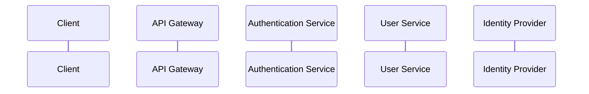

#### 7.1.2 US002: Email Verification

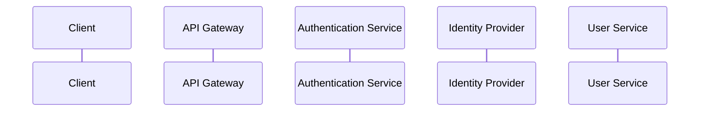

#### 7.1.3 US003: User Login

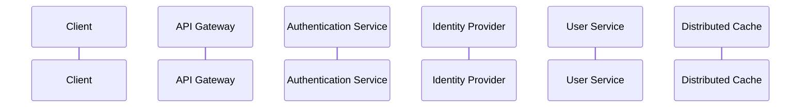

#### 7.1.4 US004: Password Reset


#### 7.1.5 QAS004: Authentication Security

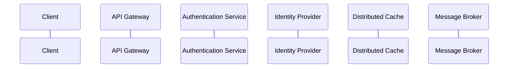

#### 7.1.6 QAS022: Environment Consistency

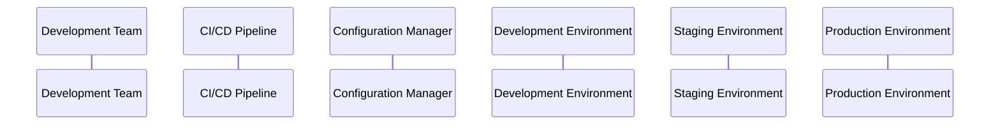

#### 7.1.7 QAS014: External Service Integration

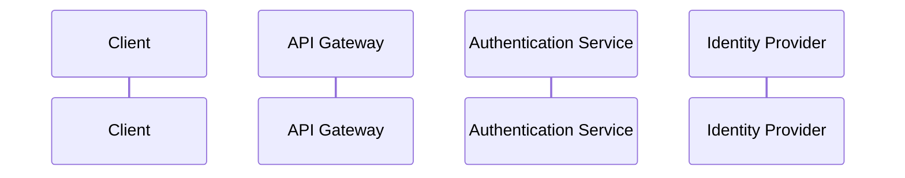

---

### 7.2 Iteration 2 — Event Management and Basic Search

**Goal:** Implement core event management capabilities and basic search functionality.

#### 7.2.1 US005: Event Creation

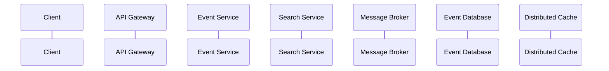

#### 7.2.2 US007: Event Listing Display

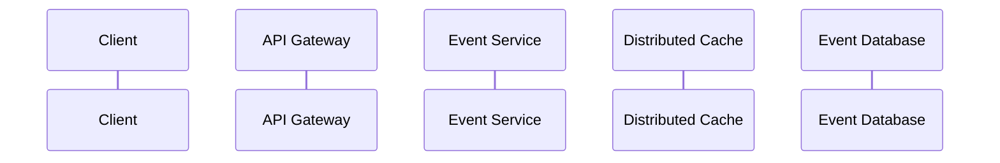

#### 7.2.3 US018: Basic Event Search

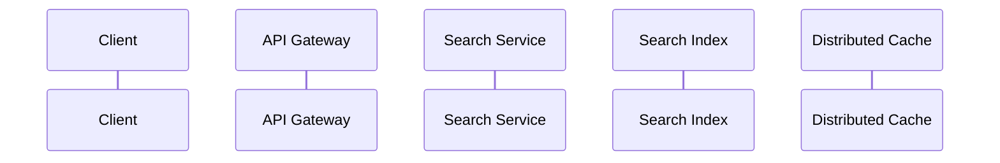

#### 7.2.4 QAS002: Search Response Time

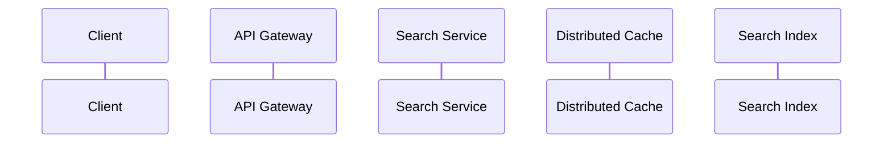

#### 7.2.5 QAS009: Mobile Responsiveness

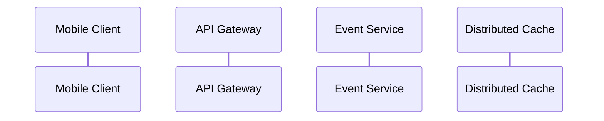

---

### 7.3 Iteration 3 — Ticket Inventory and Order Management

**Goal:** Implement ticket inventory management and basic order processing capabilities.

#### 7.3.1 US009: Inventory Creation

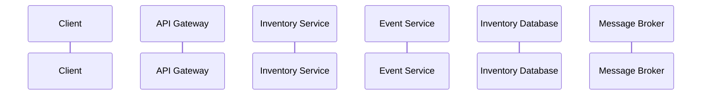

#### 7.3.2 US010: Inventory Updates

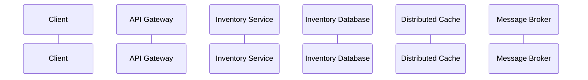

#### 7.3.3 US012: Ticket Selection

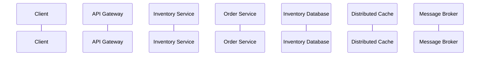

#### 7.3.4 US014: Order Confirmation

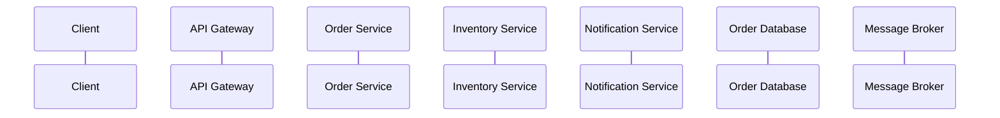

#### 7.3.5 QAS001: High-Concurrency Ticket Purchase


#### 7.3.6 QAS007: Transaction Integrity

```mermaid
sequenceDiagram
    participant Client
    participant APIGW as API Gateway
    participant OrderSvc as Order Service
    participant InventorySvc as Inventory Service
    participant PaymentSvc as Payment Service
    participant OrderDB as Order Database
    participant MQ as Message Broker
```

#### 7.3.7 QAS008: Data Consistency

```mermaid
sequenceDiagram
    participant Client
    participant APIGW as API Gateway
    participant InventorySvc as Inventory Service
    participant OrderSvc as Order Service
    participant SearchSvc as Search Service
    participant InventoryDB as Inventory Database
    participant Cache as Distributed Cache
    participant MQ as Message Broker
```

#### 7.3.8 QAS013: Payment Gateway Integration

```mermaid
sequenceDiagram
    participant Client
    participant APIGW as API Gateway
    participant PaymentSvc as Payment Service
    participant PayGW as Payment Gateway
    participant PaymentDB as Payment Database
    participant MQ as Message Broker
```

---

### 7.4 Iteration 4 — Payment Processing and Ticket Generation

**Goal:** Implement secure payment processing and ticket generation capabilities.

#### 7.4.1 US013: Payment Processing

```mermaid
sequenceDiagram
    participant Client
    participant APIGW as API Gateway
    participant OrderSvc as Order Service
    participant PaymentSvc as Payment Service
    participant PayGW as Payment Gateway
    participant TicketSvc as Ticket Service
    participant PaymentDB as Payment Database
    participant Cache as Distributed Cache
    participant MQ as Message Broker
```

#### 7.4.2 US015: Ticket Generation

```mermaid
sequenceDiagram
    participant Client
    participant APIGW as API Gateway
    participant TicketSvc as Ticket Service
    participant OrderSvc as Order Service
    participant PaymentSvc as Payment Service
    participant TicketDB as Ticket Database
    participant Cache as Distributed Cache
    participant MQ as Message Broker
```

#### 7.4.3 US016: Ticket Delivery

```mermaid
sequenceDiagram
    participant Client
    participant APIGW as API Gateway
    participant TicketSvc as Ticket Service
    participant NotificationSvc as Notification Service
    participant EmailSvc as Email Service
    participant TicketDB as Ticket Database
    participant MQ as Message Broker
```

#### 7.4.4 QAS003: Payment Data Protection

```mermaid
sequenceDiagram
    participant Client
    participant APIGW as API Gateway
    participant PaymentSvc as Payment Service
    participant PayGW as Payment Gateway
    participant PaymentDB as Payment Database
```

#### 7.4.5 QAS006: Database Scaling

```mermaid
sequenceDiagram
    participant Client
    participant APIGW as API Gateway
    participant PaymentSvc as Payment Service
    participant Cache as Distributed Cache
    participant PrimaryDB as Primary Database
    participant ReplicaDB as Read Replica
```

#### 7.4.6 QAS015: System Recovery from Failure

```mermaid
sequenceDiagram
    participant Client
    participant APIGW as API Gateway
    participant PaymentSvc as Payment Service
    participant PrimaryRegion as Primary Region
    participant BackupRegion as Backup Region
    participant MQ as Message Broker
```

---

## 8. Interfaces

_This section will describe the API contracts, message schemas, and integration interface specifications for each container boundary. It will include REST API endpoint definitions (paths, methods, request/response schemas, error codes), asynchronous message contracts (event schemas published to the message broker), and integration interface specifications for external systems (Identity Provider, Payment Gateway, Email Service, Venue Management System). To be completed in subsequent iterations._

---

## 9. Design Decisions

This section records the significant design decisions taken during the architecture process. Each decision is linked to the driver(s) that motivated it, together with the chosen approach, the rationale, and any alternatives that were considered but discarded.

| # | Driver(s) | Decision | Rationale | Discarded Alternative(s) |
|---|-----------|----------|-----------|--------------------------|
|   |           |          |           |                          |
