# Domain Model — Event Ticket Booking System

## 1. Requirements Consistency Review

Before establishing the domain model, I reviewed the architectural drivers for consistency and completeness. The findings are summarised below.

### 1.1 Consistency Observations

| # | Observation | Assessment |
|---|-------------|------------|
| 1 | The Architecture document (section 7) references internal sections 9.x throughout the sequence diagram descriptions, but those sections are absent from the provided document. | **Minor gap** — referenced design decisions exist as implied intent; they should be documented explicitly in a future iteration. |
| 2 | US018 (Basic Event Search, High priority) has no sequence diagram in section 7.1, despite being listed as a high-priority user story. | **Gap** — a sequence diagram for US018 should be added; the Search bounded context is nonetheless derivable from the requirements. |
| 3 | QAS007 (Transaction Integrity) describes "ACID properties in a distributed environment" achieved via the Saga pattern. The Saga pattern provides *eventual consistency with compensating transactions*, not strict ACID. | **Conceptual imprecision** — the intent is sound (no partial transactions), but the documentation should be corrected to describe Saga-based eventual consistency rather than ACID across services. |
| 4 | The high-priority architectural concern C005.1.1 (Microservice boundaries) is addressed throughout the sequence diagrams, but the Delivery Service and Notification Service appear to overlap in responsibility for post-purchase communication. | **Clarification needed** — the domain model below formalises the separation: the Notification bounded context owns user-facing communication preferences and dispatch; the Ticket bounded context owns delivery records. |
| 5 | Feature F6 (Ticket Transfer) and F7 (Ticket Resale) appear in the vision but are excluded from the MVP scope and have no user stories or quality attribute scenarios assigned. | **Acceptable for MVP** — these are acknowledged future-scope features; the domain model leaves extension points for them. |
| 6 | The priorities are internally consistent: high-priority user stories (US001–US016, US018) are fully covered by high-priority QAS entries (QAS001–QAS008, QAS013, QAS015, QAS021–QAS022), and high-priority architectural concerns (security, data consistency, RBAC, compliance) align with the payment and authentication flows shown in the sequence diagrams. | **Consistent** — no contradictions found between the priority tables. |

### 1.2 Summary

The architectural drivers are substantially consistent and provide sufficient information to define a domain model. The gaps identified are minor and do not compromise the integrity of the model presented below.

---

## 2. Bounded Contexts

The system is decomposed into eight bounded contexts, each corresponding to a microservice (or a small cluster of microservices). Bounded contexts define the linguistic and ownership boundaries within which domain concepts carry their precise meaning.

| Bounded Context | Responsibility | Core Driving Concerns |
|-----------------|----------------|-----------------------|
| **Identity & Access (IAM)** | User registration, authentication, authorisation, session management | US001–US004, QAS004, C003.2.x |
| **Event Management** | Lifecycle of events from creation to completion, venue information | US005–US008, QAS005, C005.1.1 |
| **Inventory Management** | Ticket types, stock levels, reservations, optimistic locking | US009–US012, QAS001, QAS008, C001.2.3 |
| **Order Management** | Purchase flow orchestration, Saga coordination, order lifecycle | US012–US014, QAS007, C001.3.x |
| **Payment** | Payment processing, PCI-DSS compliance, refunds, circuit-breaker integration | US013, QAS003, QAS013, C003.1.x, C007.1.3 |
| **Ticket** | Digital ticket generation, QR codes, delivery records | US015–US017, C003.1.1 |
| **Notification** | User notifications, organiser notifications, channel preferences | US021–US023, C009.2.x |
| **Search** | Read-model projections of events for fast discovery and filtering | US018–US020, QAS002 |

---

## 3. Domain Model Class Diagram

```mermaid
classDiagram
    %% ─────────────────────────────────────────────
    %% BOUNDED CONTEXT: Identity & Access (IAM)
    %% ─────────────────────────────────────────────
    namespace IAM {
        class User {
            <<AR>>
            +UserId userId
            +Email email
            +UserStatus status
            +List~Role~ roles
            +DateTime createdAt
            +DateTime updatedAt
            +register()
            +verifyEmail()
            +lock()
            +unlock()
        }
        class UserProfile {
            <<Entity>>
            +ProfileId profileId
            +UserId userId
            +String firstName
            +String lastName
            +PhoneNumber phoneNumber
            +NotificationPreferences preferences
        }
        class Email {
            <<VO>>
            +String address
            +Boolean verified
        }
        class Role {
            <<Enumeration>>
            ATTENDEE
            ORGANIZER
            ADMIN
        }
        class UserStatus {
            <<Enumeration>>
            PENDING_VERIFICATION
            ACTIVE
            LOCKED
            SUSPENDED
        }
        class UserRegistered {
            <<DomainEvent>>
            +UserId userId
            +Email email
            +DateTime occurredAt
        }
        class AccountLocked {
            <<DomainEvent>>
            +UserId userId
            +String reason
            +DateTime occurredAt
        }
    }

    User "1" *-- "1" UserProfile : owns
    User "1" *-- "1" Email : identified by
    User "1" o-- "1..*" Role : assigned
    User --> UserRegistered : publishes
    User --> AccountLocked : publishes

    %% ─────────────────────────────────────────────
    %% BOUNDED CONTEXT: Event Management
    %% ─────────────────────────────────────────────
    namespace EventMgmt {
        class Event {
            <<AR>>
            +EventId eventId
            +UserId organizerId
            +String title
            +String description
            +EventStatus status
            +EventCategory category
            +VenueInfo venue
            +TimeSlot timeSlot
            +DateTime createdAt
            +publish()
            +cancel()
            +complete()
        }
        class VenueInfo {
            <<VO>>
            +String venueId
            +String name
            +Address address
            +Integer capacity
        }
        class TimeSlot {
            <<VO>>
            +DateTime startDateTime
            +DateTime endDateTime
        }
        class Address {
            <<VO>>
            +String street
            +String city
            +String country
            +String postalCode
        }
        class EventStatus {
            <<Enumeration>>
            DRAFT
            PUBLISHED
            SOLD_OUT
            CANCELLED
            COMPLETED
        }
        class EventCategory {
            <<Enumeration>>
            CONCERT
            SPORTS
            THEATER
            CONFERENCE
            FESTIVAL
            OTHER
        }
        class EventCreated {
            <<DomainEvent>>
            +EventId eventId
            +String title
            +EventCategory category
            +DateTime occurredAt
        }
        class EventPublished {
            <<DomainEvent>>
            +EventId eventId
            +DateTime occurredAt
        }
        class EventCancelled {
            <<DomainEvent>>
            +EventId eventId
            +String reason
            +DateTime occurredAt
        }
    }

    Event "1" *-- "1" VenueInfo : located at
    Event "1" *-- "1" TimeSlot : scheduled in
    VenueInfo "1" *-- "1" Address : at
    Event --> EventCreated : publishes
    Event --> EventPublished : publishes
    Event --> EventCancelled : publishes

    %% ─────────────────────────────────────────────
    %% BOUNDED CONTEXT: Inventory Management
    %% ─────────────────────────────────────────────
    namespace InventoryMgmt {
        class TicketInventory {
            <<AR>>
            +InventoryId inventoryId
            +EventId eventId
            +List~TicketType~ ticketTypes
            +Long version
            +reserve(typeId, qty)
            +release(reservationId)
            +confirm(reservationId)
        }
        class TicketType {
            <<Entity>>
            +TicketTypeId typeId
            +String name
            +String description
            +Money price
            +Integer totalQuantity
            +Integer availableQuantity
            +Integer reservedQuantity
        }
        class Reservation {
            <<Entity>>
            +ReservationId reservationId
            +TicketTypeId ticketTypeId
            +UserId userId
            +Integer quantity
            +DateTime expiresAt
            +ReservationStatus status
        }
        class Money {
            <<VO>>
            +BigDecimal amount
            +Currency currency
        }
        class ReservationStatus {
            <<Enumeration>>
            PENDING
            CONFIRMED
            EXPIRED
            CANCELLED
        }
        class InventoryReserved {
            <<DomainEvent>>
            +ReservationId reservationId
            +EventId eventId
            +TicketTypeId ticketTypeId
            +Integer quantity
            +DateTime occurredAt
        }
        class InventoryUpdated {
            <<DomainEvent>>
            +InventoryId inventoryId
            +EventId eventId
            +DateTime occurredAt
        }
        class ReservationExpired {
            <<DomainEvent>>
            +ReservationId reservationId
            +DateTime occurredAt
        }
    }

    TicketInventory "1" *-- "1..*" TicketType : contains
    TicketInventory "1" *-- "0..*" Reservation : tracks
    TicketType "1" *-- "1" Money : priced as
    TicketInventory --> InventoryReserved : publishes
    TicketInventory --> InventoryUpdated : publishes
    TicketInventory --> ReservationExpired : publishes

    %% ─────────────────────────────────────────────
    %% BOUNDED CONTEXT: Order Management
    %% ─────────────────────────────────────────────
    namespace OrderMgmt {
        class Order {
            <<AR>>
            +OrderId orderId
            +UserId userId
            +EventId eventId
            +ReservationId reservationId
            +List~OrderItem~ items
            +OrderStatus status
            +Money totalAmount
            +DateTime createdAt
            +confirm()
            +cancel()
            +refund()
        }
        class OrderItem {
            <<Entity>>
            +OrderItemId itemId
            +TicketTypeId ticketTypeId
            +String ticketTypeName
            +Integer quantity
            +Money unitPrice
            +Money subtotal
        }
        class OrderStatus {
            <<Enumeration>>
            PENDING_PAYMENT
            CONFIRMED
            CANCELLED
            REFUNDED
        }
        class OrderCreated {
            <<DomainEvent>>
            +OrderId orderId
            +UserId userId
            +EventId eventId
            +Money totalAmount
            +DateTime occurredAt
        }
        class OrderConfirmed {
            <<DomainEvent>>
            +OrderId orderId
            +DateTime occurredAt
        }
        class OrderCancelled {
            <<DomainEvent>>
            +OrderId orderId
            +String reason
            +DateTime occurredAt
        }
    }

    Order "1" *-- "1..*" OrderItem : contains
    Order "1" *-- "1" Money : totals
    OrderItem "1" *-- "1" Money : unit price
    Order --> OrderCreated : publishes
    Order --> OrderConfirmed : publishes
    Order --> OrderCancelled : publishes

    %% ─────────────────────────────────────────────
    %% BOUNDED CONTEXT: Payment
    %% ─────────────────────────────────────────────
    namespace PaymentCtx {
        class Payment {
            <<AR>>
            +PaymentId paymentId
            +OrderId orderId
            +UserId userId
            +Money amount
            +PaymentStatus status
            +PaymentMethod method
            +String maskedReference
            +DateTime processedAt
            +process()
            +fail(reason)
        }
        class Refund {
            <<Entity>>
            +RefundId refundId
            +PaymentId paymentId
            +Money amount
            +String reason
            +RefundStatus status
            +DateTime requestedAt
        }
        class PaymentMethod {
            <<VO>>
            +PaymentMethodType type
            +String maskedIdentifier
        }
        class PaymentStatus {
            <<Enumeration>>
            PENDING
            COMPLETED
            FAILED
            REFUNDED
        }
        class RefundStatus {
            <<Enumeration>>
            REQUESTED
            APPROVED
            PROCESSED
            REJECTED
        }
        class PaymentMethodType {
            <<Enumeration>>
            CREDIT_CARD
            DEBIT_CARD
            DIGITAL_WALLET
            BANK_TRANSFER
        }
        class PaymentProcessed {
            <<DomainEvent>>
            +PaymentId paymentId
            +OrderId orderId
            +Money amount
            +DateTime occurredAt
        }
        class PaymentFailed {
            <<DomainEvent>>
            +PaymentId paymentId
            +OrderId orderId
            +String reason
            +DateTime occurredAt
        }
        class RefundProcessed {
            <<DomainEvent>>
            +RefundId refundId
            +PaymentId paymentId
            +Money amount
            +DateTime occurredAt
        }
    }

    Payment "1" *-- "1" PaymentMethod : uses
    Payment "1" *-- "1" Money : for amount
    Payment "1" o-- "0..1" Refund : may have
    Refund "1" *-- "1" Money : refunds
    Payment --> PaymentProcessed : publishes
    Payment --> PaymentFailed : publishes
    Payment --> RefundProcessed : publishes

    %% ─────────────────────────────────────────────
    %% BOUNDED CONTEXT: Ticket
    %% ─────────────────────────────────────────────
    namespace TicketCtx {
        class Ticket {
            <<AR>>
            +TicketId ticketId
            +OrderId orderId
            +EventId eventId
            +TicketTypeId ticketTypeId
            +UserId ownerId
            +TicketStatus status
            +QRCode qrCode
            +DateTime generatedAt
            +generate()
            +deliver()
            +use()
            +cancel()
        }
        class DeliveryRecord {
            <<Entity>>
            +DeliveryId deliveryId
            +TicketId ticketId
            +DeliveryChannel channel
            +String recipient
            +DeliveryStatus status
            +DateTime deliveredAt
        }
        class QRCode {
            <<VO>>
            +String encodedPayload
            +String securityHash
            +DateTime generatedAt
            +DateTime expiresAt
        }
        class TicketStatus {
            <<Enumeration>>
            PENDING_GENERATION
            GENERATED
            DELIVERED
            USED
            CANCELLED
        }
        class DeliveryChannel {
            <<Enumeration>>
            EMAIL
            PUSH_NOTIFICATION
            IN_APP
        }
        class DeliveryStatus {
            <<Enumeration>>
            PENDING
            SENT
            DELIVERED
            FAILED
        }
        class TicketGenerated {
            <<DomainEvent>>
            +TicketId ticketId
            +OrderId orderId
            +UserId ownerId
            +DateTime occurredAt
        }
        class TicketDelivered {
            <<DomainEvent>>
            +TicketId ticketId
            +DeliveryChannel channel
            +DateTime occurredAt
        }
    }

    Ticket "1" *-- "1" QRCode : secured by
    Ticket "1" *-- "0..*" DeliveryRecord : recorded in
    Ticket --> TicketGenerated : publishes
    Ticket --> TicketDelivered : publishes

    %% ─────────────────────────────────────────────
    %% BOUNDED CONTEXT: Notification
    %% ─────────────────────────────────────────────
    namespace NotificationCtx {
        class Notification {
            <<AR>>
            +NotificationId notificationId
            +UserId recipientId
            +NotificationType type
            +String subject
            +String body
            +NotificationStatus status
            +DateTime scheduledAt
            +DateTime sentAt
            +send()
            +fail(reason)
        }
        class NotificationPreference {
            <<Entity>>
            +PreferenceId preferenceId
            +UserId userId
            +NotificationType notificationType
            +Boolean emailEnabled
            +Boolean pushEnabled
            +Boolean smsEnabled
        }
        class NotificationType {
            <<Enumeration>>
            REGISTRATION_CONFIRM
            ORDER_CONFIRMATION
            TICKET_DELIVERY
            EVENT_REMINDER
            EVENT_CANCELLED
            PAYMENT_RECEIPT
            ACCOUNT_LOCKED
        }
        class NotificationStatus {
            <<Enumeration>>
            PENDING
            SENT
            FAILED
        }
    }

    Notification --> NotificationType : typed by
    NotificationPreference --> NotificationType : configures

    %% ─────────────────────────────────────────────
    %% BOUNDED CONTEXT: Search (Read Model)
    %% ─────────────────────────────────────────────
    namespace SearchCtx {
        class EventSearchIndex {
            <<Entity>>
            +EventId eventId
            +String title
            +String description
            +EventCategory category
            +DateTime startDateTime
            +String cityName
            +String countryName
            +Money minPrice
            +Money maxPrice
            +Integer availableTickets
            +Boolean isSoldOut
            +DateTime indexedAt
        }
        class SearchFilter {
            <<VO>>
            +String keyword
            +EventCategory category
            +DateRange dateRange
            +PriceRange priceRange
            +String location
            +Boolean availableOnly
        }
        class DateRange {
            <<VO>>
            +DateTime from
            +DateTime to
        }
        class PriceRange {
            <<VO>>
            +Money min
            +Money max
        }
    }

    SearchFilter "1" *-- "0..1" DateRange : filters by
    SearchFilter "1" *-- "0..1" PriceRange : filters by

    %% ─────────────────────────────────────────────
    %% CROSS-CONTEXT DOMAIN EVENT FLOWS
    %% ─────────────────────────────────────────────
    UserRegistered ..> Notification : triggers
    EventCreated ..> EventSearchIndex : updates
    EventPublished ..> EventSearchIndex : updates
    EventCancelled ..> Notification : triggers
    EventCancelled ..> EventSearchIndex : updates
    InventoryReserved ..> Order : triggers creation
    InventoryUpdated ..> EventSearchIndex : updates
    OrderConfirmed ..> Payment : triggers
    PaymentProcessed ..> Order : confirms
    PaymentProcessed ..> Ticket : triggers generation
    PaymentFailed ..> Order : cancels
    PaymentFailed ..> InventoryReserved : triggers release
    TicketGenerated ..> Notification : triggers
    TicketDelivered ..> Notification : triggers
```

The diagram below represents all eight bounded contexts. Stereotype annotations distinguish Aggregate Roots (`<<AR>>`), Entities (`<<Entity>>`), Value Objects (`<<VO>>`), Domain Events (`<<DomainEvent>>`), and Enumerations (`<<Enumeration>>`). Relationships between bounded contexts are shown as dashed dependencies labelled with the domain event that crosses the context boundary.

---

## 4. Domain Elements Description

### 4.1 Identity & Access (IAM) Bounded Context

| Element | Type | Description |
|---------|------|-------------|
| `User` | Aggregate Root | Central identity entity. Owns the lifecycle of registration, email verification, account locking, and role assignment. Authentication is delegated to the external Identity Provider; this aggregate holds the system-side representation and its current state. |
| `UserProfile` | Entity | Holds personal and contact details for a `User`. Scoped within the IAM context; other contexts reference the user only by `UserId`. |
| `Email` | Value Object | Represents an email address with a verified flag. Immutable once verified. |
| `Role` | Enumeration | Defines the coarse-grained authorisation role of a user within the system: `ATTENDEE`, `ORGANIZER`, or `ADMIN`. Drives RBAC policies (C003.2.1). |
| `UserStatus` | Enumeration | Lifecycle state of the user account: `PENDING_VERIFICATION`, `ACTIVE`, `LOCKED`, `SUSPENDED`. Supports the brute-force mitigation flow in QAS004. |
| `UserRegistered` | Domain Event | Published when a user successfully completes registration. Consumed by the Notification context to send a welcome/verification email. |
| `AccountLocked` | Domain Event | Published when the account is locked after repeated failed login attempts. Consumed by the Notification context and the monitoring infrastructure (C004.1.3). |

### 4.2 Event Management Bounded Context

| Element | Type | Description |
|---------|------|-------------|
| `Event` | Aggregate Root | Represents a ticketable event. Enforces business rules on state transitions (e.g., only a `PUBLISHED` event may have tickets reserved against it). The `organizerId` is a reference into the IAM context; no direct object dependency exists. |
| `VenueInfo` | Value Object | A snapshot of venue data synchronised from the external Venue Management System. Captures the data at event-creation time to remain stable if the external system changes. |
| `TimeSlot` | Value Object | Encapsulates the start and end date-times of an event. Enables constraint validation (no overlapping events at the same venue). |
| `Address` | Value Object | Physical address used within `VenueInfo`. Shared as a value object across multiple contexts but carries no cross-context identity. |
| `EventStatus` | Enumeration | `DRAFT` → `PUBLISHED` → (`SOLD_OUT` | `CANCELLED` | `COMPLETED`). Governs which operations are permitted on the aggregate at each stage. |
| `EventCategory` | Enumeration | Categorical classification of events used for filtering in the Search context and for notification targeting. |
| `EventCreated` | Domain Event | Published on successful event creation. Consumed by the Search context to build the initial search index entry. |
| `EventPublished` | Domain Event | Published when an organiser makes an event publicly visible. Consumed by Search (to mark as searchable) and Notification (to alert users subscribed to that category). |
| `EventCancelled` | Domain Event | Published on event cancellation. Consumed by Inventory (to release all reservations), Search (to remove the entry), and Notification (to inform ticket holders). |

### 4.3 Inventory Management Bounded Context

| Element | Type | Description |
|---------|------|-------------|
| `TicketInventory` | Aggregate Root | Governs the stock of tickets for a single event. Enforces the invariant that `availableQuantity ≥ 0` at all times. Uses optimistic locking (`version` field) to handle concurrent reservation requests (QAS001, QAS008). |
| `TicketType` | Entity | Represents a category of ticket within an inventory (e.g., VIP, General Admission). Holds pricing and quantity counters. Identity is meaningful within the aggregate. |
| `Reservation` | Entity | A time-boxed hold on a specific quantity of a ticket type for a user. Reservations expire automatically if not confirmed within the defined TTL, after which the inventory is returned to the available pool. |
| `Money` | Value Object | Immutable representation of a monetary amount with an explicit currency. Used across Inventory, Order, and Payment contexts as an anti-corruption layer value; each context holds its own copy at creation time. |
| `ReservationStatus` | Enumeration | `PENDING` → `CONFIRMED` | `EXPIRED` | `CANCELLED`. Drives the time-limited lock mechanism that prevents indefinite inventory holds. |
| `InventoryReserved` | Domain Event | Published when a reservation is successfully created. Consumed by the Order context to initiate order creation. |
| `InventoryUpdated` | Domain Event | Published whenever available quantities change. Consumed by the Search context to keep the `availableTickets` counter accurate (QAS008). |
| `ReservationExpired` | Domain Event | Published by a scheduled process when a reservation TTL lapses. Consumed internally to release stock and optionally by Notification to inform the user. |

### 4.4 Order Management Bounded Context

| Element | Type | Description |
|---------|------|-------------|
| `Order` | Aggregate Root | Orchestrates the purchase saga (QAS007). Holds a stable snapshot of items and prices at the time of purchase. Transitions through `PENDING_PAYMENT` → `CONFIRMED` or `CANCELLED`. Coordinates compensating transactions by publishing domain events consumed by Payment and Inventory. |
| `OrderItem` | Entity | A line item within an order. Captures the ticket type name and unit price as a snapshot, isolating the order history from future price changes in the Inventory context. |
| `OrderStatus` | Enumeration | `PENDING_PAYMENT` → `CONFIRMED` → `REFUNDED` or directly to `CANCELLED`. Reflects the Saga state machine. |
| `OrderCreated` | Domain Event | Published when an order is instantiated. Consumed by the Payment context to initiate payment processing. |
| `OrderConfirmed` | Domain Event | Published after payment succeeds and the reservation is confirmed. Consumed by the Ticket context to trigger ticket generation and by Notification. |
| `OrderCancelled` | Domain Event | Published when the order is cancelled (by user, payment failure, or reservation expiry). Consumed by Inventory (to release hold) and Notification (to inform user). |

### 4.5 Payment Bounded Context

| Element | Type | Description |
|---------|------|-------------|
| `Payment` | Aggregate Root | Represents a single payment transaction. Integrates with the external Payment Gateway via an anti-corruption adapter (circuit-breaker protected, QAS013). Never stores raw card numbers; only masked references are persisted to comply with PCI-DSS (QAS003, C003.1.x). |
| `Refund` | Entity | Represents a reversal of a completed payment. Has its own lifecycle and audit trail to satisfy financial regulation concerns (C007.1.3). |
| `PaymentMethod` | Value Object | Encapsulates the type and masked identifier of the payment instrument. Immutable once recorded. |
| `PaymentStatus` | Enumeration | `PENDING` → `COMPLETED` | `FAILED` | `REFUNDED`. Drives post-payment saga compensation steps. |
| `RefundStatus` | Enumeration | `REQUESTED` → `APPROVED` → `PROCESSED` | `REJECTED`. Tracks the refund workflow independently. |
| `PaymentMethodType` | Enumeration | Classifies the payment instrument for routing and reporting purposes. |
| `PaymentProcessed` | Domain Event | Published on successful payment. Consumed by Order (to confirm) and Ticket (to trigger generation). |
| `PaymentFailed` | Domain Event | Published on payment failure. Consumed by Order (to cancel) and Inventory (to release the reservation). |
| `RefundProcessed` | Domain Event | Published when a refund is completed. Consumed by Order (to update status) and Notification (to inform user). |

### 4.6 Ticket Bounded Context

| Element | Type | Description |
|---------|------|-------------|
| `Ticket` | Aggregate Root | Represents the digital ticket artefact. Created after `PaymentProcessed` is received. Encapsulates the full ticket lifecycle including generation, delivery, use at the venue, and cancellation. |
| `DeliveryRecord` | Entity | Records a delivery attempt for a ticket across a specific channel. Multiple delivery records may exist per ticket (e.g., email + push). Supports the delivery retry and status tracking requirements. |
| `QRCode` | Value Object | An immutable, cryptographically secured payload for ticket validation at the venue. Contains a `securityHash` derived from ticket identity and a server-side secret, and an `expiresAt` timestamp. Supports F10 (Mobile Ticket Validation). |
| `TicketStatus` | Enumeration | `PENDING_GENERATION` → `GENERATED` → `DELIVERED` → `USED` | `CANCELLED`. The `USED` transition is irreversible and prevents re-entry fraud. |
| `DeliveryChannel` | Enumeration | Defines the delivery method: `EMAIL`, `PUSH_NOTIFICATION`, `IN_APP`. Implements the Strategy pattern described in the architecture. |
| `DeliveryStatus` | Enumeration | Tracks the outcome of a delivery attempt: `PENDING`, `SENT`, `DELIVERED`, `FAILED`. |
| `TicketGenerated` | Domain Event | Published once a ticket is successfully generated. Consumed by the Notification context to trigger ticket delivery. |
| `TicketDelivered` | Domain Event | Published after a successful delivery record is created. Consumed by Notification to confirm delivery to the user. |

### 4.7 Notification Bounded Context

| Element | Type | Description |
|---------|------|-------------|
| `Notification` | Aggregate Root | Represents a single notification dispatch task. Holds the rendered subject and body and tracks sending status. Created in response to domain events from other contexts. |
| `NotificationPreference` | Entity | Per-user, per-notification-type channel preference. Determines whether email, push, or SMS is used for a given notification type (US023, C009.1.4). |
| `NotificationType` | Enumeration | Classifies the notification for preference filtering and template selection: registration, order, ticket, event reminder, cancellation, payment, and security alerts. |
| `NotificationStatus` | Enumeration | `PENDING` → `SENT` | `FAILED`. Supports retry logic and monitoring of delivery success rates. |

### 4.8 Search Bounded Context (Read Model)

| Element | Type | Description |
|---------|------|-------------|
| `EventSearchIndex` | Entity | A denormalised, queryable projection of event data optimised for the search use case (QAS002: results within 500 ms). Built and maintained asynchronously from `EventCreated`, `EventPublished`, `EventCancelled`, and `InventoryUpdated` domain events. It is a read model and carries no write authority. |
| `SearchFilter` | Value Object | Encapsulates the parameters of a search query. Passed to the search index at query time; never persisted. |
| `DateRange` | Value Object | A bounded range of date-time values used within `SearchFilter`. |
| `PriceRange` | Value Object | A bounded range of monetary values used within `SearchFilter`. |

---

## 5. Cross-Context Integration Summary

The table below documents the domain events that carry information across bounded context boundaries. These events are the primary integration contracts between microservices and are transported via the Message Queue (event bus) infrastructure identified in the architecture.

| Domain Event | Producer Context | Consumer Context(s) | Purpose |
|---|---|---|---|
| `UserRegistered` | IAM | Notification | Send welcome/verification email |
| `AccountLocked` | IAM | Notification, Monitoring | Alert user and operations team |
| `EventCreated` | Event Management | Search | Index new event |
| `EventPublished` | Event Management | Search, Notification | Mark event as searchable; notify subscribers |
| `EventCancelled` | Event Management | Inventory, Search, Notification | Release all reservations; remove from search; notify holders |
| `InventoryReserved` | Inventory | Order | Trigger order creation |
| `InventoryUpdated` | Inventory | Search | Update available ticket count in index |
| `ReservationExpired` | Inventory | Notification | Inform user that hold has lapsed |
| `OrderCreated` | Order | Payment | Initiate payment processing |
| `OrderConfirmed` | Order | Ticket, Notification | Generate tickets; confirm to user |
| `OrderCancelled` | Order | Inventory, Notification | Release reservation; inform user |
| `PaymentProcessed` | Payment | Order, Ticket | Confirm order; trigger ticket generation |
| `PaymentFailed` | Payment | Order, Inventory | Cancel order; release inventory reservation |
| `RefundProcessed` | Payment | Order, Notification | Update order to `REFUNDED`; inform user |
| `TicketGenerated` | Ticket | Notification | Deliver ticket to user |
| `TicketDelivered` | Ticket | Notification | Confirm delivery completion |
