# Hotel Pricing System — Architecture Document

**Architect:** Neo  
**Method:** Attribute-Driven Design (ADD) / C4 Model  
**Target Architecture:** Microservices  

---

## Table of Contents

1. [Introduction](#1-introduction)
2. [Context Diagram](#2-context-diagram)
3. [Architectural Drivers](#3-architectural-drivers)
4. [Domain Model](#4-domain-model)
5. [Container Diagram](#5-container-diagram)
6. [Component Diagrams](#6-component-diagrams)
7. [Sequence Diagrams](#7-sequence-diagrams)
8. [Interfaces](#8-interfaces)
9. [Design Decisions](#9-design-decisions)

---

## 1. Introduction

This document describes the software architecture of the **Hotel Pricing System (HPS)** for AD&D Hotels. The HPS is a business-critical platform used by sales managers and commercial representatives to establish, simulate, and publish room prices across the hotel chain. Prices are defined against a set of rates (base, fixed, and calculated) and room types per hotel, and once committed, they are distributed to external systems — including the Channel Management System, the Property Management System, and the Commercial Analysis System — from which reservations are made and revenue is tracked.

The document is produced following the **Attribute-Driven Design (ADD)** process, which derives architectural decisions from a prioritised set of architectural drivers: user stories, quality attribute scenarios, architectural concerns, and constraints. The final architecture is built on a **microservices** style, where each bounded context identified through Domain-Driven Design maps directly to one or more independently deployable services.

The document uses the **C4 model** as its primary notation for structural views — context, container, and component diagrams — and **UML sequence diagrams** for behavioural views of key user stories and quality attribute scenarios. Design decisions are recorded in a decision log in section 9.

The document is structured to evolve incrementally across six design iterations, as defined in the Iteration Plan, starting with the most business-critical and architecturally significant drivers and progressing through the full set of requirements within the 6-month delivery window.

The intended audience is the development team, architect, and technical stakeholders responsible for building and maintaining the Hotel Pricing System.

---

## 2. Context Diagram

The context diagram below positions the Hotel Pricing System (HPS) within its operational environment. It treats the HPS as a single black box and shows all external actors and systems with which it interacts, together with the nature of each interaction. This level of abstraction establishes the system boundary, identifies all integration points, and provides the foundation for all subsequent architectural decisions.

The HPS sits at the centre of AD&D Hotels' IT infrastructure. End users — sales managers and commercial representatives — send price changes into the system. Once prices are committed, the HPS distributes them to the Channel Management System (which propagates prices to online travel agencies), the Property Management System (which uses prices for internal reservations), and the Commercial Analysis System (which uses prices for business reporting). User credentials are validated against the cloud-hosted User Identity Service. Provision is also made for other downstream systems that may consume prices in future integrations.

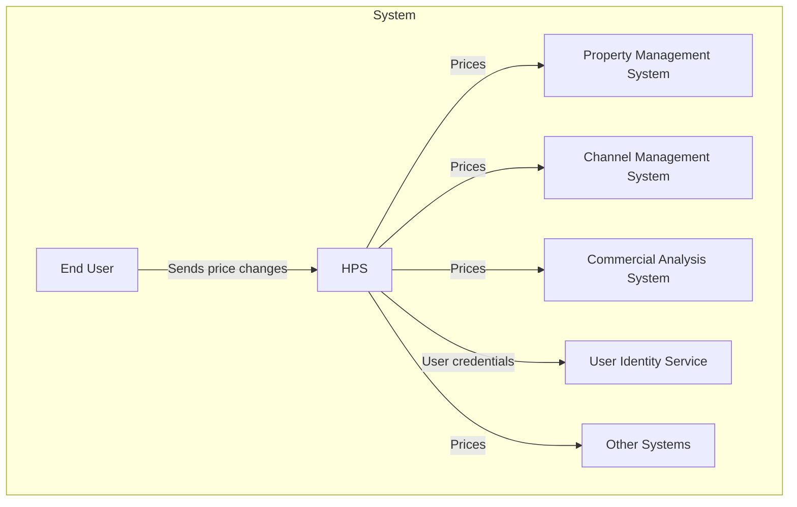

---

## 3. Architectural Drivers

This section summarises the complete set of architectural drivers that shape the system design. Drivers are divided into user stories (functional requirements), quality attribute scenarios (non-functional requirements), architectural concerns (cross-cutting operational and governance requirements), and constraints (non-negotiable boundary conditions imposed from outside the project). Each driver is annotated with its priority, which directly influences the order of design iterations.

### 3.1 User Stories

| ID | Description | Priority |
|----|-------------|----------|
| HPS-1 | **Log In:** A user (commercial or administrator) provides their credentials in a login window. The system checks these credentials against a user identity service and, if successful, provides access to the system. Once logged in, a user can only make queries and changes to the hotels for which they have been authorized. | Medium |
| HPS-2 | **Change Prices:** A user selects a specific hotel for which they are authorized and selects particular dates to make price changes to a base or fixed rate. All calculated rates are updated at that point. The system allows price changes to be simulated before they are committed. When committed, prices are pushed to the Channel Management System and become available for querying. | **High** |
| HPS-3 | **Query Prices:** A user or an external system queries prices for a given hotel through the user interface or a query API. | **High** |
| HPS-4 | **Manage Hotels:** An administrator adds, changes, or modifies hotel information, including the hotel's tax rates, available rates, and room types. | **High** |
| HPS-5 | **Manage Rates:** An administrator adds, changes, or modifies rates, including defining the calculation business rules for the different rates. | Medium |
| HPS-6 | **Manage Users:** An administrator changes permissions for a given user. | Medium |

### 3.2 Quality Attribute Scenarios

| ID | Quality Attribute | Scenario | Associated User Story | Customer Importance | Architect Difficulty |
|----|------------------|----------|-----------------------|---------------------|----------------------|
| QA-1 | Performance | A base rate price is changed for a specific hotel and date during normal operation; the prices for all the rates and room types for the hotel are published (ready for query) in less than 100 ms. | HPS-2 | **High** | **High** |
| QA-2 | Reliability | A user performs multiple price changes on a given hotel. 100% of the price changes are published (available for query) successfully and they are also received by the Channel Management System. | HPS-2 | **High** | **High** |
| QA-3 | Availability | Pricing queries uptime SLA must be 99.9% outside of maintenance windows. | All | **High** | **High** |
| QA-4 | Scalability | The system will initially support a minimum of 100,000 price queries per day through its API and should be capable of handling up to 1,000,000 without decreasing average latency by more than 20%. | HPS-3 | **High** | **High** |
| QA-5 | Security | A user logs into the system through the front-end. The credentials of the user are validated against the User Identity Service and, once logged in, they are presented with only the functions that they are authorized to use. | All | **High** | Medium |
| QA-6 | Modifiability | Support for a price query endpoint with a different protocol than REST (e.g., gRPC) is added to the system. The new endpoint does not require changes to be made to the core components of the system. | All | Medium | Medium |
| QA-7 | Deployability | The application is moved between non-production environments as part of the development process. No changes in the code are needed. | All | Medium | Medium |
| QA-8 | Monitorability | A system operator wishes to measure the performance and reliability of price publication during operation. The system provides a mechanism that allows 100% of these measures to be collected as needed. | HPS-2 | Medium | Medium |
| QA-9 | Testability | 100% of the system and its elements should support integration testing independently of the external systems. | All | Medium | Medium |

**Primary drivers:** QA-1, QA-2, QA-3, QA-4, QA-5 (High importance, addressed in the first three iterations).

### 3.3 Constraints

| ID | Constraint |
|----|------------|
| CON-1 | Users must interact with the system through a web browser in different platforms — Windows, OSX, and Linux — and on different devices. |
| CON-2 | Manage users through cloud provider identity service and host resources in the cloud. |
| CON-3 | Code must be hosted on a proprietary Git-based platform that is already in use by other projects in the company. |
| CON-4 | The initial release of the system must be delivered in 6 months, but an initial version of the system (MVP) must be demonstrated to internal stakeholders in at most 2 months. |
| CON-5 | The system must interact initially with existing systems through REST APIs but may need to later support other protocols. |
| CON-6 | A cloud-native approach should be favored when designing the system. |

### 3.4 Architectural Concerns

| ID | Concern |
|----|---------|
| CRN-1 | Establish an overall initial system structure. |
| CRN-2 | Leverage the team's knowledge about Java technologies and the Angular framework. |
| CRN-3 | Allocate work to members of the development team. |
| CRN-4 | Avoid introducing technical debt. |
| CRN-5 | Set up a continuous deployment infrastructure. |

---

## 4. Domain Model

This section presents the domain model derived using Domain-Driven Design (DDD) from the architectural drivers identified in section 3. The model defines six bounded contexts, each of which maps directly to a microservice boundary. It establishes the shared language (ubiquitous language) within each context and the integration contracts (domain events) between them. The full derivation of this model — including the requirements consistency review and design decisions — is available in `DomainModel.md`.

### 4.1 Requirements Consistency Review

Before establishing the domain model, the architectural drivers were reviewed for consistency and completeness. The key findings are summarised below.

| # | Driver(s) | Observation | Assessment |
|---|-----------|-------------|------------|
| 1 | Context diagram, HPS-2 | The context diagram lists the **Property Management System (PMS)** as a price consumer, but no user story, QAS, or constraint explicitly addresses PMS integration. HPS-2 only mentions the Channel Management System. | **Gap.** Subsumed under the Channel Distribution bounded context, which acts as the anti-corruption layer for all external price consumers. |
| 2 | HPS-3, QA-3, QA-4 | The write path (price change, calculation, publication — QA-1: 100 ms) and the read path (query, QA-3, QA-4) cannot share the same component under concurrent load without violating SLAs. | **Tension identified.** A CQRS pattern is required: a dedicated **Price Query** bounded context (read model) ensures query SLA is independent of write load. |
| 3 | QA-1, QA-2 | QA-1 (100 ms publication) + QA-2 (100% delivery) together rule out synchronous on-demand price calculation and require pre-computation at commit time plus a durable event publication mechanism. | **Consistent, but demanding.** Pre-computation and a transactional Outbox pattern are non-negotiable architectural decisions. |
| 4 | QA-6, CON-5 | QA-6 (new protocol without core changes) and CON-5 (REST initially, other protocols later) both require the integration adapter layer to be isolated from the core domain. | **Consistent.** Addressed by the Channel Distribution ACL context. |
| 5 | HPS-1, QA-5, CON-2 | Authentication is external (CON-2), but authorization granularity (which user can act on which hotel) is implied but never stated explicitly. | **Clarification applied.** A `UserAuthorization` aggregate owns hotel-level permissions; authentication remains external. |
| 6 | QA-1, HPS-4, HPS-5 | Changes to hotel configuration or rate business rules implicitly require cascading recalculation of affected derived prices. | **Implicit requirement surfaced.** Rate Management and Hotel Management contexts publish domain events consumed by Price Management to trigger recalculation. |
| 7 | QA-9, CON-5 | All external boundaries must be behind adapter interfaces to allow integration testing without live external systems. | **Consistent.** All external integrations are represented as ports; adapters translate external protocols. |
| 8 | CON-4 | MVP in 2 months; full release in 6 months. | **Scope influence.** Bounded contexts must be independently deployable and developable, confirming the microservices decomposition. |

### 4.2 Bounded Contexts

The domain is decomposed into six bounded contexts. Each context maps directly to one or more independently deployable microservices.

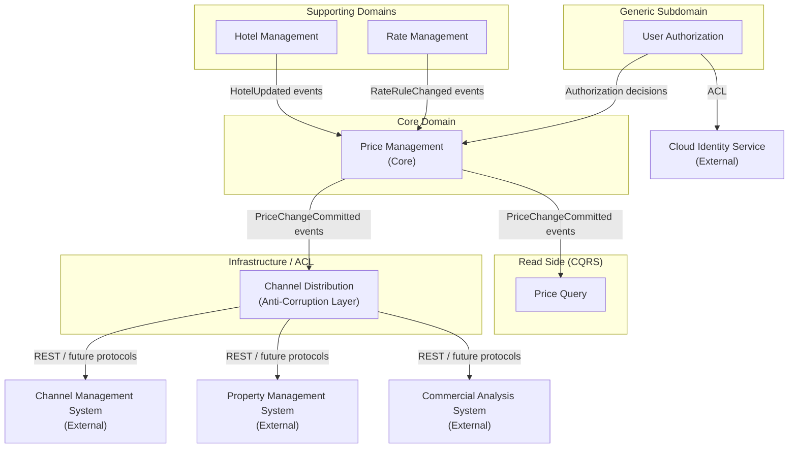

| Bounded Context | DDD Type | Responsibility |
|---|---|---|
| **Price Management** | Core Domain | Orchestrates price change operations: simulation, derivation of calculated prices from base/fixed rates, commitment, and publication. Source of truth for all price changes. |
| **Hotel Management** | Supporting Domain | Manages the hotel catalog, room types, and tax rates. Provides the structural context within which prices are defined. |
| **Rate Management** | Supporting Domain | Manages rate definitions and the business rules used to derive calculated prices from base rates. |
| **User Authorization** | Generic Subdomain | Manages application-level authorization — which users may act on which hotels. Authentication is delegated to the external cloud identity service. |
| **Price Query** | Read Side (CQRS) | Maintains a denormalized, highly-available read model of published prices. Serves all query traffic independently of write-path load. |
| **Channel Distribution** | Infrastructure / ACL | Translates committed price change events into protocol-specific API calls targeting external systems. Insulates the core domain from external protocol changes. |

### 4.3 Domain Model Class Diagram

The diagram below represents all six bounded contexts. Stereotype annotations distinguish Aggregate Roots (`<<AR>>`), Entities (`<<Entity>>`), Value Objects (`<<VO>>`), Domain Events (`<<DomainEvent>>`), Domain Services (`<<DomainService>>`), and Enumerations (`<<Enumeration>>`). Cross-context relationships are shown as dashed dependencies labeled with the domain event or identity reference that crosses the boundary.

```mermaid
classDiagram

    %% ============================================================
    %% BOUNDED CONTEXT: Price Management (Core Domain)
    %% ============================================================
    namespace PriceManagement {

        class PriceChange {
            <<AR>>
            +PriceChangeId id
            +HotelId hotelId
            +ExternalUserId initiatedBy
            +DateTime timestamp
            +PriceChangeStatus status
            +List~PriceChangeEntry~ entries
            +simulate(entries) PriceChangeSimulated
            +commit() PriceChangeCommitted
        }

        class PriceChangeEntry {
            <<VO>>
            +RateId rateId
            +RoomTypeId roomTypeId
            +Date date
            +Money amount
            +PriceEntryType entryType
        }

        class PriceCalculationService {
            <<DomainService>>
            +calculateDerivedPrices(baseEntries, rules) List~PriceChangeEntry~
        }

        class PriceChangeSimulated {
            <<DomainEvent>>
            +PriceChangeId priceChangeId
            +HotelId hotelId
            +List~PriceChangeEntry~ simulatedEntries
            +DateTime occurredAt
        }

        class PriceChangeCommitted {
            <<DomainEvent>>
            +PriceChangeId priceChangeId
            +HotelId hotelId
            +List~PriceChangeEntry~ publishedEntries
            +DateTime occurredAt
        }

        class PriceChangeId {
            <<VO>>
            +String value
        }

        class PriceChangeStatus {
            <<Enumeration>>
            SIMULATED
            COMMITTED
        }

        class PriceEntryType {
            <<Enumeration>>
            BASE
            FIXED
            CALCULATED
        }

        class Money {
            <<VO>>
            +BigDecimal amount
            +String currency
            +add(Money) Money
            +multiply(BigDecimal) Money
        }
    }

    PriceChange "1" *-- "1..*" PriceChangeEntry : contains
    PriceChangeEntry "1" *-- "1" Money : valued as
    PriceChange ..> PriceChangeSimulated : emits
    PriceChange ..> PriceChangeCommitted : emits

    %% ============================================================
    %% BOUNDED CONTEXT: Hotel Management (Supporting Domain)
    %% ============================================================
    namespace HotelManagement {

        class Hotel {
            <<AR>>
            +HotelId id
            +String name
            +Location location
            +TaxRate taxRate
            +List~RoomType~ roomTypes
            +List~RateId~ availableRateIds
            +addRoomType(roomType) RoomTypeAdded
            +removeRoomType(roomTypeId) RoomTypeRemoved
            +updateTaxRate(taxRate) HotelUpdated
        }

        class RoomType {
            <<Entity>>
            +RoomTypeId id
            +String name
            +String description
            +int capacity
        }

        class HotelId {
            <<VO>>
            +String value
        }

        class RoomTypeId {
            <<VO>>
            +String value
        }

        class Location {
            <<VO>>
            +String address
            +String city
            +String country
        }

        class TaxRate {
            <<VO>>
            +BigDecimal percentage
            +validate() boolean
        }

        class HotelCreated {
            <<DomainEvent>>
            +HotelId hotelId
            +String name
            +DateTime occurredAt
        }

        class HotelUpdated {
            <<DomainEvent>>
            +HotelId hotelId
            +DateTime occurredAt
        }

        class RoomTypeAdded {
            <<DomainEvent>>
            +HotelId hotelId
            +RoomTypeId roomTypeId
            +DateTime occurredAt
        }

        class RoomTypeRemoved {
            <<DomainEvent>>
            +HotelId hotelId
            +RoomTypeId roomTypeId
            +DateTime occurredAt
        }
    }

    Hotel "1" *-- "0..*" RoomType : contains
    Hotel "1" *-- "1" Location : located at
    Hotel "1" *-- "1" TaxRate : taxed by
    Hotel ..> HotelCreated : emits
    Hotel ..> HotelUpdated : emits
    Hotel ..> RoomTypeAdded : emits
    Hotel ..> RoomTypeRemoved : emits
    RoomType "1" *-- "1" RoomTypeId : identified by

    %% ============================================================
    %% BOUNDED CONTEXT: Rate Management (Supporting Domain)
    %% ============================================================
    namespace RateManagement {

        class Rate {
            <<AR>>
            +RateId id
            +String name
            +String description
            +RateType type
            +List~BusinessRule~ calculationRules
            +addRule(rule) RateRuleAdded
            +removeRule(ruleId) RateRuleRemoved
            +applyRules(baseMoney) Money
        }

        class BusinessRule {
            <<Entity>>
            +BusinessRuleId id
            +String name
            +Formula formula
            +int priority
            +apply(baseMoney) Money
        }

        class RateId {
            <<VO>>
            +String value
        }

        class BusinessRuleId {
            <<VO>>
            +String value
        }

        class Formula {
            <<VO>>
            +String expression
            +validate() boolean
            +evaluate(baseMoney) Money
        }

        class RateType {
            <<Enumeration>>
            BASE
            FIXED
            CALCULATED
        }

        class RateCreated {
            <<DomainEvent>>
            +RateId rateId
            +RateType type
            +DateTime occurredAt
        }

        class RateUpdated {
            <<DomainEvent>>
            +RateId rateId
            +DateTime occurredAt
        }

        class RateRuleAdded {
            <<DomainEvent>>
            +RateId rateId
            +BusinessRuleId ruleId
            +DateTime occurredAt
        }

        class RateRuleRemoved {
            <<DomainEvent>>
            +RateId rateId
            +BusinessRuleId ruleId
            +DateTime occurredAt
        }
    }

    Rate "1" *-- "0..*" BusinessRule : governed by
    BusinessRule "1" *-- "1" Formula : defined by
    Rate ..> RateCreated : emits
    Rate ..> RateUpdated : emits
    Rate ..> RateRuleAdded : emits
    Rate ..> RateRuleRemoved : emits

    %% ============================================================
    %% BOUNDED CONTEXT: User Authorization (Generic Subdomain)
    %% ============================================================
    namespace UserAuthorization {

        class UserAuthorization {
            <<AR>>
            +ExternalUserId userId
            +UserRole role
            +List~HotelId~ authorizedHotelIds
            +grantAccess(hotelId) HotelAccessGranted
            +revokeAccess(hotelId) HotelAccessRevoked
            +isAuthorizedFor(hotelId) boolean
            +isAdministrator() boolean
        }

        class ExternalUserId {
            <<VO>>
            +String value
        }

        class UserRole {
            <<Enumeration>>
            ADMINISTRATOR
            COMMERCIAL
        }

        class HotelAccessGranted {
            <<DomainEvent>>
            +ExternalUserId userId
            +HotelId hotelId
            +DateTime occurredAt
        }

        class HotelAccessRevoked {
            <<DomainEvent>>
            +ExternalUserId userId
            +HotelId hotelId
            +DateTime occurredAt
        }
    }

    UserAuthorization ..> HotelAccessGranted : emits
    UserAuthorization ..> HotelAccessRevoked : emits

    %% ============================================================
    %% BOUNDED CONTEXT: Price Query — Read Side (CQRS)
    %% ============================================================
    namespace PriceQuery {

        class PriceReadModel {
            <<Entity>>
            +HotelId hotelId
            +RateId rateId
            +RoomTypeId roomTypeId
            +Date date
            +Money amount
            +PriceEntryType entryType
            +DateTime publishedAt
            +DateTime lastUpdatedAt
        }

        class PriceQueryFilter {
            <<VO>>
            +HotelId hotelId
            +DateRange dateRange
            +RateId rateId
            +RoomTypeId roomTypeId
        }

        class DateRange {
            <<VO>>
            +Date from
            +Date to
        }
    }

    PriceQueryFilter "1" *-- "0..1" DateRange : bounded by

    %% ============================================================
    %% BOUNDED CONTEXT: Channel Distribution (Infrastructure / ACL)
    %% ============================================================
    namespace ChannelDistribution {

        class DistributionJob {
            <<AR>>
            +DistributionJobId id
            +PriceChangeId sourceEventId
            +HotelId hotelId
            +DistributionStatus status
            +List~DistributionTarget~ targets
            +DateTime scheduledAt
            +DateTime completedAt
            +dispatch() DistributionCompleted
            +fail(reason) DistributionFailed
        }

        class DistributionTarget {
            <<Entity>>
            +DistributionTargetId id
            +ExternalSystemType systemType
            +TargetStatus status
            +String endpoint
            +int retryCount
        }

        class DistributionJobId {
            <<VO>>
            +String value
        }

        class ExternalSystemType {
            <<Enumeration>>
            CHANNEL_MANAGEMENT_SYSTEM
            PROPERTY_MANAGEMENT_SYSTEM
            COMMERCIAL_ANALYSIS_SYSTEM
            OTHER
        }

        class DistributionStatus {
            <<Enumeration>>
            PENDING
            IN_PROGRESS
            COMPLETED
            PARTIALLY_FAILED
            FAILED
        }

        class TargetStatus {
            <<Enumeration>>
            PENDING
            DELIVERED
            FAILED
        }

        class DistributionCompleted {
            <<DomainEvent>>
            +DistributionJobId jobId
            +HotelId hotelId
            +DateTime occurredAt
        }

        class DistributionFailed {
            <<DomainEvent>>
            +DistributionJobId jobId
            +String reason
            +DateTime occurredAt
        }
    }

    DistributionJob "1" *-- "1..*" DistributionTarget : delivers to
    DistributionJob ..> DistributionCompleted : emits
    DistributionJob ..> DistributionFailed : emits

    %% ============================================================
    %% CROSS-CONTEXT REFERENCES (by identity only)
    %% ============================================================
    PriceChange --> HotelId : references
    PriceChange --> ExternalUserId : references
    PriceChangeEntry --> RateId : references
    PriceChangeEntry --> RoomTypeId : references
    Hotel --> RateId : references
    UserAuthorization --> HotelId : references
    DistributionJob --> PriceChangeId : originates from
    PriceReadModel --> HotelId : indexed by
    PriceReadModel --> RateId : for rate
    PriceReadModel --> RoomTypeId : for room type

    %% ============================================================
    %% CROSS-CONTEXT DOMAIN EVENT FLOWS
    %% ============================================================
    PriceChangeCommitted ..> DistributionJob : triggers creation
    PriceChangeCommitted ..> PriceReadModel : projects into
    HotelUpdated ..> PriceChange : triggers recalculation
    RoomTypeAdded ..> PriceChange : triggers initialization
    RoomTypeRemoved ..> PriceReadModel : triggers archival
    RateRuleAdded ..> PriceChange : triggers recalculation
    RateRuleRemoved ..> PriceChange : triggers recalculation
```

### 4.4 Domain Elements Description

#### Price Management (Core Domain)

| Element | Type | Description |
|---------|------|-------------|
| `PriceChange` | Aggregate Root | The central aggregate of the system. Represents a complete price change operation for a specific hotel. Manages the lifecycle from simulation (`SIMULATED`) through to final publication (`COMMITTED`). Emits `PriceChangeSimulated` (preview) and `PriceChangeCommitted` (publication). Directly addresses HPS-2, QA-1, QA-2. |
| `PriceChangeEntry` | Value Object | An immutable record of a single price: the combination of rate, room type, date, amount, and entry type. Immutability ensures audit integrity and supports event replay. |
| `PriceCalculationService` | Domain Service | Stateless service that applies business rules of `CALCULATED` rates to base prices, producing all derived `PriceChangeEntry` objects. Responsible for meeting the 100 ms calculation bound in QA-1. |
| `PriceChangeSimulated` | Domain Event | Emitted on simulation. Carries simulated entries for user preview. Does not trigger downstream publication. |
| `PriceChangeCommitted` | Domain Event | The primary integration event. Consumed by Channel Distribution and Price Query. Must be delivered with 100% reliability via the Outbox pattern (QA-2). |
| `PriceChangeId` | Value Object | Strongly-typed identity for a `PriceChange`. Carried in all related events for traceability. |
| `PriceChangeStatus` | Enumeration | `SIMULATED` (under review, not published) and `COMMITTED` (finalized and published). |
| `PriceEntryType` | Enumeration | `BASE`, `FIXED`, or `CALCULATED`. Determines how an amount was produced and how it may be recalculated. |
| `Money` | Value Object | Immutable monetary amount with currency. Arithmetic operations return new instances. |

#### Hotel Management (Supporting Domain)

| Element | Type | Description |
|---------|------|-------------|
| `Hotel` | Aggregate Root | Represents a hotel in the AD&D chain. Manages room types and available rate IDs. The `taxRate` is a critical pricing input. Addresses HPS-4. |
| `RoomType` | Entity | A category of room within a hotel (e.g., Single, Double, Suite). A dimension of price variation: every price entry is specific to a rate AND a room type. |
| `HotelId` | Value Object | Strongly-typed identity for a `Hotel`. Used as a cross-context reference in `PriceChange`, `UserAuthorization`, `PriceReadModel`, and `DistributionJob`. |
| `RoomTypeId` | Value Object | Strongly-typed identity for a `RoomType`. Used as a cross-context reference in `PriceChangeEntry` and `PriceReadModel`. |
| `Location` | Value Object | Immutable physical address of the hotel. |
| `TaxRate` | Value Object | Immutable tax percentage for a hotel. Self-validates before acceptance into the aggregate. |
| `HotelCreated` | Domain Event | Emitted on hotel creation. Consumed by Price Query to initialize an empty read model entry. |
| `HotelUpdated` | Domain Event | Emitted on hotel attribute changes (name, location, tax rate). Consumed by Price Management to trigger price recalculation. |
| `RoomTypeAdded` | Domain Event | Emitted when a room type is added. Signals Price Management to initialize new price combinations. |
| `RoomTypeRemoved` | Domain Event | Emitted when a room type is removed. Signals Price Query to archive associated prices. |

#### Rate Management (Supporting Domain)

| Element | Type | Description |
|---------|------|-------------|
| `Rate` | Aggregate Root | A pricing scheme (e.g., public rate, corporate rate). Classified as `BASE`, `FIXED`, or `CALCULATED`. `CALCULATED` rates own ordered `BusinessRule` objects. Addresses HPS-5. |
| `BusinessRule` | Entity | A single calculation rule within a `Rate`, with its own identity for independent lifecycle management. Contains a `Formula` evaluated at price calculation time. |
| `RateId` | Value Object | Strongly-typed identity for a `Rate`. Used as cross-context reference in `Hotel` and `PriceChangeEntry`. |
| `BusinessRuleId` | Value Object | Strongly-typed identity for a `BusinessRule`. |
| `Formula` | Value Object | Immutable expression string defining how a calculated price derives from a base price. Includes expression validation logic. |
| `RateType` | Enumeration | `BASE` — foundational rate. `FIXED` — independent absolute price. `CALCULATED` — derived using business rules. |
| `RateCreated` | Domain Event | Emitted on rate creation. Consumed by Hotel Management to offer the rate at hotels. |
| `RateUpdated` | Domain Event | Emitted on rate metadata change. |
| `RateRuleAdded` | Domain Event | Emitted when a rule is added. Triggers recalculation of all derived prices in Price Management. |
| `RateRuleRemoved` | Domain Event | Emitted when a rule is removed. Same recalculation consequence as `RateRuleAdded`. |

#### User Authorization (Generic Subdomain)

| Element | Type | Description |
|---------|------|-------------|
| `UserAuthorization` | Aggregate Root | Manages application-level authorization for a user authenticated by the cloud identity service. Holds only the user's role and authorized hotel list. Enforces hotel-level access control for `COMMERCIAL` users. The root for all permission management (HPS-6). |
| `ExternalUserId` | Value Object | Strongly-typed reference to the user's identity in the cloud identity service. Sole bridge between this context and the external IdP. |
| `UserRole` | Enumeration | `ADMINISTRATOR` — full access. `COMMERCIAL` — restricted to authorized hotels only. |
| `HotelAccessGranted` | Domain Event | Emitted when hotel access is granted to a user. Consumed by monitoring and audit infrastructure. |
| `HotelAccessRevoked` | Domain Event | Emitted when hotel access is revoked. Consumed by monitoring and audit infrastructure. |

#### Price Query — Read Side (CQRS)

| Element | Type | Description |
|---------|------|-------------|
| `PriceReadModel` | Entity | Denormalized, queryable projection of published prices. Each record covers one (hotel, rate, room type, date) combination. Built asynchronously from `PriceChangeCommitted` events. Pure read model — no write authority. Satisfies HPS-3, QA-3, QA-4. |
| `PriceQueryFilter` | Value Object | Encapsulates query parameters: hotel, optional date range, optional rate, optional room type. Never persisted. |
| `DateRange` | Value Object | Bounded range of calendar dates used as a filter within `PriceQueryFilter`. |

#### Channel Distribution (Infrastructure / ACL)

| Element | Type | Description |
|---------|------|-------------|
| `DistributionJob` | Aggregate Root | A single price distribution batch, created in response to a `PriceChangeCommitted` event. Tracks delivery to all configured external systems and manages retry and partial-failure handling. Satisfies QA-2 and QA-6. |
| `DistributionTarget` | Entity | A single external system as a delivery target within a `DistributionJob`. Carries its own delivery status and retry counter, enabling per-target retry independent of the overall job. |
| `DistributionJobId` | Value Object | Strongly-typed identity for a `DistributionJob`. |
| `ExternalSystemType` | Enumeration | `CHANNEL_MANAGEMENT_SYSTEM`, `PROPERTY_MANAGEMENT_SYSTEM`, `COMMERCIAL_ANALYSIS_SYSTEM`, `OTHER`. The `OTHER` value is the extension point for new integrations (QA-6). |
| `DistributionStatus` | Enumeration | `PENDING` → `IN_PROGRESS` → `COMPLETED` \| `PARTIALLY_FAILED` \| `FAILED`. Non-`COMPLETED` states require operator alerting (QA-8). |
| `TargetStatus` | Enumeration | `PENDING`, `DELIVERED`, `FAILED`. Drives per-target retry logic. |
| `DistributionCompleted` | Domain Event | Emitted on full delivery success. Consumed by monitoring infrastructure (QA-8). |
| `DistributionFailed` | Domain Event | Emitted when delivery fails after exhausting retries. Triggers operator alerting (QA-8). |

### 4.5 Cross-Context Integration Summary

| Domain Event | Producer Context | Consumer Context(s) | Purpose |
|---|---|---|---|
| `PriceChangeSimulated` | Price Management | UI / API | Return simulation preview to user; not propagated downstream |
| `PriceChangeCommitted` | Price Management | Channel Distribution, Price Query | Trigger external distribution and update read model; guaranteed via Outbox (QA-2) |
| `HotelCreated` | Hotel Management | Price Query | Initialize empty read model entries for the new hotel |
| `HotelUpdated` | Hotel Management | Price Management | Trigger recalculation of all published prices for the hotel |
| `RoomTypeAdded` | Hotel Management | Price Management | Initialize new price combinations (rate × room type) for the hotel |
| `RoomTypeRemoved` | Hotel Management | Price Management, Price Query | Invalidate prices; archive read model entries |
| `RateCreated` | Rate Management | Hotel Management | Make the new rate available for association with hotels |
| `RateRuleAdded` | Rate Management | Price Management | Trigger recalculation of all derived prices for this rate |
| `RateRuleRemoved` | Rate Management | Price Management | Trigger recalculation of all derived prices for this rate |
| `HotelAccessGranted` | User Authorization | Monitoring / Audit | Record permission change for compliance and auditability |
| `HotelAccessRevoked` | User Authorization | Monitoring / Audit | Record permission change for compliance and auditability |
| `DistributionCompleted` | Channel Distribution | Monitoring | Record successful external delivery (QA-8) |
| `DistributionFailed` | Channel Distribution | Monitoring, Alerting | Trigger operator alert and metrics capture (QA-8) |

---

## 5. Container Diagram

The container diagram below shows the high-level technical building blocks of the Hotel Pricing System at the next level of detail below the context diagram. A container in the C4 model represents a separately deployable or runnable unit — a web application, a microservice, a database, a message broker, or a cache. The diagram shows how the containers are organized to support the microservices architecture derived from the domain model, how they communicate with each other and with external systems, and where key architectural patterns (CQRS, event-driven integration, anti-corruption layer) are realized in terms of deployable units. Each microservice corresponds directly to one of the bounded contexts identified in section 4.

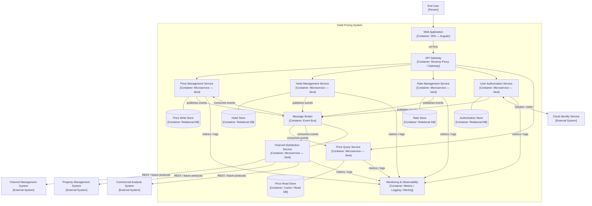

### 5.1 Container Descriptions

| Container | Type | Responsibilities |
|-----------|------|-----------------|
| **Web Application** | Single-Page Application (Angular) | Provides the browser-based user interface for end users on Windows, OSX, and Linux (CON-1). Supports price simulation and change workflows (HPS-2), price queries (HPS-3), hotel and rate management (HPS-4, HPS-5), and user permission management (HPS-6). Communicates exclusively through the API Gateway over HTTPS. |
| **API Gateway** | Reverse Proxy / Gateway | Single entry point for all external traffic. Responsibilities: TLS termination, request routing to microservices, JWT validation against the cloud identity service, rate limiting, API versioning, and observability (request logging, distributed trace injection). Supports addition of new protocol endpoints without changes to downstream services (QA-6). |
| **Price Management Service** | Microservice (Java) | Implements the Price Management bounded context. Orchestrates price simulations and commits. Invokes `PriceCalculationService` to compute all derived prices before committing. Persists `PriceChange` aggregates and publishes `PriceChangeCommitted` events via the Outbox pattern to guarantee 100% delivery (QA-1, QA-2). |
| **Hotel Management Service** | Microservice (Java) | Implements the Hotel Management bounded context. Manages the hotel catalog, room types, and tax rates (HPS-4). Publishes `HotelCreated`, `HotelUpdated`, `RoomTypeAdded`, and `RoomTypeRemoved` domain events to the message broker. |
| **Rate Management Service** | Microservice (Java) | Implements the Rate Management bounded context. Manages rate definitions and calculation business rules (HPS-5). Publishes `RateCreated`, `RateUpdated`, `RateRuleAdded`, and `RateRuleRemoved` domain events. |
| **User Authorization Service** | Microservice (Java) | Implements the User Authorization bounded context. Manages hotel-level permissions for authenticated users (HPS-1, HPS-6, QA-5). Delegates authentication to the cloud identity service via OAuth2/OIDC. Provides an authorization check API consumed by the API Gateway and other services. |
| **Price Query Service** | Microservice (Java) | Implements the Price Query bounded context (CQRS read side). Consumes `PriceChangeCommitted` events to maintain a denormalized `PriceReadModel`. Serves all price query requests (HPS-3) with the high availability and throughput required by QA-3 and QA-4, independently of write-path load. |
| **Channel Distribution Service** | Microservice (Java) | Implements the Channel Distribution bounded context (ACL). Consumes `PriceChangeCommitted` events and translates them into protocol-specific calls to CMS, PMS, and CAS. Manages retry logic and partial-failure recovery per distribution target. Ensures 100% delivery (QA-2) and isolates the core domain from external protocol changes (QA-6, CON-5). |
| **Message Broker** | Event Bus | Asynchronous event bus for all cross-service integration. Decouples producers (Price Management, Hotel Management, Rate Management, User Authorization) from consumers (Price Query, Channel Distribution, Price Management for recalculation). Guarantees at-least-once delivery. Supports the event-driven architecture required by QA-2 and QA-8. |
| **Price Write Store** | Relational Database | Persistent store for `PriceChange` aggregates and the Outbox table used for reliable event publication. Owned exclusively by the Price Management Service. |
| **Price Read Store** | Cache / Read Database | Optimised store for the `PriceReadModel`. Supports high-throughput, low-latency reads to meet the 1,000,000 queries/day and 99.9% availability requirements (QA-3, QA-4). Owned exclusively by the Price Query Service. |
| **Hotel Store** | Relational Database | Persistent store for `Hotel` aggregates and `RoomType` entities. Owned exclusively by the Hotel Management Service. |
| **Rate Store** | Relational Database | Persistent store for `Rate` aggregates and `BusinessRule` entities. Owned exclusively by the Rate Management Service. |
| **Authorization Store** | Relational Database | Persistent store for `UserAuthorization` aggregates. Owned exclusively by the User Authorization Service. |
| **Monitoring & Observability** | Metrics / Logging / Alerting | Centralized collection of metrics, logs, and traces from all microservices. Supports the operator's ability to measure performance and reliability of price publication (QA-8). Provides alerting for `DistributionFailed` events and SLA breach detection (QA-3). |

---

## 6. Component Diagrams

For each container identified in section 5 that will be developed as part of this project, a dedicated subsection below will provide a component diagram detailing the internal design of that container. A component in the C4 model represents a major logical building block within a container — for example, a controller, an application service, a domain service, a repository, an event publisher, or an infrastructure adapter.

Each component diagram will show the components within the container, their dependencies on one another, and their interactions with external containers (databases, message broker, other microservices). Each diagram will be accompanied by a table listing the name of every component shown and a concise description of its responsibilities.

Component diagrams will be added iteratively, aligned with the design iterations defined in the Iteration Plan, as the internal design of each container is refined.

---

## 7. Sequence Diagrams

For each user story and quality attribute scenario addressed in the Iteration Plan, this section provides a sequence diagram illustrating the runtime behaviour of the system. Diagrams show the interactions between containers and between the system and external actors. They are organized by iteration to reflect the incremental nature of the ADD process. Sequence diagrams will be elaborated progressively as each iteration is completed.

---

### 7.1 Iteration 1 — Establish Overall System Structure

**Goal:** Define the overall architecture and deployment model. Establish CI/CD infrastructure, cloud-native deployment, and cloud identity service integration.

#### 7.1.1 CRN-1: Establish Overall System Structure

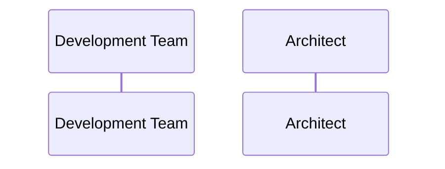

#### 7.1.2 CON-6: Cloud-Native Deployment

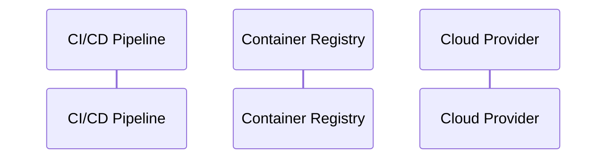

#### 7.1.3 CON-2: Cloud Identity Service Integration

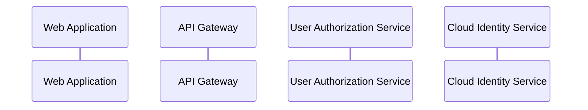

#### 7.1.4 CRN-5: Continuous Deployment Infrastructure

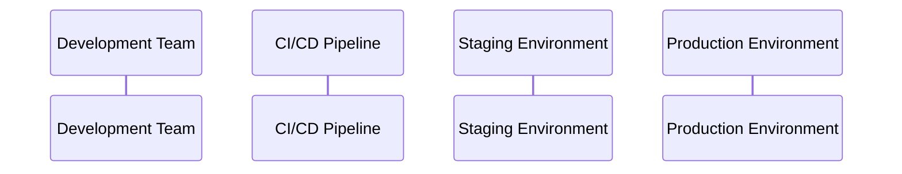

#### 7.1.5 QA-7: Deployability — Environment Promotion

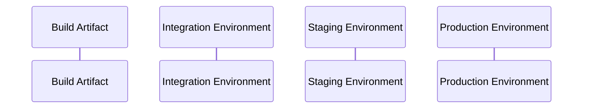

---

### 7.2 Iteration 2 — Core Pricing Calculation and Publication

**Goal:** Design the core business functionality for changing and publishing prices, addressing performance (QA-1) and reliability (QA-2).

#### 7.2.1 HPS-2: Change Prices

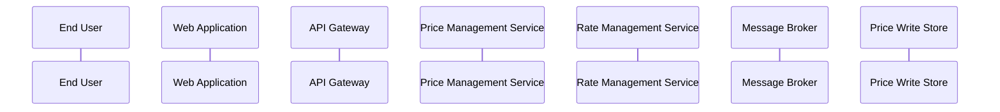

#### 7.2.2 QA-1: Performance — Price Publication Under 100 ms

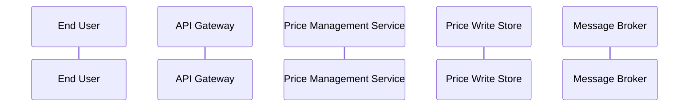

#### 7.2.3 QA-2: Reliability — 100% Price Change Publication

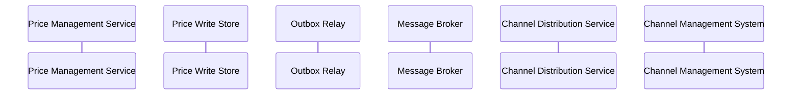

#### 7.2.4 CON-5: Initial REST API Integration with External Systems

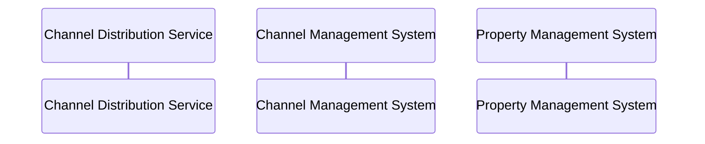

---

### 7.3 Iteration 3 — Query Capabilities and Scalability

**Goal:** Design the price query capabilities, ensuring high availability (QA-3) and scalability (QA-4).

#### 7.3.1 HPS-3: Query Prices

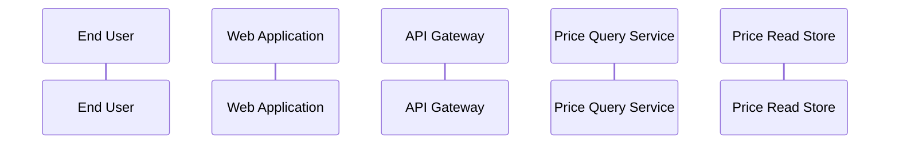

#### 7.3.2 QA-3: Availability — 99.9% Query Uptime

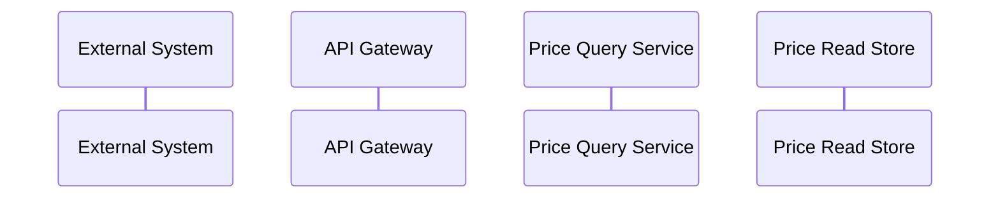

#### 7.3.3 QA-4: Scalability — Up to 1,000,000 Queries per Day

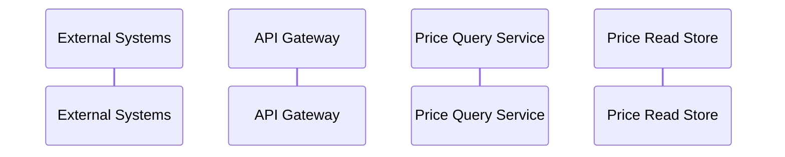

---

### 7.4 Iteration 4 — Hotel and Rate Management

**Goal:** Design the functionality to manage hotels and rates, including calculation business rules.

#### 7.4.1 HPS-4: Manage Hotels

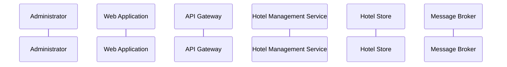

#### 7.4.2 HPS-5: Manage Rates

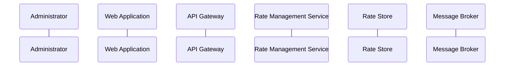

---

### 7.5 Iteration 5 — Security and User Management

**Goal:** Design authentication and authorization flows, hotel-level access control, and multi-platform web interface.

#### 7.5.1 HPS-1: Log In

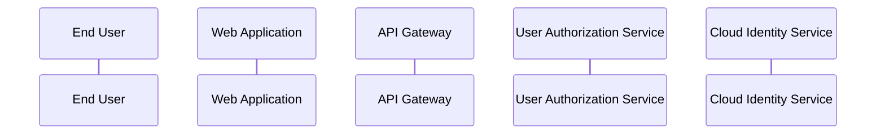

#### 7.5.2 HPS-6: Manage Users

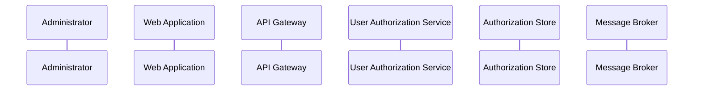

#### 7.5.3 QA-5: Security — Authentication and Authorization

```mermaid
sequenceDiagram
    participant User as End User
    participant WebApp as Web Application
    participant APIGW as API Gateway
    participant UserAuthSvc as User Authorization Service
    participant IdS as Cloud Identity Service
    participant PriceMgmtSvc as Price Management Service
```

#### 7.5.4 CON-1: Multi-Platform Web Interface

```mermaid
sequenceDiagram
    participant Browser as Web Browser
    participant WebApp as Web Application
    participant APIGW as API Gateway
```

---

### 7.6 Iteration 6 — Modularity, Monitoring, and Testability

**Goal:** Enhance protocol modularity (QA-6), observability (QA-8), integration testability (QA-9), and address technical debt (CRN-4).

#### 7.6.1 QA-6: Modifiability — New Query Protocol (e.g., gRPC)

```mermaid
sequenceDiagram
    participant ExternalSystem as External System
    participant APIGW as API Gateway
    participant PriceQuerySvc as Price Query Service
    participant PriceReadStore as Price Read Store
```

#### 7.6.2 QA-8: Monitorability — Price Publication Observability

```mermaid
sequenceDiagram
    participant Operator as System Operator
    participant Monitoring as Monitoring System
    participant PriceMgmtSvc as Price Management Service
    participant ChannelDistSvc as Channel Distribution Service
    participant MessageBroker as Message Broker
```

#### 7.6.3 QA-9: Testability — Integration Testing Without External Systems

```mermaid
sequenceDiagram
    participant TestRunner as Test Runner
    participant PriceMgmtSvc as Price Management Service
    participant MockIdS as Mock Identity Service
    participant MockCMS as Mock Channel Management System
    participant PriceWriteDB as Price Write Store
```

#### 7.6.4 CRN-4: Avoid Technical Debt

```mermaid
sequenceDiagram
    participant Dev as Development Team
    participant CI as CI/CD Pipeline
    participant StaticAnalysis as Static Analysis
    participant Monitoring as Monitoring System
```

---

## 8. Interfaces

_This section will describe the API contracts, message schemas, and integration interface specifications for each container boundary. It will include REST API endpoint definitions (paths, methods, request/response schemas, and error codes), asynchronous message contracts (event schemas published to the message broker), and integration interface specifications for external systems (Cloud Identity Service, Channel Management System, Property Management System, Commercial Analysis System). To be completed in subsequent iterations._

---

## 9. Design Decisions

This section records the significant design decisions taken during the architecture process. Each decision will be linked to the driver(s) that motivated it, together with the chosen approach, the rationale, and any alternatives that were considered but discarded. Decisions will be added as each iteration is completed.

| Driver(s) | Decision | Rationale | Discarded Alternative(s) |
|-----------|----------|-----------|--------------------------|
|  |  |  |  |
