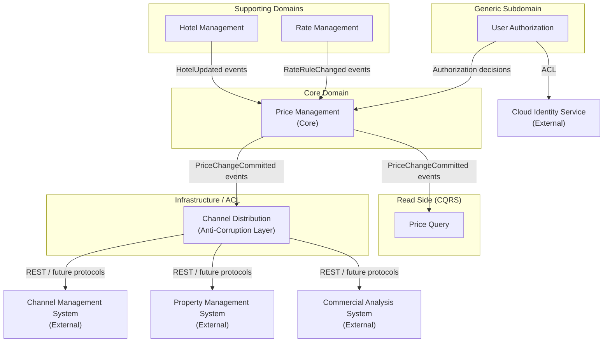

# Hotel Pricing System — Domain Model

**Architect:** Neo  
**Method:** Attribute-Driven Design (ADD) / Domain-Driven Design (DDD)  
**Target Architecture:** Microservices

---

## 1. Requirements Consistency Review

Before the domain model is established, the full set of architectural drivers was reviewed to confirm internal consistency, identify gaps, and resolve any conflicts that would otherwise propagate into structural decisions.

### 1.1 Observations

| # | Driver(s) | Observation | Assessment |
|---|-----------|-------------|------------|
| 1 | Context diagram, HPS-2 | The context diagram lists the **Property Management System (PMS)** as a price consumer, but no user story, QAS, or constraint explicitly addresses PMS integration. HPS-2 only mentions the Channel Management System. | **Gap.** The PMS integration is a real integration point visible in the context diagram and must be covered. It is subsumed under the Channel Distribution bounded context, which acts as the anti-corruption layer for all external price consumers. This document treats PMS as one consumer alongside CMS. |
| 2 | HPS-3, QA-3, QA-4 | HPS-3 says prices may be queried via both a **user interface** and a **query API** by external systems. QA-3 (99.9% uptime) and QA-4 (up to 1,000,000 queries/day without latency degradation) apply specifically to this query path. However, the same QA entries also must hold when HPS-2 write operations are occurring concurrently. | **Tension identified.** The write path (price change, calculation, publication — QA-1: 100 ms) and the read path (query, QA-3, QA-4) must be architecturally separated. A CQRS pattern is required: a dedicated **Price Query** bounded context (read model) ensures the query SLA is independent of write load. Without this separation, a high-load write burst would violate QA-3. |
| 3 | QA-1, QA-2 | QA-1 demands price publication in **under 100 ms** end-to-end. QA-2 demands **100% delivery** to the Channel Management System. These two requirements together rule out synchronous on-demand price calculation at query time and require that derived prices are **pre-computed** and stored as part of the commit step. The 100% reliability requirement further mandates a durable, transactional event publication mechanism (e.g., Outbox pattern). | **Consistent, but demanding.** Pre-computation at commit time and transactional outbox are non-negotiable architectural decisions; they are reflected in the domain model. |
| 4 | QA-6, CON-5 | QA-6 requires that a new query protocol (e.g., gRPC) can be added **without changing core components**. CON-5 requires REST initially but anticipates other protocols. Both drivers point to the same solution: the query adapter layer must be isolated from the price domain model. | **Consistent.** The Channel Distribution bounded context (for write) and the Price Query bounded context (for read) both act as pluggable adapter layers over the stable domain core. |
| 5 | HPS-1, QA-5, CON-2 | Authentication is fully delegated to the cloud identity service (CON-2). HPS-1 and QA-5 confirm this. However, the user stories and QAS do not specify **authorization granularity**: which users can manage which hotels? HPS-6 (Manage Users) and the RBAC implication of QA-5 ("presented with only the functions they are authorized to use") together imply hotel-level access control for commercial users. | **Clarification applied.** The domain model introduces a `UserAuthorization` aggregate that owns hotel-level permissions. Authentication remains external; this aggregate provides the application-level authorization cache. |
| 6 | QA-1, HPS-4, HPS-5 | When hotel configuration changes (tax rates, room types — HPS-4) or rate business rules change (HPS-5), all affected derived prices may need to be recalculated. This cascading recalculation is not explicitly called out in the requirements but is a logical consequence of the domain rules. | **Implicit requirement surfaced.** The Rate Management and Hotel Management contexts publish domain events that trigger recalculation workflows in the Price Management context. This is captured in the cross-context integration section below. |
| 7 | QA-9, CON-5 | QA-9 demands that all elements support integration testing independently of external systems. CON-5 and QA-6 require protocol flexibility. Together, these reinforce the need for anti-corruption layers and adapter interfaces at every external boundary (cloud identity service, CMS, PMS, commercial analysis system). | **Consistent.** All external system integrations are represented as ports in the domain model; adapters (not domain objects) translate external protocols. |
| 8 | CON-4 | An MVP must be demonstrated in 2 months; the full system in 6 months. | **Scope influence.** The bounded contexts identified must be independently developable and deployable. This confirms the microservices decomposition and aligns with CRN-3 (work allocation). |

### 1.2 Summary

The architectural drivers are internally consistent. The two structural decisions that emerge directly from this review — **CQRS read/write separation** and **transactional outbox for reliable event publication** — are foundational to the domain model and will drive all subsequent architectural decisions. No contradictions were found between the priority tables.

---

## 2. Bounded Contexts

The domain is decomposed into six bounded contexts. Each context is a linguistic and ownership boundary within which domain concepts carry a precise, unambiguous meaning. Each context maps directly to one or more independently deployable microservices.



| Bounded Context | DDD Type | Responsibility |
|---|---|---|
| **Price Management** | Core Domain | Orchestrates price change operations: simulation, derivation of calculated prices from base/fixed rates, commitment, and publication. The highest-value context — directly tied to business revenue and the source of truth for all price changes. |
| **Hotel Management** | Supporting Domain | Manages the hotel catalog, room types, and tax rates. Provides the structural context (which rooms exist, at what tax rate) within which prices are defined. |
| **Rate Management** | Supporting Domain | Manages rate definitions and the business rules used to derive calculated prices from base rates. Owns the calculation logic as configurable domain rules. |
| **User Authorization** | Generic Subdomain | Manages application-level authorization — which users may act on which hotels. Authentication is fully delegated to the external cloud identity service; this context holds only the local authorization model. |
| **Price Query** | Read Side (CQRS) | Maintains a denormalized, highly-available read model of published prices. Serves all query traffic (HPS-3, QA-3, QA-4) and is updated asynchronously from `PriceChangeCommitted` events. Completely independent of write-path load. |
| **Channel Distribution** | Infrastructure / ACL | Anti-corruption layer that translates committed price change events into API calls targeting external systems (CMS, PMS, Commercial Analysis System). Insulates the core domain from external protocol changes (QA-6, CON-5). |

---

## 3. Domain Model Class Diagram

The diagram below represents all six bounded contexts using DDD stereotypes. Stereotype annotations distinguish Aggregate Roots (`<<AR>>`), Entities (`<<Entity>>`), Value Objects (`<<VO>>`), Domain Events (`<<DomainEvent>>`), Domain Services (`<<DomainService>>`), and Enumerations (`<<Enumeration>>`). Cross-context relationships are shown as dashed dependencies labeled with the domain event or reference mechanism that crosses the boundary.

```mermaid
classDiagram

    %% ============================================================
    %% BOUNDED CONTEXT: Price Management (Core Domain)
    %% ============================================================
    namespace PriceManagement {

        class PriceChange {
            <<AR>>
            +PriceChangeId id
            +HotelId hotelId
            +ExternalUserId initiatedBy
            +DateTime timestamp
            +PriceChangeStatus status
            +List~PriceChangeEntry~ entries
            +simulate(entries) PriceChangeSimulated
            +commit() PriceChangeCommitted
        }

        class PriceChangeEntry {
            <<VO>>
            +RateId rateId
            +RoomTypeId roomTypeId
            +Date date
            +Money amount
            +PriceEntryType entryType
        }

        class PriceCalculationService {
            <<DomainService>>
            +calculateDerivedPrices(baseEntries, rules) List~PriceChangeEntry~
        }

        class PriceChangeSimulated {
            <<DomainEvent>>
            +PriceChangeId priceChangeId
            +HotelId hotelId
            +List~PriceChangeEntry~ simulatedEntries
            +DateTime occurredAt
        }

        class PriceChangeCommitted {
            <<DomainEvent>>
            +PriceChangeId priceChangeId
            +HotelId hotelId
            +List~PriceChangeEntry~ publishedEntries
            +DateTime occurredAt
        }

        class PriceChangeId {
            <<VO>>
            +String value
        }

        class PriceChangeStatus {
            <<Enumeration>>
            SIMULATED
            COMMITTED
        }

        class PriceEntryType {
            <<Enumeration>>
            BASE
            FIXED
            CALCULATED
        }

        class Money {
            <<VO>>
            +BigDecimal amount
            +String currency
            +add(Money) Money
            +multiply(BigDecimal) Money
        }
    }

    PriceChange "1" *-- "1..*" PriceChangeEntry : contains
    PriceChangeEntry "1" *-- "1" Money : valued as
    PriceChange ..> PriceChangeSimulated : emits
    PriceChange ..> PriceChangeCommitted : emits

    %% ============================================================
    %% BOUNDED CONTEXT: Hotel Management (Supporting Domain)
    %% ============================================================
    namespace HotelManagement {

        class Hotel {
            <<AR>>
            +HotelId id
            +String name
            +Location location
            +TaxRate taxRate
            +List~RoomType~ roomTypes
            +List~RateId~ availableRateIds
            +addRoomType(roomType) RoomTypeAdded
            +removeRoomType(roomTypeId) RoomTypeRemoved
            +updateTaxRate(taxRate) HotelUpdated
        }

        class RoomType {
            <<Entity>>
            +RoomTypeId id
            +String name
            +String description
            +int capacity
        }

        class HotelId {
            <<VO>>
            +String value
        }

        class RoomTypeId {
            <<VO>>
            +String value
        }

        class Location {
            <<VO>>
            +String address
            +String city
            +String country
        }

        class TaxRate {
            <<VO>>
            +BigDecimal percentage
            +validate() boolean
        }

        class HotelCreated {
            <<DomainEvent>>
            +HotelId hotelId
            +String name
            +DateTime occurredAt
        }

        class HotelUpdated {
            <<DomainEvent>>
            +HotelId hotelId
            +DateTime occurredAt
        }

        class RoomTypeAdded {
            <<DomainEvent>>
            +HotelId hotelId
            +RoomTypeId roomTypeId
            +DateTime occurredAt
        }

        class RoomTypeRemoved {
            <<DomainEvent>>
            +HotelId hotelId
            +RoomTypeId roomTypeId
            +DateTime occurredAt
        }
    }

    Hotel "1" *-- "0..*" RoomType : contains
    Hotel "1" *-- "1" Location : located at
    Hotel "1" *-- "1" TaxRate : taxed by
    Hotel ..> HotelCreated : emits
    Hotel ..> HotelUpdated : emits
    Hotel ..> RoomTypeAdded : emits
    Hotel ..> RoomTypeRemoved : emits
    RoomType "1" *-- "1" RoomTypeId : identified by

    %% ============================================================
    %% BOUNDED CONTEXT: Rate Management (Supporting Domain)
    %% ============================================================
    namespace RateManagement {

        class Rate {
            <<AR>>
            +RateId id
            +String name
            +String description
            +RateType type
            +List~BusinessRule~ calculationRules
            +addRule(rule) RateRuleAdded
            +removeRule(ruleId) RateRuleRemoved
            +applyRules(baseMoney) Money
        }

        class BusinessRule {
            <<Entity>>
            +BusinessRuleId id
            +String name
            +Formula formula
            +int priority
            +apply(baseMoney) Money
        }

        class RateId {
            <<VO>>
            +String value
        }

        class BusinessRuleId {
            <<VO>>
            +String value
        }

        class Formula {
            <<VO>>
            +String expression
            +validate() boolean
            +evaluate(baseMoney) Money
        }

        class RateType {
            <<Enumeration>>
            BASE
            FIXED
            CALCULATED
        }

        class RateCreated {
            <<DomainEvent>>
            +RateId rateId
            +RateType type
            +DateTime occurredAt
        }

        class RateUpdated {
            <<DomainEvent>>
            +RateId rateId
            +DateTime occurredAt
        }

        class RateRuleAdded {
            <<DomainEvent>>
            +RateId rateId
            +BusinessRuleId ruleId
            +DateTime occurredAt
        }

        class RateRuleRemoved {
            <<DomainEvent>>
            +RateId rateId
            +BusinessRuleId ruleId
            +DateTime occurredAt
        }
    }

    Rate "1" *-- "0..*" BusinessRule : governed by
    BusinessRule "1" *-- "1" Formula : defined by
    Rate ..> RateCreated : emits
    Rate ..> RateUpdated : emits
    Rate ..> RateRuleAdded : emits
    Rate ..> RateRuleRemoved : emits

    %% ============================================================
    %% BOUNDED CONTEXT: User Authorization (Generic Subdomain)
    %% ============================================================
    namespace UserAuthorization {

        class UserAuthorization {
            <<AR>>
            +ExternalUserId userId
            +UserRole role
            +List~HotelId~ authorizedHotelIds
            +grantAccess(hotelId) HotelAccessGranted
            +revokeAccess(hotelId) HotelAccessRevoked
            +isAuthorizedFor(hotelId) boolean
            +isAdministrator() boolean
        }

        class ExternalUserId {
            <<VO>>
            +String value
        }

        class UserRole {
            <<Enumeration>>
            ADMINISTRATOR
            COMMERCIAL
        }

        class HotelAccessGranted {
            <<DomainEvent>>
            +ExternalUserId userId
            +HotelId hotelId
            +DateTime occurredAt
        }

        class HotelAccessRevoked {
            <<DomainEvent>>
            +ExternalUserId userId
            +HotelId hotelId
            +DateTime occurredAt
        }
    }

    UserAuthorization ..> HotelAccessGranted : emits
    UserAuthorization ..> HotelAccessRevoked : emits

    %% ============================================================
    %% BOUNDED CONTEXT: Price Query — Read Side (CQRS)
    %% ============================================================
    namespace PriceQuery {

        class PriceReadModel {
            <<Entity>>
            +HotelId hotelId
            +RateId rateId
            +RoomTypeId roomTypeId
            +Date date
            +Money amount
            +PriceEntryType entryType
            +DateTime publishedAt
            +DateTime lastUpdatedAt
        }

        class PriceQueryFilter {
            <<VO>>
            +HotelId hotelId
            +DateRange dateRange
            +RateId rateId
            +RoomTypeId roomTypeId
        }

        class DateRange {
            <<VO>>
            +Date from
            +Date to
        }
    }

    PriceQueryFilter "1" *-- "0..1" DateRange : bounded by

    %% ============================================================
    %% BOUNDED CONTEXT: Channel Distribution (Infrastructure / ACL)
    %% ============================================================
    namespace ChannelDistribution {

        class DistributionJob {
            <<AR>>
            +DistributionJobId id
            +PriceChangeId sourceEventId
            +HotelId hotelId
            +DistributionStatus status
            +List~DistributionTarget~ targets
            +DateTime scheduledAt
            +DateTime completedAt
            +dispatch() DistributionCompleted
            +fail(reason) DistributionFailed
        }

        class DistributionTarget {
            <<Entity>>
            +DistributionTargetId id
            +ExternalSystemType systemType
            +TargetStatus status
            +String endpoint
            +int retryCount
        }

        class DistributionJobId {
            <<VO>>
            +String value
        }

        class ExternalSystemType {
            <<Enumeration>>
            CHANNEL_MANAGEMENT_SYSTEM
            PROPERTY_MANAGEMENT_SYSTEM
            COMMERCIAL_ANALYSIS_SYSTEM
            OTHER
        }

        class DistributionStatus {
            <<Enumeration>>
            PENDING
            IN_PROGRESS
            COMPLETED
            PARTIALLY_FAILED
            FAILED
        }

        class TargetStatus {
            <<Enumeration>>
            PENDING
            DELIVERED
            FAILED
        }

        class DistributionCompleted {
            <<DomainEvent>>
            +DistributionJobId jobId
            +HotelId hotelId
            +DateTime occurredAt
        }

        class DistributionFailed {
            <<DomainEvent>>
            +DistributionJobId jobId
            +String reason
            +DateTime occurredAt
        }
    }

    DistributionJob "1" *-- "1..*" DistributionTarget : delivers to
    DistributionJob ..> DistributionCompleted : emits
    DistributionJob ..> DistributionFailed : emits

    %% ============================================================
    %% CROSS-CONTEXT REFERENCES (by identity only)
    %% ============================================================
    PriceChange --> HotelId : references
    PriceChange --> ExternalUserId : references
    PriceChangeEntry --> RateId : references
    PriceChangeEntry --> RoomTypeId : references
    Hotel --> RateId : references
    UserAuthorization --> HotelId : references
    DistributionJob --> PriceChangeId : originates from
    PriceReadModel --> HotelId : indexed by
    PriceReadModel --> RateId : for rate
    PriceReadModel --> RoomTypeId : for room type

    %% ============================================================
    %% CROSS-CONTEXT DOMAIN EVENT FLOWS
    %% ============================================================
    PriceChangeCommitted ..> DistributionJob : triggers creation
    PriceChangeCommitted ..> PriceReadModel : projects into
    HotelUpdated ..> PriceChange : triggers recalculation
    RoomTypeAdded ..> PriceChange : triggers initialization
    RoomTypeRemoved ..> PriceReadModel : triggers archival
    RateRuleAdded ..> PriceChange : triggers recalculation
    RateRuleRemoved ..> PriceChange : triggers recalculation
```

---

## 4. Domain Model Description

### 4.1 Price Management Bounded Context (Core Domain)

| Element | Type | Description |
|---------|------|-------------|
| `PriceChange` | Aggregate Root | The central aggregate of the system. Represents a complete price change operation initiated by a user for a specific hotel. Manages the lifecycle from simulation (`SIMULATED`) through to final publication (`COMMITTED`). Contains all price entries — base, fixed, and derived — that result from the operation. Emits `PriceChangeSimulated` (for preview) and `PriceChangeCommitted` (for publication and downstream propagation). Directly addresses HPS-2, QA-1, and QA-2. |
| `PriceChangeEntry` | Value Object | An immutable record of a single price within a `PriceChange`. Identifies the combination of rate, room type, and date, along with the resulting amount and its entry type (`BASE`, `FIXED`, or `CALCULATED`). Immutability ensures audit integrity and supports reliable event replay. |
| `PriceCalculationService` | Domain Service | Stateless service that applies the business rules of `CALCULATED` rates to base prices, producing the full set of derived `PriceChangeEntry` objects. Lives within Price Management but receives rate rule definitions via an integration contract from Rate Management. Responsible for satisfying the 100 ms calculation bound in QA-1. |
| `PriceChangeSimulated` | Domain Event | Emitted when a user completes a simulation (`SIMULATED` status). Carries the full set of simulated entries for display to the user (preview, not published). Does not trigger downstream publication or distribution. |
| `PriceChangeCommitted` | Domain Event | Emitted when a price change is committed (`COMMITTED` status). This is the primary integration event — it is consumed by Channel Distribution (to dispatch prices to external systems) and by Price Query (to update the read model). Must be delivered with 100% reliability, mandating a transactional Outbox pattern to satisfy QA-2. |
| `PriceChangeId` | Value Object | Strongly-typed identity for a `PriceChange`. Carried in all related domain events to maintain traceability. |
| `PriceChangeStatus` | Enumeration | Lifecycle states of a `PriceChange`: `SIMULATED` (under review, not yet published) and `COMMITTED` (finalized and published). |
| `PriceEntryType` | Enumeration | Classifies a `PriceChangeEntry` as `BASE` (foundational price entered by the user), `FIXED` (user-defined absolute price independent of base), or `CALCULATED` (derived from base rate using business rules). |
| `Money` | Value Object | Immutable representation of a monetary amount with its currency. Arithmetic operations (`add`, `multiply`) return new instances, preserving immutability. The sole monetary primitive shared (by value copy) across Price Management and Rate Management contexts. |

---

### 4.2 Hotel Management Bounded Context (Supporting Domain)

| Element | Type | Description |
|---------|------|-------------|
| `Hotel` | Aggregate Root | Represents a hotel in the AD&D chain. Acts as the root of the hotel catalog, managing its room types and the set of rate IDs associated with it. The `taxRate` is a critical pricing input that, when modified, must trigger recalculation of all affected prices in the Price Management context. Maintains the structural consistency of the hotel's configuration. Addresses HPS-4. |
| `RoomType` | Entity | A type of room within a hotel (e.g., Single, Double, Suite). Has its own identity within the `Hotel` aggregate. Room types are a dimension of price variation: every price entry is specific to a rate AND a room type combination. |
| `HotelId` | Value Object | Strongly-typed identity for a `Hotel`. Used as a cross-context reference in `PriceChange`, `UserAuthorization`, `PriceReadModel`, and `DistributionJob`. Never replaced by an object reference across context boundaries. |
| `RoomTypeId` | Value Object | Strongly-typed identity for a `RoomType`. Used as a cross-context reference in `PriceChangeEntry` and `PriceReadModel`. |
| `Location` | Value Object | Immutable value object capturing the hotel's physical address. Used for informational purposes within the Hotel Management context only. |
| `TaxRate` | Value Object | Immutable representation of the hotel's applicable tax percentage. Self-validates to ensure the value is within acceptable business bounds before being accepted into the aggregate. |
| `HotelCreated` | Domain Event | Emitted when a new hotel is added to the system. Consumed by Rate Management (to make rates available at the hotel) and by Price Query (to initialize an empty read model entry). |
| `HotelUpdated` | Domain Event | Emitted when hotel attributes (name, location, tax rate) are modified. Consumed by Price Management to trigger recalculation of all currently published prices for the hotel. |
| `RoomTypeAdded` | Domain Event | Emitted when a room type is added to a hotel. Signals to Price Management that new price combinations (rate × room type × date) must be initialized and published. |
| `RoomTypeRemoved` | Domain Event | Emitted when a room type is removed. Signals to Price Query that associated prices should be archived, and to Price Management that they are no longer valid targets for future changes. |

---

### 4.3 Rate Management Bounded Context (Supporting Domain)

| Element | Type | Description |
|---------|------|-------------|
| `Rate` | Aggregate Root | Represents a pricing scheme (e.g., public rate, corporate rate, promotional rate). Classified as `BASE`, `FIXED`, or `CALCULATED`. `CALCULATED` rates own a set of ordered `BusinessRule` objects that derive their prices from a base rate. Maintains the integrity and ordering of its rule collection. Addresses HPS-5. |
| `BusinessRule` | Entity | A single calculation rule within a `Rate`. Has its own identity so that rules can be individually added, modified, or removed without replacing the entire rule set. Contains a `Formula` evaluated at price calculation time. The `priority` field governs the order in which rules are applied when multiple rules exist for a rate. |
| `RateId` | Value Object | Strongly-typed identity for a `Rate`. Used as a cross-context reference in `Hotel` (to declare available rates at a hotel) and in `PriceChangeEntry` (to identify which rate an entry belongs to). |
| `BusinessRuleId` | Value Object | Strongly-typed identity for a `BusinessRule`. Carried in `RateRuleAdded` and `RateRuleRemoved` events for precise change tracking. |
| `Formula` | Value Object | Immutable value object containing the expression string that defines how a calculated price is derived from a base price. Includes validation logic (`validate()`) to reject malformed or dangerous expressions before persistence. |
| `RateType` | Enumeration | `BASE` — the foundational rate from which calculated rates derive. `FIXED` — independent absolute price, not derived from base. `CALCULATED` — derived from the base rate using the aggregate's `BusinessRule` collection. |
| `RateCreated` | Domain Event | Emitted when a new rate is created. Consumed by Hotel Management to make the rate available for association with specific hotels. |
| `RateUpdated` | Domain Event | Emitted when rate metadata (name, description) is changed. Triggers downstream notifications to any context maintaining a snapshot of rate metadata. |
| `RateRuleAdded` | Domain Event | Emitted when a `BusinessRule` is added to a `Rate`. Consumed by Price Management to trigger recalculation of all prices currently derived from this rate, across all hotels that use it. |
| `RateRuleRemoved` | Domain Event | Emitted when a `BusinessRule` is removed from a `Rate`. Has the same downstream recalculation consequence as `RateRuleAdded`. |

---

### 4.4 User Authorization Bounded Context (Generic Subdomain)

| Element | Type | Description |
|---------|------|-------------|
| `UserAuthorization` | Aggregate Root | Manages application-level authorization for a user who has been authenticated by the cloud identity service (CON-2). Does not store credentials or profile data — only the user's role and the list of hotels they are permitted to act upon. Enforces the rule that a `COMMERCIAL` user may only submit price changes for hotels on their authorized list (HPS-1, QA-5). The aggregate root for all permission management operations (HPS-6). |
| `ExternalUserId` | Value Object | Strongly-typed reference to the user's identity in the cloud identity service. The sole bridge between this bounded context and the external identity provider. All other contexts reference users via this value object only. |
| `UserRole` | Enumeration | `ADMINISTRATOR` — full system access: may manage hotels, rates, users, and all hotel prices. `COMMERCIAL` — restricted access: may only change prices for explicitly authorized hotels. |
| `HotelAccessGranted` | Domain Event | Emitted when an administrator grants a user access to a specific hotel. Consumed by monitoring and audit infrastructure (QA-8). |
| `HotelAccessRevoked` | Domain Event | Emitted when hotel access is removed from a user. Consumed by monitoring and audit infrastructure (QA-8). |

---

### 4.5 Price Query Bounded Context (CQRS Read Side)

| Element | Type | Description |
|---------|------|-------------|
| `PriceReadModel` | Entity | A denormalized, queryable projection of published price data. Each record corresponds to a single (hotel, rate, room type, date) combination and carries the published `Money` amount, the entry type, and the publication timestamp. Built and maintained asynchronously by consuming `PriceChangeCommitted` events from Price Management. This is a pure read model: it carries no write authority and can be rebuilt from the event log at any time. Directly satisfies HPS-3, QA-3 (99.9% availability), and QA-4 (1,000,000 queries/day) by decoupling read throughput entirely from write operations. |
| `PriceQueryFilter` | Value Object | Encapsulates the parameters of a price query: hotel, optional date range, optional rate, and optional room type. Never persisted; constructed per request and discarded after use. Satisfies the query API described in HPS-3. |
| `DateRange` | Value Object | A bounded range of calendar dates used as a filter dimension within `PriceQueryFilter`. Validates that `from` is not after `to`. |

---

### 4.6 Channel Distribution Bounded Context (Infrastructure / Anti-Corruption Layer)

| Element | Type | Description |
|---------|------|-------------|
| `DistributionJob` | Aggregate Root | Represents a single price distribution batch, created in response to a `PriceChangeCommitted` event. Tracks delivery of committed prices to all configured external systems (CMS, PMS, Commercial Analysis System). Manages the full delivery lifecycle including retries and partial-failure handling. Directly satisfies QA-2 (100% delivery) and QA-6 (protocol isolation). |
| `DistributionTarget` | Entity | Represents a single external system as a delivery target within a `DistributionJob`. Has its own delivery status (`PENDING`, `DELIVERED`, `FAILED`) and retry counter. An overall job is `COMPLETED` only when all targets are delivered; otherwise it transitions to `PARTIALLY_FAILED` or `FAILED`. |
| `DistributionJobId` | Value Object | Strongly-typed identity for a `DistributionJob`. |
| `ExternalSystemType` | Enumeration | Classifies the external system being integrated: `CHANNEL_MANAGEMENT_SYSTEM`, `PROPERTY_MANAGEMENT_SYSTEM`, `COMMERCIAL_ANALYSIS_SYSTEM`, `OTHER`. The `OTHER` value provides the extension point required by QA-6 (adding new protocol targets without changing core components). |
| `DistributionStatus` | Enumeration | `PENDING` → `IN_PROGRESS` → `COMPLETED` \| `PARTIALLY_FAILED` \| `FAILED`. A job that completes with all targets delivered is `COMPLETED`; a job with at least one failed target is `PARTIALLY_FAILED`; a job with all targets failed is `FAILED`. Both non-`COMPLETED` states require operator alerting (QA-8). |
| `TargetStatus` | Enumeration | Delivery state for a single `DistributionTarget`: `PENDING`, `DELIVERED`, `FAILED`. Used to drive per-target retry logic independently of the overall job status. |
| `DistributionCompleted` | Domain Event | Emitted when all distribution targets have been successfully delivered. Consumed by the monitoring infrastructure (QA-8) to record successful publication. |
| `DistributionFailed` | Domain Event | Emitted when a distribution job cannot be completed successfully after exhausting retries. Consumed by monitoring and operations alerting (QA-8). |

---

## 5. Cross-Context Integration Summary

All integration between bounded contexts is expressed through domain events transported over the message broker. No bounded context holds an object reference into another; cross-context links are identity references only (`HotelId`, `RateId`, `RoomTypeId`, `ExternalUserId`, `PriceChangeId`).

| Domain Event | Producer Context | Consumer Context(s) | Purpose |
|---|---|---|---|
| `PriceChangeSimulated` | Price Management | UI / API | Return simulation preview to the user (not propagated to downstream systems) |
| `PriceChangeCommitted` | Price Management | Channel Distribution, Price Query | Trigger external distribution and update read model; guaranteed via Outbox (QA-2) |
| `HotelCreated` | Hotel Management | Price Query | Initialize empty read model entries for the new hotel |
| `HotelUpdated` | Hotel Management | Price Management | Trigger recalculation of all published prices for the hotel (tax rate change) |
| `RoomTypeAdded` | Hotel Management | Price Management | Initialize new price combinations (rate × room type) for the hotel |
| `RoomTypeRemoved` | Hotel Management | Price Management, Price Query | Invalidate prices; archive read model entries for the removed room type |
| `RateCreated` | Rate Management | Hotel Management | Make the new rate available for association with hotels |
| `RateRuleAdded` | Rate Management | Price Management | Trigger recalculation of all prices derived from this rate across all hotels |
| `RateRuleRemoved` | Rate Management | Price Management | Trigger recalculation of all prices derived from this rate across all hotels |
| `HotelAccessGranted` | User Authorization | Monitoring / Audit | Record permission change for compliance and auditability |
| `HotelAccessRevoked` | User Authorization | Monitoring / Audit | Record permission change for compliance and auditability |
| `DistributionCompleted` | Channel Distribution | Monitoring | Record successful external delivery for QA-8 observability |
| `DistributionFailed` | Channel Distribution | Monitoring, Alerting | Trigger operator alert and metrics capture for QA-8 |

---

## 6. Key Design Decisions Derived from the Domain Model

| # | Decision | Drivers | Rationale |
|---|----------|---------|-----------|
| DD-1 | **CQRS: Read and Write paths separated into distinct bounded contexts.** Price Management owns the write model; Price Query owns the read model. | QA-1, QA-3, QA-4 | Enables the read path (99.9% SLA, 1M queries/day) to be independently scaled and made highly available without being impacted by write-side computation load. |
| DD-2 | **Pre-computation of all derived prices at commit time.** `PriceCalculationService` computes all calculated rate entries before `PriceChangeCommitted` is emitted. | QA-1 (100 ms), HPS-2 | Ensures that all prices are ready to query within 100 ms of publication. Query-time derivation would violate QA-1 under load. |
| DD-3 | **Transactional Outbox pattern for `PriceChangeCommitted`.** The event is written to an outbox table in the same database transaction as the `PriceChange` aggregate state change. | QA-2 (100% delivery) | Eliminates the dual-write problem between aggregate state persistence and event publication, guaranteeing at-least-once delivery to downstream consumers. |
| DD-4 | **Channel Distribution as a standalone Anti-Corruption Layer.** All external system integrations are encapsulated within the Channel Distribution context; no external protocol details leak into Price Management. | QA-6, CON-5 | Adding support for a new protocol (e.g., gRPC, SFTP) or a new external system requires only a new `DistributionTarget` adapter — zero changes to the core domain. |
| DD-5 | **Authentication fully external; UserAuthorization aggregate as local authorization cache.** | CON-2, QA-5, QA-9 | Satisfies CON-2 (cloud identity service mandate) while providing testable, in-process authorization decisions. The `UserAuthorization` aggregate can be stubbed in integration tests without the cloud identity service (QA-9). |
