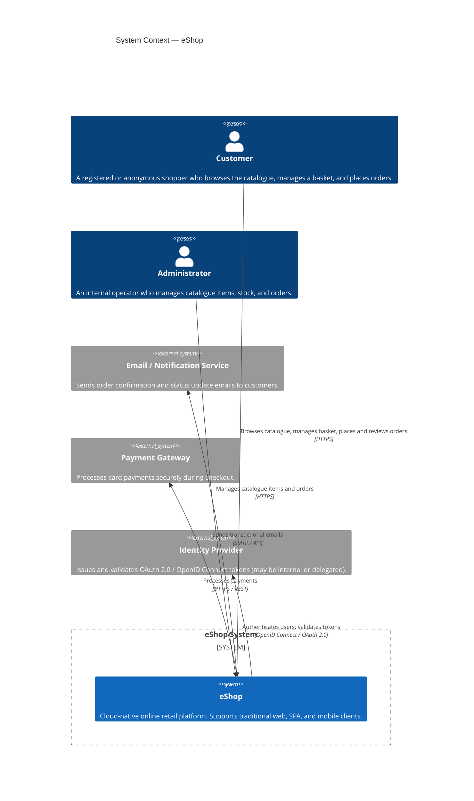

# eShop — Software Architecture Document

**Author:** Neo (Software Architect)
**Method:** Attribute-Driven Design (ADD)
**Date:** 2026-06-09
**Version:** 0.1 — Initial Skeleton

---

## Table of Contents

1. [Introduction](#1-introduction)
2. [Context Diagram](#2-context-diagram)
3. [Architectural Drivers](#3-architectural-drivers)
4. [Domain Model](#4-domain-model)
5. [Container Diagram](#5-container-diagram)
6. [Component Diagrams](#6-component-diagrams)
7. [Sequence Diagrams](#7-sequence-diagrams)
8. [Interfaces](#8-interfaces)
9. [Design Decisions](#9-design-decisions)

---

## 1. Introduction

This document describes the software architecture of the **eShop** system — a cloud-native, microservices-based online retail application. It is intended for software architects, senior developers, and technical stakeholders who need to understand the structural and behavioural design of the system.

The document is produced following the **Attribute-Driven Design (ADD)** methodology. ADD is an iterative decomposition process driven by architectural drivers — functional requirements, quality attribute scenarios, architectural concerns, and constraints. Each design decision is traceable to one or more of these drivers.

The architecture is based on a **microservices** style, where each bounded context identified in the domain model maps to an independently deployable service. This approach directly addresses the system's top-priority quality attributes: high availability, independent deployability via CI/CD, and the ability to serve multiple client types (traditional web, Single Page Application, and native mobile) over a common API surface.

This document evolves alongside the system. In its current version it establishes:

- The system context and its external actors and dependencies.
- The complete set of architectural drivers with their priorities.
- The domain model, derived from Domain-Driven Design (DDD), that constitutes the conceptual foundation of the design.
- The high-level container decomposition of the system.
- Placeholder sections for component diagrams, sequence diagrams, interface contracts, and design decisions, which will be elaborated in subsequent ADD iterations.

---

## 2. Context Diagram

The diagram below is a **C4 Level 1 — System Context** diagram. It shows the eShop system as a single black-box boundary and illustrates who and what interacts with it. The diagram identifies the human actors (customers and administrators) and the external software systems that the eShop depends on or integrates with. It does not expose any internal structure; its purpose is to clarify the system's place in the wider environment and to establish the boundary between what is inside and outside the architecture team's responsibility.



---

## 3. Architectural Drivers

This section summarises the architectural drivers that guide all design decisions. Drivers are separated into four categories: **User Stories** (functional requirements expressed from the user's perspective), **Quality Attribute Scenarios** (measurable non-functional goals), **Architectural Concerns** (cross-cutting considerations the architecture team must address), and **Constraints** (non-negotiable boundaries imposed externally or by policy).

### 3.1 User Stories

| ID  | User Story | Priority |
|-----|------------|----------|
| US1 | As a customer, I want to browse the product catalogue so that I can discover items available for purchase. | High |
| US2 | As a customer, I want to filter catalogue items by product type so that I can narrow down results to relevant categories. | High |
| US3 | As a customer, I want to filter catalogue items by brand so that I can find products from a preferred manufacturer. | High |
| US4 | As a customer, I want to add items to my shopping basket so that I can collect products before purchasing. | High |
| US5 | As a customer, I want to edit the quantity of items or remove items from my basket so that I can adjust my intended purchase. | High |
| US6 | As a customer, I want to check out my basket so that I can place and pay for my order. | High |
| US7 | As a new user, I want to register an account so that I can access personalised features and track my orders. | High |
| US8 | As a registered user, I want to sign in and sign out so that I can securely access my account. | High |
| US9 | As a customer, I want to review my past orders so that I can track their status and history. | Medium |

### 3.2 Quality Attribute Scenarios

| ID   | Quality Attribute | Stimulus | Source | Environment | Response | Response Measure | Priority |
|------|-------------------|----------|--------|-------------|----------|------------------|----------|
| QA1  | Availability      | A sudden traffic spike doubles normal request volume. | Automated load balancer / orchestrator | Normal operation | System scales out additional service instances automatically and continues serving requests. | Zero downtime; 99.9 % uptime SLA; scale-out completes within 2 minutes. | High |
| QA2  | Availability      | One microservice instance becomes unresponsive. | Infrastructure fault | Normal operation | Requests are routed away from the failed instance; healthy instances continue to serve traffic. | No user-visible error; recovery detected within 30 seconds. | High |
| QA3  | Observability     | An unexpected error occurs in the ordering pipeline. | Runtime exception | Normal operation | Structured diagnostic logs are written; a health-check endpoint reports degraded status. | Error traceable end-to-end within 5 minutes using correlation IDs. | High |
| QA4  | Deployability     | A developer merges a feature branch into the main branch of a microservice. | CI/CD pipeline trigger | Development environment | The affected microservice is built, tested, and deployed independently without coordinating with other services. | Deployment pipeline completes in under 15 minutes; no other service is redeployed. | High |
| QA5  | Portability       | A mobile client on iOS requests the same product data as the web SPA. | Mobile app | Normal operation | The API layer serves identical responses to all client types via a unified API surface. | No client-specific backend code paths; all clients use the same public API. | Medium |
| QA6  | Maintainability   | A developer needs to change the pricing logic in the Catalog service. | Developer | Normal operation | The change is localised to the Catalog microservice; no other service requires modification. | Change confined to one repository / deployable unit; zero cross-service redeployments required. | Medium |

### 3.3 Architectural Concerns

| ID  | Concern | Description |
|-----|---------|-------------|
| AC1 | Cross-cutting authentication | All microservices must validate bearer tokens consistently without duplicating authentication logic. |
| AC2 | Inter-service communication | Services must communicate without tight coupling; synchronous calls must not cascade failures. |
| AC3 | Data isolation | Each microservice must own its own data store; no shared databases across service boundaries. |
| AC4 | Distributed tracing | Requests spanning multiple services must carry a correlation ID to enable end-to-end traceability (supports QA3). |
| AC5 | Event-driven integration | Cross-context workflows (e.g., checkout triggering order creation) must use asynchronous messaging to preserve service autonomy. |

### 3.4 Constraints

| ID  | Constraint | Source |
|-----|------------|--------|
| CO1 | The architecture must be based on microservices. | Project mandate |
| CO2 | The system must support deployment on multiple hosting platforms (on-premises, cloud). | NFR — cross-platform hosting |
| CO3 | Development tooling and runtime must be cross-platform (Windows, macOS, Linux). | NFR — cross-platform development |
| CO4 | The system must expose APIs consumable by traditional web apps, SPAs, and native mobile apps. | NFR — multi-client support |
| CO5 | The system must support CI/CD pipelines for each independently deployable unit. | NFR — agile development process |

---

## 4. Domain Model

The domain model below was produced using Domain-Driven Design (DDD), guided by the architectural drivers in Section 3. The model identifies bounded contexts, aggregate roots, entities, and value objects. Each bounded context maps to one microservice in the target architecture.

### 4.1 Bounded Contexts

| Bounded Context | Responsibility |
|-----------------|----------------|
| **Catalog**     | Product catalogue management — items, types, brands |
| **Basket**      | Ephemeral shopping basket per buyer (session/cache-backed) |
| **Ordering**    | Order lifecycle from creation through fulfilment |
| **Identity**    | User registration, authentication, and authorisation |
| **Payment**     | Payment method management; referenced during checkout |

### 4.2 Domain Model Class Diagram

```mermaid
classDiagram
    %% ─── CATALOG BOUNDED CONTEXT ───────────────────────────────────────────
    namespace Catalog {
        class CatalogItem {
            +CatalogItemId id
            +String name
            +String description
            +Money price
            +String pictureUri
            +int availableStock
            +int restockThreshold
            +int maxStockThreshold
            +bool onReorder
            +removeStock(quantity) int
            +addStock(quantity) int
        }
        class CatalogType {
            +int id
            +String type
        }
        class CatalogBrand {
            +int id
            +String brand
        }
        class CatalogItemId {
            <<ValueObject>>
            +int value
        }
        class Money {
            <<ValueObject>>
            +decimal amount
            +String currency
        }
    }

    CatalogItem "1" --> "1" CatalogType : classifiedAs
    CatalogItem "1" --> "1" CatalogBrand : brandedWith
    CatalogItem *-- CatalogItemId
    CatalogItem *-- Money

    %% ─── BASKET BOUNDED CONTEXT ────────────────────────────────────────────
    namespace Basket {
        class CustomerBasket {
            <<AggregateRoot>>
            +String buyerId
            +List~BasketItem~ items
            +addItem(item)
            +updateItem(itemId, quantity)
            +removeItem(itemId)
        }
        class BasketItem {
            +String id
            +int productId
            +String productName
            +Money unitPrice
            +Money oldUnitPrice
            +int quantity
            +String pictureUrl
        }
    }

    CustomerBasket "1" *-- "0..*" BasketItem : contains

    %% ─── ORDERING BOUNDED CONTEXT ──────────────────────────────────────────
    namespace Ordering {
        class Order {
            <<AggregateRoot>>
            +OrderId id
            +String buyerId
            +DateTime orderDate
            +Address address
            +OrderStatus status
            +List~OrderItem~ orderItems
            +int? paymentMethodId
            +addOrderItem(productId, name, price, discount, pictureUrl, units)
            +setPaymentId(id)
            +setAwaitingValidationStatus()
            +setStockConfirmedStatus()
            +setPaidStatus()
            +setShippedStatus()
            +setCancelledStatus()
            +getTotalAmount() Money
        }
        class OrderItem {
            +int productId
            +String productName
            +Money unitPrice
            +Money discount
            +int units
            +String pictureUrl
        }
        class OrderId {
            <<ValueObject>>
            +int value
        }
        class Address {
            <<ValueObject>>
            +String street
            +String city
            +String state
            +String country
            +String zipCode
        }
        class OrderStatus {
            <<ValueObject>>
            +Submitted
            +AwaitingValidation
            +StockConfirmed
            +Paid
            +Shipped
            +Cancelled
        }
        class Buyer {
            <<AggregateRoot>>
            +BuyerId id
            +String name
            +String identityGuid
            +List~PaymentMethod~ paymentMethods
            +verifyOrAddPaymentMethod(cardType, alias, cardNumber, expiration, nameOnCard, securityNumber, orderId) PaymentMethod
        }
        class PaymentMethod {
            +int id
            +String alias
            +String maskedNumber
            +CardType cardType
            +DateTime expiration
            +String nameOnCard
            +isEqualTo(cardType, expiration, cardNumber) bool
        }
        class BuyerId {
            <<ValueObject>>
            +int value
        }
        class CardType {
            <<ValueObject>>
            +Amex
            +Visa
            +MasterCard
        }
    }

    Order *-- OrderId
    Order *-- Address
    Order *-- OrderStatus
    Order "1" *-- "1..*" OrderItem : contains
    Buyer *-- BuyerId
    Buyer "1" *-- "0..*" PaymentMethod : owns
    PaymentMethod *-- CardType
    Order "many" --> "1" Buyer : placedBy

    %% ─── IDENTITY BOUNDED CONTEXT ──────────────────────────────────────────
    namespace Identity {
        class ApplicationUser {
            <<AggregateRoot>>
            +String id
            +String userName
            +String email
            +String normalizedEmail
            +String phoneNumber
            +String cardNumber
            +String securityNumber
            +String expiration
            +String cardHolderName
            +int cardTypeId
            +String street
            +String city
            +String state
            +String country
            +String zipCode
            +List~UserRole~ roles
        }
        class UserRole {
            +String userId
            +String roleId
        }
        class Role {
            +String id
            +String name
        }
    }

    ApplicationUser "1" *-- "0..*" UserRole : hasRoles
    UserRole "many" --> "1" Role : refersTo
```



### 4.3 Domain Element Descriptions

#### Catalog Bounded Context

| Element         | Type           | Description |
|-----------------|----------------|-------------|
| `CatalogItem`   | Aggregate Root | The central entity of the Catalog. Represents a product available for purchase. Owns stock management logic (`removeStock`, `addStock`). |
| `CatalogType`   | Entity         | Classifies catalogue items into product types (e.g., T-Shirt, Mug). Used as a filter dimension (US2). |
| `CatalogBrand`  | Entity         | Identifies the brand of a catalogue item (e.g., Azure, .NET). Used as a filter dimension (US3). |
| `CatalogItemId` | Value Object   | Strongly-typed identifier for `CatalogItem`. Prevents primitive obsession and enforces identity immutability. |
| `Money`         | Value Object   | Represents a monetary amount with currency. Immutable; equality is structural. |

#### Basket Bounded Context

| Element          | Type           | Description |
|------------------|----------------|-------------|
| `CustomerBasket` | Aggregate Root | Represents the buyer's current shopping session. Ephemeral — backed by a distributed cache (Redis) to meet QA1. |
| `BasketItem`     | Entity (local) | A line item within the basket. Holds a price snapshot at the time of addition to detect price drift before checkout. |

#### Ordering Bounded Context

| Element         | Type           | Description |
|-----------------|----------------|-------------|
| `Order`         | Aggregate Root | Core aggregate of the Ordering context. Encapsulates the full lifecycle via explicit state-transition methods. Enforces invariants on items. |
| `OrderItem`     | Entity         | A line item within an order. Holds a denormalised product snapshot so the record is self-contained regardless of future catalogue changes. |
| `OrderId`       | Value Object   | Strongly-typed identifier for `Order`. |
| `Address`       | Value Object   | Shipping address. Immutable; embedded within `Order`. |
| `OrderStatus`   | Value Object   | Enumerated lifecycle states. Transitions enforced by `Order` domain methods. |
| `Buyer`         | Aggregate Root | Ordering-context identity of a customer. Manages registered payment methods independently of the Identity service. |
| `BuyerId`       | Value Object   | Strongly-typed identifier for `Buyer`. |
| `PaymentMethod` | Entity         | A payment card registered by a buyer. Contains masked card information. Validates for equality to avoid duplicates. |
| `CardType`      | Value Object   | Enumerated card network types (Amex, Visa, MasterCard). |

#### Identity Bounded Context

| Element           | Type           | Description |
|-------------------|----------------|-------------|
| `ApplicationUser` | Aggregate Root | Registered user of the platform. Holds authentication credentials and default address/card data. Supports US7 and US8. |
| `UserRole`        | Entity         | Join entity mapping a user to one or more authorisation roles. |
| `Role`            | Entity         | An authorisation role (e.g., `admin`, `customer`). |

---

## 5. Container Diagram

The diagram below is a **C4 Level 2 — Container Diagram**. It zooms into the eShop system boundary and shows the high-level building blocks (containers) that make up the system: frontend applications, backend microservices, databases, caches, and the message bus. Each container is an independently deployable and runnable unit. The diagram shows the primary communication paths between containers, including synchronous HTTP/REST calls and asynchronous message-based integration. It does not show internal component structure — that is the responsibility of the Component Diagrams in Section 6.

```mermaid
C4Container
    title Container Diagram — eShop

    Person(customer, "Customer")
    Person(admin, "Administrator")

    System_Boundary(eshop, "eShop System") {

        Container(webMvc, "Web MVC App", "ASP.NET Core MVC", "Server-rendered traditional web frontend for customers.")
        Container(spa, "Single Page Application", "JavaScript / TypeScript", "Browser-based SPA frontend for customers.")
        Container(mobileApp, "Mobile App", "React Native / MAUI", "Native mobile client for iOS and Android.")
        Container(adminApp, "Admin Web App", "ASP.NET Core MVC", "Web frontend for administrators to manage catalogue and orders.")

        Container(apiGateway, "API Gateway / BFF", "Ocelot / YARP", "Single entry point for all clients. Routes requests, aggregates responses, and enforces authentication.")

        Container(catalogApi, "Catalog API", "ASP.NET Core / .NET", "Manages catalogue items, types, and brands. Exposes paginated, filterable product listings.")
        ContainerDb(catalogDb, "Catalog DB", "SQL Server", "Persistent store for catalogue items, types, and brands.")

        Container(basketApi, "Basket API", "ASP.NET Core / .NET", "Manages ephemeral shopping baskets per buyer.")
        ContainerDb(basketCache, "Basket Cache", "Redis", "Distributed in-memory cache storing basket state for fast read/write access.")

        Container(orderingApi, "Ordering API", "ASP.NET Core / .NET", "Manages order lifecycle from submission through fulfilment.")
        ContainerDb(orderingDb, "Ordering DB", "SQL Server", "Persistent store for orders, buyers, and payment methods.")

        Container(identityApi, "Identity API", "ASP.NET Core Identity / IdentityServer", "Handles user registration, authentication, and token issuance.")
        ContainerDb(identityDb, "Identity DB", "SQL Server", "Persistent store for user accounts and roles.")

        Container(messageBus, "Message Bus", "RabbitMQ / Azure Service Bus", "Asynchronous integration bus. Carries domain integration events between services.")
    }

    System_Ext(emailSystem, "Email Service", "Sends transactional emails.")
    System_Ext(paymentGateway, "Payment Gateway", "Processes card payments.")

    Rel(customer, webMvc, "Uses", "HTTPS")
    Rel(customer, spa, "Uses", "HTTPS")
    Rel(customer, mobileApp, "Uses", "HTTPS")
    Rel(admin, adminApp, "Uses", "HTTPS")

    Rel(webMvc, apiGateway, "API calls", "HTTPS / REST")
    Rel(spa, apiGateway, "API calls", "HTTPS / REST")
    Rel(mobileApp, apiGateway, "API calls", "HTTPS / REST")
    Rel(adminApp, apiGateway, "API calls", "HTTPS / REST")

    Rel(apiGateway, catalogApi, "Routes requests", "HTTPS / REST")
    Rel(apiGateway, basketApi, "Routes requests", "HTTPS / REST")
    Rel(apiGateway, orderingApi, "Routes requests", "HTTPS / REST")
    Rel(apiGateway, identityApi, "Validates tokens", "HTTPS / OIDC")

    Rel(catalogApi, catalogDb, "Reads / Writes", "SQL")
    Rel(basketApi, basketCache, "Reads / Writes", "Redis protocol")
    Rel(orderingApi, orderingDb, "Reads / Writes", "SQL")
    Rel(identityApi, identityDb, "Reads / Writes", "SQL")

    Rel(basketApi, messageBus, "Publishes OrderStarted event", "AMQP")
    Rel(orderingApi, messageBus, "Publishes / Subscribes to order events", "AMQP")
    Rel(catalogApi, messageBus, "Publishes stock change events", "AMQP")

    Rel(orderingApi, paymentGateway, "Processes payment", "HTTPS")
    Rel(orderingApi, emailSystem, "Sends order notifications", "SMTP / API")
```



### 5.1 Container Responsibilities

| Container | Technology | Responsibility |
|-----------|------------|----------------|
| **Web MVC App** | ASP.NET Core MVC | Server-side rendered frontend. Serves HTML to customers using traditional request/response web browsing. |
| **Single Page Application** | JavaScript / TypeScript | Client-rendered SPA for customers. Provides a dynamic, reactive shopping experience in the browser. |
| **Mobile App** | React Native / MAUI | Native mobile client for iOS and Android. Consumes the same API surface as the web clients. |
| **Admin Web App** | ASP.NET Core MVC | Internal management frontend for administrators to manage the product catalogue and monitor orders. |
| **API Gateway / BFF** | Ocelot / YARP | Unified entry point. Handles request routing, aggregation, rate limiting, and token validation. Acts as a Backend for Frontend (BFF) to decouple clients from internal service topology. |
| **Catalog API** | ASP.NET Core / .NET | Microservice responsible for the Catalog bounded context. Exposes paginated and filterable catalogue listings. |
| **Catalog DB** | SQL Server | Relational database exclusively owned by the Catalog API. Stores catalogue items, types, and brands. |
| **Basket API** | ASP.NET Core / .NET | Microservice responsible for the Basket bounded context. Provides fast read/write access to buyer basket state. |
| **Basket Cache** | Redis | Distributed in-memory store exclusively owned by the Basket API. Provides low-latency ephemeral basket persistence. |
| **Ordering API** | ASP.NET Core / .NET | Microservice responsible for the Ordering bounded context. Manages order and buyer aggregates through their full lifecycle. |
| **Ordering DB** | SQL Server | Relational database exclusively owned by the Ordering API. Stores orders, order items, buyers, and payment methods. |
| **Identity API** | ASP.NET Core Identity / IdentityServer | Microservice responsible for the Identity bounded context. Issues OpenID Connect tokens and manages user accounts. |
| **Identity DB** | SQL Server | Relational database exclusively owned by the Identity API. Stores user credentials, profiles, and roles. |
| **Message Bus** | RabbitMQ / Azure Service Bus | Asynchronous integration backbone. Decouples services for cross-context workflows such as checkout and order status updates. |

---

## 6. Component Diagrams

For each container from Section 5 that will be developed as part of this project, a dedicated subsection will be provided below containing a **C4 Level 3 — Component Diagram**. Component diagrams detail the internal structure of a container: the major logical building blocks (components) it contains, their responsibilities, and how they interact with each other and with other containers.

Each component diagram will be accompanied by a table listing each component and its responsibility, following the same format used for containers in Section 5.1.

Component diagrams will be elaborated in subsequent ADD iterations, once the container-level design has been validated against the architectural drivers.

---

## 7. Sequence Diagrams

For each use case driver and quality attribute scenario identified in the iteration plan, a sequence diagram is provided in a dedicated subsection below. These diagrams illustrate the runtime interactions between containers (and, where relevant, components) required to fulfil each driver. They serve as the primary means of validating that the container and component design actually satisfies the stated requirements.

### 7.1 US1 — Browse Catalogue

> **Driver:** As a customer, I want to browse the product catalogue so that I can discover items available for purchase.

```mermaid
sequenceDiagram
```

---

### 7.2 US2 — Filter by Type

> **Driver:** As a customer, I want to filter catalogue items by product type.

```mermaid
sequenceDiagram
```

---

### 7.3 US3 — Filter by Brand

> **Driver:** As a customer, I want to filter catalogue items by brand.

```mermaid
sequenceDiagram
```

---

### 7.4 US4 — Add Item to Basket

> **Driver:** As a customer, I want to add items to my shopping basket.

```mermaid
sequenceDiagram
```

---

### 7.5 US5 — Edit / Remove Basket Items

> **Driver:** As a customer, I want to edit the quantity of items or remove items from my basket.

```mermaid
sequenceDiagram
```

---

### 7.6 US6 — Checkout

> **Driver:** As a customer, I want to check out my basket so that I can place and pay for my order.

```mermaid
sequenceDiagram
```

---

### 7.7 US7 — Register an Account

> **Driver:** As a new user, I want to register an account.

```mermaid
sequenceDiagram
```

---

### 7.8 US8 — Sign In / Sign Out

> **Driver:** As a registered user, I want to sign in and sign out.

```mermaid
sequenceDiagram
```

---

### 7.9 US9 — Review Orders

> **Driver:** As a customer, I want to review my past orders and their status.

```mermaid
sequenceDiagram
```

---

### 7.10 QA1 — Auto-scaling Under Traffic Spike

> **Driver:** The system scales out additional instances automatically under sudden traffic increases and returns to normal capacity once the spike subsides.

```mermaid
sequenceDiagram
```

---

### 7.11 QA2 — Resilience to Instance Failure

> **Driver:** When one microservice instance becomes unresponsive, requests are routed to healthy instances with no user-visible error.

```mermaid
sequenceDiagram
```

---

### 7.12 QA3 — End-to-End Error Traceability

> **Driver:** When an unexpected error occurs, it must be traceable end-to-end within 5 minutes using structured logs and correlation IDs.

```mermaid
sequenceDiagram
```

---

### 7.13 QA4 — Independent Microservice Deployment

> **Driver:** A microservice can be built, tested, and deployed independently via CI/CD in under 15 minutes without redeploying other services.

```mermaid
sequenceDiagram
```

---

### 7.14 QA5 — Unified API for Multiple Client Types

> **Driver:** Mobile, SPA, and traditional web clients consume identical API endpoints with no client-specific backend code paths.

```mermaid
sequenceDiagram
```

---

## 8. Interfaces

This section will document the contracts (API specifications, message schemas, and integration event payloads) exposed by and consumed between the containers defined in Section 5. Contracts will be specified using OpenAPI 3.x for synchronous REST interfaces and JSON Schema for asynchronous message payloads.

*To be elaborated in a subsequent ADD iteration.*

---

## 9. Design Decisions

The table below records the key design decisions that shaped this architecture. Each decision is traceable to one or more architectural drivers and includes the rationale for the chosen approach and any alternatives that were considered and discarded.

| # | Driver(s) | Decision | Rationale | Discarded Alternative |
|---|-----------|----------|-----------|-----------------------|
|   |           |          |           |                       |
