# Domain Model — eShop

**Author:** Neo (Software Architect)
**Method:** Attribute-Driven Design (ADD) — Domain-Driven Design artefact
**Date:** 2026-06-09

---

## 1. Architectural Driver Review

Before defining the domain model, the architectural drivers are reviewed for consistency.

### 1.1 Functional Requirements (Quality-relevant subset)

| ID  | Requirement                         | Notes                                                      |
|-----|-------------------------------------|------------------------------------------------------------|
| FR1 | List catalog items                  | Read-heavy; drives Catalog bounded context                 |
| FR2 | Filter items by type                | Drives CatalogType as a first-class concept                |
| FR3 | Filter items by brand               | Drives CatalogBrand as a first-class concept               |
| FR4 | Add items to shopping basket        | Drives Basket bounded context                              |
| FR5 | Edit / remove items from basket     | Basket is mutable prior to checkout                        |
| FR6 | Checkout                            | Transition from Basket → Order; drives Order context       |
| FR7 | Register an account                 | Drives Identity bounded context                            |
| FR8 | Sign in / Sign out                  | Authentication; drives Identity context                    |
| FR9 | Review orders                       | Read model on Order context                                |

### 1.2 Non-Functional Requirements

| ID   | Quality Attribute      | Scenario                                                                                 | Priority |
|------|------------------------|------------------------------------------------------------------------------------------|----------|
| NFR1 | Availability           | System remains available during partial failures; auto-scales under load spikes          | High     |
| NFR2 | Observability          | Health endpoints and structured diagnostic logs available at all times                   | High     |
| NFR3 | Deployability          | Each bounded context deploys independently via CI/CD without coordination                | High     |
| NFR4 | Portability            | Traditional web, SPA, and native mobile clients all consume the same backend APIs        | Medium   |
| NFR5 | Maintainability        | Cross-platform hosting; teams can work on bounded contexts independently                 | Medium   |

### 1.3 Consistency Assessment

The requirements are internally **consistent**. No contradictions were identified. Key observations:

- The Checkout flow (FR6) acts as the integration point between Basket and Order; these must remain **separate bounded contexts** to preserve autonomy and independent deployability (NFR3).
- The Identity context is entirely separate from business ordering logic; it issues tokens consumed by all other services (supporting NFR4 multi-client requirement).
- The auto-scaling requirement (NFR1) reinforces the microservices split — each service can scale independently.

---

## 2. Bounded Contexts

The domain is decomposed into the following bounded contexts, each mapping to an independent microservice:

| Bounded Context | Responsibility                                                   |
|-----------------|------------------------------------------------------------------|
| **Catalog**     | Product catalogue management — items, types, brands             |
| **Basket**      | Ephemeral shopping basket per buyer (session/cache-backed)       |
| **Ordering**    | Order lifecycle from creation through fulfilment                 |
| **Identity**    | User registration, authentication, and authorisation             |
| **Payment**     | Payment method management; referenced during checkout            |

---

## 3. Domain Model Class Diagram

```mermaid
classDiagram
    %% ─── CATALOG BOUNDED CONTEXT ───────────────────────────────────────────
    namespace Catalog {
        class CatalogItem {
            +CatalogItemId id
            +String name
            +String description
            +Money price
            +String pictureUri
            +int availableStock
            +int restockThreshold
            +int maxStockThreshold
            +bool onReorder
            +removeStock(quantity) int
            +addStock(quantity) int
        }
        class CatalogType {
            +int id
            +String type
        }
        class CatalogBrand {
            +int id
            +String brand
        }
        class CatalogItemId {
            <<ValueObject>>
            +int value
        }
        class Money {
            <<ValueObject>>
            +decimal amount
            +String currency
        }
    }

    CatalogItem "1" --> "1" CatalogType : classifiedAs
    CatalogItem "1" --> "1" CatalogBrand : brandedWith
    CatalogItem *-- CatalogItemId
    CatalogItem *-- Money

    %% ─── BASKET BOUNDED CONTEXT ────────────────────────────────────────────
    namespace Basket {
        class CustomerBasket {
            <<AggregateRoot>>
            +String buyerId
            +List~BasketItem~ items
            +addItem(item)
            +updateItem(itemId, quantity)
            +removeItem(itemId)
        }
        class BasketItem {
            +String id
            +int productId
            +String productName
            +Money unitPrice
            +Money oldUnitPrice
            +int quantity
            +String pictureUrl
        }
    }

    CustomerBasket "1" *-- "0..*" BasketItem : contains

    %% ─── ORDERING BOUNDED CONTEXT ──────────────────────────────────────────
    namespace Ordering {
        class Order {
            <<AggregateRoot>>
            +OrderId id
            +String buyerId
            +DateTime orderDate
            +Address address
            +OrderStatus status
            +List~OrderItem~ orderItems
            +int? paymentMethodId
            +addOrderItem(productId, name, price, discount, pictureUrl, units)
            +setPaymentId(id)
            +setAwaitingValidationStatus()
            +setStockConfirmedStatus()
            +setPaidStatus()
            +setShippedStatus()
            +setCancelledStatus()
            +getTotalAmount() Money
        }
        class OrderItem {
            +int productId
            +String productName
            +Money unitPrice
            +Money discount
            +int units
            +String pictureUrl
        }
        class OrderId {
            <<ValueObject>>
            +int value
        }
        class Address {
            <<ValueObject>>
            +String street
            +String city
            +String state
            +String country
            +String zipCode
        }
        class OrderStatus {
            <<ValueObject>>
            +Submitted
            +AwaitingValidation
            +StockConfirmed
            +Paid
            +Shipped
            +Cancelled
        }
        class Buyer {
            <<AggregateRoot>>
            +BuyerId id
            +String name
            +String identityGuid
            +List~PaymentMethod~ paymentMethods
            +verifyOrAddPaymentMethod(cardType, alias, cardNumber, expiration, nameOnCard, securityNumber, orderId) PaymentMethod
        }
        class PaymentMethod {
            +int id
            +String alias
            +String maskedNumber
            +CardType cardType
            +DateTime expiration
            +String nameOnCard
            +isEqualTo(cardType, expiration, cardNumber) bool
        }
        class BuyerId {
            <<ValueObject>>
            +int value
        }
        class CardType {
            <<ValueObject>>
            +Amex
            +Visa
            +MasterCard
        }
    }

    Order *-- OrderId
    Order *-- Address
    Order *-- OrderStatus
    Order "1" *-- "1..*" OrderItem : contains
    Buyer *-- BuyerId
    Buyer "1" *-- "0..*" PaymentMethod : owns
    PaymentMethod *-- CardType
    Order "many" --> "1" Buyer : placedBy

    %% ─── IDENTITY BOUNDED CONTEXT ──────────────────────────────────────────
    namespace Identity {
        class ApplicationUser {
            <<AggregateRoot>>
            +String id
            +String userName
            +String email
            +String normalizedEmail
            +String phoneNumber
            +String cardNumber
            +String securityNumber
            +String expiration
            +String cardHolderName
            +int cardTypeId
            +String street
            +String city
            +String state
            +String country
            +String zipCode
            +List~UserRole~ roles
        }
        class UserRole {
            +String userId
            +String roleId
        }
        class Role {
            +String id
            +String name
        }
    }

    ApplicationUser "1" *-- "0..*" UserRole : hasRoles
    UserRole "many" --> "1" Role : refersTo
```

---

## 4. Domain Element Descriptions

### 4.1 Catalog Bounded Context

| Element        | Type           | Description                                                                                                                              |
|----------------|----------------|------------------------------------------------------------------------------------------------------------------------------------------|
| `CatalogItem`  | Aggregate Root | The central entity of the Catalog. Represents a product available for purchase. Owns its stock management logic (`removeStock`, `addStock`). |
| `CatalogType`  | Entity         | Classifies catalogue items into product types (e.g., T-Shirt, Mug). Used as a filter dimension (FR2).                                    |
| `CatalogBrand` | Entity         | Identifies the brand of a catalogue item (e.g., Azure, .NET). Used as a filter dimension (FR3).                                          |
| `CatalogItemId`| Value Object   | Strongly-typed identifier for `CatalogItem`. Prevents primitive obsession and enforces identity immutability.                             |
| `Money`        | Value Object   | Represents a monetary amount with currency. Immutable; equality is structural. Shared across bounded contexts as a concept, not a shared class. |

### 4.2 Basket Bounded Context

| Element          | Type           | Description                                                                                                                                          |
|------------------|----------------|------------------------------------------------------------------------------------------------------------------------------------------------------|
| `CustomerBasket` | Aggregate Root | Represents the buyer's current shopping session. Ephemeral — backed by a distributed cache (Redis) to meet the high-availability requirement (NFR1). |
| `BasketItem`     | Entity (local) | A line item within the basket. Holds a snapshot of the product price at the time of addition to detect price changes before checkout.                |

### 4.3 Ordering Bounded Context

| Element         | Type           | Description                                                                                                                                                          |
|-----------------|----------------|----------------------------------------------------------------------------------------------------------------------------------------------------------------------|
| `Order`         | Aggregate Root | The core aggregate of the Ordering context. Encapsulates the full lifecycle of a placed order via explicit state-transition methods. Enforces invariants on items.   |
| `OrderItem`     | Entity         | A line item within an order. Holds a denormalised product snapshot (name, price, picture) so the order record is self-contained regardless of catalogue changes.     |
| `OrderId`       | Value Object   | Strongly-typed identifier for `Order`.                                                                                                                               |
| `Address`       | Value Object   | Shipping address. Immutable structural value; equality is by content, not identity. Embedded within `Order`.                                                         |
| `OrderStatus`   | Value Object   | Enumerated lifecycle states of an order. Transitions are enforced by domain methods on `Order` to prevent invalid state changes.                                     |
| `Buyer`         | Aggregate Root | Represents the ordering identity of a customer within the Ordering context. Manages the customer's registered payment methods independently of the Identity service.  |
| `BuyerId`       | Value Object   | Strongly-typed identifier for `Buyer`.                                                                                                                               |
| `PaymentMethod` | Entity         | A payment card registered by a buyer. Contains masked card information. Validated for equality to avoid duplicate registrations.                                     |
| `CardType`      | Value Object   | Enumerated card network types (Amex, Visa, MasterCard).                                                                                                              |

### 4.4 Identity Bounded Context

| Element           | Type           | Description                                                                                                                                                 |
|-------------------|----------------|-------------------------------------------------------------------------------------------------------------------------------------------------------------|
| `ApplicationUser` | Aggregate Root | Represents a registered user of the platform. Holds authentication credentials and default address/card data. Supports FR7 (register), FR8 (sign in/out).  |
| `UserRole`        | Entity         | Join entity mapping a user to one or more authorisation roles.                                                                                              |
| `Role`            | Entity         | An authorisation role (e.g., `admin`, `customer`). Governs access control across services.                                                                  |

---

## 5. Cross-Context Relationships and Anti-Corruption Notes

| Relationship                           | Mechanism                                                                                                                  |
|----------------------------------------|----------------------------------------------------------------------------------------------------------------------------|
| Basket → Ordering (Checkout)           | Basket contents are converted into an `Order` via a domain event / integration event. The Basket is then cleared.         |
| Identity → Ordering (Buyer creation)   | When a user places a first order, a `Buyer` aggregate is created in the Ordering context using the Identity `userId` as a correlation key. These are **not** the same object. |
| Identity → Basket                      | The `buyerId` stored in `CustomerBasket` is the Identity `userId` string — no shared model, only a reference key.         |
| Catalog → Ordering (Price snapshot)    | `OrderItem` captures price at order time; subsequent catalogue price changes do not retroactively alter placed orders.      |
| Catalog → Basket (Price snapshot)      | `BasketItem` stores `oldUnitPrice` alongside current price so the UI can warn buyers of price changes at checkout.         |

---

## 6. Ubiquitous Language Glossary

| Term               | Definition                                                                                      |
|--------------------|-------------------------------------------------------------------------------------------------|
| Catalog Item       | A product listed for sale, classified by Type and Brand.                                        |
| Basket             | A temporary container of items a buyer intends to purchase, not yet committed.                  |
| Checkout           | The act of converting a Basket into a confirmed Order.                                          |
| Order              | A formally placed purchase request with a known status lifecycle.                               |
| Buyer              | The ordering-context identity of a customer, owning payment methods and order history.          |
| Payment Method     | A registered card associated with a Buyer, used to settle an Order.                            |
| Order Status       | The current phase of an Order: Submitted → AwaitingValidation → StockConfirmed → Paid → Shipped (or Cancelled). |
| Identity User      | The authentication/authorisation record of a person using the platform.                         |
| Money              | An amount with an associated currency; immutable and compared structurally.                     |
| Address            | A shipping destination; immutable value embedded in an Order.                                   |
