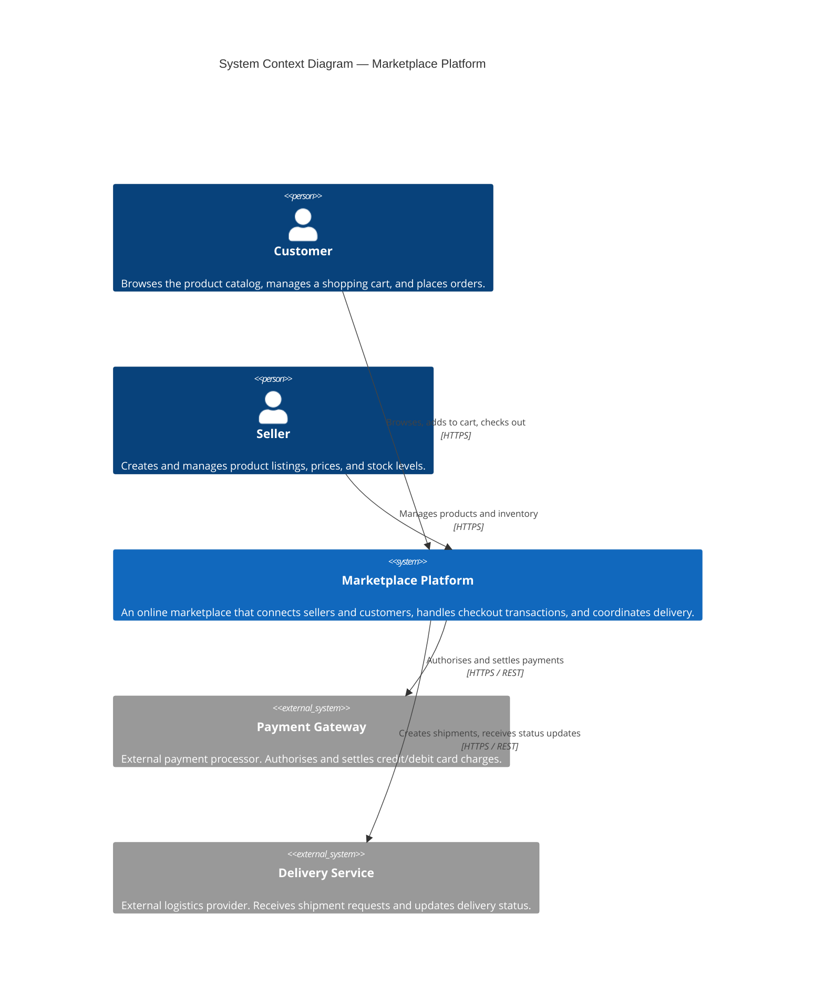
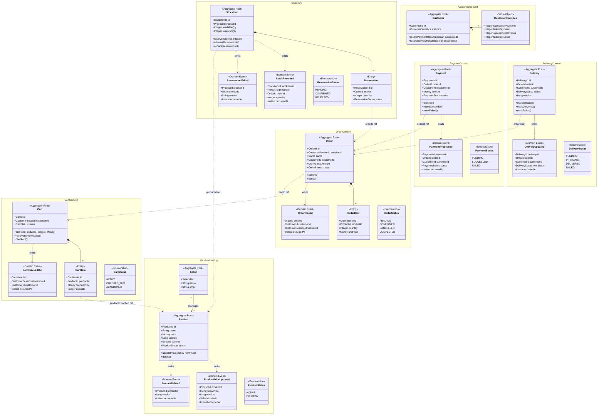

# Architecture Document — Marketplace System

**Version:** 0.1 (Iteration 1 skeleton)
**Method:** Attribute-Driven Design (ADD 3.0)
**Status:** In progress

---

## Table of Contents

1. [Introduction](#1-introduction)
2. [Context Diagram](#2-context-diagram)
3. [Architectural Drivers](#3-architectural-drivers)
4. [Domain Model](#4-domain-model)
5. [Container Diagram](#5-container-diagram)
6. [Component Diagrams](#6-component-diagrams)
7. [Sequence Diagrams](#7-sequence-diagrams)
8. [Interfaces](#8-interfaces)
9. [Design Decisions](#9-design-decisions)

---

## 1. Introduction

This document describes the software architecture of the **Marketplace** system — an online platform that enables sellers to list products and manage inventory, and customers to browse, add items to a cart, and complete purchases.

The architecture is designed using the **Attribute-Driven Design (ADD 3.0)** method, which ensures that every structural decision is traceable to a specific architectural driver: a functional requirement, a quality attribute scenario, a constraint, or a concern. The document evolves iteratively alongside the ADD process; each iteration refines and extends one or more sections.

The target architecture is **microservices-based**, with asynchronous event-driven communication as the primary integration mechanism. Microservices are aligned with the seven bounded contexts identified in the domain model (see Section 4), each owning an isolated data store. No shared databases exist. Cross-service data consistency is achieved through domain events, saga-based compensation, and causal ordering guarantees provided by the message broker.

This document serves as the central reference for:
- The overall structural decomposition of the system.
- The rationale behind key design decisions.
- The interaction contracts between services.
- The mapping between architectural drivers and design elements.

---

## 2. Context Diagram

The following C4 Level-1 System Context diagram shows the **Marketplace Platform** as a black box and identifies the external actors and systems that interact with it. It establishes the system boundary and clarifies what is inside versus outside the scope of this architecture.

Two human actors interact with the system: **Customers**, who browse the catalog, manage their cart, and place orders; and **Sellers**, who manage product listings, prices, and stock. Two external systems are integrated: a **Payment Gateway**, which processes financial transactions on behalf of the platform, and a **Delivery Service**, which handles the physical shipment of confirmed orders.



---

## 3. Architectural Drivers

This section summarises the architectural drivers that govern the design of the Marketplace system. Drivers are classified into four categories: **User Stories**, **Quality Attribute Scenarios**, **Constraints**, and **Concerns**. Priorities are assigned as **High**, **Medium**, or **Low**.

---

### 3.1 User Stories (Functional Requirements)

| ID | User Story | Priority |
|---|---|---|
| FR-01 | As a microservice, I communicate with other microservices through asynchronous events so that functionalities spanning multiple services can be carried out without tight coupling. | High |
| FR-02 | As a microservice, I directly access only my own data store; external services access my data only through predefined interfaces or by subscribing to my events. | High |
| FR-03 | As a customer, when I check out my cart, either all steps (stock reservation, payment, delivery creation) succeed or none of them are committed, so my order is never left in a partial state. | High |
| FR-04 | As a seller, when I update a product's price or delete a product, all downstream caches and replicas must eventually reflect the change in a consistent manner — supporting eventual, object-level causal, and cross-object (seller-scoped) causal correctness. | High |
| FR-05 | As the system, stock must always reference a product that exists in the Product service, ensuring cross-microservice referential integrity under either an available (eventual) or consistent (synchronous) system policy. | High |
| FR-06 | As the system, the cart of a customer session must not be checked out more than once, preventing duplicate orders. | High |
| FR-07 | As the system, the reserved quantity of a product must never exceed its available quantity, preventing overselling. | High |
| FR-08 | As the system, successful and failed payments and deliveries are tracked per customer through counter increments. | Medium |
| FR-09 | As the system, concurrent updates to a product's price or version must be linearized, so no two updates can produce an inconsistent final state. | High |
| FR-10 | As the system, concurrent Update Delivery transactions for the same delivery record must execute in isolation, preventing conflicting state transitions. | High |

---

### 3.2 Quality Attribute Scenarios

| ID | Quality Attribute | Stimulus | Source | Response | Measure | Priority |
|---|---|---|---|---|---|---|
| QA-01 | Reliability / Atomicity | A customer submits a checkout; payment succeeds but stock reservation fails. | Customer | The system rolls back the payment and cancels the order; all services return to their pre-checkout state. | No committed partial state remains after compensation completes. | High |
| QA-02 | Data Consistency | A read workload requires joining product data with cart data from different microservices. | Internal read request | The system returns a consistent view without issuing synchronous cross-service queries at read time. | Read latency ≤ latency of a single-service query + replication lag. | High |
| QA-03 | Replication Correctness | A seller updates price of product P twice (v1 → v2) in quick succession. | Seller | Cart replicas reflect v2 for product P and never apply v2 before v1 for the same product. | Zero causal ordering violations per product across all Cart replicas. | High |
| QA-04 | Data Integrity | A product is deleted from the Product service. | Seller | Inventory eventually stops accepting new reservations for that product; no permanent dangling references remain. | Inventory refuses new reservations within one event propagation cycle after deletion. | High |
| QA-05 | Isolation | Two concurrent delivery status update requests arrive for the same Delivery record. | Concurrent clients | Exactly one update succeeds; the other is rejected or safely retried. | Zero dirty writes or lost updates under concurrent access. | High |
| QA-06 | Scalability | A flash sale generates a spike of concurrent reservation requests on a single product. | High load event | Inventory handles the spike without overselling; requests beyond available stock are rejected gracefully. | Zero overselling occurrences; ≥ 99% of requests receive a definitive response within 2 s. | Medium |
| QA-07 | Availability | The Payment service is temporarily unavailable during a checkout flow. | Infrastructure failure | The checkout saga suspends and resumes when Payment recovers, without data loss or duplicate charges. | Zero lost saga states; zero duplicate payment charges after recovery. | Medium |

---

### 3.3 Constraints

| ID | Constraint |
|---|---|
| CON-01 | The architecture must be microservices-based. Each microservice encapsulates its own data store; no shared databases are permitted. |
| CON-02 | Microservices must communicate asynchronously via events as the primary integration mechanism. |
| CON-03 | No microservice may directly access another microservice's data store. |
| CON-04 | The system must be decomposed according to the seven bounded contexts identified in the domain model: Product Catalog, Inventory, Cart, Order, Payment, Delivery, Customer. |
| CON-05 | All-or-nothing atomicity must be achieved without a distributed two-phase commit (2PC/XA) protocol, which is incompatible with the asynchronous communication mandate. |

---

### 3.4 Concerns

| ID | Concern | Description |
|---|---|---|
| CRN-01 | Distributed atomicity | The async nature of events and the absence of a shared data store make classical distributed transactions infeasible. A saga-based compensation pattern is required. |
| CRN-02 | Event ordering and idempotency | Events can arrive out of order, late, or duplicated. Every consumer must handle all three cases without corrupting aggregate state. |
| CRN-03 | Replication lag | Cached or replicated data in downstream services (e.g., product price in Cart) may be stale. Acceptable staleness bounds must be defined per scenario. |
| CRN-04 | Cross-microservice data queries | Read workloads requiring data from multiple services must be satisfied without synchronous inter-service calls at query time. |
| CRN-05 | Application-level referential integrity | Without a shared database, foreign-key constraints cannot be enforced by the data layer; integrity must be enforced at the application level through events and compensating logic. |

---

## 4. Domain Model

*The full domain model, including the DDD class diagram and element descriptions, is maintained in [DomainModel.md](DomainModel.md). The content is reproduced below for reference.*

---

### Bounded Contexts

| # | Bounded Context | Core Aggregate(s) | Architectural Drivers Addressed |
|---|---|---|---|
| 1 | **Product Catalog** | `Product`, `Seller` | FR-04, FR-09, QA-03 |
| 2 | **Inventory** | `StockItem` | FR-05, FR-07, QA-04, QA-06 |
| 3 | **Cart** | `Cart` | FR-06, FR-03, FR-04, QA-03 |
| 4 | **Order** | `Order` | FR-03, FR-06, QA-01 |
| 5 | **Payment** | `Payment` | FR-03, FR-08, QA-01, QA-07 |
| 6 | **Delivery** | `Delivery` | FR-08, FR-10, QA-05 |
| 7 | **Customer** | `Customer` | FR-08 |

### Class Diagram



---

## 5. Container Diagram

The following C4 Level-2 Container diagram shows the internal structure of the Marketplace Platform. Containers are the high-level deployable units that make up the system: microservices, databases, the message broker, the API Gateway, and the frontend application. Each microservice owns a dedicated data store — no database is shared between containers. Synchronous communication (REST/gRPC) is used only for client-to-service requests through the API Gateway. All inter-service communication is asynchronous, mediated by the Message Broker.

```mermaid
C4Container
    title Container Diagram — Marketplace Platform

    Person(customer, "Customer", "Browses products, manages cart, places orders")
    Person(seller, "Seller", "Manages products and inventory")

    System_Ext(paymentGateway, "Payment Gateway", "External payment processor")
    System_Ext(deliveryProvider, "Delivery Service", "External logistics provider")

    System_Boundary(marketplace, "Marketplace Platform") {

        Container(webApp, "Web Application", "React / TypeScript", "Single-page application served to browsers. Entry point for customers and sellers.")
        Container(apiGateway, "API Gateway", "Kong / nginx", "Authenticates requests, routes to microservices, enforces rate limits.")
        Container(messageBroker, "Message Broker", "Apache Kafka", "Durable, partitioned event bus. Provides ordered delivery within partitions.")

        Container(productService, "Product Service", "Java / Spring Boot", "Manages product listings, prices, and seller accounts.")
        ContainerDb(productDb, "Product DB", "PostgreSQL", "Stores products, sellers, and version counters.")

        Container(inventoryService, "Inventory Service", "Java / Spring Boot", "Manages stock levels and seat reservations.")
        ContainerDb(inventoryDb, "Inventory DB", "PostgreSQL", "Stores stock items and reservations.")

        Container(cartService, "Cart Service", "Java / Spring Boot", "Manages customer session carts and cached product prices.")
        ContainerDb(cartDb, "Cart DB", "PostgreSQL", "Stores carts and cart items with cached prices.")

        Container(orderService, "Order Service", "Java / Spring Boot", "Creates orders and orchestrates the checkout saga.")
        ContainerDb(orderDb, "Order DB", "PostgreSQL", "Stores orders, order items, and saga state.")

        Container(paymentService, "Payment Service", "Java / Spring Boot", "Processes payments via the external Payment Gateway.")
        ContainerDb(paymentDb, "Payment DB", "PostgreSQL", "Stores payment records and status.")

        Container(deliveryService, "Delivery Service", "Java / Spring Boot", "Creates and tracks deliveries via the external Delivery Service.")
        ContainerDb(deliveryDb, "Delivery DB", "PostgreSQL", "Stores delivery records with optimistic-lock version.")

        Container(customerService, "Customer Service", "Java / Spring Boot", "Maintains customer statistics.")
        ContainerDb(customerDb, "Customer DB", "PostgreSQL", "Stores customer profiles and statistics counters.")
    }

    Rel(customer, webApp, "Uses", "HTTPS")
    Rel(seller, webApp, "Uses", "HTTPS")
    Rel(webApp, apiGateway, "API calls", "HTTPS / REST")

    Rel(apiGateway, productService, "Routes product requests", "REST")
    Rel(apiGateway, inventoryService, "Routes inventory requests", "REST")
    Rel(apiGateway, cartService, "Routes cart requests", "REST")
    Rel(apiGateway, orderService, "Routes order requests", "REST")
    Rel(apiGateway, customerService, "Routes customer requests", "REST")

    Rel(productService, productDb, "Reads / Writes", "JDBC")
    Rel(inventoryService, inventoryDb, "Reads / Writes", "JDBC")
    Rel(cartService, cartDb, "Reads / Writes", "JDBC")
    Rel(orderService, orderDb, "Reads / Writes", "JDBC")
    Rel(paymentService, paymentDb, "Reads / Writes", "JDBC")
    Rel(deliveryService, deliveryDb, "Reads / Writes", "JDBC")
    Rel(customerService, customerDb, "Reads / Writes", "JDBC")

    Rel(productService, messageBroker, "Publishes ProductPriceUpdated, ProductDeleted", "Kafka")
    Rel(inventoryService, messageBroker, "Publishes StockReserved, ReservationFailed; Subscribes ProductDeleted, OrderPlaced", "Kafka")
    Rel(cartService, messageBroker, "Publishes CartCheckedOut; Subscribes ProductPriceUpdated, ProductDeleted", "Kafka")
    Rel(orderService, messageBroker, "Publishes OrderPlaced; Subscribes CartCheckedOut, StockReserved, ReservationFailed, PaymentProcessed", "Kafka")
    Rel(paymentService, messageBroker, "Publishes PaymentProcessed; Subscribes OrderPlaced", "Kafka")
    Rel(deliveryService, messageBroker, "Publishes DeliveryUpdated; Subscribes PaymentProcessed", "Kafka")
    Rel(customerService, messageBroker, "Subscribes PaymentProcessed, DeliveryUpdated", "Kafka")

    Rel(paymentService, paymentGateway, "Authorises charges", "HTTPS / REST")
    Rel(deliveryService, deliveryProvider, "Creates shipments, receives updates", "HTTPS / REST")
```



### Container Responsibilities

| Container | Type | Responsibility |
|---|---|---|
| **Web Application** | Frontend | Single-page application. Provides the customer-facing storefront (browse, cart, checkout) and the seller-facing dashboard (product and inventory management). |
| **API Gateway** | Infrastructure | Single entry point for all external traffic. Handles authentication/authorisation, TLS termination, request routing, and rate limiting. Shields microservices from direct exposure. |
| **Message Broker** (Kafka) | Infrastructure | Durable, ordered, partitioned event bus. Decouples producers from consumers. Provides at-least-once delivery with partition-level ordering, enabling causal consistency semantics (QA-03, CRN-02). |
| **Product Service** | Microservice | Manages the product catalog and seller accounts. The authoritative source of product price and status. Enforces linearized updates (FR-09, S#5) via optimistic locking. Emits `ProductPriceUpdated` and `ProductDeleted` events. |
| **Product DB** | Data Store | Isolated PostgreSQL instance for Product Service. Holds products, sellers, and monotonically increasing version counters. |
| **Inventory Service** | Microservice | Manages stock levels. Enforces the no-overselling invariant (FR-07, S#3) atomically within its own database. Handles `OrderPlaced` to create reservations and `ProductDeleted` to guard referential integrity (FR-05, S#1). |
| **Inventory DB** | Data Store | Isolated PostgreSQL instance for Inventory Service. Holds stock items and reservations. |
| **Cart Service** | Microservice | Manages customer session carts. Caches product prices at item-add time. Applies causal price updates received from the broker (FR-04, QA-03). Enforces no-duplicate-checkout (FR-06, S#2) via terminal cart status. |
| **Cart DB** | Data Store | Isolated PostgreSQL instance for Cart Service. Holds carts and cart items including cached price snapshots. |
| **Order Service** | Microservice | Creates orders from checked-out carts and **orchestrates the checkout saga** (FR-03, QA-01). Listens to saga step outcomes and either confirms the order or triggers compensation. Enforces idempotency against duplicate `CartCheckedOut` events (FR-06). |
| **Order DB** | Data Store | Isolated PostgreSQL instance for Order Service. Holds orders, order items, and saga correlation state. |
| **Payment Service** | Microservice | Charges the customer via the external Payment Gateway. Publishes `PaymentProcessed` (succeeded or failed) to drive the saga forward or trigger compensation. |
| **Payment DB** | Data Store | Isolated PostgreSQL instance for Payment Service. Holds payment records and idempotency keys. |
| **Delivery Service** | Microservice | Creates and tracks deliveries via the external Delivery Service. Enforces concurrent-update isolation (FR-10, S#6, QA-05) via optimistic locking on `version`. |
| **Delivery DB** | Data Store | Isolated PostgreSQL instance for Delivery Service. Holds delivery records with a version column for optimistic concurrency control. |
| **Customer Service** | Microservice | Maintains customer statistics by subscribing to `PaymentProcessed` and `DeliveryUpdated` events and incrementing counters (FR-08, S#4). Idempotent counter increments prevent double-counting under at-least-once delivery. |
| **Customer DB** | Data Store | Isolated PostgreSQL instance for Customer Service. Holds customer profiles and statistics counters. |

---

## 6. Component Diagrams

For each microservice container defined in Section 5, a dedicated subsection will be added here containing a C4 Level-3 Component diagram that details the internal structure of that container. Each component diagram will show the internal building blocks of the microservice — such as controllers, application services, domain aggregates, repositories, and event publishers/consumers — and how they collaborate to fulfil the container's responsibilities.

Each component diagram will be accompanied by a table listing each component and its responsibility.

Component diagrams will be developed in subsequent ADD iterations, as the internal design of each microservice is decomposed.

---

## 7. Sequence Diagrams

For each use case and quality attribute scenario driver, a dedicated subsection below contains a sequence diagram illustrating the runtime interactions between containers. These diagrams make the communication topology and event flow concrete, and verify that the container design (Section 5) can satisfy the architectural drivers.

---

### 7.1 FR-03 / QA-01 — Checkout: Happy Path (All-or-Nothing Atomicity)

*Illustrates the successful checkout saga: cart checkout → order creation → stock reservation → payment → delivery creation.*

```mermaid
sequenceDiagram
```

---

### 7.2 FR-03 / QA-01 — Checkout: Compensation Path (Reservation Fails)

*Illustrates the saga compensation when stock reservation fails after payment has been charged: payment is refunded and order is cancelled.*

```mermaid
sequenceDiagram
```

---

### 7.3 FR-03 / QA-01 — Checkout: Compensation Path (Payment Fails)

*Illustrates the saga compensation when payment fails after stock has been reserved: reservation is released and order is cancelled.*

```mermaid
sequenceDiagram
```

---

### 7.4 FR-04 / QA-03 — Product Price Update (Causal Replication)

*Illustrates how a seller's price update propagates from Product Service to Cart Service with causal ordering guarantees, preventing out-of-order application.*

```mermaid
sequenceDiagram
```

---

### 7.5 FR-05 / QA-04 — Product Deletion (Referential Integrity)

*Illustrates how deleting a product in Product Service is propagated to Inventory Service, which then blocks new reservations for that product.*

```mermaid
sequenceDiagram
```

---

### 7.6 FR-06 — Duplicate Checkout Prevention

*Illustrates the system's response when a customer attempts to check out the same cart a second time, demonstrating the terminal-state guard in Cart Service.*

```mermaid
sequenceDiagram
```

---

### 7.7 FR-07 — No Overselling (Concurrent Reservation Requests)

*Illustrates how Inventory Service handles two concurrent reservation requests for the same product when only enough stock exists for one, ensuring exactly one succeeds.*

```mermaid
sequenceDiagram
```

---

### 7.8 FR-10 / QA-05 — Concurrent Delivery Updates (Isolation)

*Illustrates how Delivery Service handles two concurrent status-update requests for the same delivery record using optimistic locking, ensuring exactly one succeeds.*

```mermaid
sequenceDiagram
```

---

## 8. Interfaces

*This section will document the API contracts and event schemas for all inter-container interfaces. For each interface (REST endpoint or Kafka topic/event), the following will be specified: operation name, request schema, response schema, error codes, and idempotency guarantees.*

*To be completed in a future iteration.*

---

## 9. Design Decisions

The following table records the architectural design decisions made during the ADD iterations. Each decision is traceable to the driver that motivated it.

| # | Driver(s) | Decision | Rationale | Discarded Alternative(s) |
|---|---|---|---|---|
| | | | | |
