# Domain Model

## Overview

This domain model is derived from the Architectural Drivers of the marketplace system and applies **Domain-Driven Design (DDD)** principles. The system is decomposed into seven **Bounded Contexts**, each aligned with a future microservice. Each Aggregate Root enforces its own invariants, and cross-context references are maintained exclusively by identity (ID), never by object reference — preserving the encapsulation mandate of driver 4.1(ii).

The domain events listed here are the primary mechanism for asynchronous inter-context communication (driver 4.1(i)) and for satisfying the replication correctness semantics of driver 4.3.

---

## Bounded Contexts

| # | Bounded Context | Core Aggregate(s) | Architectural Drivers Addressed |
|---|---|---|---|
| 1 | **Product Catalog** | `Product`, `Seller` | 4.3(i)(ii)(iii), S#5 |
| 2 | **Inventory** | `StockItem` | S#1, S#3 |
| 3 | **Cart** | `Cart` | S#2, 4.2, 4.3(iii) |
| 4 | **Order** | `Order` | 4.2, S#2 |
| 5 | **Payment** | `Payment` | 4.2, S#4 |
| 6 | **Delivery** | `Delivery` | S#4, S#6 |
| 7 | **Customer** | `Customer` | S#4 |

---

## Class Diagram

```mermaid
classDiagram
    direction TB

    namespace ProductCatalog {
        class Product {
            <<Aggregate Root>>
            +ProductId id
            +String name
            +Money price
            +Long version
            +SellerId sellerId
            +ProductStatus status
            +updatePrice(Money newPrice)
            +delete()
        }
        class Seller {
            <<Aggregate Root>>
            +SellerId id
            +String name
            +String email
        }
        class ProductPriceUpdated {
            <<Domain Event>>
            +ProductId productId
            +Money newPrice
            +Long version
            +SellerId sellerId
            +Instant occurredAt
        }
        class ProductDeleted {
            <<Domain Event>>
            +ProductId productId
            +Long version
            +Instant occurredAt
        }
        class ProductStatus {
            <<Enumeration>>
            ACTIVE
            DELETED
        }
    }

    namespace Inventory {
        class StockItem {
            <<Aggregate Root>>
            +StockItemId id
            +ProductId productId
            +Integer availableQty
            +Integer reservedQty
            +reserve(OrderId, Integer)
            +release(ReservationId)
            +deduct(ReservationId)
        }
        class Reservation {
            <<Entity>>
            +ReservationId id
            +OrderId orderId
            +Integer quantity
            +ReservationStatus status
        }
        class StockReserved {
            <<Domain Event>>
            +StockItemId stockItemId
            +ProductId productId
            +OrderId orderId
            +Integer quantity
            +Instant occurredAt
        }
        class ReservationFailed {
            <<Domain Event>>
            +ProductId productId
            +OrderId orderId
            +String reason
            +Instant occurredAt
        }
        class ReservationStatus {
            <<Enumeration>>
            PENDING
            CONFIRMED
            RELEASED
        }
    }

    namespace CartContext {
        class Cart {
            <<Aggregate Root>>
            +CartId id
            +CustomerSessionId sessionId
            +CartStatus status
            +addItem(ProductId, Integer, Money)
            +removeItem(ProductId)
            +checkout()
        }
        class CartItem {
            <<Entity>>
            +CartItemId id
            +ProductId productId
            +Money cachedPrice
            +Integer quantity
        }
        class CartCheckedOut {
            <<Domain Event>>
            +CartId cartId
            +CustomerSessionId sessionId
            +CustomerId customerId
            +Instant occurredAt
        }
        class CartStatus {
            <<Enumeration>>
            ACTIVE
            CHECKED_OUT
            ABANDONED
        }
    }

    namespace OrderContext {
        class Order {
            <<Aggregate Root>>
            +OrderId id
            +CustomerSessionId sessionId
            +CartId cartId
            +CustomerId customerId
            +Money totalAmount
            +OrderStatus status
            +confirm()
            +cancel()
        }
        class OrderItem {
            <<Entity>>
            +OrderItemId id
            +ProductId productId
            +Integer quantity
            +Money unitPrice
        }
        class OrderPlaced {
            <<Domain Event>>
            +OrderId orderId
            +CustomerId customerId
            +CustomerSessionId sessionId
            +Instant occurredAt
        }
        class OrderStatus {
            <<Enumeration>>
            PENDING
            CONFIRMED
            CANCELLED
            COMPLETED
        }
    }

    namespace PaymentContext {
        class Payment {
            <<Aggregate Root>>
            +PaymentId id
            +OrderId orderId
            +CustomerId customerId
            +Money amount
            +PaymentStatus status
            +process()
            +markSucceeded()
            +markFailed()
        }
        class PaymentProcessed {
            <<Domain Event>>
            +PaymentId paymentId
            +OrderId orderId
            +CustomerId customerId
            +PaymentStatus status
            +Instant occurredAt
        }
        class PaymentStatus {
            <<Enumeration>>
            PENDING
            SUCCEEDED
            FAILED
        }
    }

    namespace DeliveryContext {
        class Delivery {
            <<Aggregate Root>>
            +DeliveryId id
            +OrderId orderId
            +CustomerId customerId
            +DeliveryStatus status
            +Long version
            +markInTransit()
            +markDelivered()
            +markFailed()
        }
        class DeliveryUpdated {
            <<Domain Event>>
            +DeliveryId deliveryId
            +OrderId orderId
            +CustomerId customerId
            +DeliveryStatus newStatus
            +Instant occurredAt
        }
        class DeliveryStatus {
            <<Enumeration>>
            PENDING
            IN_TRANSIT
            DELIVERED
            FAILED
        }
    }

    namespace CustomerContext {
        class Customer {
            <<Aggregate Root>>
            +CustomerId id
            +CustomerStatistics statistics
            +recordPaymentResult(Boolean succeeded)
            +recordDeliveryResult(Boolean succeeded)
        }
        class CustomerStatistics {
            <<Value Object>>
            +Integer successfulPayments
            +Integer failedPayments
            +Integer successfulDeliveries
            +Integer failedDeliveries
        }
    }

    %% ──────────────────────────────────────────
    %% Internal Compositions  (Aggregate → Entity / VO)
    %% ──────────────────────────────────────────
    StockItem  "1" *-- "0..*" Reservation
    Cart       "1" *-- "0..*" CartItem
    Order      "1" *-- "1..*" OrderItem
    Customer   "1" *-- "1"   CustomerStatistics

    %% ──────────────────────────────────────────
    %% Intra-Context: Aggregate emits Domain Event
    %% ──────────────────────────────────────────
    Product  ..> ProductPriceUpdated : emits
    Product  ..> ProductDeleted      : emits
    StockItem ..> StockReserved      : emits
    StockItem ..> ReservationFailed  : emits
    Cart     ..> CartCheckedOut      : emits
    Order    ..> OrderPlaced         : emits
    Payment  ..> PaymentProcessed    : emits
    Delivery ..> DeliveryUpdated     : emits

    %% ──────────────────────────────────────────
    %% Intra-Context: Seller manages Products
    %% ──────────────────────────────────────────
    Seller "1" --> "0..*" Product : manages

    %% ──────────────────────────────────────────
    %% Cross-Context ID References  (by ID only – DDD principle)
    %% ──────────────────────────────────────────
    StockItem  ..> Product : productId ref
    CartItem   ..> Product : productId cached ref
    Order      ..> Cart    : cartId ref
    Reservation ..> Order  : orderId ref
    Payment    ..> Order   : orderId ref
    Delivery   ..> Order   : orderId ref
```

---

## Element Descriptions

### Aggregate Roots

| Element | Bounded Context | Description | Key Invariants / Drivers |
|---|---|---|---|
| `Product` | Product Catalog | Represents a sellable item in the marketplace. Owns its name, current price, and version counter. All price and status mutations are linearized through this aggregate. | S#5: updates must be linearized (version incremented on every mutation). `ProductStatus` transitions are terminal — a deleted product cannot be reactivated. |
| `Seller` | Product Catalog | Represents a marketplace seller who owns and manages products. Seller identity is the causality scope for requirement 4.3(iii): all price/delete events generated by the same seller must be applied to the cart in source order. | 4.3(iii): seller-scoped causal ordering is encoded as `SellerId` in `ProductPriceUpdated` and `ProductDeleted` events. |
| `StockItem` | Inventory | Tracks the physical stock for a single product. Maintains the invariant that `reservedQty ≤ availableQty` at all times. Cross-microservice referential integrity with `Product` is maintained via S#1. | S#1: references a product that must exist in Product Catalog. S#3: `reserve()` is rejected when `reservedQty + requested > availableQty`. |
| `Cart` | Cart | Represents a customer session's shopping basket. Transitions from `ACTIVE` to `CHECKED_OUT` exactly once, enforcing S#2. Cart items snapshot the product price at the time of addition to decouple the cart from live catalog state. | S#2: `checkout()` is rejected if `status == CHECKED_OUT`. 4.3(i)/(ii)/(iii): cached prices tolerate eventual / causal replication updates from Product Catalog. |
| `Order` | Order | Created from a checked-out cart. Represents the commitment to purchase. Participates in the distributed saga (4.2) as the saga orchestration point: it confirms when stock is reserved and payment succeeds, or cancels when either fails. | 4.2: all-or-nothing atomicity is implemented as a saga anchored to `Order`. S#2: `CartId` is stored to prevent re-creation from the same cart. |
| `Payment` | Payment | Represents the financial transaction for an order. Transitions through a terminal state machine (`PENDING → SUCCEEDED | FAILED`). | S#4: outcome (`PaymentProcessed` event) is consumed by Customer to increment statistics. 4.2: part of the checkout saga. |
| `Delivery` | Delivery | Tracks the physical fulfilment of an order. The `version` field enables optimistic concurrency control, ensuring that concurrent `Update Delivery` transactions execute in isolation. | S#6: concurrent updates are serialized via optimistic locking on `version`. S#4: outcome consumed by Customer. |
| `Customer` | Customer | Holds the persistent statistics of a customer: counts of successful and failed payments and deliveries. Updated exclusively via domain events from Payment and Delivery. | S#4: statistics are incremented, never overwritten, ensuring safety under concurrent event delivery. |

---

### Entities

| Element | Belongs To | Description | Key Invariants / Drivers |
|---|---|---|---|
| `Reservation` | `StockItem` (Inventory) | Records a pending stock hold for a specific order. Created by `StockItem.reserve()` and released or deducted as the saga progresses. A `StockItem` may hold zero or more active reservations. | S#3: the aggregate ensures the sum of all `PENDING` reservation quantities never exceeds `availableQty`. |
| `CartItem` | `Cart` (Cart) | Represents a single product line in the cart. Stores a **snapshot** of the product price at the time the item was added (`cachedPrice`), decoupling cart reads from live product state and supporting the causal replication semantics of 4.3. | 4.3(i)/(ii)/(iii): cached price is updated when a `ProductPriceUpdated` event is applied to the cart, in the order defined by the causal consistency semantics. |
| `OrderItem` | `Order` (Order) | An immutable line item in a placed order, capturing the agreed quantity and unit price. Once the order is placed, `OrderItem` data is frozen. | 4.2: immutability ensures the saga can reliably compensate or confirm with stable data. |

---

### Value Objects

| Element | Bounded Context(s) | Description |
|---|---|---|
| `Money` | Product Catalog, Cart, Order, Payment | Encapsulates a monetary amount and its currency. Immutable. Prevents primitive obsession over raw decimal prices. Shared concept across contexts but defined independently in each (no shared kernel). |
| `CustomerStatistics` | Customer | An immutable snapshot of a customer's counters. Replaced (not mutated) on each increment, preserving value-object semantics. |
| `ProductId` | Product Catalog, Inventory, Cart, Order | Opaque identity of a `Product`. Carried across context boundaries to maintain cross-context references without object coupling. |
| `SellerId` | Product Catalog | Opaque identity of a `Seller`. Embedded in domain events to enable seller-scoped causal ordering (driver 4.3(iii)). |
| `CartId` | Cart, Order | Opaque identity of a `Cart`. Stored in `Order` to enforce S#2 (no re-checkout of the same cart). |
| `OrderId` | Order, Inventory, Payment, Delivery | Opaque identity of an `Order`. The primary correlation key for the checkout saga across Inventory, Payment, and Delivery. |
| `CustomerSessionId` | Cart, Order | Identifies the customer session. Enforces S#2: one session → one cart → one checkout. |
| `CustomerId` | Order, Payment, Delivery, Customer | Stable customer identity used to route `PaymentProcessed` and `DeliveryUpdated` events to the correct `Customer` aggregate. |
| `ReservationId` | Inventory | Opaque identity of a `Reservation`. Used to release or deduct a specific hold without ambiguity. |
| `StockItemId` | Inventory | Opaque identity of a `StockItem`. |
| `PaymentId` | Payment | Opaque identity of a `Payment`. |
| `DeliveryId` | Delivery | Opaque identity of a `Delivery`. |

---

### Domain Events

| Event | Emitted By | Consumed By | Purpose / Driver |
|---|---|---|---|
| `ProductPriceUpdated` | `Product` | Cart (replication), Inventory (guard) | Carries `version` and `sellerId` to support object-level causal ordering (4.3(ii)) and seller-scoped causal ordering (4.3(iii)). Allows Cart to update cached prices in order. |
| `ProductDeleted` | `Product` | Inventory (guard), Cart (staleness) | Triggers Inventory to stop accepting new reservations for the product (S#1 — Available System variant). Carries `version` for causal ordering. |
| `StockReserved` | `StockItem` | Order (saga progress) | Confirms that stock was successfully held; advances the checkout saga toward payment. |
| `ReservationFailed` | `StockItem` | Order (saga compensation) | Triggers saga compensation: Order transitions to `CANCELLED`. |
| `CartCheckedOut` | `Cart` | Order (saga initiation) | Triggers Order creation, beginning the all-or-nothing checkout saga (4.2). |
| `OrderPlaced` | `Order` | Inventory (reserve), Payment (charge) | Broadcast to Inventory (to reserve stock) and Payment (to charge the customer) in parallel as part of the saga. |
| `PaymentProcessed` | `Payment` | Order (saga progress/compensation), Customer (statistics) | `SUCCEEDED` advances saga to Delivery creation; `FAILED` triggers compensation. Customer increments statistics (S#4). |
| `DeliveryUpdated` | `Delivery` | Customer (statistics) | `DELIVERED` or `FAILED` outcome is consumed by Customer to update delivery statistics (S#4). `version` in `Delivery` prevents duplicate concurrent processing (S#6). |

---

### Enumerations

| Element | Bounded Context | Values | Purpose |
|---|---|---|---|
| `ProductStatus` | Product Catalog | `ACTIVE`, `DELETED` | Terminal state machine for a product's lifecycle. A deleted product cannot be restored (S#1 invariant). |
| `ReservationStatus` | Inventory | `PENDING`, `CONFIRMED`, `RELEASED` | Tracks lifecycle of a stock hold within the saga. |
| `CartStatus` | Cart | `ACTIVE`, `CHECKED_OUT`, `ABANDONED` | Enforces S#2: the transition `ACTIVE → CHECKED_OUT` may occur exactly once. |
| `OrderStatus` | Order | `PENDING`, `CONFIRMED`, `CANCELLED`, `COMPLETED` | State machine governing the saga lifecycle of a checkout (4.2). |
| `PaymentStatus` | Payment | `PENDING`, `SUCCEEDED`, `FAILED` | Terminal payment outcome consumed by the saga and by Customer statistics (S#4). |
| `DeliveryStatus` | Delivery | `PENDING`, `IN_TRANSIT`, `DELIVERED`, `FAILED` | Lifecycle of physical fulfilment. Concurrent transitions are guarded by optimistic locking on `Delivery.version` (S#6). |

---

## Cross-Cutting Design Notes

### Causality and Replication Correctness (Driver 4.3)

- **Eventual (4.3(i)):** Price-update and product-delete events may be applied to Cart replicas in any order without violating business rules because Cart items hold a `cachedPrice` snapshot and the Cart does not depend on a globally consistent view of the catalog.
- **Object-level causality (4.3(ii)):** `ProductPriceUpdated` embeds a monotonically increasing `version`. Consumers (e.g., Cart) process updates for the same `ProductId` in version order, discarding stale or duplicate messages.
- **Cross-object causality / read-your-writes (4.3(iii)):** `ProductPriceUpdated` and `ProductDeleted` embed `SellerId`. An event broker (e.g., Kafka) partitioned by `SellerId` guarantees that all events from the same seller are consumed by Cart in source order, achieving the read-your-write guarantee.

### All-or-Nothing Atomicity (Driver 4.2)

The checkout saga, orchestrated by `Order`, is the primary mechanism. The saga steps are:

1. `CartCheckedOut` → Order creates `Order` (PENDING)
2. `OrderPlaced` → Inventory reserves stock; Payment charges customer (parallel)
3. `StockReserved` + `PaymentProcessed(SUCCEEDED)` → Order transitions to `CONFIRMED`; Delivery created
4. `ReservationFailed` or `PaymentProcessed(FAILED)` → compensation path; Order cancelled; stock released; payment refunded

### Cross-Microservice Referential Integrity (S#1)

Under the **Available System** policy, `StockItem` listens to `ProductDeleted` events and marks the product as no longer reservable. Because the event is asynchronous, there is a brief window after deletion where new reservations could be accepted — the requirement explicitly accepts this under eventual consistency.

Under the **Consistent System** policy (if selected instead), a synchronous two-phase commit between Product and Inventory would be required — but this conflicts with the asynchronous communication mandate of 4.1(i). The domain model is designed to support the Available System policy by default.
