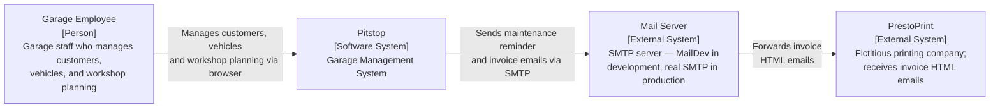

# Pitstop — Architectural Drivers

**Architect**: Neo  
**Method**: Attribute-Driven Design 3.0  
**Date**: 2026-05-23

---

## Business Case

Pitstop is a **Garage Management System** for the fictitious PitStop car repair shop. It is used by garage employees to manage their daily operations: registering customers and vehicles, planning maintenance jobs, tracking job completion, sending customer reminders, and generating invoices.

The primary purpose of the application is **educational**: it is a reference implementation designed for conference talks and workshops, intended to help .NET developers learn microservices architecture, event-driven systems, Domain-Driven Design (DDD), CQRS, and event sourcing by studying a working system. This educational purpose is the single most important constraint shaping every architectural decision in this system.

The following context diagram shows Pitstop in relation to its users and external systems. The system interacts with exactly one category of user (garage employees) and two external systems (a mail server for notifications and invoices, and a fictitious printing company that receives invoice emails).

---

## System Requirements

### Primary Functionality

The following use cases represent the primary functional requirements of Pitstop. Each use case maps to one or more microservices and forms the basis for iteration planning.

| ID | Use Case | Description | Priority |
|----|----------|-------------|----------|
| UC-01 | **Register and look up customers** | A garage employee registers a new customer (name, address, telephone, email) and can retrieve the list of registered customers or look up a specific customer by ID. | **High** |
| UC-02 | **Register vehicles and associate with owner** | A garage employee registers a vehicle (licence number, brand, type) and associates it with a registered customer as its owner. | **High** |
| UC-03 | **Plan and track maintenance jobs** | A garage employee selects a day, chooses a vehicle and customer, and schedules a maintenance job within an available timeslot. A job can subsequently be marked as finished, recording actual start/end times and technician notes. | **High** |
| UC-04 | **Send daily maintenance notifications** | Each day, customers who have a maintenance job scheduled for that day automatically receive an email reminder listing all their jobs for the day. | **Medium** |
| UC-05 | **Generate and email invoices** | Each day, invoices are automatically generated for all maintenance jobs that were completed but not yet invoiced, and emailed to PrestoPrint for printing. | **Medium** |
| UC-06 | **Record all domain events for audit** | Every domain event raised by any service is automatically persisted to a date-partitioned audit log for retrospective analysis. | **Low** |

---

### Quality Attribute Scenarios

Quality attribute scenarios define measurable, testable requirements on the system's runtime and developmental qualities. The four quality goals (Learnability, Demonstrability, Autonomy, Resilience) are prioritised in that order; scenarios rated **High** by stakeholder importance are primary architectural drivers addressed in the earliest iterations.

| ID | Quality Attribute | Scenario | Stakeholder Importance | Implementation Difficulty |
|----|------------------|----------|----------------------|--------------------------|
| QAS-L1 | Learnability | A .NET developer clones the repository and reads the documentation. They can understand the overall architecture, the role of each service, and the event flow between services within 30 minutes, without external assistance. | **High** | Low |
| QAS-L2 | Learnability | During a live demo, a presenter registers a customer and shows the `CustomerRegistered` event flowing through RabbitMQ to all consuming services in real time, visible in the Seq log dashboard. | **High** | Medium |
| QAS-L3 | Learnability | A developer wants to understand event sourcing. They can read and understand the `WorkshopManagementAPI` — its aggregate, events, event store, and read-model — in isolation, without needing to read any other service's code. | **High** | Medium |
| QAS-D1 | Demonstrability | A developer runs `docker compose up` on a clean machine with Docker installed. All services and infrastructure components start without manual intervention and the system is accessible at `http://localhost:7005` within 2 minutes. | **High** | Low |
| QAS-D2 | Demonstrability | A developer applies the Kubernetes manifests from the `k8s/` folder to a cluster. The system starts successfully. A service mesh (Istio or Linkerd) functions as an optional, additive layer without requiring changes to any service. | Medium | Medium |
| QAS-D3 | Demonstrability | An operator queries the health endpoint of any running API service. The `/hc` endpoint returns the current health status within 1 second. Docker performs health checks automatically every 30 seconds. | Low | Low |
| QAS-A1 | Autonomy | The `CustomerManagementAPI` is taken offline while the `WorkshopManagementAPI` continues to receive job planning requests. All planning requests are processed successfully using the Workshop Management local read-model. No requests to `WorkshopManagementAPI` fail or degrade because the Customer service is unavailable. | **High** | **High** |
| QAS-A2 | Autonomy | A single service is redeployed (container restart) while all other services remain running. The redeployment of that service causes zero disruption or configuration changes in any other service. | **High** | **High** |
| QAS-R1 | Resilience | SQL Server is slow to start during `docker compose up`. All services that depend on the database retry their connection with exponential backoff. Once SQL Server becomes available, all services connect successfully without manual intervention. | **High** | Low |
| QAS-R2 | Resilience | RabbitMQ is temporarily unavailable during operation. Services retry their message broker connections with exponential backoff. Published messages are retried up to 9 times before failing. No message is silently lost when the broker is temporarily unreachable. | **High** | Low |
| QAS-R3 | Resilience | The WebApp cannot reach a backend API after multiple consecutive failures. The Polly circuit breaker activates and the WebApp displays a graceful offline page rather than propagating the error to the user. | Medium | Medium |

---

### Constraints

Constraints are non-negotiable conditions imposed on the system by its technical, organisational, and educational context. All constraints are equally binding.

| ID | Constraint |
|----|------------|
| CON-01 | All services must be implemented in .NET and C#. This keeps the solution accessible to the target audience (.NET developers) and enables shared infrastructure libraries via NuGet. |
| CON-02 | Every service and infrastructure component must run as a Linux Docker container. Docker Compose is the primary local orchestration tool; Kubernetes manifests must be provided for cluster deployment. |
| CON-03 | A single SQL Server instance is used as the database platform for all services (deliberate simplification for educational purposes). Each service must use its own dedicated logical schema — no cross-service schema sharing is permitted. |
| CON-04 | RabbitMQ is the sole message broker for all asynchronous inter-service communication. No other message broker may be introduced. |
| CON-05 | The final architecture must be based on microservices. Each service must be independently deployable. |
| CON-06 | All message-broker interactions must go through the `IMessagePublisher` / `IMessageHandler` abstractions provided by the `Infrastructure.Messaging` shared library. No service may have a direct dependency on `RabbitMQ.Client`. |
| CON-07 | The project is open source. No proprietary runtime dependencies may be introduced (Seq is permitted as it has a free tier for development use). |

---

### Architectural Concerns

Architectural concerns capture cross-cutting technical and organisational considerations that guide the design process. They are not functional requirements but directly influence how the architecture is structured.

| ID | Concern |
|----|---------|
| CRN-01 | Establish the overall initial system structure: identify bounded contexts, decompose them into deployable services, and define inter-service communication patterns. |
| CRN-02 | Demonstrate multiple design approaches within a single system (DDD + Event Sourcing for the core domain; CRUD for supporting domains) without allowing one pattern to bleed into adjacent services. |
| CRN-03 | Achieve per-service data autonomy within the constraint of a shared SQL Server instance: each service must be unable to access another service's schema, even though they share the same database server. |
| CRN-04 | Handle time-dependent behaviour (daily notifications, daily invoicing) in a deterministic and demonstrable way that does not rely on real-time clocks or cron jobs within the consuming services. |
| CRN-05 | Provide centralised, structured observability across all services without introducing heavy distributed tracing infrastructure (e.g. Jaeger) that would add complexity for the target audience. |
| CRN-06 | Manage shared infrastructure code (messaging abstraction, health checks, Polly policies, Serilog configuration) without introducing tight coupling between services. |

---

## Priorities

The four quality goals are ordered as follows. In any case of conflict between architectural goals, this ordering is the tiebreaker:

| Rank | Quality Goal | Rationale |
|------|-------------|-----------|
| 1 | **Learnability** | The system exists to teach. If it cannot be understood, it fails its primary purpose. |
| 2 | **Demonstrability** | The system must be runnable in a live demo without friction. |
| 3 | **Autonomy** | Services must be independently deployable and resilient to sibling failures. |
| 4 | **Resilience** | Transient infrastructure failures must be handled gracefully. |

The following use cases are identified as **primary functional drivers** — they are addressed in the first iteration because they establish the core structure of the system:

- **UC-01** — Register and look up customers
- **UC-02** — Register vehicles and associate with owner
- **UC-03** — Plan and track maintenance jobs

The following quality attribute scenarios are identified as **primary QAS drivers** based on combined stakeholder importance and implementation difficulty:

| Scenario ID | Importance | Difficulty | Selected as Primary Driver? |
|------------|------------|------------|----------------------------|
| QAS-L1 | High | Low | Yes |
| QAS-L2 | High | Medium | Yes |
| QAS-L3 | High | Medium | Yes |
| QAS-D1 | High | Low | Yes |
| QAS-A1 | High | High | Yes |
| QAS-A2 | High | High | Yes |
| QAS-R1 | High | Low | Yes |
| QAS-R2 | High | Low | Yes |
| QAS-D2 | Medium | Medium | No |
| QAS-R3 | Medium | Medium | No |
| QAS-D3 | Low | Low | No |
