# Pitstop — Architecture Document

**Architect**: Neo  
**Method**: Attribute-Driven Design 3.0  
**Date**: 2026-05-23

---

## 1. Introduction

This document describes the software architecture of the **Pitstop Garage Management System**. It presents the architectural decisions, structural components, and their relationships that together satisfy the functional and quality requirements of the system. The document follows the **Attribute-Driven Design (ADD) 3.0** process and uses the **C4 model** as the primary notation for visualising architecture at multiple levels of abstraction: context, container, and component.

Pitstop is a sample application built around a fictitious car repair shop. Its purpose is not to implement a complete, production-grade garage system — its purpose is to **demonstrate architectural concepts** to .NET developers learning about microservices, event-driven systems, Domain-Driven Design (DDD), CQRS, and event sourcing. This educational mission is the highest-priority architectural driver and shapes every design decision in the document.

The architecture is built on a **microservices** foundation. Each service is independently deployable, owns its own data, and communicates exclusively through asynchronous events published to a RabbitMQ message broker. The Workshop Management bounded context — the core domain — demonstrates DDD aggregates with event sourcing and CQRS. Supporting contexts (Customer Management, Vehicle Management) use simpler CRUD approaches, illustrating that different subdomains warrant different levels of design complexity.

The document is structured to be progressively refined across **three ADD iterations**, each guided by the highest-priority architectural drivers. Sections marked as empty or skeletal will be completed in the corresponding iteration. The document serves as the authoritative architectural reference for all stakeholders: developers, architects, workshop participants, and conference audiences.

---

## 2. Context Diagram

The diagram below shows Pitstop in the context of its users and external systems. It is drawn at the C4 *System Context* level, which means the Pitstop system is treated as a black box: the diagram does not reveal any internal structure. Its purpose is to establish the system's boundary — to identify who uses the system (actors), which external systems it interacts with, and the nature of those interactions. Pitstop has a single category of user (garage employees who interact through a web browser) and two external systems (a mail server that delivers outbound emails, and PrestoPrint, a fictitious printing company that receives invoice HTML emails). There are no external identity providers, no payment systems, and no real-time integrations — the limited integration surface is a deliberate consequence of the system's educational scope.

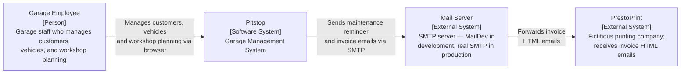

---

## 3. Architectural Drivers

This section summarises the architectural drivers for Pitstop as elicited from stakeholders and recorded in `ArchitecturalDrivers.md`. Drivers are the primary inputs to the ADD process and directly shape every architectural decision made in this document. They are organised into four categories: use cases, quality attribute scenarios, constraints, and architectural concerns.

### 3.1 Use Cases

Use cases represent the primary functional requirements of the system. Stories classified as **High** priority are primary drivers addressed in the earliest iterations.

| ID | Description | Priority |
|----|-------------|----------|
| UC-01 | **Register and look up customers**: A garage employee registers a new customer (name, address, telephone, email) and can retrieve the list of registered customers or look up a specific customer by ID. | **High** |
| UC-02 | **Register vehicles and associate with owner**: A garage employee registers a vehicle (licence number, brand, type) and associates it with a registered customer as its owner. | **High** |
| UC-03 | **Plan and track maintenance jobs**: A garage employee selects a day, chooses a vehicle and customer, and schedules a maintenance job within an available timeslot. A job can subsequently be marked as finished, recording actual start/end times and technician notes. | **High** |
| UC-04 | **Send daily maintenance notifications**: Each day, customers who have a maintenance job scheduled for that day automatically receive an email reminder listing all their jobs for the day. | Medium |
| UC-05 | **Generate and email invoices**: Each day, invoices are automatically generated for all maintenance jobs that were completed but not yet invoiced, and emailed to PrestoPrint for printing. | Medium |
| UC-06 | **Record all domain events for audit**: Every domain event raised by any service is automatically persisted to a date-partitioned audit log for retrospective analysis. | Low |

### 3.2 Quality Attribute Scenarios

Quality attribute scenarios define measurable, testable requirements on the system's runtime and developmental qualities. Scenarios rated **High** by stakeholder importance and selected as primary drivers are addressed in the earliest ADD iterations.

| ID | Quality Attribute | Scenario | Stakeholder Importance | Implementation Difficulty |
|----|------------------|----------|----------------------|--------------------------|
| QAS-L1 | Learnability | A .NET developer clones the repository and reads the documentation. They can understand the overall architecture, the role of each service, and the event flow between services within 30 minutes, without external assistance. | **High** | Low |
| QAS-L2 | Learnability | During a live demo, a presenter registers a customer and shows the `CustomerRegistered` event flowing through RabbitMQ to all consuming services in real time, visible in the Seq log dashboard. | **High** | Medium |
| QAS-L3 | Learnability | A developer wants to understand event sourcing. They can read and understand the `WorkshopManagementAPI` — its aggregate, events, event store, and read-model — in isolation, without needing to read any other service's code. | **High** | Medium |
| QAS-D1 | Demonstrability | A developer runs `docker compose up` on a clean machine with Docker installed. All services and infrastructure components start without manual intervention and the system is accessible at `http://localhost:7005` within 2 minutes. | **High** | Low |
| QAS-D2 | Demonstrability | A developer applies the Kubernetes manifests from the `k8s/` folder to a cluster. The system starts successfully. A service mesh (Istio or Linkerd) functions as an optional, additive layer without requiring changes to any service. | Medium | Medium |
| QAS-D3 | Demonstrability | An operator queries the health endpoint of any running API service. The `/hc` endpoint returns the current health status within 1 second. Docker performs health checks automatically every 30 seconds. | Low | Low |
| QAS-A1 | Autonomy | The `CustomerManagementAPI` is taken offline while the `WorkshopManagementAPI` continues to receive job planning requests. All planning requests are processed successfully using the Workshop Management local read-model. No requests fail or degrade because the Customer service is unavailable. | **High** | **High** |
| QAS-A2 | Autonomy | A single service is redeployed (container restart) while all other services remain running. The redeployment of that service causes zero disruption or configuration changes in any other service. | **High** | **High** |
| QAS-R1 | Resilience | SQL Server is slow to start during `docker compose up`. All services retry their database connections with exponential backoff. Once SQL Server is available, all services connect successfully without manual intervention. | **High** | Low |
| QAS-R2 | Resilience | RabbitMQ is temporarily unavailable during operation. Services retry their message broker connections with exponential backoff. Published messages are retried up to 9 times before failing. No message is silently lost when the broker is temporarily unreachable. | **High** | Low |
| QAS-R3 | Resilience | The WebApp cannot reach a backend API after multiple consecutive failures. The Polly circuit breaker activates and the WebApp displays a graceful offline page rather than propagating the error to the user. | Medium | Medium |

### 3.3 Constraints

Constraints are non-negotiable conditions imposed on the system by its technical, organisational, and educational context. All constraints are equally binding and are not prioritised relative to one another.

| ID | Constraint |
|----|------------|
| CON-01 | All services must be implemented in .NET and C#. |
| CON-02 | Every service and infrastructure component must run as a Linux Docker container. Docker Compose is the primary local orchestration tool; Kubernetes manifests must be provided for cluster deployment. |
| CON-03 | A single SQL Server instance is used as the database platform for all services. Each service must use its own dedicated logical schema — no cross-service schema sharing is permitted. |
| CON-04 | RabbitMQ is the sole message broker for all asynchronous inter-service communication. |
| CON-05 | The final architecture must be based on microservices. Each service must be independently deployable. |
| CON-06 | All message-broker interactions must go through the `IMessagePublisher` / `IMessageHandler` abstractions. No service may have a direct dependency on `RabbitMQ.Client`. |
| CON-07 | The project is open source. No proprietary runtime dependencies may be introduced (Seq is permitted as it has a free development tier). |

### 3.4 Architectural Concerns

Architectural concerns capture cross-cutting technical and organisational considerations that guide the design process.

| ID | Concern |
|----|---------|
| CRN-01 | Establish the overall initial system structure: identify bounded contexts, decompose them into deployable services, and define inter-service communication patterns. |
| CRN-02 | Demonstrate multiple design approaches within a single system (DDD + Event Sourcing for the core domain; CRUD for supporting domains) without allowing one pattern to bleed into adjacent services. |
| CRN-03 | Achieve per-service data autonomy within the constraint of a shared SQL Server instance. |
| CRN-04 | Handle time-dependent behaviour (daily notifications, daily invoicing) in a deterministic and demonstrable way that does not rely on real-time clocks or cron jobs within consuming services. |
| CRN-05 | Provide centralised, structured observability across all services without introducing heavy distributed tracing infrastructure. |
| CRN-06 | Manage shared infrastructure code (messaging abstraction, health checks, Polly policies, Serilog configuration) without introducing tight coupling between services. |

---

## 4. Domain Model

This section presents the domain model for Pitstop, developed using Domain-Driven Design (DDD) principles. The model defines the **ubiquitous language** of the system — the shared vocabulary used by both business stakeholders and the development team — and establishes the structural foundation from which service boundaries, data ownership, and event contracts are derived.

The model is organised around **seven bounded contexts**, each representing an independently deployable subdomain with its own internally consistent language and clearly defined integration boundaries. Cross-context integration is achieved exclusively through domain events published to RabbitMQ — there are no synchronous service-to-service calls in the domain model. The **Workshop Management** context is the **core domain**: it contains the most complex business logic and is where DDD patterns (aggregates, value objects, event sourcing, CQRS) are applied in full. All other contexts are supporting or generic subdomains that use simpler approaches appropriate to their complexity.

### 4.1 Bounded Contexts

| Bounded Context | Type | Design Approach |
|----------------|------|----------------|
| Customer Management | Supporting | CRUD — Entity Framework Core |
| Vehicle Management | Supporting | CRUD — Entity Framework Core |
| Workshop Management | **Core** | DDD — Aggregates + Event Sourcing + CQRS |
| Notification | Supporting | Read-model built from consumed events |
| Invoice | Supporting | Read-model + Invoice record built from consumed events |
| Audit Log | Generic | Append-only log of all domain events |
| Time | Generic | Domain event source for time progression |

### 4.2 Class Diagram

```mermaid
classDiagram
    namespace CustomerManagement {
        class Customer {
            <<Aggregate Root>>
            +string CustomerId
            +string Name
            +string Address
            +string PostalCode
            +string City
            +string TelephoneNumber
            +string EmailAddress
        }
        class CustomerRegistered {
            <<Domain Event>>
            +Guid MessageId
            +string CustomerId
            +string Name
            +string Address
            +string PostalCode
            +string City
            +string TelephoneNumber
            +string EmailAddress
        }
    }

    namespace VehicleManagement {
        class Vehicle {
            <<Aggregate Root>>
            +string LicenseNumber
            +string Brand
            +string Type
            +string OwnerId
        }
        class VehicleRegistered {
            <<Domain Event>>
            +Guid MessageId
            +string LicenseNumber
            +string Brand
            +string Type
            +string OwnerId
        }
    }

    namespace WorkshopManagement {
        class WorkshopPlanning {
            <<Aggregate Root — Event Sourced>>
            +WorkshopPlanningId Id
            +List~MaintenanceJob~ Jobs
            +Create(date) WorkshopPlanningCreated
            +PlanMaintenanceJob(cmd) MaintenanceJobPlanned
            +FinishMaintenanceJob(cmd) MaintenanceJobFinished
        }
        class MaintenanceJob {
            <<Entity>>
            +Guid Id
            +Timeslot PlannedTimeslot
            +Timeslot ActualTimeslot
            +WmCustomer Customer
            +WmVehicle Vehicle
            +string Description
            +string Notes
            +string Status
            +Plan(timeslot, vehicle, customer, desc)
            +Finish(actualTimeslot, notes)
        }
        class WmCustomer {
            <<Local Snapshot>>
            +string Id
            +string Name
            +string TelephoneNumber
        }
        class WmVehicle {
            <<Local Snapshot>>
            +LicenseNumber Id
            +string Brand
            +string Type
            +string OwnerId
        }
        class WorkshopPlanningId {
            <<Value Object>>
            +string Value
            +Create(date) WorkshopPlanningId
        }
        class LicenseNumber {
            <<Value Object>>
            +string Value
            +Create(value) LicenseNumber
        }
        class Timeslot {
            <<Value Object>>
            +DateTime StartTime
            +DateTime EndTime
            +IsWithinOneDay() bool
            +OverlapsWith(other) bool
        }
        class WorkshopPlanningCreated {
            <<Domain Event>>
            +Guid MessageId
            +DateTime Date
        }
        class MaintenanceJobPlanned {
            <<Domain Event>>
            +Guid MessageId
            +Guid JobId
            +DateTime StartTime
            +DateTime EndTime
            +CustomerInfo CustomerInfo
            +VehicleInfo VehicleInfo
            +string Description
        }
        class MaintenanceJobFinished {
            <<Domain Event>>
            +Guid MessageId
            +Guid JobId
            +DateTime StartTime
            +DateTime EndTime
            +string Notes
        }
    }

    namespace NotificationService {
        class NsCustomer {
            <<Read Model>>
            +string CustomerId
            +string Name
            +string TelephoneNumber
            +string EmailAddress
        }
        class NsMaintenanceJob {
            <<Read Model>>
            +string JobId
            +string LicenseNumber
            +string CustomerId
            +DateTime StartTime
            +string Description
        }
    }

    namespace InvoiceService {
        class Invoice {
            <<Aggregate Root>>
            +string InvoiceId
            +DateTime InvoiceDate
            +string CustomerId
            +decimal Amount
            +string Specification
            +string JobIds
        }
        class IsCustomer {
            <<Read Model>>
            +string CustomerId
            +string Name
            +string Address
            +string PostalCode
            +string City
        }
        class IsMaintenanceJob {
            <<Read Model>>
            +string JobId
            +string LicenseNumber
            +string CustomerId
            +string Description
            +DateTime StartTime
            +DateTime EndTime
            +bool Finished
            +bool InvoiceSent
        }
    }

    namespace AuditLogService {
        class AuditLogEntry {
            <<Record>>
            +DateTime Timestamp
            +string MessageType
            +string Message
        }
    }

    namespace TimeService {
        class DayHasPassed {
            <<Domain Event>>
            +Guid MessageId
        }
    }

    %% ── Customer Management ──────────────────────────────────────────
    Customer ..> CustomerRegistered : publishes

    %% ── Vehicle Management ───────────────────────────────────────────
    Vehicle ..> VehicleRegistered : publishes
    Vehicle ..> Customer : OwnerId references

    %% ── Workshop Management (intra-BC) ───────────────────────────────
    WorkshopPlanning "1" *-- "*" MaintenanceJob : contains
    WorkshopPlanning --> WorkshopPlanningId : identified by
    WorkshopPlanning ..> WorkshopPlanningCreated : publishes
    WorkshopPlanning ..> MaintenanceJobPlanned : publishes
    WorkshopPlanning ..> MaintenanceJobFinished : publishes
    MaintenanceJob --> Timeslot : planned / actual timeslot
    MaintenanceJob --> WmCustomer : carries snapshot
    MaintenanceJob --> WmVehicle : carries snapshot
    WmVehicle --> LicenseNumber : identified by

    %% ── Cross-BC event flows (integration) ───────────────────────────
    CustomerRegistered ..> NsCustomer : hydrates
    CustomerRegistered ..> IsCustomer : hydrates
    CustomerRegistered ..> WmCustomer : hydrates ref-data
    VehicleRegistered ..> WmVehicle : hydrates ref-data
    MaintenanceJobPlanned ..> NsMaintenanceJob : hydrates
    MaintenanceJobPlanned ..> IsMaintenanceJob : hydrates
    MaintenanceJobFinished ..> IsMaintenanceJob : updates
    MaintenanceJobFinished ..> Invoice : triggers creation
    DayHasPassed ..> NsMaintenanceJob : triggers daily notification
    DayHasPassed ..> IsMaintenanceJob : triggers daily invoicing
```

### 4.3 Element Descriptions

#### Aggregates

| Element | Kind | Bounded Context | Description |
|---------|------|----------------|-------------|
| `Customer` | Aggregate Root | Customer Management | Represents a registered garage customer. Identified by `CustomerId`. Persisted via EF Core. Publishes `CustomerRegistered` on creation. |
| `Vehicle` | Aggregate Root | Vehicle Management | Represents a registered vehicle identified by its `LicenseNumber`. Linked to its owner via `OwnerId`. Publishes `VehicleRegistered` on creation. |
| `WorkshopPlanning` | Aggregate Root (Event-Sourced) | Workshop Management | Represents the maintenance plan for a **single calendar day**. State is reconstructed by replaying stored events. Enforces business rules on job scheduling: single-day timeslot, workstation capacity, no vehicle overlap. |
| `Invoice` | Aggregate Root | Invoice Service | Represents a generated invoice for one or more finished maintenance jobs. Created and persisted as an immutable record when emailed to PrestoPrint. |

#### Entities

| Element | Kind | Bounded Context | Description |
|---------|------|----------------|-------------|
| `MaintenanceJob` | Entity | Workshop Management | A single maintenance task within a `WorkshopPlanning`. Holds a planned and (after completion) actual `Timeslot`, plus local snapshots of the customer and vehicle. Status is derived from whether `ActualTimeslot` is set. |
| `WmCustomer` | Local Snapshot | Workshop Management | Denormalised local copy of customer data, built from `CustomerRegistered` events. Enables autonomous planning without calling the Customer service. |
| `WmVehicle` | Local Snapshot | Workshop Management | Denormalised local copy of vehicle data, built from `VehicleRegistered` events. Same autonomy rationale as `WmCustomer`. |
| `AuditLogEntry` | Record | Audit Log Service | Immutable record of a received domain event, written to a date-partitioned flat file. |

#### Value Objects

| Element | Kind | Bounded Context | Description |
|---------|------|----------------|-------------|
| `WorkshopPlanningId` | Value Object | Workshop Management | Date-derived identity of the `WorkshopPlanning` aggregate (`"yyyy-MM-dd"` format). Structural equality. |
| `LicenseNumber` | Value Object | Workshop Management | Validated vehicle licence number (`nn-nnn-nn` pattern). Implicit conversion to `string`. |
| `Timeslot` | Value Object | Workshop Management | Immutable time window with `StartTime` and `EndTime`. Enforces start-before-end invariant. Provides overlap detection and single-day boundary check. |

#### Domain Events

| Element | Published By | Consumed By | Description |
|---------|-------------|-------------|-------------|
| `CustomerRegistered` | Customer Management | Workshop Mgmt, Notification, Invoice, Audit Log | New customer registered; full profile payload. |
| `VehicleRegistered` | Vehicle Management | Workshop Mgmt, Audit Log | New vehicle registered; full vehicle payload. |
| `WorkshopPlanningCreated` | Workshop Management | Workshop Mgmt (event store) | New day plan initialised; internal event used for aggregate replay. |
| `MaintenanceJobPlanned` | Workshop Management | Notification, Invoice, Audit Log | Job scheduled; embedded `CustomerInfo` and `VehicleInfo` snapshots. |
| `MaintenanceJobFinished` | Workshop Management | Invoice, Audit Log | Job completed; actual timeslot and notes payload. |
| `DayHasPassed` | Time Service | Notification, Invoice | Calendar day advanced; triggers daily notification and invoicing flows. |

#### Business Rules (Workshop Management)

| Rule ID | Description | Enforced On |
|---------|-------------|-------------|
| BR-01 | Planned job must fall entirely within a single business day. | `PlanMaintenanceJob` |
| BR-02 | Parallel jobs must not exceed available workstation capacity. | `PlanMaintenanceJob` |
| BR-03 | A vehicle may not have overlapping maintenance jobs. | `PlanMaintenanceJob` |
| BR-04 | A completed job cannot be finished again. | `FinishMaintenanceJob` |

---

## 5. Container Diagram

The diagram below shows Pitstop at the C4 *Container* level. In the C4 model, a **container** is any separately deployable unit that executes code or stores data — this includes web frontends, microservices, background workers, databases, and message brokers. The container diagram reveals how the system's responsibilities are distributed across independently deployable runtime units, how those units communicate with one another and with external actors, and how the overall system decomposition maps to the bounded contexts identified in the domain model. Each container owns its data exclusively: no container accesses another container's database schema directly. Asynchronous integration between containers happens exclusively via RabbitMQ domain events. The detailed communication flows and configuration parameters will be elaborated during ADD Iteration 1.

```mermaid
flowchart TD
    %% External actors
    GarageEmployee(["Garage Employee"])
    MailServer(["Mail Server"])
    PrestoPrint(["PrestoPrint"])

    %% Containers — connections to be detailed in Iteration 1
    WebApp["Web Application\n[ASP.NET Core MVC]"]
    CustomerAPI["Customer Management API\n[ASP.NET Core Web API]"]
    VehicleAPI["Vehicle Management API\n[ASP.NET Core Web API]"]
    WorkshopAPI["Workshop Management API\n[ASP.NET Core Web API]"]
    WorkshopEventHandler["Workshop Management\nEvent Handler\n[Background Worker]"]
    NotificationSvc["Notification Service\n[Background Worker]"]
    InvoiceSvc["Invoice Service\n[Background Worker]"]
    TimeSvc["Time Service\n[Background Worker]"]
    AuditlogSvc["Auditlog Service\n[Background Worker]"]
    RabbitMQ[("RabbitMQ\n[Message Broker]")]
    SQLServer[("SQL Server\n[Relational Database]")]
    Seq["Seq\n[Log Server]"]
```

### Container Responsibilities

| Container | Responsibilities |
|-----------|----------------|
| **Web Application** | Browser-based user interface for garage employees. Provides views for managing customers, vehicles, and workshop planning. Calls Customer, Vehicle, and Workshop Management APIs directly via Refit typed HTTP clients. Implements Polly circuit-breaker fallback to an offline page when a backend API is unreachable (QAS-R3). |
| **Customer Management API** | REST API that handles the `RegisterCustomer` command and exposes customer query endpoints. Persists `Customer` aggregates using Entity Framework Core (CRUD). Publishes `CustomerRegistered` to RabbitMQ on successful registration. Owns the `CustomerManagement` database schema. |
| **Vehicle Management API** | REST API that handles the `RegisterVehicle` command and exposes vehicle query endpoints. Persists `Vehicle` aggregates using Entity Framework Core (CRUD). Publishes `VehicleRegistered` to RabbitMQ on successful registration. Owns the `VehicleManagement` database schema. |
| **Workshop Management API** | REST API that handles `PlanMaintenanceJob` and `FinishMaintenanceJob` commands. Implements the core domain using DDD aggregates with full event sourcing. Aggregate state is reconstructed by replaying events from the `WorkshopManagementEventStore`. Publishes `WorkshopPlanningCreated`, `MaintenanceJobPlanned`, and `MaintenanceJobFinished` to RabbitMQ. |
| **Workshop Management Event Handler** | Background worker that subscribes to `CustomerRegistered` and `VehicleRegistered` events and maintains local customer and vehicle reference data in the `WorkshopManagement` read-model database. This reference data is used by the Workshop Management API to resolve customer and vehicle information when planning a job, enabling the API to operate autonomously even when Customer or Vehicle services are offline (QAS-A1). Shares the `WorkshopManagement` database schema with the Workshop Management API. |
| **Notification Service** | Background worker that subscribes to `CustomerRegistered`, `MaintenanceJobPlanned`, `MaintenanceJobFinished`, and `DayHasPassed` events. Maintains a local read-model of customers and today's jobs. When `DayHasPassed` is received, sends email reminders to all customers with a job scheduled for that day via SMTP. Owns the `Notification` database schema. |
| **Invoice Service** | Background worker that subscribes to `CustomerRegistered`, `MaintenanceJobPlanned`, `MaintenanceJobFinished`, and `DayHasPassed` events. Maintains a local read-model of customers and jobs. When `DayHasPassed` is received, generates and emails HTML invoices to PrestoPrint for all finished, uninvoiced jobs. Owns the `Invoice` (Invoicing) database schema. |
| **Time Service** | Background worker with no database. Publishes `DayHasPassed` events at a configurable interval to simulate the passage of time. Externalises time progression as a domain event, making time-dependent behaviour in Notification and Invoice services fully deterministic and testable (CRN-04). |
| **Auditlog Service** | Background worker that subscribes to all domain events from RabbitMQ and appends each received event (type and raw JSON payload) to a date-partitioned log file. Provides a complete, append-only audit trail of all domain activity. |
| **RabbitMQ** | Message broker providing durable fanout exchanges for all asynchronous inter-service communication. Each domain event type has a dedicated exchange. Consumer services create and bind their own queues to the relevant exchanges. All interactions go through the `Infrastructure.Messaging` abstraction (CON-06). |
| **SQL Server** | Shared relational database server hosting all per-service schemas as logically isolated databases. Each service connects only to its own database; no cross-service schema access is permitted (CON-03). In a production deployment, each service would have its own dedicated SQL Server instance. |
| **Seq** | Centralised structured log server. All services use Serilog with a Seq sink to ship structured log events. Provides a searchable, real-time log dashboard for observability during demos and debugging (QAS-L2, CRN-05). |

---

## 6. Component Diagrams

For each container identified in the Container Diagram that will be developed by the team, this section will include a dedicated subsection containing a component diagram. Component diagrams operate at the C4 *Component* level and detail the internal structure of a container — the major components (classes, modules, or services) that compose it, their responsibilities, and their interactions with each other and with external elements.

Each component diagram subsection will be accompanied by a table listing every component and its responsibilities. Component diagrams will be produced incrementally across ADD iterations 1 through 3, following the priority order established in `IterationPlan.md`.

---

## 7. Sequence Diagrams

This section contains sequence diagrams that trace the flow of control and data through the system for each key use case and quality attribute scenario. Each subsection corresponds to a driver addressed in `IterationPlan.md` and illustrates how the containers and components interact to satisfy that driver. Sequence diagrams will be elaborated during the ADD iteration in which the corresponding driver is addressed.

### 7.1 UC-01: Register and Look Up Customers

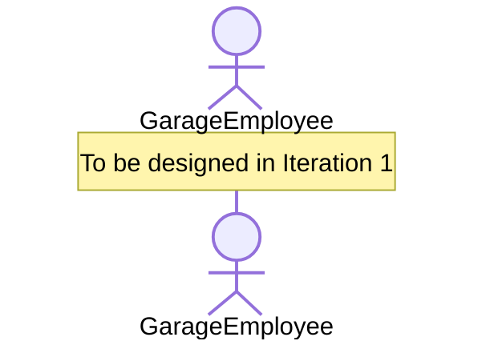

### 7.2 UC-02: Register Vehicles and Associate with Owner

### 7.3 UC-03: Plan and Track Maintenance Jobs

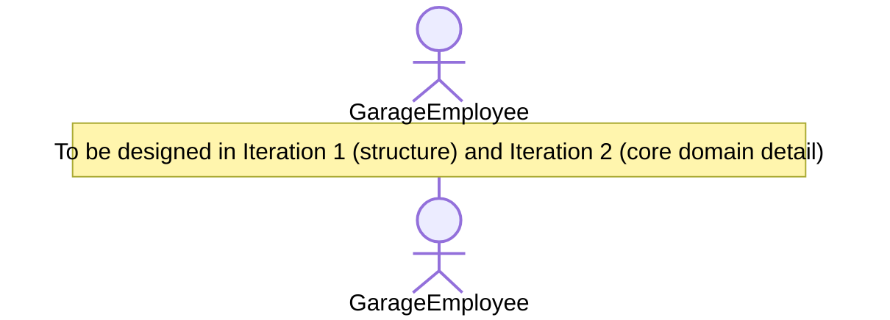

### 7.4 UC-04: Send Daily Maintenance Notifications

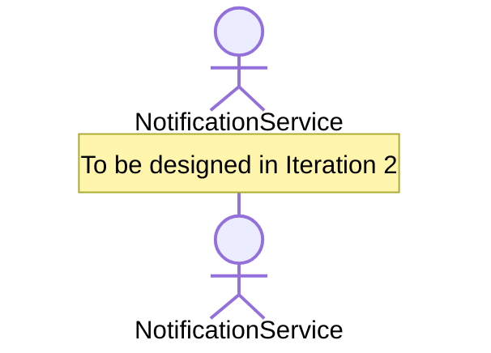

### 7.5 UC-05: Generate and Email Invoices

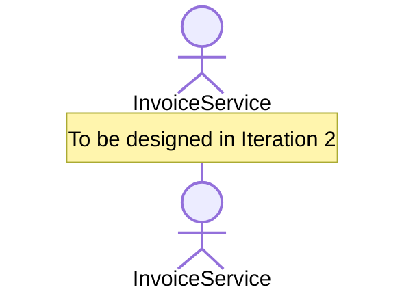

### 7.6 UC-06: Record All Domain Events for Audit

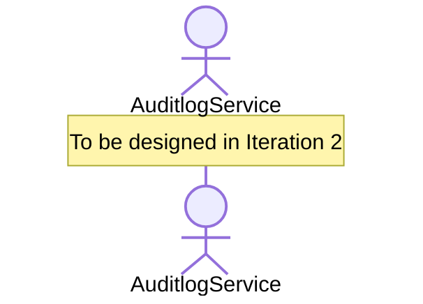

### 7.7 QAS-D1: Local Startup via Docker Compose

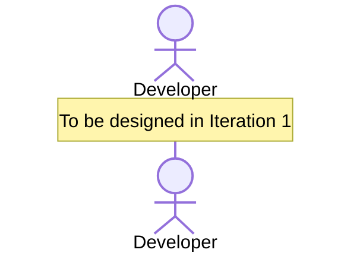

### 7.8 QAS-A1: Workshop Management Autonomy When Customer API Is Offline

### 7.9 QAS-A2: Independent Service Redeployment

### 7.10 QAS-R1: Database Connection Retry on Startup

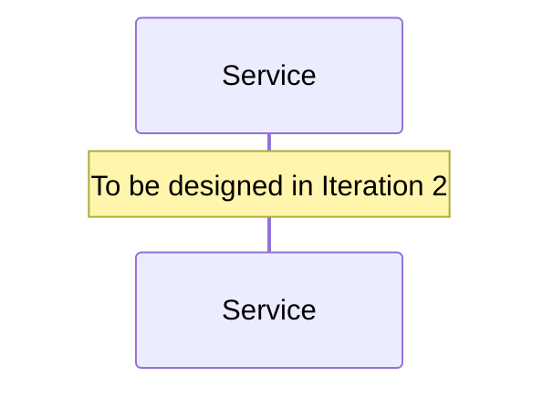

### 7.11 QAS-R2: Message Broker Retry on Connection Failure

### 7.12 QAS-R3: Circuit Breaker Fallback in WebApp

### 7.13 QAS-D2: Kubernetes Deployment

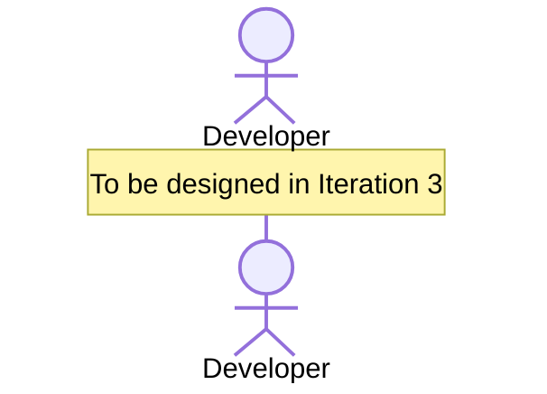

### 7.14 QAS-D3: Health Check Endpoints

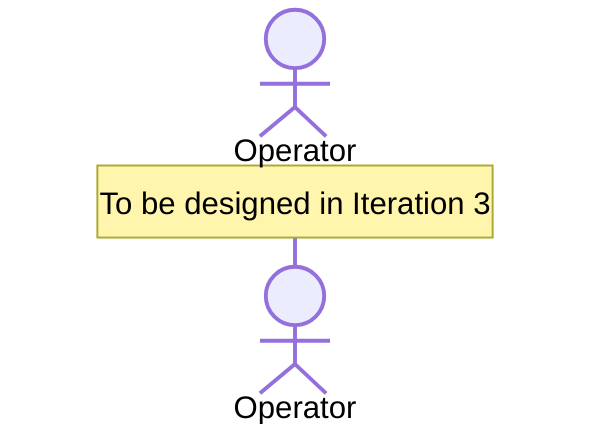

### 7.15 QAS-L1: Developer Understands Architecture Within 30 Minutes

### 7.16 QAS-L2: Real-Time Event Trace in Seq During Live Demo

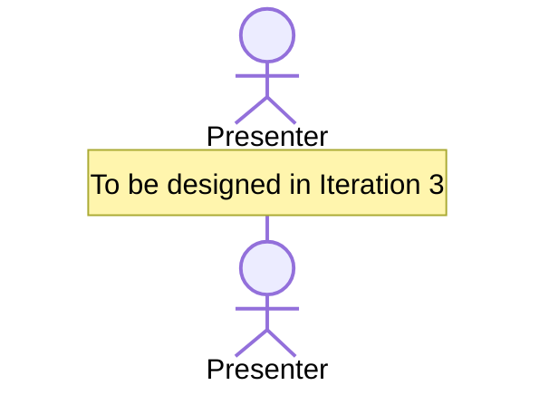

### 7.17 QAS-L3: Event Sourcing Pattern Understandable in Isolation

---

## 8. Interfaces

This section will define the API contracts, message schemas, and integration specifications for all containers and their interactions with external systems. It will be populated incrementally as each container's internal design is completed during the corresponding ADD iteration.

---

## 9. Design Decisions

The table below records the architectural design decisions made during the ADD process. Each decision is traced to the driver(s) that motivated it, together with the rationale and the alternatives that were considered and rejected. This table will be populated incrementally as decisions are made in each ADD iteration.

| Driver | Decision | Rationale | Discarded Alternatives |
|--------|----------|-----------|----------------------|
| | | | |
