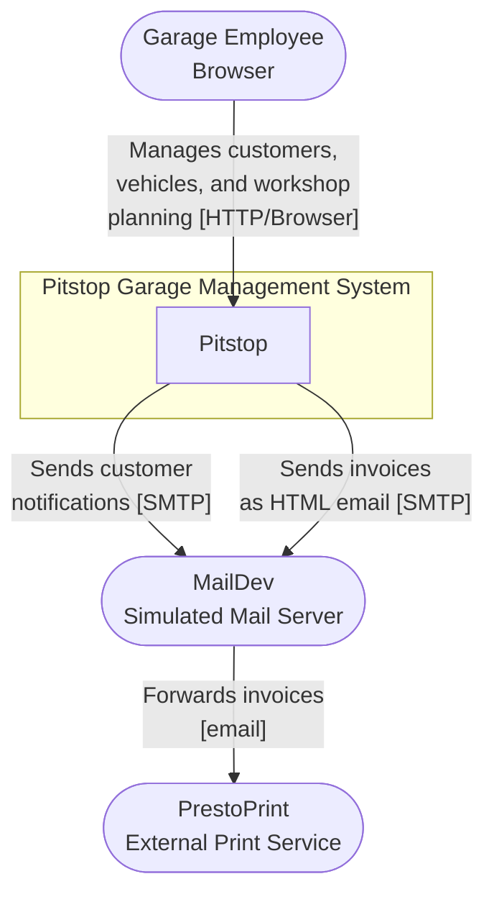
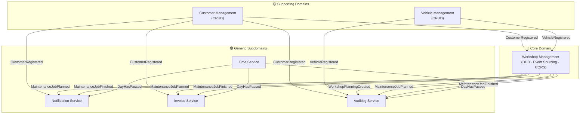
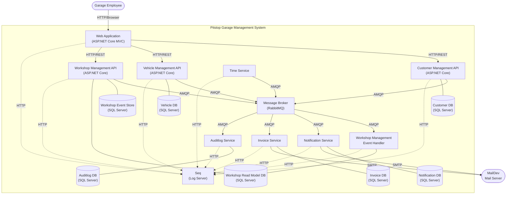

# Pitstop Garage Management System — Architecture Document

**Architect:** Neo  
**Method:** Attribute-Driven Design (ADD 3.0) / C4 Model  
**Target Architecture:** Microservices

---

## Table of Contents

1. [Introduction](#1-introduction)
2. [Context Diagram](#2-context-diagram)
3. [Architectural Drivers](#3-architectural-drivers)
   - [3.1 User Stories](#31-user-stories)
   - [3.2 Quality Attribute Scenarios](#32-quality-attribute-scenarios)
   - [3.3 Architectural Concerns](#33-architectural-concerns)
   - [3.4 Constraints](#34-constraints)
4. [Domain Model](#4-domain-model)
5. [Container Diagram](#5-container-diagram)
   - [5.1 Diagram](#51-diagram)
   - [5.2 Container Descriptions](#52-container-descriptions)
6. [Component Diagrams](#6-component-diagrams)
7. [Sequence Diagrams](#7-sequence-diagrams)
   - [7.1 Iteration 1 — Overall System Structure and Supporting Bounded Contexts](#71-iteration-1--overall-system-structure-and-supporting-bounded-contexts)
   - [7.2 Iteration 2 — Core Domain: Workshop Management](#72-iteration-2--core-domain-workshop-management)
   - [7.3 Iteration 3 — Event-Driven Supporting Services](#73-iteration-3--event-driven-supporting-services)
8. [Interfaces](#8-interfaces)
9. [Design Decisions](#9-design-decisions)

---

## 1. Introduction

This document describes the software architecture of the **Pitstop Garage Management System**, a reference application for a fictitious car repair garage. The system supports the daily operational tasks of garage employees: registering customers and vehicles, planning and finishing maintenance jobs, automatically notifying customers of upcoming work, and generating invoices for completed jobs.

The document is produced following the **Attribute-Driven Design (ADD 3.0)** process, which derives every architectural decision from a prioritised set of architectural drivers — user stories, quality attribute scenarios, architectural concerns, and constraints. The final architecture is based on a **microservices** style, with each bounded context identified through Domain-Driven Design mapping directly to one or more independently deployable services.

Structural views use the **C4 model** (context, container, and component diagrams). Behavioural views use **UML sequence diagrams** for the key use cases and quality attribute scenarios listed in the Iteration Plan. Design decisions are recorded in the decision log in section 9.

The document is structured to evolve incrementally across three design iterations, as defined in `IterationPlan.md`, starting with the foundational system structure, progressing through the core business domain, and concluding with the event-driven supporting services.

The primary goals of the system are **learnability** and **demonstrability**: the architecture is intentionally transparent and well-documented so that .NET developers, conference audiences, and workshop participants can understand microservices, DDD, CQRS, event sourcing, and container technologies from a working reference implementation.

The intended audience is developers, architects, and technical stakeholders who wish to study, extend, or present the system.

---

## 2. Context Diagram

The context diagram below positions the Pitstop Garage Management System within its operational environment. It represents the entire system as a single black box and shows all external actors and systems that interact with it, together with the direction and nature of each interaction. This level of abstraction — C4 Level 1 (System Context) — establishes the system boundary, identifies all integration points with the outside world, and provides the foundation from which more detailed views (containers, components) are derived in later sections.

The system is used exclusively by **Garage Employees** through a web browser. It has two outbound email dependencies: **MailDev** (a simulated SMTP/POP3 server that captures all outbound mail in development, representing a real mail server in production) and **PrestoPrint** (a fictitious external print service that receives invoices as HTML email). No external systems call into the Pitstop system; all interaction is initiated by garage employees or by the passage of time.



| Actor / System | Type | Description |
|----------------|------|-------------|
| **Garage Employee** | User | Uses the web application to register customers and vehicles, plan and finish maintenance jobs, and view the workshop schedule. Only actor that directly interacts with the system. |
| **MailDev** | External System | Simulated SMTP/POP3 server that captures all outbound emails during development. In a production deployment this would be replaced by a real mail server or email delivery service. |
| **PrestoPrint** | External System | Fictitious external printing company. Receives HTML invoices for completed maintenance jobs via email, forwarded through MailDev. |

---

## 3. Architectural Drivers

This section summarises the complete set of architectural drivers that shape the system design. Drivers are divided into user stories (functional requirements), quality attribute scenarios (non-functional requirements), architectural concerns (cross-cutting design and governance concerns), and constraints (non-negotiable boundary conditions). Each driver is assigned a priority that directly influences the ordering of design iterations.

### 3.1 User Stories

| ID | User Story | Description | Priority |
|----|------------|-------------|----------|
| US-1 | Register Customer | A garage employee registers a new customer by providing their name, telephone number, and email address. | **High** |
| US-2 | Look Up Customer | A garage employee looks up an existing customer by listing all customers or retrieving a customer by ID. | **High** |
| US-3 | Register Vehicle | A garage employee registers a vehicle (license number, brand, type) and associates it with an existing customer. | **High** |
| US-4 | Look Up Vehicle | A garage employee looks up an existing vehicle by listing all vehicles or retrieving a vehicle by license number. | **High** |
| US-5 | Plan Maintenance Job | A garage employee selects a date, a vehicle, and a time slot, and schedules a maintenance job in the workshop planning for that day. | **High** |
| US-6 | View Workshop Planning | A garage employee views the workshop planning for a specific day, including all maintenance jobs, their time slots, associated vehicles and customers. | **High** |
| US-7 | Finish Maintenance Job | A garage employee marks a planned maintenance job as finished. | **High** |
| US-8 | Receive Maintenance Notification | When a day passes, customers who have a maintenance job scheduled for that day automatically receive a reminder email. | Medium |
| US-9 | Receive Invoice | When a day passes, customers whose maintenance job was finished but not yet invoiced automatically receive an HTML invoice by email. | Medium |

### 3.2 Quality Attribute Scenarios

| ID | Quality Attribute | Scenario | Associated Drivers | Business Priority | Technical Difficulty |
|----|-------------------|----------|--------------------|-------------------|----------------------|
| QAS-L1 | Learnability | A .NET developer clones the repository and wants to understand the microservices architecture. The developer can understand the overall architecture and the role of each service within 30 minutes by reading the documentation and browsing the code. | US-1 to US-9 | **High** | Medium |
| QAS-L2 | Learnability | A conference presenter registers a customer and shows the resulting event flowing to all consuming services in real-time via the Seq log server. | US-1, CRN-4 | **High** | Low |
| QAS-L3 | Learnability | A developer wants to understand how event sourcing works. The WorkshopManagementAPI provides a clear, isolated implementation of event sourcing with DDD aggregates that can be studied independently. | US-5, US-7 | **High** | **High** |
| QAS-O1 | Operability | Running `docker compose up` starts all services and infrastructure. The system is accessible at `http://localhost:7005` within 2 minutes. | CRN-1, CON-2 | **High** | Low |
| QAS-O2 | Operability | Kubernetes manifests in the `k8s/` folder can be applied to a cluster. The system starts successfully, with an optional Istio or Linkerd service mesh. | CRN-5 | Medium | Medium |
| QAS-O3 | Operability | Every API service exposes a `/hc` endpoint returning health status. Docker performs health checks every 30 seconds. | CON-2 | Medium | Low |
| QAS-R1 | Resilience | SQL Server is slow to start during `docker compose up`. Services retry database connections with exponential backoff (Polly). After SQL Server is ready, services connect successfully without manual intervention. | CON-2, CON-3 | **High** | Medium |
| QAS-R2 | Resilience | RabbitMQ is temporarily unavailable. Services retry message broker connections with exponential backoff. Published messages are retried up to 9 times. | CON-4 | **High** | Medium |
| QAS-R3 | Autonomy | The Customer Management API is offline when a maintenance job is being planned. The Workshop Management service operates autonomously using its local read-model (cached customer and vehicle data). | US-5, US-6 | **High** | **High** |
| QAS-R4 | Resilience | The WebApp cannot reach a backend API after multiple retries. A Polly circuit-breaker triggers and the WebApp shows an offline fallback page rather than an error. | US-1 to US-7 | **High** | Medium |

**Primary drivers:** QAS-L1, QAS-L3, QAS-O1, QAS-R1, QAS-R2, QAS-R3, QAS-R4 (addressed across iterations 1–3).

### 3.3 Architectural Concerns

| ID | Concern | Description | Priority |
|----|---------|-------------|----------|
| CRN-1 | Establish overall system structure | Define the microservices decomposition, service boundaries, inter-service communication patterns, and overall deployment topology from the first iteration. | **High** |
| CRN-2 | Event-driven inter-service communication | Design the asynchronous messaging pattern: fanout exchange per event type, domain event schema, manual acknowledgement, and retry policy. | **High** |
| CRN-3 | Database-per-service data isolation | Ensure each service owns its own logical database schema. No service accesses another service's database directly. | **High** |
| CRN-4 | Centralized structured logging | All services must use Serilog with a Seq sink and enrich log events with the machine name for correlation in multi-container environments. | Medium |
| CRN-5 | Container orchestration | Provide both Docker Compose (local) and Kubernetes manifests (cloud/demo) for all services and infrastructure components. | Medium |

### 3.4 Constraints

| ID | Constraint | Description |
|----|------------|-------------|
| CON-1 | .NET / C# | All services are implemented in .NET and C#. This keeps the solution accessible to the target audience (.NET developers) and enables shared libraries via NuGet. |
| CON-2 | Docker | Every service and all infrastructure components run as Linux Docker containers. Docker Compose is the primary local orchestration tool. |
| CON-3 | SQL Server | A single SQL Server instance is used as the database platform for all services. This is a deliberate simplification; production deployments would use separate database instances. |
| CON-4 | RabbitMQ | RabbitMQ is the sole message broker for all asynchronous inter-service communication. All services use the `Infrastructure.Messaging` abstraction library rather than depending on `RabbitMQ.Client` directly. |
| CON-5 | Educational scope | Functional scope is limited to create and read operations only (no update or delete). The primary goal is to demonstrate architectural concepts clearly, not to build a production-grade application. |
| CON-6 | Open source | The code is publicly available on GitHub. No proprietary dependencies or licences are used (except Seq, which has a free development tier). |

---

## 4. Domain Model

The domain model below was derived from the architectural drivers using Domain-Driven Design (DDD). Full detail — including the bounded context map, class diagram, element reference tables, and design decisions — is documented in `DomainModel.md`. The key findings are reproduced here for completeness.

The system decomposes into **six bounded contexts**: Workshop Management (core domain), Customer Management and Vehicle Management (supporting domains), and Notification, Invoice, Auditlog, and Time (generic subdomains). All cross-context integration is via asynchronous domain events — there are no synchronous service-to-service calls.

### 4.1 Bounded Context Map



### 4.2 Domain Model Class Diagram

```mermaid
classDiagram
    namespace CustomerManagement {
        class Customer {
            <<AggregateRoot>>
            +CustomerId id
            +Name name
            +TelephoneNumber telephoneNumber
            +EmailAddress emailAddress
            +register()$ CustomerRegistered
        }
        class CustomerId {
            <<ValueObject>>
            +Guid value
        }
        class Name {
            <<ValueObject>>
            +string firstName
            +string lastName
        }
        class TelephoneNumber {
            <<ValueObject>>
            +string value
        }
        class EmailAddress {
            <<ValueObject>>
            +string value
        }
        class CustomerRegistered {
            <<DomainEvent>>
            +Guid customerId
            +string firstName
            +string lastName
            +string telephoneNumber
            +string emailAddress
        }
    }

    namespace VehicleManagement {
        class Vehicle {
            <<AggregateRoot>>
            +LicenseNumber licenseNumber
            +string brand
            +string type
            +CustomerId ownerId
            +register()$ VehicleRegistered
        }
        class LicenseNumber {
            <<ValueObject>>
            +string value
        }
        class VehicleRegistered {
            <<DomainEvent>>
            +string licenseNumber
            +string brand
            +string type
            +Guid ownerId
        }
    }

    namespace WorkshopManagement {
        class WorkshopPlanning {
            <<AggregateRoot>>
            +PlanningDate date
            +List~MaintenanceJob~ jobs
            +planMaintenanceJob(cmd)$ MaintenanceJobPlanned
            +finishMaintenanceJob(cmd)$ MaintenanceJobFinished
        }
        class MaintenanceJob {
            <<Entity>>
            +JobId id
            +CustomerId customerId
            +LicenseNumber vehicleId
            +TimeSlot timeSlot
            +string description
            +JobStatus status
        }
        class PlanningDate {
            <<ValueObject>>
            +DateTime date
        }
        class JobId {
            <<ValueObject>>
            +Guid value
        }
        class TimeSlot {
            <<ValueObject>>
            +DateTime startTime
            +DateTime endTime
        }
        class JobStatus {
            <<Enumeration>>
            Planned
            Finished
        }
        class CustomerInfo {
            <<ReadModel>>
            +Guid customerId
            +string name
            +string telephoneNumber
            +string emailAddress
        }
        class VehicleInfo {
            <<ReadModel>>
            +string licenseNumber
            +string brand
            +string type
            +Guid ownerId
        }
        class WorkshopPlanningCreated {
            <<DomainEvent>>
            +DateTime planningDate
        }
        class MaintenanceJobPlanned {
            <<DomainEvent>>
            +Guid jobId
            +DateTime planningDate
            +Guid customerId
            +string vehicleLicenseNumber
            +DateTime startTime
            +DateTime endTime
            +string description
        }
        class MaintenanceJobFinished {
            <<DomainEvent>>
            +Guid jobId
            +DateTime planningDate
            +DateTime finishedAt
        }
    }

    namespace NotificationContext {
        class NotificationCustomer {
            <<Entity>>
            +Guid customerId
            +string name
            +string telephoneNumber
            +string emailAddress
        }
        class PlannedMaintenanceJob {
            <<Entity>>
            +Guid jobId
            +Guid customerId
            +string vehicleLicenseNumber
            +DateTime plannedDate
            +bool notificationSent
        }
    }

    namespace InvoiceContext {
        class InvoiceCustomer {
            <<Entity>>
            +Guid customerId
            +string name
            +string emailAddress
        }
        class FinishedMaintenanceJob {
            <<Entity>>
            +Guid jobId
            +Guid customerId
            +string vehicleLicenseNumber
            +DateTime finishedDate
            +bool invoiceSent
        }
    }

    namespace AuditlogContext {
        class AuditlogEntry {
            <<Entity>>
            +Guid id
            +string eventType
            +string messageBody
            +DateTime timestamp
        }
    }

    namespace TimeContext {
        class TimeService {
            <<Service>>
            +tick()$ DayHasPassed
        }
        class DayHasPassed {
            <<DomainEvent>>
            +DateTime date
        }
    }

    Customer "1" *-- "1" CustomerId : identified by
    Customer "1" *-- "1" Name : has
    Customer "1" *-- "1" TelephoneNumber : has
    Customer "1" *-- "1" EmailAddress : has
    Customer ..> CustomerRegistered : publishes

    Vehicle "1" *-- "1" LicenseNumber : identified by
    Vehicle ..> VehicleRegistered : publishes

    WorkshopPlanning "1" *-- "1" PlanningDate : identified by
    WorkshopPlanning "1" *-- "0..*" MaintenanceJob : contains
    MaintenanceJob "1" *-- "1" JobId : identified by
    MaintenanceJob "1" *-- "1" TimeSlot : scheduled in
    MaintenanceJob --> JobStatus : status
    WorkshopPlanning ..> WorkshopPlanningCreated : publishes
    WorkshopPlanning ..> MaintenanceJobPlanned : publishes
    WorkshopPlanning ..> MaintenanceJobFinished : publishes

    TimeService ..> DayHasPassed : publishes

    CustomerRegistered ..> CustomerInfo : populates
    VehicleRegistered ..> VehicleInfo : populates
    CustomerRegistered ..> NotificationCustomer : populates
    CustomerRegistered ..> InvoiceCustomer : populates
    MaintenanceJobPlanned ..> PlannedMaintenanceJob : creates
    MaintenanceJobFinished ..> FinishedMaintenanceJob : creates
    MaintenanceJobFinished ..> PlannedMaintenanceJob : updates status
```



### 4.3 Domain Elements Reference

| Element | Bounded Context | DDD Type | Description |
|---------|----------------|----------|-------------|
| `Customer` | Customer Management | AggregateRoot | Represents a registered garage customer. Publishes `CustomerRegistered` on creation. |
| `Vehicle` | Vehicle Management | AggregateRoot | Represents a vehicle owned by a customer. Identified by its license number. Publishes `VehicleRegistered` on creation. |
| `WorkshopPlanning` | Workshop Management | AggregateRoot | The schedule for a single calendar day. Enforces business rules (no overlapping time slots). Persisted via event sourcing. |
| `MaintenanceJob` | Workshop Management | Entity | A single maintenance task within a `WorkshopPlanning`. Transitions from `Planned` to `Finished`. |
| `NotificationCustomer` | Notification | Entity | Local projection of customer data cached by the Notification service. |
| `PlannedMaintenanceJob` | Notification | Entity | Local projection of job data; tracks whether a notification has been sent. |
| `InvoiceCustomer` | Invoice | Entity | Local projection of customer data cached by the Invoice service. |
| `FinishedMaintenanceJob` | Invoice | Entity | Local projection of finished job data; tracks whether an invoice has been sent. |
| `AuditlogEntry` | Auditlog | Entity | Immutable record of a domain event (type, body, timestamp). |
| `CustomerId` | Customer Management | ValueObject | `Guid` wrapper that uniquely identifies a customer across bounded contexts. |
| `Name` | Customer Management | ValueObject | Immutable `firstName` + `lastName` pair. |
| `TelephoneNumber` | Customer Management | ValueObject | Validated, immutable telephone number string. |
| `EmailAddress` | Customer Management | ValueObject | Validated, immutable email address string. |
| `LicenseNumber` | Vehicle Management | ValueObject | Vehicle license plate; natural identity key for `Vehicle`. |
| `PlanningDate` | Workshop Management | ValueObject | Date-only wrapper identifying which day a `WorkshopPlanning` covers. |
| `JobId` | Workshop Management | ValueObject | `Guid` wrapper uniquely identifying a `MaintenanceJob`. |
| `TimeSlot` | Workshop Management | ValueObject | Immutable `startTime` + `endTime` pair for a maintenance job window. |
| `JobStatus` | Workshop Management | Enumeration | `Planned` or `Finished`. |
| `CustomerInfo` | Workshop Management | ReadModel | Cached customer projection used by Workshop Management for autonomous operation. |
| `VehicleInfo` | Workshop Management | ReadModel | Cached vehicle projection used by Workshop Management for autonomous operation. |
| `TimeService` | Time Context | Service | Publishes `DayHasPassed` events to advance the simulated calendar day. |
| `CustomerRegistered` | Customer Management | DomainEvent | Signals a new customer registration; consumed by Workshop Management, Notification, Invoice, Auditlog. |
| `VehicleRegistered` | Vehicle Management | DomainEvent | Signals a new vehicle registration; consumed by Workshop Management, Auditlog. |
| `WorkshopPlanningCreated` | Workshop Management | DomainEvent | Signals a new planning day aggregate; consumed by Workshop Management EventHandler, Auditlog. |
| `MaintenanceJobPlanned` | Workshop Management | DomainEvent | Signals a job has been scheduled; consumed by Workshop Management EventHandler, Notification, Invoice, Auditlog. |
| `MaintenanceJobFinished` | Workshop Management | DomainEvent | Signals a job has been completed; consumed by Workshop Management EventHandler, Notification, Invoice, Auditlog. |
| `DayHasPassed` | Time Context | DomainEvent | Signals the passage of a calendar day; triggers Notification and Invoice processing. |

---

## 5. Container Diagram

### 5.1 Diagram

The container diagram below is a C4 Level 2 view of the Pitstop Garage Management System. It zooms inside the system boundary to show all high-level technical building blocks — applications, services, databases, message queues, and infrastructure components — that must be running for the system to function. Each container is an independently deployable unit, runs in its own Docker container, and owns its own lifecycle. This diagram serves as the primary map for understanding how the system is composed and how information flows between its parts. Subsequent sections (component diagrams and sequence diagrams) zoom further into individual containers.



### 5.2 Container Descriptions

| Container | Type | Responsibilities |
|-----------|------|-----------------|
| **Web Application** | ASP.NET Core MVC Web App | Browser-based front-end for garage employees. Provides views for customer registration, vehicle registration, workshop planning, and job management. Calls backend APIs via Refit typed HTTP clients. Has no direct knowledge of the message broker or other services. |
| **Customer Management API** | ASP.NET Core Web API | Manages customers: registers new customers and retrieves existing ones (by ID or full list). Persists data in the Customer DB using Entity Framework Core (CRUD). Publishes `CustomerRegistered` events to the message broker on each successful registration. |
| **Vehicle Management API** | ASP.NET Core Web API | Manages vehicles: registers new vehicles, associates them with a customer owner, and retrieves existing ones. Persists data in the Vehicle DB using Entity Framework Core (CRUD). Publishes `VehicleRegistered` events. |
| **Workshop Management API** | ASP.NET Core Web API | Core domain service. Manages maintenance job scheduling and completion. Implements DDD (aggregate: `WorkshopPlanning`), Event Sourcing (state persisted as event stream in the Event Store), and CQRS (writes via event store, reads from the read model DB). Publishes `WorkshopPlanningCreated`, `MaintenanceJobPlanned`, and `MaintenanceJobFinished` events. |
| **Workshop Management Event Handler** | Background Worker Service | Subscribes to all domain events and maintains the Workshop Management read model and reference data cache (customer and vehicle info) in the Workshop Read Model DB. Ensures the Workshop Management API can operate autonomously when other services are unavailable. |
| **Notification Service** | Background Worker Service | Subscribes to `CustomerRegistered`, `MaintenanceJobPlanned`, `MaintenanceJobFinished`, and `DayHasPassed` events. On each `DayHasPassed`, queries its local database for jobs planned for that day and sends reminder email notifications to customers via SMTP. |
| **Invoice Service** | Background Worker Service | Subscribes to `CustomerRegistered`, `MaintenanceJobPlanned`, `MaintenanceJobFinished`, and `DayHasPassed` events. On each `DayHasPassed`, queries its local database for finished but uninvoiced jobs and sends HTML invoice emails to the customer and PrestoPrint via SMTP. |
| **Time Service** | Background Worker Service | Publishes `DayHasPassed` events at a configurable interval to simulate the passage of time. Has no database. Enables deterministic and testable time-dependent behaviour. |
| **Auditlog Service** | Background Worker Service | Subscribes to all domain events and persists each event as an `AuditlogEntry` in the Auditlog DB for later reference. |
| **Message Broker (RabbitMQ)** | Infrastructure — Message Broker | Fanout-exchange-based AMQP message broker. Every domain event is published to its own fanout exchange; each subscribing service has a dedicated queue bound to that exchange, ensuring every service receives every event independently. |
| **Customer DB** | Infrastructure — SQL Server Database | Logical database schema owned exclusively by the Customer Management API. Stores `Customer` records. |
| **Vehicle DB** | Infrastructure — SQL Server Database | Logical database schema owned exclusively by the Vehicle Management API. Stores `Vehicle` records. |
| **Workshop Event Store DB** | Infrastructure — SQL Server Database | Logical database schema owned exclusively by the Workshop Management API. Stores the append-only stream of domain events for the `WorkshopPlanning` aggregate (event sourcing store). |
| **Workshop Read Model DB** | Infrastructure — SQL Server Database | Logical database schema shared between the Workshop Management API (reads) and the Workshop Management Event Handler (writes). Stores denormalized read-model data: planning schedules, cached `CustomerInfo`, and cached `VehicleInfo`. |
| **Notification DB** | Infrastructure — SQL Server Database | Logical database schema owned exclusively by the Notification Service. Caches customer contact data and planned job records, including a flag tracking whether a notification has been sent. |
| **Invoice DB** | Infrastructure — SQL Server Database | Logical database schema owned exclusively by the Invoice Service. Caches customer contact data and finished job records, including a flag tracking whether an invoice has been sent. |
| **Auditlog DB** | Infrastructure — SQL Server Database | Logical database schema owned exclusively by the Auditlog Service. Stores all `AuditlogEntry` records. |
| **Seq** | Infrastructure — Log Server | Centralized structured log aggregation server. All services use Serilog with a Seq HTTP sink. Provides a searchable, filterable dashboard over all structured log events from all containers in real-time. |

---

## 6. Component Diagrams

For each container identified in the Container Diagram (section 5) that will be developed as part of this project, a dedicated subsection will be included here with a component diagram detailing the internal design of that container. Component diagrams correspond to C4 Level 3 and show the major structural building blocks inside a container — controllers, command handlers, repositories, aggregates, event publishers, and other significant internal components — along with their responsibilities and how they interact.

Each component diagram subsection will be accompanied by a table listing the name and responsibility of every component shown in the diagram.

Component diagrams will be produced incrementally as part of the ADD iteration process: each iteration that refines a specific container will introduce or update the corresponding component diagram in this section.

---

## 7. Sequence Diagrams

For each use case and quality attribute scenario addressed in the Iteration Plan (`IterationPlan.md`), a dedicated subsection below contains a sequence diagram that illustrates the runtime behaviour of the system for that driver. Sequence diagrams capture the interaction between containers (and, where relevant, internal components) from the perspective of a single scenario. They complement the structural views in sections 5 and 6 by showing how the architecture behaves dynamically.

Sequence diagrams are produced iteration by iteration: empty placeholders are provided here and will be populated during the corresponding ADD iteration.

### 7.1 Iteration 1 — Overall System Structure and Supporting Bounded Contexts

#### US-1: Register Customer

```mermaid
sequenceDiagram
```

#### US-2: Look Up Customer

```mermaid
sequenceDiagram
```

#### US-3: Register Vehicle

```mermaid
sequenceDiagram
```

#### US-4: Look Up Vehicle

```mermaid
sequenceDiagram
```

#### QAS-O1: Docker Compose Startup Within 2 Minutes

```mermaid
sequenceDiagram
```

#### QAS-L1: Architecture Understandable Within 30 Minutes

```mermaid
sequenceDiagram
```

---

### 7.2 Iteration 2 — Core Domain: Workshop Management

#### US-5: Plan Maintenance Job

```mermaid
sequenceDiagram
```

#### US-6: View Workshop Planning

```mermaid
sequenceDiagram
```

#### US-7: Finish Maintenance Job

```mermaid
sequenceDiagram
```

#### QAS-R1: SQL Server Slow Startup — Exponential Backoff Retry

```mermaid
sequenceDiagram
```

#### QAS-R2: RabbitMQ Temporarily Unavailable — Message Retry

```mermaid
sequenceDiagram
```

#### QAS-R3: Customer Management API Offline — Workshop Management Autonomous Operation

```mermaid
sequenceDiagram
```

#### QAS-L3: Event Sourcing Flow — Plan and Replay WorkshopPlanning Aggregate

```mermaid
sequenceDiagram
```

---

### 7.3 Iteration 3 — Event-Driven Supporting Services

#### US-8: Receive Maintenance Notification

```mermaid
sequenceDiagram
```

#### US-9: Receive Invoice

```mermaid
sequenceDiagram
```

#### QAS-R4: WebApp Circuit-Breaker — Fallback to Offline Page

```mermaid
sequenceDiagram
```

#### QAS-L2: Event Flow Visible in Real-Time via Seq

```mermaid
sequenceDiagram
```

#### QAS-O3: Health Check Endpoint

```mermaid
sequenceDiagram
```

---

## 8. Interfaces

*This section will describe the contracts between containers and with external systems, including REST API endpoints (request/response schemas), AMQP message schemas (domain event payloads), and SMTP message formats. To be completed during the ADD iteration process.*

---

## 9. Design Decisions

The table below records the architectural decisions made during the ADD process. Each entry links the decision back to the driver(s) that motivated it, states what was decided, explains the rationale, and documents the alternatives that were considered and discarded.

| Driver | Decision | Rationale | Discarded Alternative |
|--------|----------|-----------|-----------------------|
| | | | |
