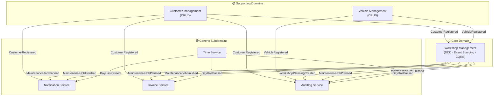

# Domain Model — Pitstop Garage Management System

> **Architect:** Neo  
> **Technique:** Attribute-Driven Design (ADD 3.0)  
> **Design approach:** Domain-Driven Design (DDD)  
> **Target architecture:** Microservices

---

## 1. Architectural Drivers Review

Before defining the domain model, the following drivers were reviewed to ensure consistency and to establish modelling priorities:

| Driver | Impact on Domain Model |
|--------|------------------------|
| **Learnability** (QA-1) | Bounded contexts must have clear, explicit boundaries. Stereotypes (AggregateRoot, Entity, ValueObject, DomainEvent) are explicitly marked to educate readers. |
| **Demonstrability** (QA-2) | The model must map 1-to-1 onto independently runnable services. Each bounded context becomes a distinct microservice deployment unit. |
| **Autonomy** (QA-3) | Each service owns its data. Cross-context data dependencies are resolved via local read-models (cached projections), not synchronous calls to foreign contexts. |
| **Resilience** (QA-4) | Domain events are the primary integration mechanism. The event-driven model naturally tolerates temporary unavailability of producing services. |
| **Functional scope** | Limited to create and read operations only. No update or delete flows are modelled. |

---

## 2. Bounded Context Map

The system decomposes into six bounded contexts. Workshop Management is the **core domain**; the others are supporting or generic subdomains.

**Integration pattern:** All cross-context communication is via asynchronous **domain events** published to RabbitMQ fanout exchanges. There are no synchronous service-to-service calls. Each consuming service maintains a local projection of the data it needs, ensuring autonomy.

---

## 3. Domain Model Class Diagram

The diagram below shows all six bounded contexts with their aggregates, entities, value objects, enumerations, read-models, and domain events.

```mermaid
classDiagram
    namespace CustomerManagement {
        class Customer {
            <<AggregateRoot>>
            +CustomerId id
            +Name name
            +TelephoneNumber telephoneNumber
            +EmailAddress emailAddress
            +register()$ CustomerRegistered
        }
        class CustomerId {
            <<ValueObject>>
            +Guid value
        }
        class Name {
            <<ValueObject>>
            +string firstName
            +string lastName
        }
        class TelephoneNumber {
            <<ValueObject>>
            +string value
        }
        class EmailAddress {
            <<ValueObject>>
            +string value
        }
        class CustomerRegistered {
            <<DomainEvent>>
            +Guid customerId
            +string firstName
            +string lastName
            +string telephoneNumber
            +string emailAddress
        }
    }

    namespace VehicleManagement {
        class Vehicle {
            <<AggregateRoot>>
            +LicenseNumber licenseNumber
            +string brand
            +string type
            +CustomerId ownerId
            +register()$ VehicleRegistered
        }
        class LicenseNumber {
            <<ValueObject>>
            +string value
        }
        class VehicleRegistered {
            <<DomainEvent>>
            +string licenseNumber
            +string brand
            +string type
            +Guid ownerId
        }
    }

    namespace WorkshopManagement {
        class WorkshopPlanning {
            <<AggregateRoot>>
            +PlanningDate date
            +List~MaintenanceJob~ jobs
            +planMaintenanceJob(cmd)$ MaintenanceJobPlanned
            +finishMaintenanceJob(cmd)$ MaintenanceJobFinished
        }
        class MaintenanceJob {
            <<Entity>>
            +JobId id
            +CustomerId customerId
            +LicenseNumber vehicleId
            +TimeSlot timeSlot
            +string description
            +JobStatus status
        }
        class PlanningDate {
            <<ValueObject>>
            +DateTime date
        }
        class JobId {
            <<ValueObject>>
            +Guid value
        }
        class TimeSlot {
            <<ValueObject>>
            +DateTime startTime
            +DateTime endTime
        }
        class JobStatus {
            <<Enumeration>>
            Planned
            Finished
        }
        class CustomerInfo {
            <<ReadModel>>
            +Guid customerId
            +string name
            +string telephoneNumber
            +string emailAddress
        }
        class VehicleInfo {
            <<ReadModel>>
            +string licenseNumber
            +string brand
            +string type
            +Guid ownerId
        }
        class WorkshopPlanningCreated {
            <<DomainEvent>>
            +DateTime planningDate
        }
        class MaintenanceJobPlanned {
            <<DomainEvent>>
            +Guid jobId
            +DateTime planningDate
            +Guid customerId
            +string vehicleLicenseNumber
            +DateTime startTime
            +DateTime endTime
            +string description
        }
        class MaintenanceJobFinished {
            <<DomainEvent>>
            +Guid jobId
            +DateTime planningDate
            +DateTime finishedAt
        }
    }

    namespace NotificationContext {
        class NotificationCustomer {
            <<Entity>>
            +Guid customerId
            +string name
            +string telephoneNumber
            +string emailAddress
        }
        class PlannedMaintenanceJob {
            <<Entity>>
            +Guid jobId
            +Guid customerId
            +string vehicleLicenseNumber
            +DateTime plannedDate
            +bool notificationSent
        }
    }

    namespace InvoiceContext {
        class InvoiceCustomer {
            <<Entity>>
            +Guid customerId
            +string name
            +string emailAddress
        }
        class FinishedMaintenanceJob {
            <<Entity>>
            +Guid jobId
            +Guid customerId
            +string vehicleLicenseNumber
            +DateTime finishedDate
            +bool invoiceSent
        }
    }

    namespace AuditlogContext {
        class AuditlogEntry {
            <<Entity>>
            +Guid id
            +string eventType
            +string messageBody
            +DateTime timestamp
        }
    }

    namespace TimeContext {
        class TimeService {
            <<Service>>
            +tick()$ DayHasPassed
        }
        class DayHasPassed {
            <<DomainEvent>>
            +DateTime date
        }
    }

    %% ── Internal structure: Customer Management ──────────────────────────
    Customer "1" *-- "1" CustomerId : identified by
    Customer "1" *-- "1" Name : has
    Customer "1" *-- "1" TelephoneNumber : has
    Customer "1" *-- "1" EmailAddress : has
    Customer ..> CustomerRegistered : publishes

    %% ── Internal structure: Vehicle Management ───────────────────────────
    Vehicle "1" *-- "1" LicenseNumber : identified by
    Vehicle ..> VehicleRegistered : publishes

    %% ── Internal structure: Workshop Management ──────────────────────────
    WorkshopPlanning "1" *-- "1" PlanningDate : identified by
    WorkshopPlanning "1" *-- "0..*" MaintenanceJob : contains
    MaintenanceJob "1" *-- "1" JobId : identified by
    MaintenanceJob "1" *-- "1" TimeSlot : scheduled in
    MaintenanceJob --> JobStatus : status
    WorkshopPlanning ..> WorkshopPlanningCreated : publishes
    WorkshopPlanning ..> MaintenanceJobPlanned : publishes
    WorkshopPlanning ..> MaintenanceJobFinished : publishes

    %% ── Time Service ─────────────────────────────────────────────────────
    TimeService ..> DayHasPassed : publishes

    %% ── Cross-context event consumption (read-model population) ──────────
    CustomerRegistered ..> CustomerInfo : populates
    VehicleRegistered ..> VehicleInfo : populates
    CustomerRegistered ..> NotificationCustomer : populates
    CustomerRegistered ..> InvoiceCustomer : populates
    MaintenanceJobPlanned ..> PlannedMaintenanceJob : creates
    MaintenanceJobFinished ..> FinishedMaintenanceJob : creates
    MaintenanceJobFinished ..> PlannedMaintenanceJob : updates status
```

---

## 4. Domain Elements Reference

### 4.1 Aggregates and Aggregate Roots

| Element | Bounded Context | DDD Type | Description |
|---------|----------------|----------|-------------|
| `Customer` | Customer Management | AggregateRoot | The central entity of the Customer Management context. Represents a registered garage customer. Owns its identity and all personal contact data. Publishes `CustomerRegistered` upon creation. |
| `Vehicle` | Vehicle Management | AggregateRoot | Represents a vehicle owned by a customer. Identified by its license number. Links back to a customer via `CustomerId`. Publishes `VehicleRegistered` upon creation. |
| `WorkshopPlanning` | Workshop Management | AggregateRoot | The core aggregate of the entire system. Represents the maintenance job schedule for a single calendar day. Enforces business rules: e.g. no overlapping jobs. Persisted via event sourcing — its state is rebuilt by replaying stored domain events. Publishes `WorkshopPlanningCreated`, `MaintenanceJobPlanned`, and `MaintenanceJobFinished`. |

### 4.2 Entities

| Element | Bounded Context | DDD Type | Description |
|---------|----------------|----------|-------------|
| `MaintenanceJob` | Workshop Management | Entity | A single maintenance task for a specific vehicle, assigned to a time slot within a `WorkshopPlanning`. Lifecycle transitions from `Planned` to `Finished`. Lives exclusively inside the `WorkshopPlanning` aggregate boundary. |
| `NotificationCustomer` | Notification | Entity | A local projection of customer data cached in the Notification service's own database. Populated by consuming `CustomerRegistered` events. Enables the service to compose notification emails autonomously. |
| `PlannedMaintenanceJob` | Notification | Entity | A local projection of maintenance job data cached in the Notification service. Tracks whether a reminder notification has been sent for the job. |
| `InvoiceCustomer` | Invoice | Entity | A local projection of customer data cached in the Invoice service's own database. Populated by consuming `CustomerRegistered` events. Enables invoice generation without calling the Customer Management API. |
| `FinishedMaintenanceJob` | Invoice | Entity | A local projection of finished maintenance job data cached in the Invoice service. Tracks whether an invoice has been generated and dispatched for the job. |
| `AuditlogEntry` | Auditlog | Entity | An immutable record of a domain event. Captures the event type, raw message body, and timestamp. New entries are appended on every domain event received, regardless of origin. |

### 4.3 Value Objects

| Element | Bounded Context | DDD Type | Description |
|---------|----------------|----------|-------------|
| `CustomerId` | Customer Management | ValueObject | Wraps a `Guid` that uniquely identifies a Customer. Shared by reference across bounded contexts — other services refer to customers only by this identifier, never by mutable data. |
| `Name` | Customer Management | ValueObject | Immutable pair of `firstName` and `lastName`. A change of name produces a new `Name` value rather than mutating the existing one. |
| `TelephoneNumber` | Customer Management | ValueObject | A validated, immutable telephone number string. Enforces format rules at construction time. |
| `EmailAddress` | Customer Management | ValueObject | A validated, immutable email address string. Used to address notification and invoice emails. |
| `LicenseNumber` | Vehicle Management | ValueObject | Wraps a vehicle license plate string. Acts as the natural identity key for a `Vehicle`. Shared across contexts as a cross-context identifier. |
| `PlanningDate` | Workshop Management | ValueObject | Wraps a `DateTime` (date component only) that identifies which day a `WorkshopPlanning` covers. Two `WorkshopPlanning` instances cannot share the same `PlanningDate`. |
| `JobId` | Workshop Management | ValueObject | Wraps a `Guid` that uniquely identifies a `MaintenanceJob` within the system. |
| `TimeSlot` | Workshop Management | ValueObject | An immutable pair of `startTime` and `endTime` representing the time window allocated to a `MaintenanceJob`. Business rules prevent overlapping `TimeSlot` values within the same `WorkshopPlanning`. |

### 4.4 Enumerations

| Element | Bounded Context | DDD Type | Description |
|---------|----------------|----------|-------------|
| `JobStatus` | Workshop Management | Enumeration | The lifecycle state of a `MaintenanceJob`. `Planned` is set when the job is first created; `Finished` is set when the job is completed. No other transitions are possible in the current scope. |

### 4.5 Read Models (Local Projections)

| Element | Bounded Context | DDD Type | Description |
|---------|----------------|----------|-------------|
| `CustomerInfo` | Workshop Management | ReadModel | Cached projection of customer data maintained by the `WorkshopManagementEventHandler`. Built from `CustomerRegistered` events. Enables Workshop Management to display customer names and contacts on the planning without calling the Customer Management API. |
| `VehicleInfo` | Workshop Management | ReadModel | Cached projection of vehicle data maintained by the `WorkshopManagementEventHandler`. Built from `VehicleRegistered` events. Enables Workshop Management to resolve vehicle details autonomously. |

### 4.6 Domain Services

| Element | Bounded Context | DDD Type | Description |
|---------|----------------|----------|-------------|
| `TimeService` | Time Context | Service | A dedicated domain service responsible for advancing the perceived notion of time. Publishes a `DayHasPassed` event once per simulated day. Externalises time progression, making time-dependent behaviour (notifications, invoices) fully deterministic and testable. |

### 4.7 Domain Events

| Event | Published by | Consumed by | Description |
|-------|-------------|-------------|-------------|
| `CustomerRegistered` | Customer Management | Workshop Management, Notification, Invoice, Auditlog | Signals that a new customer has been registered. Carries all customer data needed by consumers to maintain their local projections. |
| `VehicleRegistered` | Vehicle Management | Workshop Management, Auditlog | Signals that a new vehicle has been registered and associated with an owner. |
| `WorkshopPlanningCreated` | Workshop Management | Workshop Management (EventHandler), Auditlog | Signals that a new `WorkshopPlanning` aggregate has been created for a day (i.e., the first maintenance job for that day has been planned). |
| `MaintenanceJobPlanned` | Workshop Management | Workshop Management (EventHandler), Notification, Invoice, Auditlog | Signals that a maintenance job has been scheduled. Carries full job details including time slot, vehicle, and customer references. |
| `MaintenanceJobFinished` | Workshop Management | Workshop Management (EventHandler), Notification, Invoice, Auditlog | Signals that a maintenance job has been completed. Triggers invoice generation in the Invoice service. |
| `DayHasPassed` | Time Service | Notification, Invoice, Auditlog | Signals the passage of a calendar day. Triggers the Notification service to send reminders and the Invoice service to dispatch invoices for all finished, uninvoiced jobs. |

---

## 5. Design Decisions Grounded in Architectural Drivers

| Decision | Driver | Rationale |
|----------|--------|-----------|
| Workshop Management is the only bounded context applying DDD + Event Sourcing | Learnability (QA-1) | Focuses complexity where it adds the most educational value — the core domain. Supporting contexts deliberately use CRUD to contrast approaches. |
| Each bounded context owns its own database schema | Autonomy (QA-3) | Prevents coupling at the data layer. A service outage does not corrupt another service's data. |
| Cross-context data is cached as local read-models rather than fetched on demand | Autonomy (QA-3), Resilience (QA-4) | Workshop Management, Notification, and Invoice can all operate even when Customer or Vehicle Management APIs are offline. |
| All integration via asynchronous domain events (RabbitMQ) | Resilience (QA-4), Autonomy (QA-3) | Event-driven integration tolerates temporary unavailability of producers. The fanout exchange pattern ensures every consumer receives every event independently. |
| Time Service externalises the `DayHasPassed` event | Learnability (QA-1), Demonstrability (QA-2) | Makes time-dependent behaviour visible as a first-class domain concept, supports deterministic tests, and allows presenters to fast-forward time during live demos. |
| No API Gateway | Demonstrability (QA-2) | Reduces infrastructure complexity so the focus remains on core microservices and DDD patterns rather than cross-cutting gateway concerns. |
