# Pitstop — Domain Model

**Architect**: Neo  
**Method**: Attribute-Driven Design 3.0  
**Date**: 2026-05-23

---

## 1. Overview

Pitstop's domain is decomposed into **seven bounded contexts**. Workshop Management is the **core domain**, where the business logic is most complex and where DDD patterns (aggregates, value objects, event sourcing) are applied in full. The remaining contexts are **supporting** or **generic** subdomains that use simpler CRUD or read-model approaches.

| Bounded Context | Type | Design Approach |
|----------------|------|----------------|
| Customer Management | Supporting | CRUD — Entity Framework Core |
| Vehicle Management | Supporting | CRUD — Entity Framework Core |
| Workshop Management | **Core** | DDD — Aggregates + Event Sourcing + CQRS |
| Notification | Supporting | Read-model built from consumed events |
| Invoice | Supporting | Read-model + Invoice record built from consumed events |
| Audit Log | Generic | Append-only log of all domain events |
| Time | Generic | Domain event source for time progression |

---

## 2. Domain Model Diagram

```mermaid
classDiagram
    namespace CustomerManagement {
        class Customer {
            <<Aggregate Root>>
            +string CustomerId
            +string Name
            +string Address
            +string PostalCode
            +string City
            +string TelephoneNumber
            +string EmailAddress
        }
        class CustomerRegistered {
            <<Domain Event>>
            +Guid MessageId
            +string CustomerId
            +string Name
            +string Address
            +string PostalCode
            +string City
            +string TelephoneNumber
            +string EmailAddress
        }
    }

    namespace VehicleManagement {
        class Vehicle {
            <<Aggregate Root>>
            +string LicenseNumber
            +string Brand
            +string Type
            +string OwnerId
        }
        class VehicleRegistered {
            <<Domain Event>>
            +Guid MessageId
            +string LicenseNumber
            +string Brand
            +string Type
            +string OwnerId
        }
    }

    namespace WorkshopManagement {
        class WorkshopPlanning {
            <<Aggregate Root — Event Sourced>>
            +WorkshopPlanningId Id
            +List~MaintenanceJob~ Jobs
            +Create(date) WorkshopPlanningCreated
            +PlanMaintenanceJob(cmd) MaintenanceJobPlanned
            +FinishMaintenanceJob(cmd) MaintenanceJobFinished
        }
        class MaintenanceJob {
            <<Entity>>
            +Guid Id
            +Timeslot PlannedTimeslot
            +Timeslot ActualTimeslot
            +WmCustomer Customer
            +WmVehicle Vehicle
            +string Description
            +string Notes
            +string Status
            +Plan(timeslot, vehicle, customer, desc)
            +Finish(actualTimeslot, notes)
        }
        class WmCustomer {
            <<Local Snapshot>>
            +string Id
            +string Name
            +string TelephoneNumber
        }
        class WmVehicle {
            <<Local Snapshot>>
            +LicenseNumber Id
            +string Brand
            +string Type
            +string OwnerId
        }
        class WorkshopPlanningId {
            <<Value Object>>
            +string Value
            +Create(date) WorkshopPlanningId
        }
        class LicenseNumber {
            <<Value Object>>
            +string Value
            +Create(value) LicenseNumber
        }
        class Timeslot {
            <<Value Object>>
            +DateTime StartTime
            +DateTime EndTime
            +IsWithinOneDay() bool
            +OverlapsWith(other) bool
        }
        class WorkshopPlanningCreated {
            <<Domain Event>>
            +Guid MessageId
            +DateTime Date
        }
        class MaintenanceJobPlanned {
            <<Domain Event>>
            +Guid MessageId
            +Guid JobId
            +DateTime StartTime
            +DateTime EndTime
            +CustomerInfo CustomerInfo
            +VehicleInfo VehicleInfo
            +string Description
        }
        class MaintenanceJobFinished {
            <<Domain Event>>
            +Guid MessageId
            +Guid JobId
            +DateTime StartTime
            +DateTime EndTime
            +string Notes
        }
    }

    namespace NotificationService {
        class NsCustomer {
            <<Read Model>>
            +string CustomerId
            +string Name
            +string TelephoneNumber
            +string EmailAddress
        }
        class NsMaintenanceJob {
            <<Read Model>>
            +string JobId
            +string LicenseNumber
            +string CustomerId
            +DateTime StartTime
            +string Description
        }
    }

    namespace InvoiceService {
        class Invoice {
            <<Aggregate Root>>
            +string InvoiceId
            +DateTime InvoiceDate
            +string CustomerId
            +decimal Amount
            +string Specification
            +string JobIds
        }
        class IsCustomer {
            <<Read Model>>
            +string CustomerId
            +string Name
            +string Address
            +string PostalCode
            +string City
        }
        class IsMaintenanceJob {
            <<Read Model>>
            +string JobId
            +string LicenseNumber
            +string CustomerId
            +string Description
            +DateTime StartTime
            +DateTime EndTime
            +bool Finished
            +bool InvoiceSent
        }
    }

    namespace AuditLogService {
        class AuditLogEntry {
            <<Record>>
            +DateTime Timestamp
            +string MessageType
            +string Message
        }
    }

    namespace TimeService {
        class DayHasPassed {
            <<Domain Event>>
            +Guid MessageId
        }
    }

    %% ── Customer Management ──────────────────────────────────────────
    Customer ..> CustomerRegistered : publishes

    %% ── Vehicle Management ───────────────────────────────────────────
    Vehicle ..> VehicleRegistered : publishes
    Vehicle ..> Customer : OwnerId references

    %% ── Workshop Management (intra-BC) ───────────────────────────────
    WorkshopPlanning "1" *-- "*" MaintenanceJob : contains
    WorkshopPlanning --> WorkshopPlanningId : identified by
    WorkshopPlanning ..> WorkshopPlanningCreated : publishes
    WorkshopPlanning ..> MaintenanceJobPlanned : publishes
    WorkshopPlanning ..> MaintenanceJobFinished : publishes
    MaintenanceJob --> Timeslot : planned / actual timeslot
    MaintenanceJob --> WmCustomer : carries snapshot
    MaintenanceJob --> WmVehicle : carries snapshot
    WmVehicle --> LicenseNumber : identified by

    %% ── Cross-BC event flows (integration) ───────────────────────────
    CustomerRegistered ..> NsCustomer : hydrates
    CustomerRegistered ..> IsCustomer : hydrates
    CustomerRegistered ..> WmCustomer : hydrates ref-data
    VehicleRegistered ..> WmVehicle : hydrates ref-data
    MaintenanceJobPlanned ..> NsMaintenanceJob : hydrates
    MaintenanceJobPlanned ..> IsMaintenanceJob : hydrates
    MaintenanceJobFinished ..> IsMaintenanceJob : updates
    MaintenanceJobFinished ..> Invoice : triggers creation
    DayHasPassed ..> NsMaintenanceJob : triggers daily notification
    DayHasPassed ..> IsMaintenanceJob : triggers daily invoicing
```

---

## 3. Element Descriptions

### 3.1 Bounded Contexts

| Element | Kind | Bounded Context | Description |
|---------|------|----------------|-------------|
| `Customer Management` | Bounded Context | — | Owns all authoritative customer data. Garage employees register and look up customers through this context. |
| `Vehicle Management` | Bounded Context | — | Owns all authoritative vehicle data. Vehicles are registered and associated with a customer (owner). |
| `Workshop Management` | Bounded Context | — | **Core domain.** Manages maintenance job planning and completion. Applies DDD aggregates, event sourcing, and CQRS. |
| `Notification Service` | Bounded Context | — | Sends daily email reminders to customers whose vehicle has a maintenance job planned for the current day. |
| `Invoice Service` | Bounded Context | — | Creates and emails invoices for every finished maintenance job when a new day begins. |
| `Audit Log Service` | Bounded Context | — | Generic subdomain. Appends every received domain event to a date-partitioned log file for audit trail. |
| `Time Service` | Bounded Context | — | Generic subdomain. Publishes `DayHasPassed` events to drive time-dependent behaviour in other services. |

---

### 3.2 Aggregates

| Element | Kind | Bounded Context | Description |
|---------|------|----------------|-------------|
| `Customer` | Aggregate Root | Customer Management | Represents a registered garage customer. Identity is a system-assigned `CustomerId` (string/UUID). State is persisted via Entity Framework Core. Simple CRUD — no domain events within the model; `CustomerRegistered` is published after persistence. |
| `Vehicle` | Aggregate Root | Vehicle Management | Represents a registered vehicle. Identity is the `LicenseNumber` string. Linked to its owner via `OwnerId` (a reference to `Customer.CustomerId`). Simple CRUD — `VehicleRegistered` published after persistence. |
| `WorkshopPlanning` | Aggregate Root (Event-Sourced) | Workshop Management | Represents **the maintenance plan for a single calendar day**. Identified by `WorkshopPlanningId` (derived from a date). State is never stored as a snapshot — it is reconstructed by replaying stored domain events. Enforces business rules on job planning (no overlapping jobs per vehicle, workstation capacity). |
| `Invoice` | Aggregate Root | Invoice Service | Represents a generated invoice for one or more finished maintenance jobs. Created when a `DayHasPassed` event is received and uninvoiced finished jobs are found for a customer. Stored as a record once emailed. |

---

### 3.3 Entities

| Element | Kind | Bounded Context | Description |
|---------|------|----------------|-------------|
| `MaintenanceJob` | Entity | Workshop Management | Represents a single vehicle maintenance task scheduled within a `WorkshopPlanning`. Identified by a `Guid`. Holds a **planned** `Timeslot` (set when created) and an **actual** `Timeslot` (set when completed). Carries local snapshots of the customer and vehicle at the time of planning. Status is derived: `"Planned"` when `ActualTimeslot` is null, `"Completed"` otherwise. |
| `WmCustomer` | Local Snapshot Entity | Workshop Management | A denormalised local copy of the customer data required for workshop planning, populated by handling `CustomerRegistered` events. Enables `WorkshopPlanning` to operate autonomously when `CustomerManagementAPI` is offline (QAS-A1). Not the authoritative customer record. |
| `WmVehicle` | Local Snapshot Entity | Workshop Management | A denormalised local copy of the vehicle data required for workshop planning, populated by handling `VehicleRegistered` events. Same autonomy rationale as `WmCustomer`. |
| `AuditLogEntry` | Record | Audit Log Service | An immutable log record for a received domain event. Contains the raw JSON message body, message type, and a server-side timestamp. Persisted to a date-partitioned flat file (not a database). |

---

### 3.4 Value Objects

| Element | Kind | Bounded Context | Description |
|---------|------|----------------|-------------|
| `WorkshopPlanningId` | Value Object | Workshop Management | Encapsulates the identity of a `WorkshopPlanning` aggregate as a formatted date string (`"yyyy-MM-dd"`). Provides implicit conversions to `string` and `DateTime`. Equality is structural. |
| `LicenseNumber` | Value Object | Workshop Management | Encapsulates a vehicle license number string and enforces format validation (`nn-nnn-nn` pattern with letters or digits). Provides implicit conversion to `string`. Equality is structural. |
| `Timeslot` | Value Object | Workshop Management | Represents a contiguous time window with a `StartTime` and `EndTime`. Enforces the invariant that start must precede end. Provides overlap detection (`OverlapsWith`) and single-day boundary check (`IsWithinOneDay`). Used for both planned and actual time windows of a `MaintenanceJob`. |

---

### 3.5 Domain Events

| Element | Kind | Published By | Consumed By | Description |
|---------|------|-------------|-------------|-------------|
| `CustomerRegistered` | Domain Event | Customer Management | Workshop Mgmt (ref-data), Notification, Invoice, Audit Log | Signals that a new customer has been registered. Carries the full customer profile. All downstream services build their own local read-model from this event. |
| `VehicleRegistered` | Domain Event | Vehicle Management | Workshop Mgmt (ref-data), Audit Log | Signals that a new vehicle has been registered and associated with an owner. |
| `WorkshopPlanningCreated` | Domain Event | Workshop Management | Workshop Mgmt (internal event store) | Signals that a new `WorkshopPlanning` aggregate has been initialised for a date. Used internally to initialise the `Jobs` collection on aggregate replay. Also persisted to the event store. |
| `MaintenanceJobPlanned` | Domain Event | Workshop Management | Notification, Invoice, Audit Log | Signals that a maintenance job has been scheduled. Carries a full snapshot of customer info (`CustomerInfo`) and vehicle info (`VehicleInfo`) as embedded value tuples to ensure downstream services have all data they need without further lookups. |
| `MaintenanceJobFinished` | Domain Event | Workshop Management | Invoice, Audit Log | Signals that a maintenance job has been completed. Carries the actual start/end times and any technician notes. Triggers the `IsMaintenanceJob` read model to be marked as `Finished`, making it eligible for invoicing. |
| `DayHasPassed` | Domain Event | Time Service | Notification, Invoice | Signals that the calendar has advanced to a new day. Notification Service uses it to send reminders for today's jobs. Invoice Service uses it to generate invoices for all finished-but-uninvoiced jobs. Contains no payload beyond `MessageId` — the receiving services use their own system clock to determine "today". |

---

### 3.6 Read Models

| Element | Kind | Bounded Context | Populated By | Description |
|---------|------|----------------|-------------|-------------|
| `NsCustomer` | Read Model | Notification Service | `CustomerRegistered` | Local projection of customer contact details required for composing notification emails (name, telephone, email address). |
| `NsMaintenanceJob` | Read Model | Notification Service | `MaintenanceJobPlanned`, `MaintenanceJobFinished` | Local projection of planned jobs. Deleted from the model once a notification has been sent (after `DayHasPassed`). Only jobs with today's start date are processed. |
| `IsCustomer` | Read Model | Invoice Service | `CustomerRegistered` | Local projection of customer data required for invoice generation (name and postal address for the invoice header). |
| `IsMaintenanceJob` | Read Model | Invoice Service | `MaintenanceJobPlanned`, `MaintenanceJobFinished` | Local projection of job data. Tracks `Finished` and `InvoiceSent` flags to determine which jobs need to be invoiced when `DayHasPassed` is received. |

---

### 3.7 Business Rules

The following business rules are enforced within the `WorkshopPlanning` aggregate:

| Rule ID | Description | Enforced On |
|---------|-------------|-------------|
| BR-01 | A planned maintenance job must fall entirely within a single business day (start and end on the same date). | `PlanMaintenanceJob` command |
| BR-02 | The number of parallel maintenance jobs at any time must not exceed the number of available workstations. | `PlanMaintenanceJob` command |
| BR-03 | A vehicle may not have more than one maintenance job planned at the same time (no overlapping timeslots per vehicle). | `PlanMaintenanceJob` command |
| BR-04 | A maintenance job that has already been completed (`ActualTimeslot` is set) cannot be finished again. | `FinishMaintenanceJob` command |

---

### 3.8 Commands

Commands are application-layer objects, not domain model elements per se. They are listed here for completeness as they represent the entry points into the domain.

| Command | Handled By | Description |
|---------|-----------|-------------|
| `RegisterCustomer` | Customer Management | Creates a new `Customer` aggregate and publishes `CustomerRegistered`. |
| `RegisterVehicle` | Vehicle Management | Creates a new `Vehicle` aggregate and publishes `VehicleRegistered`. |
| `PlanMaintenanceJob` | Workshop Management | Loads or creates the `WorkshopPlanning` aggregate for the target date and calls `PlanMaintenanceJob`, enforcing business rules and publishing `MaintenanceJobPlanned`. |
| `FinishMaintenanceJob` | Workshop Management | Loads the `WorkshopPlanning` aggregate for the job's date, finds the job, and calls `FinishMaintenanceJob`, publishing `MaintenanceJobFinished`. |

---

## 4. Key Design Observations

1. **Asymmetric complexity is intentional.** Workshop Management applies full DDD because it contains genuine business logic (capacity rules, overlapping job detection, time constraints). Customer and Vehicle Management have no domain logic worth modelling — CRUD is the appropriate choice for supporting subdomains.

2. **Local snapshots enforce autonomy.** `WmCustomer` and `WmVehicle` within Workshop Management are not references — they are local copies built from events. This allows `WorkshopPlanning` to enforce business rules without a synchronous dependency on Customer or Vehicle APIs at command time, satisfying QAS-A1.

3. **Event payloads carry embedded snapshots.** `MaintenanceJobPlanned` embeds `CustomerInfo` and `VehicleInfo` as value tuples. This ensures downstream consumers (Notification, Invoice) receive all data they need in a single event, eliminating the need to call back into other services.

4. **WorkshopPlanning is a per-day aggregate.** One `WorkshopPlanning` instance represents the plan for exactly one calendar day. Its identity, `WorkshopPlanningId`, is derived from the date. This is a deliberate choice — it bounds the aggregate's growth and keeps event replay fast.

5. **Time is externalised as a domain event.** `DayHasPassed` is published by a dedicated `TimeService` rather than relying on cron jobs or system clocks inside the consuming services. This makes time-dependent behaviour deterministic and fully testable (QAS-L2, QAS-D1).
