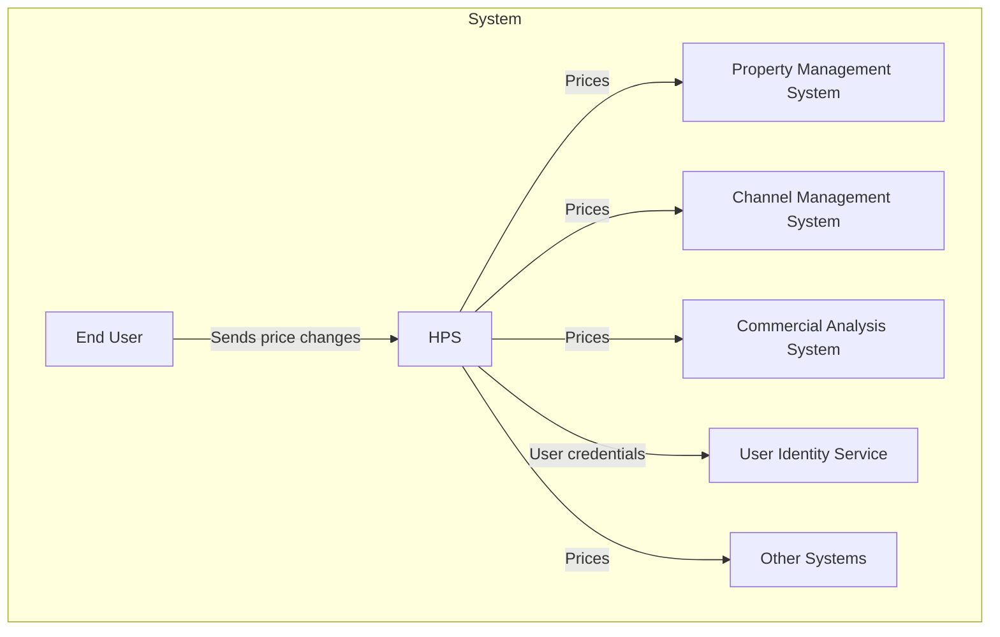
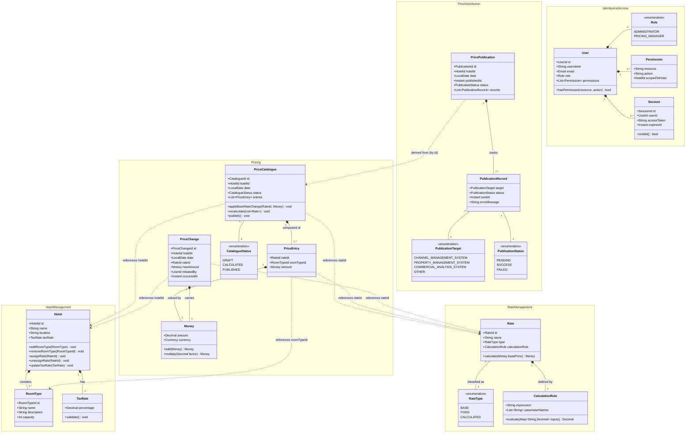
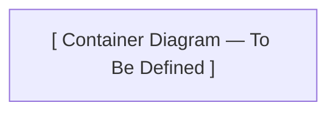

# Hotel Pricing System — Architecture Document

**Author:** Neo (Software Architect)  
**Process:** Attribute-Driven Design (ADD)  
**Version:** 0.1 (skeleton)  
**Date:** 2026-05-23

---

## Table of Contents

1. [Introduction](#1-introduction)
2. [Context Diagram](#2-context-diagram)
3. [Architectural Drivers](#3-architectural-drivers)
4. [Domain Model](#4-domain-model)
5. [Container Diagram](#5-container-diagram)
6. [Component Diagrams](#6-component-diagrams)
7. [Sequence Diagrams](#7-sequence-diagrams)
8. [Interfaces](#8-interfaces)
9. [Design Decisions](#9-design-decisions)

---

## 1. Introduction

This document describes the software architecture of the **Hotel Pricing System (HPS)** for AD&D Hotels. Its purpose is to serve as the authoritative reference for all architectural decisions, component structures, and their interactions, as they evolve through the design process.

The document follows the **Attribute-Driven Design (ADD)** process, which grounds every architectural decision in explicit, prioritised drivers: functional requirements (user stories), quality attribute scenarios, constraints, and concerns. The architecture is realised as a **microservices system** deployed on cloud infrastructure, and is visualised using the **C4 model** (Context → Container → Component) to provide layered views suitable for different audiences.

The document is structured as follows:

- **Context Diagram** — positions the HPS within the broader AD&D Hotels IT landscape, showing external actors and systems.
- **Architectural Drivers** — the complete, prioritised set of requirements that shape the architecture.
- **Domain Model** — a Domain-Driven Design (DDD) model of the business concepts that the system must represent and manage.
- **Container Diagram** — the high-level decomposition of the system into independently deployable units (microservices, databases, frontends, message brokers).
- **Component Diagrams** — for each container, a finer-grained view of its internal components and their responsibilities.
- **Sequence Diagrams** — end-to-end interaction flows for the key use cases and quality attribute scenarios.
- **Interfaces** — formal contracts (API schemas, event schemas) exposed by each container.
- **Design Decisions** — a structured record of the significant architectural decisions made, the rationale behind them, and the alternatives that were considered and discarded.

This is a living document. It will be updated at the end of each design iteration as new decisions are made and new views are elaborated.

---

## 2. Context Diagram

The diagram below shows the **Hotel Pricing System (HPS)** in its operational environment. The HPS is the central system responsible for managing and distributing hotel room prices within the AD&D Hotels IT landscape. It receives price change instructions from end users through a web interface and distributes the resulting computed prices to a set of downstream systems: the Property Management System (PMS), the Channel Management System (CMS), and the Commercial Analysis System (CAS). User authentication is delegated to an external User Identity Service. The diagram makes clear which systems are inside the scope of the HPS and which are external dependencies whose interfaces the HPS must respect.



---

## 3. Architectural Drivers

The architectural drivers are the requirements and constraints that directly influence the structure of the system. They are organised into four categories: user stories, quality attribute scenarios, constraints, and architectural concerns. Each driver is assigned a priority (High, Medium, or Low) that guides the order in which architectural decisions are made during the ADD iterations.

### 3.1 User Stories

| ID | Description | Priority |
|----|-------------|----------|
| HPS-1 | **Log In:** A user provides credentials in a login window. The system checks these credentials against a user identity service and, if successful, provides access to the system. | Medium |
| HPS-2 | **Change Prices:** A user selects a specific hotel and dates to make price changes to base or fixed rates. All calculated rates are updated, and changes are pushed to the Channel Management System. | High |
| HPS-3 | **Query Prices:** A user or external system queries prices for a given hotel through the user interface or a query API. | High |
| HPS-4 | **Manage Hotels:** An administrator adds, changes, or modifies hotel information, including tax rates, available rates, and room types. | High |
| HPS-5 | **Manage Rates:** An administrator adds, changes, or modifies rates, including defining calculation business rules. | Medium |
| HPS-6 | **Manage Users:** An administrator changes permissions for a given user. | Medium |

### 3.2 Quality Attribute Scenarios

| ID | Quality Attribute | Scenario | Priority |
|----|------------------|----------|----------|
| QA-1 | Performance | A base rate price is changed for a specific hotel and date during normal operation; the prices for all rates and room types for the hotel are published (ready for query) in less than 100 ms. | High |
| QA-2 | Reliability | A user performs multiple price changes on a given hotel. 100% of the price changes are published (available for query) successfully and are also received by the channel management system. | High |
| QA-3 | Availability | Pricing query uptime SLA must be 99.9% outside of maintenance windows. | High |
| QA-4 | Scalability | The system will initially support a minimum of 100,000 price queries per day through its API and should be capable of handling up to 1,000,000 without decreasing average latency by more than 20%. | High |
| QA-5 | Security | A user logs into the system through the front-end. The credentials of the user are validated against the User Identity Service and, once logged in, they are presented with only the functions that they are authorised to use. | High |
| QA-6 | Modifiability | Support for a price query endpoint with a different protocol than REST (e.g. gRPC) is added to the system. The new endpoint does not require changes to be made to the core components of the system. | Medium |
| QA-7 | Deployability | The application is moved between non-production environments as part of the development process. No changes in the code are needed. | Medium |
| QA-8 | Monitorability | A system operator wishes to measure the performance and reliability of price publication during operation. The system provides a mechanism that allows 100% of these measures to be collected as needed. | Medium |
| QA-9 | Testability | 100% of the system and its elements should support integration testing independently of the external systems. | Medium |

### 3.3 Constraints

| ID | Constraint |
|----|------------|
| CON-1 | Users must interact with the system through a web browser on different platforms (Windows, OSX, Linux) and different devices. |
| CON-2 | Manage users through a cloud provider identity service and host resources in the cloud. |
| CON-3 | Code must be hosted on a proprietary Git-based platform already in use by other projects in the company. |
| CON-4 | The initial release must be delivered in 6 months; an MVP must be demonstrated to internal stakeholders within 2 months. |
| CON-5 | The system must interact initially with existing systems through REST APIs but may need to support other protocols later. |
| CON-6 | A cloud-native approach should be favoured when designing the system. |

### 3.4 Architectural Concerns

| ID | Concern |
|----|---------|
| CRN-1 | Establish an overall initial system structure. |
| CRN-2 | Leverage the team's knowledge about Java technologies and the Angular framework. |
| CRN-3 | Allocate work to members of the development team. |
| CRN-4 | Avoid introducing technical debt. |
| CRN-5 | Set up a continuous deployment infrastructure. |

---

## 4. Domain Model

The domain model is based on Domain-Driven Design (DDD) and identifies the bounded contexts, aggregates, entities, value objects, and domain events that form the conceptual foundation of the system. Each bounded context corresponds to a future microservice in the target architecture. Full details, including element descriptions and design rationale, are maintained in the companion document [`DomainModel.md`](./DomainModel.md). The class diagram and element table below are reproduced here for completeness.

### 4.1 Bounded Contexts

| Bounded Context | Type | Description |
|---|---|---|
| **Hotel Management** | Supporting Domain | Manages hotel master data: room types, tax rates, and rate assignments. |
| **Rate Management** | Supporting Domain | Defines rate types and the calculation rules that derive prices from base rates. |
| **Pricing** | Core Domain | Owns the price lifecycle: records changes, triggers recalculation, and stores the current price catalogue per hotel and date. |
| **Price Distribution** | Supporting Domain | Publishes the computed price catalogue to downstream systems (CMS, PMS, CAS, etc.) and exposes the query API. |
| **Identity & Access** | Generic Subdomain | Authenticates users against the external User Identity Service and enforces permission-based access control. |

### 4.2 Class Diagram



### 4.3 Element Descriptions

| Element | Context | Kind | Description |
|---|---|---|---|
| **Hotel** | Hotel Management | Aggregate Root | Central master-data entity for a hotel property. Owns its room types and tax rate. |
| **RoomType** | Hotel Management | Entity | A named category of room within a hotel (e.g., Standard, Suite). |
| **TaxRate** | Hotel Management | Value Object | An immutable percentage applied to room prices. Validated to be in [0, 100]. |
| **Rate** | Rate Management | Aggregate Root | Defines a named pricing rule and its type. A `CALCULATED` rate owns a `CalculationRule`. |
| **RateType** | Rate Management | Enumeration | `BASE`, `FIXED`, or `CALCULATED`. |
| **CalculationRule** | Rate Management | Value Object | An immutable expression and its parameter names used to derive a calculated price. |
| **PriceCatalogue** | Pricing | Aggregate Root | Authoritative price state for one hotel on one date. Only entity allowed to mutate prices. |
| **PriceEntry** | Pricing | Entity | A single computed price for one rate / room-type combination. |
| **PriceChange** | Pricing | Aggregate | A user-initiated command record that triggers recalculation. Also serves as audit log. |
| **CatalogueStatus** | Pricing | Enumeration | `DRAFT` → `CALCULATED` → `PUBLISHED`. |
| **Money** | Pricing | Value Object | Immutable `(amount, currency)` pair supporting financial arithmetic. |
| **PricePublication** | Price Distribution | Aggregate Root | Tracks the full delivery lifecycle of a published catalogue to all downstream targets. |
| **PublicationRecord** | Price Distribution | Entity | Per-target delivery attempt with status and error details. |
| **PublicationTarget** | Price Distribution | Enumeration | `CHANNEL_MANAGEMENT_SYSTEM`, `PROPERTY_MANAGEMENT_SYSTEM`, `COMMERCIAL_ANALYSIS_SYSTEM`, `OTHER`. |
| **PublicationStatus** | Price Distribution | Enumeration | `PENDING`, `SUCCESS`, `FAILED`. |
| **User** | Identity & Access | Aggregate Root | Authenticated principal with role and hotel-scoped permissions. |
| **Role** | Identity & Access | Enumeration | `ADMINISTRATOR` or `PRICING_MANAGER`. |
| **Permission** | Identity & Access | Value Object | Immutable `(resource, action, optional hotelId)` access grant. |
| **Session** | Identity & Access | Entity | Time-bounded, token-backed user session. |

---

## 5. Container Diagram

The container diagram presents the second level of the C4 model. It decomposes the Hotel Pricing System into its major **containers** — independently deployable units that collaborate to deliver the system's capabilities. Each container maps to one bounded context from the domain model and runs as a separate microservice (or infrastructure component) in the cloud environment. The diagram shows how containers interact with each other, with the end user, and with external systems. It provides the primary blueprint used by development teams to partition work and by operations to plan deployment topology.



### 5.1 Container Responsibilities

| Container | Technology (indicative) | Responsibilities |
|---|---|---|
| _To be defined_ | | |

---

## 6. Component Diagrams

For each container identified in Section 5 that the development team will build, a dedicated subsection will be added to this chapter containing a **component diagram**. Component diagrams represent the third level of the C4 model and detail the internal structure of a container — the major classes, modules, or services within it and the way they collaborate to fulfil the container's responsibilities.

Each component diagram will be accompanied by a table listing every component with its name and a description of its responsibility. Component diagrams will be elaborated progressively, one container at a time, as design iterations are completed.

---

## 7. Sequence Diagrams

For each user story and quality attribute scenario addressed in the iteration plan, a sequence diagram is provided in a dedicated subsection below. Sequence diagrams show the end-to-end interactions between containers and external actors required to satisfy a specific driver. They are the primary tool for validating that the container decomposition and the interface contracts are sufficient to meet both functional and quality requirements.

> **Note:** Subsections are derived from the drivers listed in `IterationPlan.md`. The diagrams below are scaffolded and will be filled in as each iteration is completed.

---

### 7.1 HPS-1 — Log In

```mermaid
sequenceDiagram
    %% To be defined
```

---

### 7.2 HPS-2 — Change Prices

```mermaid
sequenceDiagram
    %% To be defined
```

---

### 7.3 HPS-3 — Query Prices

```mermaid
sequenceDiagram
    %% To be defined
```

---

### 7.4 HPS-4 — Manage Hotels

```mermaid
sequenceDiagram
    %% To be defined
```

---

### 7.5 HPS-5 — Manage Rates

```mermaid
sequenceDiagram
    %% To be defined
```

---

### 7.6 HPS-6 — Manage Users

```mermaid
sequenceDiagram
    %% To be defined
```

---

### 7.7 QA-1 — Performance: Price Publication Under 100 ms

```mermaid
sequenceDiagram
    %% To be defined
```

---

### 7.8 QA-2 — Reliability: 100% Price Change Delivery

```mermaid
sequenceDiagram
    %% To be defined
```

---

### 7.9 QA-3 — Availability: 99.9% Query Uptime

```mermaid
sequenceDiagram
    %% To be defined
```

---

### 7.10 QA-4 — Scalability: Up to 1,000,000 Queries/Day

```mermaid
sequenceDiagram
    %% To be defined
```

---

### 7.11 QA-5 — Security: Credential Validation and Role-Based Access

```mermaid
sequenceDiagram
    %% To be defined
```

---

### 7.12 QA-6 — Modifiability: Adding a New Query Protocol

```mermaid
sequenceDiagram
    %% To be defined
```

---

### 7.13 QA-7 — Deployability: Environment Portability Without Code Changes

```mermaid
sequenceDiagram
    %% To be defined
```

---

### 7.14 QA-8 — Monitorability: Collecting Price Publication Metrics

```mermaid
sequenceDiagram
    %% To be defined
```

---

### 7.15 QA-9 — Testability: Integration Testing Without External Systems

```mermaid
sequenceDiagram
    %% To be defined
```

---

## 8. Interfaces

_This section will document the formal contracts — REST API schemas, event schemas, and any other protocol-level specifications — exposed by each container. To be defined in subsequent design iterations._

---

## 9. Design Decisions

The table below records the significant architectural decisions made during the ADD process. Each entry links the decision back to the driver(s) that motivated it, states the chosen approach, explains the rationale, and notes alternatives that were considered but discarded.

| Driver(s) | Decision | Rationale | Discarded Alternative(s) |
|---|---|---|---|
| | | | |
