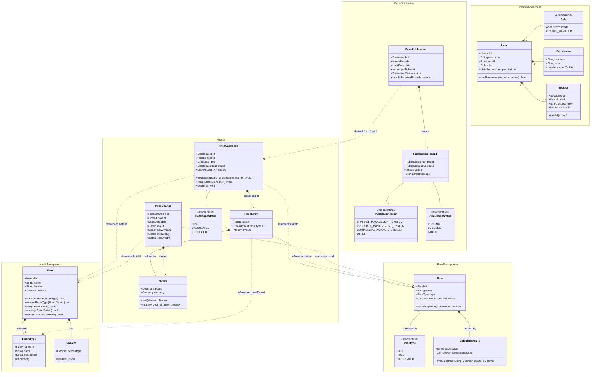

# Hotel Pricing System — Domain Model

**Author:** Neo (Software Architect)  
**Process:** Attribute-Driven Design (ADD)  
**Approach:** Domain-Driven Design (DDD)  
**Date:** 2026-05-23

---

## 1. Bounded Contexts

The domain is decomposed into five bounded contexts that will map directly to microservices in the target architecture. Each context owns its data and communicates with others through well-defined domain events or APIs.

| Bounded Context | Type | Description |
|---|---|---|
| **Hotel Management** | Supporting Domain | Manages hotel master data: room types, tax rates, and rate assignments. |
| **Rate Management** | Supporting Domain | Defines rate types and the calculation rules that derive prices from base rates. |
| **Pricing** | Core Domain | Owns the price lifecycle: records changes, triggers recalculation, and stores the current price catalogue per hotel and date. |
| **Price Distribution** | Supporting Domain | Publishes the computed price catalogue to downstream systems (CMS, PMS, CAS, etc.) and exposes the query API. |
| **Identity & Access** | Generic Subdomain | Authenticates users against the external User Identity Service and enforces permission-based access control. |

---

## 2. Class Diagram

---

## 3. Element Descriptions

### Aggregates and Aggregate Roots

| Element | Context | Kind | Description |
|---|---|---|---|
| **Hotel** | Hotel Management | Aggregate Root | Central master-data entity for a hotel property. Owns its room types and tax rate. Enforces the invariant that a hotel must have at least one room type. Changes to hotel configuration raise a `HotelConfigurationChanged` domain event. |
| **Rate** | Rate Management | Aggregate Root | Defines a named pricing rule. Enforces the invariant that a `CALCULATED` rate must have a non-null `CalculationRule`, while a `BASE` or `FIXED` rate must not. Changes raise a `RateDefinitionChanged` event. |
| **PriceCatalogue** | Pricing | Aggregate Root | The authoritative price state for a specific hotel on a specific date. It is the only place prices are mutated. Transitioning to `PUBLISHED` status raises the `PricesPublished` domain event consumed by the Price Distribution context. |
| **PriceChange** | Pricing | Aggregate (command record) | Represents a user-initiated instruction to change a base or fixed rate price. Acts as an audit record and the trigger for recalculation. Raises `BaseRateChanged`. |
| **PricePublication** | Price Distribution | Aggregate Root | Tracks the lifecycle of distributing a published price catalogue to all downstream systems. Each `PublicationRecord` captures the outcome per target system, satisfying QA-2 (100% delivery guarantee). |
| **User** | Identity & Access | Aggregate Root | Represents an authenticated principal. Permissions are scoped optionally to a specific hotel to satisfy QA-5 (role-based access). Delegates credential validation to the external User Identity Service. |

### Entities

| Element | Context | Kind | Description |
|---|---|---|---|
| **RoomType** | Hotel Management | Entity | A named category of room within a hotel (e.g., Standard, Suite). Identified within the Hotel aggregate. |
| **PriceEntry** | Pricing | Entity | A single price line within a `PriceCatalogue`, representing the computed price for one rate/room-type combination on a given date. |
| **PublicationRecord** | Price Distribution | Entity | A per-target delivery attempt record within a `PricePublication`. Stores status and error details to enable monitoring (QA-8). |
| **Session** | Identity & Access | Entity | A validated, time-bounded user session backed by an access token issued after successful authentication against the User Identity Service. |

### Value Objects

| Element | Context | Kind | Description |
|---|---|---|---|
| **TaxRate** | Hotel Management | Value Object | An immutable percentage value applied to room prices. Validated to be in range [0, 100]. |
| **CalculationRule** | Rate Management | Value Object | An immutable expression (e.g., a formula string) plus its named parameters used to derive a calculated rate from a base price. Evaluated by the Pricing engine. |
| **Money** | Pricing | Value Object | An immutable pair of `(amount, currency)`. Supports addition and scalar multiplication. Currency mismatch raises a domain error. Satisfies precision requirements for financial data. |
| **Permission** | Identity & Access | Value Object | An immutable tuple of `(resource, action, optional hotelId)` that grants a user the right to perform a specific action on a resource, optionally scoped to one hotel. |
| **Email** | Identity & Access | Value Object | Validated, immutable e-mail address. |

### Enumerations

| Element | Context | Description |
|---|---|---|
| **RateType** | Rate Management | `BASE` — primary price set directly; `FIXED` — hardcoded amount; `CALCULATED` — derived via a `CalculationRule`. |
| **CatalogueStatus** | Pricing | Lifecycle state of a `PriceCatalogue`: `DRAFT` (being edited) → `CALCULATED` (all rates computed) → `PUBLISHED` (pushed downstream). |
| **PublicationStatus** | Price Distribution | Per-record delivery state: `PENDING`, `SUCCESS`, `FAILED`. |
| **PublicationTarget** | Price Distribution | Identifies a downstream consumer: `CHANNEL_MANAGEMENT_SYSTEM`, `PROPERTY_MANAGEMENT_SYSTEM`, `COMMERCIAL_ANALYSIS_SYSTEM`, `OTHER`. |
| **Role** | Identity & Access | `ADMINISTRATOR` (full access, manages hotels/rates/users), `PRICING_MANAGER` (hotel-scoped price changes). |

### Domain Events

| Event | Raised By | Consumed By | Description |
|---|---|---|---|
| **BaseRateChanged** | `PriceChange` (Pricing) | `PriceCatalogue` (Pricing) | Signals that a base or fixed rate has been given a new value for a hotel/date. Triggers price recalculation. |
| **PricesCalculated** | `PriceCatalogue` (Pricing) | `PriceCatalogue` (Pricing) | All derived rates have been computed. Catalogue transitions to `CALCULATED`. |
| **PricesPublished** | `PriceCatalogue` (Pricing) | Price Distribution BC | Signals that a catalogue is ready for distribution. The Price Distribution context subscribes to this event to initiate delivery to downstream systems. |
| **HotelConfigurationChanged** | `Hotel` (Hotel Management) | Pricing BC | Signals that hotel metadata (e.g., tax rate, room types) has changed. Pricing must invalidate or recalculate affected catalogues. |
| **RateDefinitionChanged** | `Rate` (Rate Management) | Pricing BC | Signals that a rate's calculation rule has changed. Pricing must recalculate affected catalogues. |
| **UserLoggedIn** | `Session` (Identity & Access) | Audit / Monitoring | Signals a successful authentication. Enables audit trail and security monitoring. |

---

## 4. Key Design Decisions

| Decision | Rationale |
|---|---|
| `PriceCatalogue` as a single aggregate per hotel/date | Enforces consistency of all price entries for a given context. Keeps the transaction boundary tight, supporting QA-1 (sub-100 ms recalculation within one aggregate). |
| Cross-context references by ID only | Bounded contexts remain independently deployable (microservices). No shared object graph across contexts, satisfying QA-6, QA-7, and QA-9. |
| Domain events as the integration mechanism | Asynchronous decoupling between Pricing and Price Distribution supports QA-2 (guaranteed delivery via durable event bus), QA-3 (availability), and QA-4 (scalability). |
| `PublicationRecord` per target | Provides fine-grained delivery tracking to satisfy QA-2 (100% delivery) and QA-8 (monitorability). |
| Permission scoped to optional `HotelId` | Enables hotel-level multi-tenancy without a dedicated tenancy mechanism, satisfying QA-5. |
| `CalculationRule` as a Value Object | Immutability ensures that a rate change always produces a new rule version, preventing silent price drift. |
