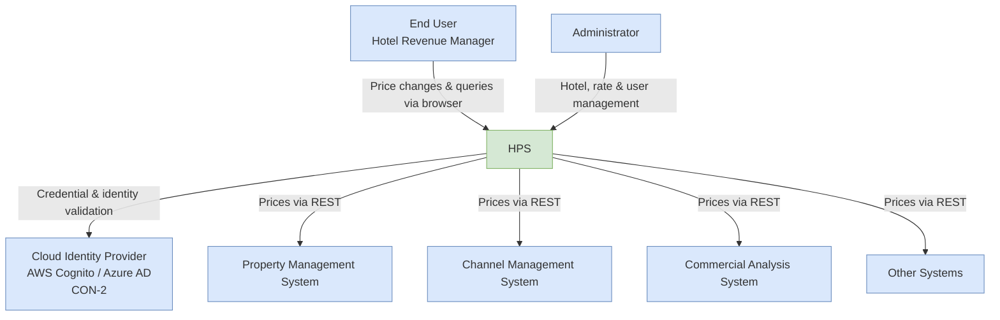
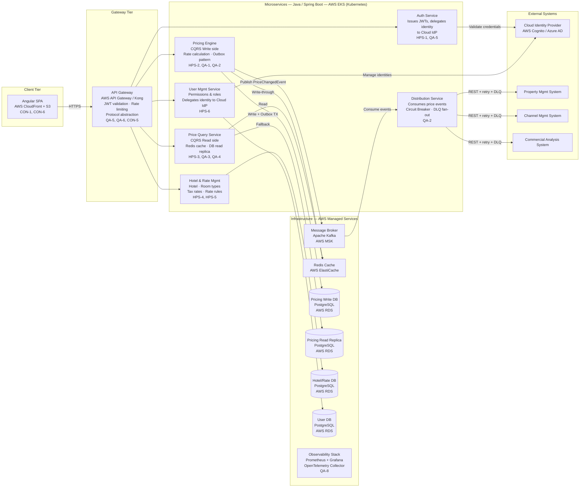
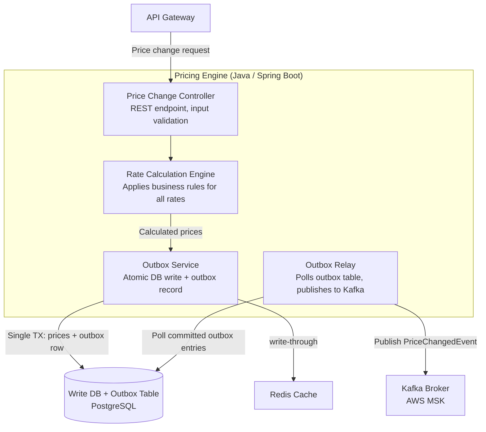
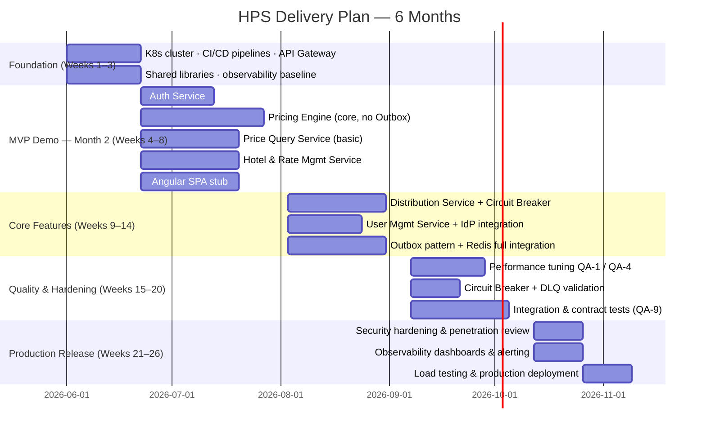

# Hotel Pricing System — Microservices Architecture

**AD&D Hotels · Designed by Neo, Software Architect · May 2026**

---

## 1. Introduction

This document describes the microservices-based architecture of the Hotel Pricing System (HPS) for AD&D Hotels. It is structured around the C4 model and the Attribute-Driven Design (ADD) process, and directly maps every architectural decision to the quality attributes, user stories, and constraints defined in the requirements. The architecture prioritises **reliability, performance, and long-term maintainability**, while remaining achievable within the project's real-world constraints.

---

## 2. System Context (C4 Level 1)

The diagram below places the HPS within its external environment. The system acts as the authoritative price-management hub: it receives mutations from internal users, stores and calculates all rates, and distributes the results to downstream consumers.

---

## 3. Container Diagram (C4 Level 2)

The system is decomposed into **six microservices** and one managed API Gateway, fronted by an Angular SPA served from a CDN. Each microservice owns its own database (database-per-service pattern). Asynchronous communication is handled exclusively through the Message Broker.

---

## 4. Component Diagram — Pricing Engine (C4 Level 3)

The Pricing Engine is the most complex service. Its internal structure is shown below.

---

## 5. Microservices Catalogue

| Service | Responsibility | Key Pattern | Technology | User Stories |
|---|---|---|---|---|
| API Gateway *(managed)* | Single entry point: request routing, JWT enforcement, rate limiting, protocol abstraction | Gateway Pattern | AWS API Gateway / Kong | All |
| Auth Service | JWT issuance; delegates credential check to Cloud Identity Provider | Delegated Authentication | Java / Spring Security / JWT | HPS-1 |
| Pricing Engine | Accepts price changes, executes rate calculation for all derived prices, guarantees event publication | CQRS Write + Outbox | Java / Spring Boot / Kafka Producer | HPS-2 |
| Price Query Service | Serves high-volume read queries from Redis cache with DB read-replica fallback | CQRS Read + Cache-Aside | Java / Spring Boot / Redis | HPS-3 |
| Hotel & Rate Mgmt | CRUD for hotels, room types, tax rates, rate rules, and calculation business rules | CRUD + Domain Model | Java / Spring Boot / PostgreSQL | HPS-4, HPS-5 |
| User Mgmt Service | Manages user permissions and role assignments; delegates identity to Cloud IdP | Thin Façade | Java / Spring Boot | HPS-6 |
| Distribution Service | Consumes price events from Kafka; fans out to PMS, CMS, and Commercial Analysis with circuit breaker and DLQ | Event Consumer + Circuit Breaker | Java / Spring Boot / Kafka Consumer / Resilience4J | HPS-2 |

---

## 6. Quality Attribute → Architectural Decision Mapping

| ID | Quality Attribute | Target | Architectural Decision | Mechanism |
|---|---|---|---|---|
| QA-1 | Performance | Price publication < 100 ms | CQRS write path + Redis write-through | Pricing Engine calculates rates, writes to Redis and DB atomically, returns before async Kafka event completes |
| QA-2 | Reliability | 100% delivery of price changes | Outbox Pattern + DLQ | Price and outbox record written in one DB transaction; relay publishes to Kafka; Distribution uses retry with DLQ |
| QA-3 | Availability | 99.9% query uptime | CQRS read replica + Redis cache | Query Service reads from Redis; falls back to RDS read replica; independently scaled on K8s |
| QA-4 | Scalability | 100K → 1M queries/day (≤20% latency increase) | Stateless read pods + Redis cache layer | Query Service scales horizontally via K8s HPA; Redis absorbs spikes |
| QA-5 | Security | Auth + RBAC via Cloud IdP | JWT + role claims | Auth Service issues JWT with role claims; API Gateway validates token on every request |
| QA-6 | Modifiability | New protocol (e.g. gRPC) without core changes | API Gateway adapter pattern | New listener added at Gateway layer; all downstream services remain unchanged (REST internally) |
| QA-7 | Deployability | Zero code changes across environments | K8s ConfigMaps + Secrets | All environment-specific config externalised; same container image promoted across envs |
| QA-8 | Monitorability | 100% metrics collectible | Prometheus + structured logging + tracing | Every service exposes `/actuator/prometheus`; OpenTelemetry collector aggregates traces; Grafana dashboards |
| QA-9 | Testability | 100% independent integration testing | Test doubles + contract tests | WireMock for CMS/PMS/IdP; Testcontainers for Kafka/Redis/Postgres; Pact for consumer-driven contracts |

---

## 7. Key Architectural Patterns

### 7.1 CQRS — Separating Write from Read

The Pricing Engine owns all price mutation logic (write side). Results are persisted to the write database, pushed to the Redis cache, and an event is published to the Message Broker. The Price Query Service (read side) serves all incoming queries exclusively from Redis, falling back to a PostgreSQL read replica. This separation allows each path to scale independently and guarantees that the < 100 ms publication target (QA-1) is met independently of query load (QA-4).

### 7.2 Outbox Pattern — Guaranteed Event Delivery (QA-2)

The Pricing Engine writes the calculated price records and an outbox event row within a **single database transaction**. A lightweight outbox relay process polls committed rows and publishes them to Kafka. This guarantees at-least-once delivery to the Distribution Service even when the broker is temporarily unavailable. No price change can be persisted without its corresponding event eventually reaching the broker.

### 7.3 API Gateway — Protocol Abstraction (QA-6)

The API Gateway is the sole entry point for all client and external traffic. It handles JWT validation, rate limiting, and request routing. Supporting a new protocol (e.g. gRPC) requires only adding a new listener/adapter at the Gateway layer — all downstream microservices continue communicating over internal REST without modification, satisfying QA-6 at zero internal cost.

### 7.4 Circuit Breaker + DLQ — Distribution Resilience (QA-2)

The Distribution Service applies a Resilience4J circuit breaker around each external system call (PMS, CMS, CAS). Failed deliveries are retried with exponential back-off. Payloads that exhaust all retries are written to a Dead Letter Queue (DLQ) for manual inspection and replay. A single external system failure cannot cascade to other systems or cause price changes to be lost.

### 7.5 Database-per-Service (Loose Coupling)

Each microservice owns an isolated PostgreSQL database. Cross-service queries are prohibited; services share data only through well-defined API contracts or asynchronous events. This eliminates shared-schema coupling and enables independent deployment and schema evolution for each service.

---

## 8. Infrastructure Overview

| Component | Technology | Purpose | Constraint / QA |
|---|---|---|---|
| Container Orchestration | Kubernetes — AWS EKS | Service deployment, auto-scaling, health management | QA-3, QA-4, QA-7, CON-6 |
| Message Broker | Apache Kafka — AWS MSK | Async event bus for price events and distribution fan-out | QA-2 |
| Cache | Redis — AWS ElastiCache | Sub-millisecond price reads; absorbs query spikes | QA-1, QA-4 |
| Relational DB | PostgreSQL — AWS RDS | Per-service databases; Multi-AZ for HA; read replicas for query path | QA-2, QA-3 |
| API Gateway | AWS API Gateway / Kong | Protocol abstraction, JWT enforcement, rate limiting | QA-5, QA-6, CON-5 |
| Identity Provider | AWS Cognito / Azure AD | User authentication and role-based identity | CON-2 |
| CI/CD | GitLab CI (existing platform) | Automated build, test, and promote pipelines | CON-3, QA-7, CRN-5 |
| Observability | Prometheus + Grafana + OpenTelemetry | Metrics, structured logs, distributed tracing | QA-8 |
| Frontend Hosting | AWS CloudFront + S3 | Angular SPA static hosting with global CDN | CON-1, QA-3 |
| Container Registry | AWS ECR | Docker image storage and promotion | QA-7 |

---

## 9. Feasibility Assessment

### 9.1 Initial Ideal Architecture (Unconstrained)

In an unconstrained scenario, the ideal architecture would include:

- 9 distinct microservices (splitting Hotel Mgmt, Rate Mgmt, and Auth into finer-grained services)
- A service mesh (Istio) for mTLS, traffic shaping, and service-level observability
- A Backend-for-Frontend (BFF) layer to tailor API responses for the SPA
- A dedicated monitoring microservice for custom telemetry aggregation
- A separate Notification Service for alerting on DLQ events

### 9.2 Feasibility Verdict

> **The unconstrained ideal architecture exceeds the given constraints. The adjusted architecture described in this document is feasible.**

Deploying 9 services with Istio and a BFF layer would demand approximately 70–80 developer-months. The team has 60 developer-months available (10 developers × 6 months). Additionally, Istio introduces 2–3 months of operational ramp-up that would jeopardise both the 2-month MVP demo (CON-4) and the 6-month release.

### 9.3 Budget Breakdown (~$500,000)

| Category | Estimate | Notes |
|---|---|---|
| Engineering salaries (10 devs × 6 months) | $360,000 | Average $60k/year × 10 × 0.5 |
| AWS Infrastructure (EKS, RDS Multi-AZ, MSK, ElastiCache, API GW, CloudFront) | $72,000 | ~$12,000/month |
| Tooling & licences (Grafana Cloud, GitLab, security scanning) | $18,000 | ~$3,000/month |
| Contingency / overhead | $50,000 | 10% buffer |
| **Total** | **$500,000** | At budget cap — no margin for scope creep |

### 9.4 Team Allocation (10 Developers)

| Role | Devs | Primary Responsibility |
|---|---|---|
| Pricing Engine Lead (×2) | 2 | Pricing Engine — CQRS write, rate calculation, Outbox, Kafka |
| Query & Cache Engineer | 1 | Price Query Service + Redis integration + read replica |
| Hotel & Rate Engineer | 1 | Hotel & Rate Management Service |
| Distribution Engineer | 1 | Distribution Service + Circuit Breaker + DLQ |
| Auth & Gateway Engineer | 1 | Auth Service + API Gateway configuration + JWT |
| User Mgmt / Thin Services | 1 | User Management Service + Cloud IdP integration |
| Frontend Engineer | 1 | Angular SPA (CON-1, CRN-2) |
| DevOps / Infrastructure | 1 | EKS cluster, CI/CD pipelines, Prometheus, OpenTelemetry |
| QA / Integration Testing | 1 | Integration tests, Testcontainers, Pact contracts (QA-9) |

---

## 10. Adjustments from Ideal to Feasible Architecture

| Ideal (Unconstrained) | Adjusted (Feasible) | Rationale |
|---|---|---|
| Hotel Management Service + Rate Management Service (separate) | Hotel & Rate Management Service (merged) | Same bounded context; saves 1 service, 1 team assignment, and cross-service coordination overhead |
| Service mesh (Istio) for inter-service mTLS + observability | K8s-native ingress + OpenTelemetry sidecar | Istio adds 2–3 months of operational complexity; unacceptable given CON-4 |
| Custom monitoring microservice | Managed Prometheus + Grafana on K8s | Cloud-native stack fully satisfies QA-8 at significantly lower cost and effort |
| 9 microservices | 6 microservices + 1 managed API Gateway | Reduces inter-team coordination overhead; fits team capacity without quality compromise |
| Backend-for-Frontend (BFF) layer | Angular SPA calls API Gateway directly | BFF adds sprint overhead not justified at this team size and SPA complexity |
| Dedicated Notification Service | DLQ alerts via CloudWatch Alarms + SNS | Achieves QA-8 alerting requirements without an additional service to build and maintain |

The adjustments preserve **100% coverage of all QA scenarios and user stories**. No functional requirement is degraded. Scalability and reliability targets are fully maintained through the retained CQRS, Outbox, Circuit Breaker, and Redis caching patterns.

---

## 11. Delivery Plan

---

## 12. Architectural Risks

| Risk | Likelihood | Impact | Mitigation |
|---|---|---|---|
| Kafka operational complexity for a team new to event streaming | Medium | High | Use AWS MSK (managed); provide team training in Month 1 |
| Budget overrun — no margin for scope creep | High | High | Strict backlog prioritisation; freeze non-MVP scope until Month 3 |
| Redis cache invalidation bugs causing stale prices | Medium | High | Price writes always go through Pricing Engine; Redis key TTL as safety net |
| External system (CMS/PMS) unavailability causing DLQ backlog | Medium | Medium | Circuit Breaker + DLQ + CloudWatch alerts; define SLA with external system owners |
| 2-month MVP timeline pressure causing technical debt (CRN-4) | High | Medium | MVP excludes Outbox and full CQRS; architecture is written for the full system; no shortcuts to core design |

---

*Architecture authored by Neo, Software Architect · AD&D Hotels Hotel Pricing System · v1.0 · May 2026*
