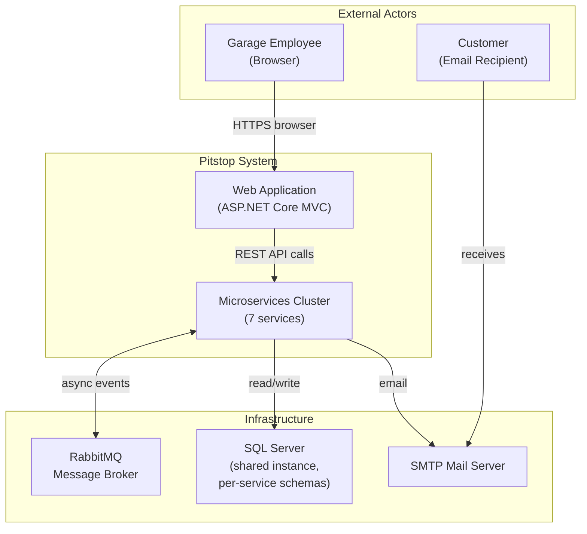
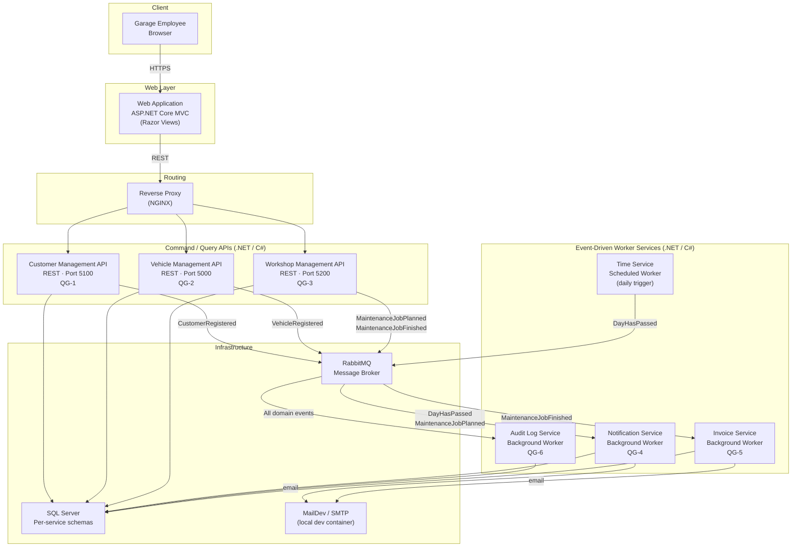
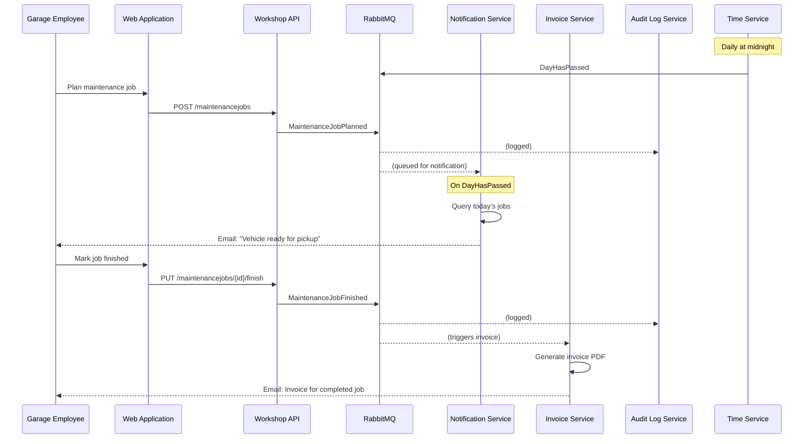
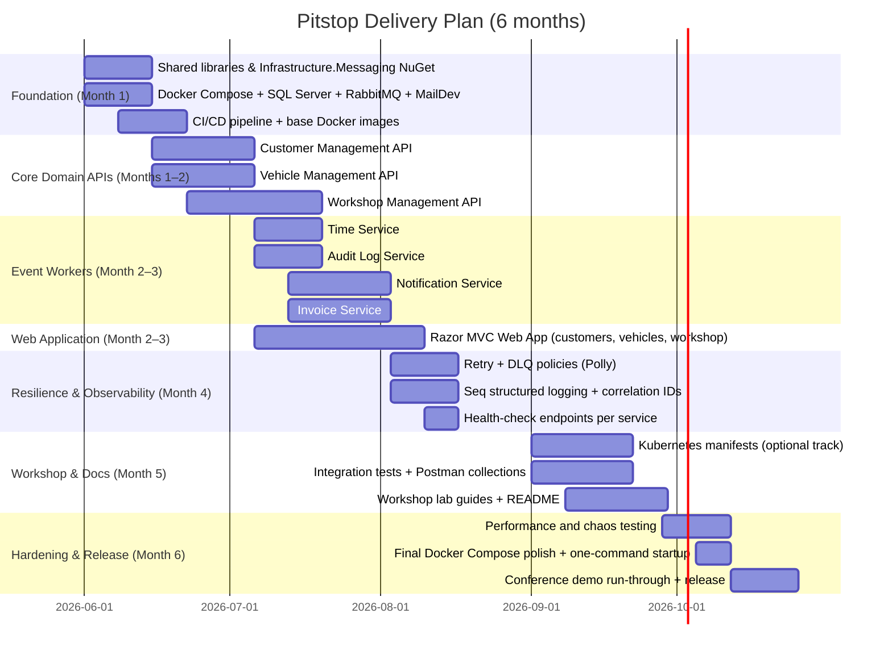

# Pitstop Garage Management System — Microservices Architecture

**Designed by Neo, Software Architect · May 2026**

---

## 1. Overview

Pitstop is a **Garage Management System** built as a cloud-native, event-driven microservices reference implementation for .NET developers. The architecture is partitioned into **seven focused microservices** communicating exclusively through asynchronous events over RabbitMQ, with a single Web Application acting as the only synchronous API consumer. The design demonstrates **Domain-Driven Design (DDD)**, **event-driven architecture**, and **autonomous service decomposition** in a way that is locally runnable via Docker Compose and deployable to Kubernetes.

The primary architectural quality goals — learnability, demonstrability, autonomy, and resilience — drive every structural decision.

---

## 2. System Context Diagram (C4 Level 1)

---

## 3. Container Diagram (C4 Level 2)

---

## 4. Event Flow Diagram

---

## 5. Microservices Catalog

| Service | Type | Responsibility | Key Pattern | Port | Domain Events Published |
|---|---|---|---|---|---|
| **Web Application** | UI / API Consumer | Razor MVC front-end; only synchronous caller of APIs | MVC + REST Client | 7000 | — |
| **Reverse Proxy** | Infrastructure | Routes `/api/customers`, `/api/vehicles`, `/api/workshop` to respective services | Reverse Proxy | 80/443 | — |
| **Customer Management API** | REST API | Register and query customers; owns `Customer` aggregate | CRUD + Domain Events | 5100 | `CustomerRegistered` |
| **Vehicle Management API** | REST API | Register vehicles and associate them with customers | CRUD + Domain Events | 5000 | `VehicleRegistered` |
| **Workshop Management API** | REST API | Plan maintenance jobs; track job status (Planned → Finished) | CRUD + Domain Events | 5200 | `MaintenanceJobPlanned`, `MaintenanceJobFinished` |
| **Notification Service** | Worker | Subscribes to `DayHasPassed`; queries today's jobs; emails customers | Event Consumer + Polling Query | — | — |
| **Invoice Service** | Worker | Subscribes to `MaintenanceJobFinished`; generates and emails invoice | Event Consumer + Template Rendering | — | — |
| **Audit Log Service** | Worker | Subscribes to **all** domain events; persists them as an immutable audit trail | Event Consumer + Append-Only Store | — | — |
| **Time Service** | Scheduled Worker | Publishes `DayHasPassed` event once per day (configurable via cron) | Scheduled Publisher | — | `DayHasPassed` |

---

## 6. Domain Events Reference

| Event | Published By | Consumed By | Trigger |
|---|---|---|---|
| `CustomerRegistered` | Customer Management API | Audit Log Service | New customer POST |
| `VehicleRegistered` | Vehicle Management API | Audit Log Service | New vehicle POST |
| `MaintenanceJobPlanned` | Workshop Management API | Notification Service, Audit Log Service | Job creation |
| `MaintenanceJobFinished` | Workshop Management API | Invoice Service, Audit Log Service | Job status update |
| `DayHasPassed` | Time Service | Notification Service, Audit Log Service | Daily cron trigger |

All events flow through RabbitMQ topic exchanges. Each consumer binds its own durable queue, ensuring **autonomous** consumption and **at-least-once delivery**.

---

## 7. Quality Attribute → Architectural Decision Mapping

| Quality Goal | Scenario | Architectural Decision | Mechanism |
|---|---|---|---|
| **QG-1 Learnability** | .NET developer can trace a customer registration end-to-end in ≤ 1 hour | Clear bounded contexts; one service per domain aggregate; shared `IMessagePublisher` abstraction | Each service is a self-contained .NET project with explicit event contracts |
| **QG-2 Demonstrability** | System starts locally with `docker compose up` in under 3 minutes | Docker Compose file with all services + SQL Server + RabbitMQ + MailDev | All images are Linux-based; SQL migrations run at startup |
| **QG-3 Autonomy** | Customer API continues operating when Workshop API is down | No synchronous service-to-service calls; each service owns its own DB schema | Services communicate only via RabbitMQ; no shared DB tables |
| **QG-4 Resilience** | Notification Service retries on transient RabbitMQ failures | Retry policy + Dead Letter Queue per consumer queue | Polly retry policies wrap all message-handler invocations; undeliverable messages go to DLQ |
| **QG-5 Security** | Only authenticated garage employees can create/modify data | NGINX basic auth (dev) / JWT via API Gateway (prod) | Auth concern isolated to the proxy/gateway layer; services are internal-only |
| **QG-6 Observability** | All events are traceable after the fact | Audit Log Service records every domain event with correlation ID and timestamp | Append-only audit store; structured logging with Serilog / Seq |

---

## 8. Critical Architectural Patterns

### 8.1 Messaging Abstraction (`IMessagePublisher` / `IMessageHandler`)

No service directly references `RabbitMQ.Client`. All broker interaction is wrapped behind the `Infrastructure.Messaging` interfaces. This decouples business logic from broker technology, simplifies unit testing (mock the interface), and makes the educational code easier to read — the domain logic stays clean.

### 8.2 Autonomous Services via Separate DB Schemas

All services share a single SQL Server *instance* (simplification for local development), but each owns its own *schema*. The Workshop API never queries the Customer schema directly — it holds denormalised customer data copied from `CustomerRegistered` events. This enforces true data autonomy at the code level even when the physical database is shared.

### 8.3 Event-Driven Notification Pipeline

The Notification Service does not poll the Workshop API. Instead it:
1. Subscribes to `MaintenanceJobPlanned` and stores a local copy of upcoming jobs.
2. Subscribes to `DayHasPassed` and, on receipt, queries its **own** local store to find jobs scheduled for today.
3. Sends emails independently of the Workshop API's availability.

This demonstrates autonomy: the Workshop API can be down at midnight and notifications still go out.

### 8.4 Retry + Dead Letter Queue (Resilience)

Each RabbitMQ consumer queue has a corresponding Dead Letter Exchange. Polly retry policies (exponential back-off, 3 attempts) wrap every `IMessageHandler.HandleAsync` call. After exhausted retries, the message routes to the DLQ for operator inspection — no silent data loss.

### 8.5 Time Service as an Explicit Domain Event

Rather than embedding a cron job inside the Notification Service, a dedicated **Time Service** publishes `DayHasPassed`. This makes the temporal trigger explicit, auditable (the Audit Log Service records it), and independently testable — a test can publish a `DayHasPassed` event manually to trigger the notification pipeline without waiting for midnight.

---

## 9. Infrastructure Overview

| Component | Technology | Purpose | Quality Goal |
|---|---|---|---|
| Container Orchestration (local) | Docker Compose | Single-command local startup; all services + infra | QG-2 |
| Container Orchestration (cloud) | Kubernetes (optional) | Production/Kubernetes workshop track | QG-2 |
| Message Broker | RabbitMQ | Async event bus; topic exchanges + durable queues | QG-3, QG-4 |
| Relational Database | SQL Server 2022 (Linux container) | Per-service schemas; no cross-schema queries | QG-3 |
| Mail Server (dev) | MailDev (Docker) | Captures outgoing emails; viewable in browser | QG-2 |
| Logging / Tracing | Seq (free tier) | Structured log aggregation; correlation ID search | QG-6 |
| Reverse Proxy | NGINX | Routes traffic; basic auth for workshop demos | QG-5 |
| Messaging Abstraction | `Infrastructure.Messaging` NuGet | Hides RabbitMQ.Client; `IMessagePublisher` / `IMessageHandler` | QG-1 |

---

## 10. Feasibility Assessment

> **Verdict: Fully Feasible — no architectural adjustment required.** The scope is deliberately limited (create and read operations only, no update/delete), the technology stack is unified (.NET / C# throughout), and infrastructure complexity is minimal (Docker Compose, single SQL Server, single RabbitMQ). The system is an educational reference, not a production platform. 10 developers with $500k over 6 months is more than adequate.

### 10.1 Budget Breakdown (~$500k)

| Category | Estimate | Notes |
|---|---|---|
| Engineering salaries (10 devs × 6 months) | $360,000 | Avg $72k/yr × 10 × 0.5 |
| Cloud infrastructure (optional K8s track — AKS / GKE small cluster) | $18,000 | ~$3k/month; primarily for Kubernetes workshop track |
| Tooling & licenses (Seq, GitHub, CI runner minutes) | $12,000 | $2k/month; all open-source-friendly choices |
| Documentation, workshop materials, conference prep | $30,000 | Slide decks, labs, README guides |
| Contingency / overhead | $80,000 | 16% buffer |
| **Total** | **$500,000** | Comfortably within budget |

### 10.2 Team Allocation (10 Developers)

| Role | Devs | Primary Responsibility |
|---|---|---|
| Domain Services Lead | 2 | Customer API + Vehicle API + shared domain libraries |
| Workshop Domain Engineer | 2 | Workshop Management API (most complex domain; job scheduling logic) |
| Notification & Invoice Engineer | 1 | Notification Service + Invoice Service worker pipelines |
| Audit Log & Time Service Engineer | 1 | Audit Log Service + Time Service + DLQ monitoring |
| Infrastructure & Messaging Engineer | 1 | `Infrastructure.Messaging` NuGet; RabbitMQ setup; Docker Compose + K8s manifests |
| Web Application Engineer | 1 | ASP.NET Core MVC Web App; Razor Views; REST client integration |
| DevOps / Observability Engineer | 1 | CI/CD pipelines; Seq configuration; health-check endpoints; Docker image publishing |
| QA / Documentation Engineer | 1 | Integration tests; Postman collections; workshop lab guides; README |

---

## 11. Delivery Phases

---

## 12. Adjustments from Ideal to Feasible Architecture

Given the constraints, the designed architecture is already lean and appropriate. Only minor simplifications are applied deliberately to preserve the educational mission:

| Ideal (Unconstrained Production) | Adjusted (Educational Reference) | Rationale |
|---|---|---|
| Separate SQL Server instance per service | Single SQL Server instance with per-service schemas | Stated project constraint; reduces local resource usage; logical isolation is preserved |
| API Gateway with JWT, OAuth2, RBAC | NGINX reverse proxy with basic auth | Auth complexity is not the focus; a dedicated auth lab can be added as an extension exercise |
| Event sourcing for Workshop aggregate | Standard CRUD with domain event publishing | Keeps the Workshop domain readable for .NET developers new to events; Event Sourcing can be introduced as an advanced workshop module |
| Saga / Process Manager for multi-step workflows | Direct event subscriptions per consumer | No multi-service write transactions in scope; keep it simple |
| Service Mesh (Istio / Linkerd) | Direct container networking via Docker / K8s services | Service mesh adds significant operator complexity; not required for the demonstrated patterns |
| Separate Notification sub-types (SMS, push) | Email only via SMTP | Single channel is sufficient to demonstrate the pattern; additional channels are extension exercises |

---

## 13. Security Considerations

Although Pitstop is an educational system, the architecture acknowledges the following security boundaries:

- **Network Isolation**: All microservices are on an internal Docker network; only the Web Application and Reverse Proxy are exposed externally.
- **No Cross-Service Direct Calls**: Services cannot call each other's REST APIs. All data sharing is via RabbitMQ events, eliminating lateral attack paths.
- **Secrets Management**: Database connection strings and SMTP credentials are injected via Docker environment variables (dev) or Kubernetes Secrets (cloud track). No secrets are hardcoded in images.
- **Audit Trail**: Every domain event is recorded by the Audit Log Service, providing a tamper-evident log of all garage operations.

---

*Architecture: Neo, Software Architect · Pitstop Garage Management System · v1.0 · May 2026*
