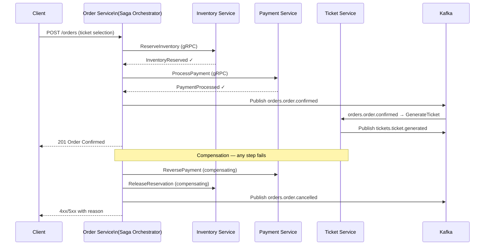
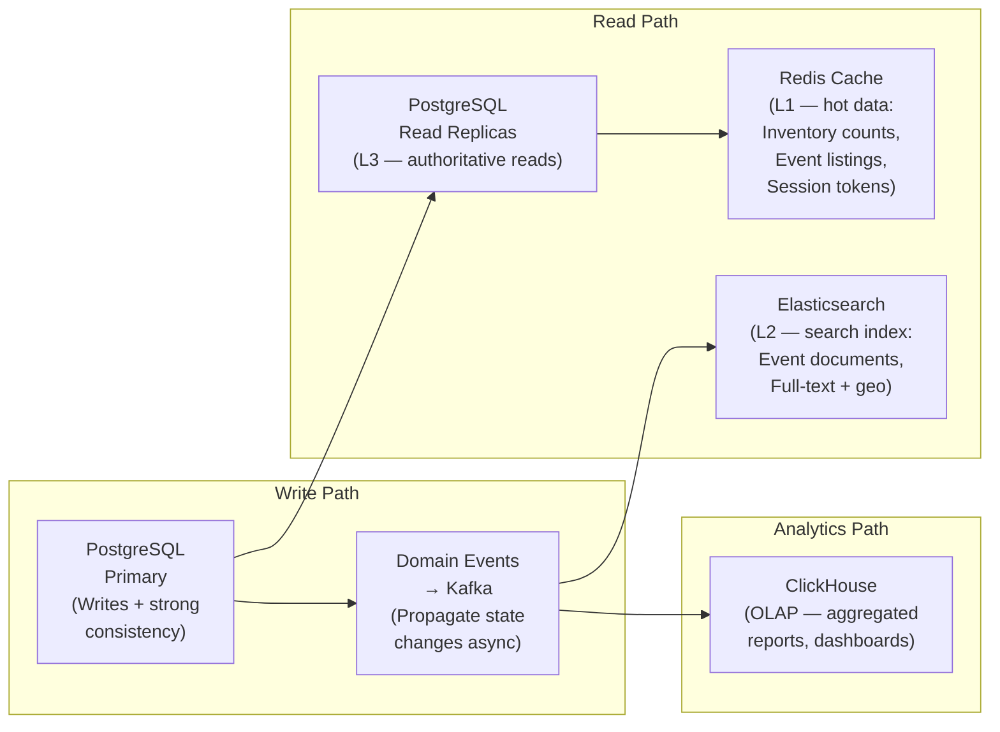
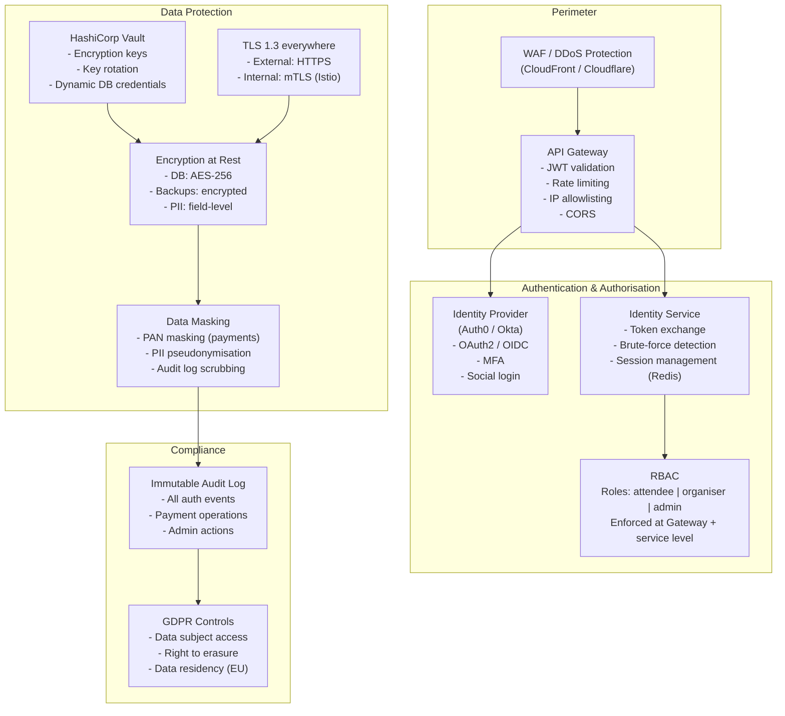
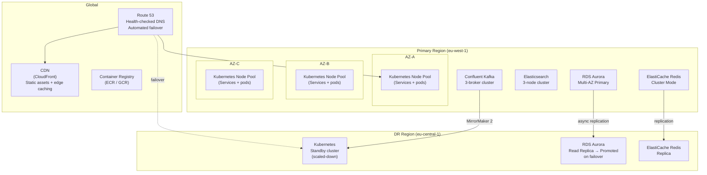
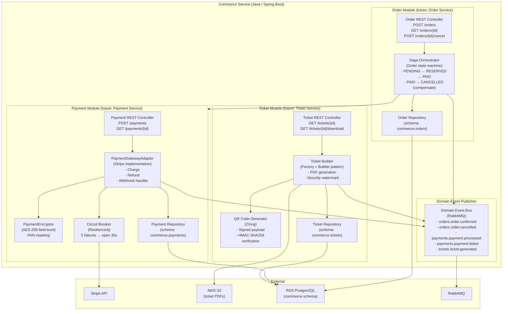
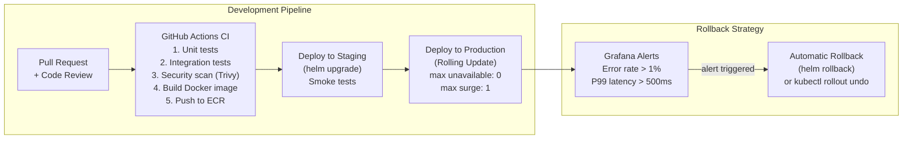
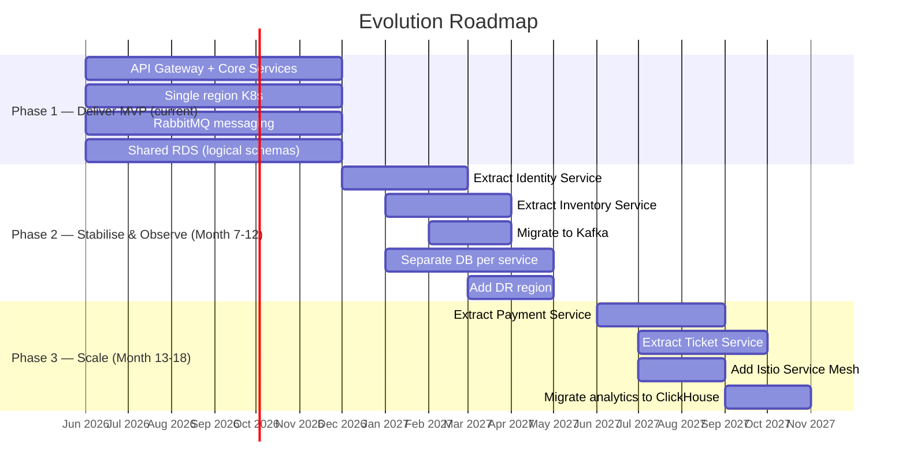

# Event Ticket Booking System — Microservices Architecture

**Designed by Neo, Software Architect · May 2026**

---

## Table of Contents

1. [Architecture Overview](#1-architecture-overview)
2. [Full Microservices Architecture — Target State](#2-full-microservices-architecture--target-state)
   - [Service Decomposition](#21-service-decomposition)
   - [Container Diagram (C4 Level 2)](#22-container-diagram-c4-level-2)
   - [Inter-Service Communication](#23-inter-service-communication)
   - [Data Architecture](#24-data-architecture)
   - [Security Architecture](#25-security-architecture)
   - [Infrastructure Architecture](#26-infrastructure-architecture)
3. [Feasibility Assessment](#3-feasibility-assessment)
   - [Constraint Analysis](#31-constraint-analysis)
   - [Complexity vs Timeline](#32-complexity-vs-timeline)
   - [Budget Analysis](#33-budget-analysis)
   - [Verdict](#34-verdict)
4. [Adjusted Architecture — Pragmatic Delivery](#4-adjusted-architecture--pragmatic-delivery)
   - [Service Consolidation Strategy](#41-service-consolidation-strategy)
   - [Container Diagram (Adjusted)](#42-container-diagram-adjusted)
   - [Component Diagram — Commerce Service](#43-component-diagram--commerce-service)
   - [Infrastructure Simplification](#44-infrastructure-simplification)
   - [Deployment Diagram](#45-deployment-diagram)
   - [Phased Evolution Plan](#46-phased-evolution-plan)
5. [Architecture Decisions](#5-architecture-decisions)
6. [Risk Register](#6-risk-register)
7. [Cross-Cutting Concerns](#7-cross-cutting-concerns)

---

## 1. Architecture Overview

This document defines the microservices architecture for the Event Ticket Booking System. It is structured in two tiers:

- **Target Architecture** — the ideal long-term microservices decomposition optimised for maximum scalability, resilience, and independent deployability across all bounded contexts.
- **Pragmatic Architecture** — a constrained but strategically equivalent architecture designed to be delivered by a team of 10 developers within 6 months and a $500 000 budget, while preserving all architectural extension points needed to evolve toward the target state.

The system must satisfy the following primary quality attributes, ranked by combined business and technical priority:

| Rank | Quality Attribute | Driving Scenarios |
|------|------------------|-------------------|
| 1 | **Concurrency & Consistency** | QAS001, QAS007, QAS008 |
| 2 | **Security** | QAS003, QAS004 |
| 3 | **Scalability** | QAS006, QAS001 |
| 4 | **Resilience & Recovery** | QAS015, QAS013 |
| 5 | **Deployability** | QAS021, QAS022, QAS025 |
| 6 | **Observability** | QAS012 |

---

## 2. Full Microservices Architecture — Target State

### 2.1 Service Decomposition

The target architecture decomposes the system into **12 independently deployable microservices**, each owning its bounded context, data store, and deployment lifecycle.

| # | Service | Bounded Context | Owns | Primary DB |
|---|---------|----------------|------|------------|
| 1 | API Gateway | Cross-cutting | Routing, Rate-limiting, TLS termination | — |
| 2 | Identity Service | Authentication | Registration, Login, Token issuance, MFA | Redis (sessions) |
| 3 | User Profile Service | User Management | Profiles, preferences, GDPR data | PostgreSQL |
| 4 | Event Service | Event Management | Event CRUD, status lifecycle | PostgreSQL |
| 5 | Inventory Service | Ticket Inventory | Ticket types, capacity, reservations | PostgreSQL |
| 6 | Order Service | Commerce | Order lifecycle, Saga orchestration | PostgreSQL |
| 7 | Payment Service | Commerce | Payment processing, gateway adapter, encryption | PostgreSQL |
| 8 | Ticket Service | Fulfilment | QR generation, ticket content, security features | MongoDB |
| 9 | Delivery Service | Fulfilment | Email/mobile delivery, delivery tracking | PostgreSQL |
| 10 | Notification Service | Notifications | User + organiser notifications, preferences | PostgreSQL |
| 11 | Search Service | Discovery | Full-text event search, geo-filtering | Elasticsearch |
| 12 | Analytics Service | Reporting | Organiser dashboards, sales metrics | ClickHouse |

### 2.2 Container Diagram (C4 Level 2)

```mermaid
graph TB
    subgraph Clients["Client Layer"]
        WebApp["Web Application\n(React / Next.js)"]
        MobileApp["Mobile Application\n(React Native)"]
    end

    subgraph Gateway["Gateway Layer"]
        APIGW["API Gateway\n(Kong / AWS APIGW)\n- Rate limiting\n- JWT validation\n- TLS termination\n- Routing"]
    end

    subgraph CoreServices["Core Domain Services"]
        IdentitySvc["Identity Service\n(Node.js)\nAuth, tokens, MFA"]
        UserSvc["User Profile Service\n(Node.js)\nProfiles, GDPR"]
        EventSvc["Event Service\n(Java/Spring)\nEvent CRUD"]
        InventorySvc["Inventory Service\n(Java/Spring)\nCapacity, reservations"]
        OrderSvc["Order Service\n(Java/Spring)\nSaga orchestration"]
        PaymentSvc["Payment Service\n(Java/Spring)\nGateway adapter"]
        TicketSvc["Ticket Service\n(Java/Spring)\nQR + security"]
        DeliverySvc["Delivery Service\n(Node.js)\nEmail / mobile"]
        NotificationSvc["Notification Service\n(Node.js)\nEvent-driven alerts"]
        SearchSvc["Search Service\n(Node.js)\nFull-text search"]
        AnalyticsSvc["Analytics Service\n(Python)\nDashboards, reports"]
    end

    subgraph Messaging["Async Messaging"]
        Kafka["Apache Kafka\nEvent Streaming\n- Topic-per-domain\n- Consumer groups"]
    end

    subgraph DataStores["Data Stores"]
        PG_Identity["PostgreSQL\nIdentity"]
        PG_User["PostgreSQL\nUser Profiles"]
        PG_Event["PostgreSQL\nEvents"]
        PG_Inventory["PostgreSQL\nInventory"]
        PG_Order["PostgreSQL\nOrders"]
        PG_Payment["PostgreSQL\nPayments"]
        Mongo_Ticket["MongoDB\nTickets"]
        PG_Delivery["PostgreSQL\nDelivery"]
        PG_Notification["PostgreSQL\nNotifications"]
        ES["Elasticsearch\nSearch Index"]
        CH["ClickHouse\nAnalytics"]
        Redis["Redis Cluster\nCache + Sessions"]
    end

    subgraph ExternalSystems["External Systems"]
        IdP["Identity Provider\n(Auth0 / Okta)"]
        PayGW["Payment Gateway\n(Stripe / Braintree)"]
        EmailSvc["Email Service\n(SendGrid)"]
        VenueSys["Venue Management\nSystem"]
        SMSSvc["SMS / Push Service\n(Twilio / FCM)"]
    end

    subgraph Infra["Infrastructure & Observability"]
        ServiceMesh["Service Mesh\n(Istio)\nmTLS, circuit breaking"]
        Prometheus["Prometheus\n+ Grafana"]
        Jaeger["Distributed Tracing\n(Jaeger)"]
        Vault["HashiCorp Vault\nSecret Management"]
    end

    WebApp --> APIGW
    MobileApp --> APIGW

    APIGW --> IdentitySvc
    APIGW --> UserSvc
    APIGW --> EventSvc
    APIGW --> InventorySvc
    APIGW --> OrderSvc
    APIGW --> PaymentSvc
    APIGW --> TicketSvc
    APIGW --> DeliverySvc
    APIGW --> SearchSvc
    APIGW --> AnalyticsSvc

    IdentitySvc --> IdP
    IdentitySvc --> PG_Identity
    IdentitySvc --> Redis

    UserSvc --> PG_User
    EventSvc --> PG_Event
    EventSvc --> VenueSys
    InventorySvc --> PG_Inventory
    InventorySvc --> Redis

    OrderSvc --> PG_Order
    OrderSvc --> Redis

    PaymentSvc --> PayGW
    PaymentSvc --> PG_Payment
    PaymentSvc --> Vault

    TicketSvc --> Mongo_Ticket
    TicketSvc --> Redis

    DeliverySvc --> EmailSvc
    DeliverySvc --> SMSSvc
    DeliverySvc --> PG_Delivery

    NotificationSvc --> EmailSvc
    NotificationSvc --> SMSSvc
    NotificationSvc --> PG_Notification

    SearchSvc --> ES

    AnalyticsSvc --> CH

    EventSvc --> Kafka
    InventorySvc --> Kafka
    OrderSvc --> Kafka
    PaymentSvc --> Kafka
    TicketSvc --> Kafka
    DeliverySvc --> Kafka
    NotificationSvc --> Kafka
    SearchSvc --> Kafka
    AnalyticsSvc --> Kafka

    ServiceMesh -.->|mTLS + observability| CoreServices
    Prometheus -.->|scrapes| CoreServices
    Jaeger -.->|traces| CoreServices
    Vault -.->|secrets| CoreServices
```



### 2.3 Inter-Service Communication

The target architecture enforces a strict communication contract between services:

| Pattern | Use Case | Technology |
|---------|----------|------------|
| **Synchronous REST** | Client-facing requests via Gateway | HTTPS / REST + OpenAPI |
| **Synchronous gRPC** | Internal service-to-service (high-frequency, latency-critical) | gRPC over mTLS (Istio) |
| **Asynchronous Events** | Domain events, saga steps, search indexing, analytics | Apache Kafka |

**Domain Event Catalogue (Kafka Topics):**

| Topic | Published By | Consumed By |
|-------|-------------|-------------|
| `identity.user.registered` | Identity Svc | User Profile Svc, Notification Svc |
| `events.event.created` | Event Svc | Search Svc, Analytics Svc |
| `inventory.reserved` | Inventory Svc | Order Svc, Search Svc |
| `inventory.released` | Inventory Svc | Order Svc, Search Svc |
| `orders.order.created` | Order Svc | Payment Svc, Notification Svc |
| `orders.order.confirmed` | Order Svc | Ticket Svc, Inventory Svc, Notification Svc |
| `orders.order.cancelled` | Order Svc | Inventory Svc, Payment Svc, Notification Svc |
| `payments.payment.processed` | Payment Svc | Order Svc, Ticket Svc |
| `payments.payment.failed` | Payment Svc | Order Svc, Notification Svc |
| `tickets.ticket.generated` | Ticket Svc | Delivery Svc |
| `delivery.completed` | Delivery Svc | Notification Svc, Analytics Svc |

**Saga Pattern — Ticket Purchase Flow:**



### 2.4 Data Architecture

Each service owns its data store exclusively. No service may query another service's database directly.



**Concurrency Control — Inventory (QAS001, QAS007, QAS008):**

Inventory reservation uses **Optimistic Locking** with a version field to prevent overselling under high concurrency without escalating to pessimistic locks that would become a bottleneck.

```sql
UPDATE inventory
SET    reserved_count = reserved_count + :quantity,
       version        = version + 1
WHERE  id             = :inventory_id
  AND  version        = :expected_version
  AND  (total_capacity - reserved_count) >= :quantity;
-- Rows affected = 0 → conflict → retry or reject
```

### 2.5 Security Architecture



### 2.6 Infrastructure Architecture

The full target infrastructure runs across two cloud regions for geographic redundancy (QAS015):



---

## 3. Feasibility Assessment

### 3.1 Constraint Analysis

| Constraint | Value | Implication |
|------------|-------|-------------|
| Timeline | 6 months | ~26 working weeks |
| Team size | 10 developers | Includes all roles |
| Budget | $500 000 | People + infrastructure + tooling |
| Available person-months | ~60 person-months | 10 devs × 6 months |

### 3.2 Complexity vs Timeline

**Full target architecture complexity score:**

| Area | Services / Components | Setup Effort (person-weeks) |
|------|--------------------|---------------------------|
| Microservices (12 services) | 12 | ~48 |
| Service Mesh (Istio) | 1 | ~6 |
| Apache Kafka (multi-broker) | 1 cluster | ~4 |
| Multi-region Kubernetes | 2 clusters | ~8 |
| Elasticsearch cluster | 1 | ~3 |
| ClickHouse analytics | 1 | ~3 |
| HashiCorp Vault | 1 | ~3 |
| CI/CD per service (GitOps + ArgoCD) | 12 pipelines | ~10 |
| Integration test harness | — | ~6 |
| Security hardening | — | ~5 |
| **Total** | | **~96 person-weeks** |

Available capacity for delivery work: **60 person-months ≈ ~240 person-weeks** (gross). After accounting for planning overhead (15%), meetings, code review, documentation, and ramp-up, effective delivery capacity is approximately **~170 person-weeks**.

However, with 10 developers coordinating across 12 autonomous services, communication overhead is high (Conway's Law friction). Each inter-service contract requires joint design, versioning, and integration testing, multiplying complexity beyond the raw estimate.

**Assessment: delivering the full target architecture in 6 months with 10 developers carries a HIGH risk of delivery failure.** The infrastructure and operations complexity alone would consume an estimated 40% of available capacity, leaving insufficient bandwidth for feature delivery against all high-priority user stories.

### 3.3 Budget Analysis

**Target architecture budget breakdown:**

| Category | 6-Month Cost (USD) | Notes |
|----------|-------------------|-------|
| Team (10 devs, blended rate) | $420 000 | $7 000/dev/month avg |
| Multi-region Kubernetes (EKS × 2) | $18 000 | ~$3 000/month |
| Managed Kafka (Confluent Cloud) | $9 000 | ~$1 500/month |
| RDS Aurora (primary + DR replica) | $8 400 | ~$1 400/month |
| Elasticsearch (managed) | $6 000 | ~$1 000/month |
| Redis ElastiCache | $3 600 | ~$600/month |
| ClickHouse Cloud | $3 000 | ~$500/month |
| HashiCorp Vault (HCP) | $2 400 | ~$400/month |
| CDN, monitoring, misc | $4 200 | ~$700/month |
| Tooling & licences | $10 000 | Auth0, Datadog, etc. |
| **Total** | **~$484 600** | |

The budget appears to barely fit on paper, but this assumes no buffer for cost overruns, no contingency, and no allowance for team overhead (hardware, software licences, travel). In practice, managed services at production scale routinely exceed initial estimates by 20–30%, pushing the real cost to **~$560–600k — over budget**.

### 3.4 Verdict

> **The full target microservices architecture is NOT feasible within the stated constraints of 6 months, 10 developers, and $500 000.**
>
> The primary blockers are: (1) infrastructure complexity consuming a disproportionate share of team capacity, (2) coordination overhead across 12 independent services with a 10-person team, and (3) budget risk from multi-region, multi-technology managed services.
>
> The architecture must be adjusted. The adjustment strategy preserves all core architectural patterns and extension points, consolidates services at bounded-context level rather than aggregate level, and simplifies infrastructure without sacrificing the primary quality attributes.

---

## 4. Adjusted Architecture — Pragmatic Delivery

### 4.1 Service Consolidation Strategy

The adjustment consolidates the 12 target services into **6 bounded-context macro-services**. Each macro-service is internally modular — its code is structured as cohesive, independently testable modules that can be extracted into separate deployment units as the team grows. This is the **Strangler Fig** preparation pattern.

| Macro-Service | Consolidates | Rationale |
|--------------|-------------|-----------|
| **Gateway** | API Gateway | Unchanged — gateway is already atomic |
| **Identity & User** | Identity + User Profile | Shared auth context; split after 6 months when team scales |
| **Event & Inventory** | Event + Inventory | Same team, tight domain coupling at MVP; split when load demands |
| **Commerce** | Order + Payment + Ticket | Single transactional boundary; Saga logic stays coherent in one deployment unit |
| **Fulfillment** | Delivery + Notification | Both are async, event-driven, stateless workers — simple to maintain together |
| **Discovery** | Search + Analytics | Both are read-only projections; share Elasticsearch and consumer group |

**Infrastructure simplifications:**

| Full Target | Adjusted | Impact |
|-------------|----------|--------|
| Apache Kafka | RabbitMQ (AWS SQS as fallback) | Simpler to operate, sufficient for MVP throughput |
| Istio Service Mesh | HTTP-level health checks + basic circuit breaker (Resilience4j) | Eliminates 6-week Istio setup; mTLS achieved via network policies |
| Multi-region Kubernetes | Single region, 3 AZs | Eliminates DR complexity; add second region in phase 2 |
| 12 separate database instances | PostgreSQL schemas per service on RDS Aurora | Lower infra cost; data isolation preserved logically |
| ClickHouse | PostgreSQL read replica for analytics | Sufficient for MVP reporting; migrate to OLAP in phase 2 |
| HashiCorp Vault | AWS Secrets Manager | Managed, simpler, no self-hosted infrastructure |

### 4.2 Container Diagram (Adjusted)

```mermaid
graph TB
    subgraph Clients["Client Layer"]
        WebApp["Web Application\n(React / Next.js)"]
        MobileApp["Mobile Application\n(React Native / PWA)"]
    end

    subgraph GatewayLayer["Gateway Layer"]
        APIGW["API Gateway\n(AWS API GW / Kong)\n- JWT validation\n- Rate limiting (per-user, per-IP)\n- TLS termination\n- Request routing\n- Circuit breaker"]
    end

    subgraph MacroServices["Macro-Services (K8s Deployments)"]
        IdentityUserSvc["Identity & User Service\n(Node.js / TypeScript)\n──────────────────\n• Auth module (OAuth2 + IdP)\n• Session module (Redis)\n• User profile module\n• GDPR compliance module\nPORT: 3001"]

        EventInventorySvc["Event & Inventory Service\n(Java / Spring Boot)\n──────────────────\n• Event CRUD module\n• Event status lifecycle\n• Inventory capacity module\n• Reservation module (optimistic locking)\n• Venue sync module\nPORT: 3002"]

        CommerceSvc["Commerce Service\n(Java / Spring Boot)\n──────────────────\n• Order module (Saga orchestrator)\n• Payment module (gateway adapter)\n• Ticket generation module\n• QR + security feature module\n• Payment encryption module\nPORT: 3003"]

        FulfillmentSvc["Fulfillment Service\n(Node.js / TypeScript)\n──────────────────\n• Email delivery module\n• Mobile push module\n• Notification preferences\n• Delivery tracking module\nPORT: 3004"]

        DiscoverySvc["Discovery Service\n(Node.js / TypeScript)\n──────────────────\n• Full-text event search\n• Geo-based filtering\n• Advanced filtering\n• Organiser analytics\nPORT: 3005"]
    end

    subgraph Messaging["Async Messaging"]
        RMQ["RabbitMQ\n(CloudAMQP / AWS MQ)\n- Durable exchanges\n- Dead-letter queues\n- Per-domain topic routing"]
    end

    subgraph DataLayer["Data Layer"]
        RDS["AWS RDS Aurora PostgreSQL\n(Multi-AZ)\n────────────────────\nschema: identity_users\nschema: events_inventory\nschema: commerce\nschema: fulfillment\nschema: discovery"]
        Redis["AWS ElastiCache Redis\n────────────────────\n• Session tokens\n• Inventory availability cache\n• Event listing cache\n• Rate-limit counters"]
        ES["Elasticsearch\n(AWS OpenSearch)\n────────────────────\n• Event search index\n• Geo-spatial queries"]
        S3["AWS S3\n────────────────────\n• Ticket PDF/QR storage\n• Event images\n• Backup storage"]
    end

    subgraph External["External Systems"]
        IdP["Auth0 / Okta\n(Identity Provider)"]
        PayGW["Stripe\n(Payment Gateway)"]
        SendGrid["SendGrid\n(Email)"]
        FCM["FCM / APNs\n(Push Notifications)"]
        VenueSys["Venue Management\nSystem"]
    end

    subgraph Observability["Observability Stack"]
        Prom["Prometheus\n+ Grafana\n(Metrics + Dashboards)"]
        Loki["Grafana Loki\n(Log Aggregation)"]
        Tempo["Grafana Tempo\n(Distributed Tracing)"]
    end

    subgraph SecretsMgmt["Security"]
        SecretsManager["AWS Secrets Manager\n(Credentials, API keys,\nencryption keys)"]
    end

    WebApp --> APIGW
    MobileApp --> APIGW

    APIGW --> IdentityUserSvc
    APIGW --> EventInventorySvc
    APIGW --> CommerceSvc
    APIGW --> FulfillmentSvc
    APIGW --> DiscoverySvc

    IdentityUserSvc --> IdP
    IdentityUserSvc --> RDS
    IdentityUserSvc --> Redis
    IdentityUserSvc --> SecretsManager

    EventInventorySvc --> RDS
    EventInventorySvc --> Redis
    EventInventorySvc --> VenueSys
    EventInventorySvc --> RMQ

    CommerceSvc --> PayGW
    CommerceSvc --> RDS
    CommerceSvc --> Redis
    CommerceSvc --> S3
    CommerceSvc --> RMQ
    CommerceSvc --> SecretsManager

    FulfillmentSvc --> SendGrid
    FulfillmentSvc --> FCM
    FulfillmentSvc --> RDS
    FulfillmentSvc --> RMQ
    FulfillmentSvc --> S3

    DiscoverySvc --> ES
    DiscoverySvc --> RDS
    DiscoverySvc --> RMQ

    Prom -.->|scrapes /metrics| MacroServices
    Loki -.->|log shipping| MacroServices
    Tempo -.->|trace collection| MacroServices
```



### 4.3 Component Diagram — Commerce Service

The Commerce Service is the most critical service, owning the core transactional boundary. Its internal component structure is shown below to illustrate the modular design that enables future extraction into the target 3-service decomposition.



### 4.4 Infrastructure Simplification

```mermaid
graph TB
    subgraph "Internet / Edge"
        Users["End Users"]
        Route53["Route 53\n(DNS + Health Checks)"]
        CF["CloudFront CDN\n(Static assets, edge cache)"]
        WAF["AWS WAF\n(DDoS, SQLi, XSS protection)"]
    end

    subgraph "Single Region: eu-west-1"
        subgraph "Public Subnets"
            ALB["Application Load Balancer\n(HTTPS + HTTP/2)"]
        end

        subgraph "Private Subnets — AZ-A, AZ-B, AZ-C"
            subgraph "EKS Cluster (Kubernetes)"
                GW["API Gateway Pod(s)\nHPA: 2–10 replicas"]
                S1["Identity & User\nHPA: 2–6 replicas"]
                S2["Event & Inventory\nHPA: 2–8 replicas"]
                S3_pod["Commerce\nHPA: 2–8 replicas"]
                S4["Fulfillment\nHPA: 2–4 replicas"]
                S5["Discovery\nHPA: 2–4 replicas"]
            end

            RDS_P["RDS Aurora PostgreSQL\n(Multi-AZ, 5 schemas)\nPrimary: r6g.xlarge\nRead Replica: r6g.large"]
            Redis_C["ElastiCache Redis\n(cluster mode, 3 shards)\ncache.r6g.large"]
            ES_C["AWS OpenSearch\n(3 nodes)\nm6g.large"]
            RMQ_C["Amazon MQ (RabbitMQ)\n(active/standby)\nmq.m5.large"]
            S3_store["AWS S3\n(ticket PDFs, images,\nbackups)"]
        end
    end

    subgraph "CI/CD & DevOps"
        GHA["GitHub Actions\n(build, test, push image)"]
        ArgoCD_lite["Helm Releases\n(kubectl apply -k)\nper-environment values"]
        ECR_reg["ECR\n(container images)"]
    end

    subgraph "Secrets & Security"
        SecretsM["AWS Secrets Manager\n(all credentials,\nAPI keys, DB passwords)"]
        KMS["AWS KMS\n(encryption keys for\nRDS, S3, Secrets Manager)"]
    end

    subgraph "Observability"
        Grafana_Stack["Grafana Cloud\n(Prometheus metrics,\nLoki logs, Tempo traces)\nSelf-hosted on K8s"]
    end

    Users --> Route53
    Route53 --> CF
    CF --> WAF
    WAF --> ALB
    ALB --> GW
    GW --> S1
    GW --> S2
    GW --> S3_pod
    GW --> S4
    GW --> S5

    S1 --> RDS_P
    S2 --> RDS_P
    S3_pod --> RDS_P
    S4 --> RDS_P
    S5 --> ES_C

    S2 --> Redis_C
    S3_pod --> Redis_C
    S1 --> Redis_C

    S2 --> RMQ_C
    S3_pod --> RMQ_C
    S4 --> RMQ_C
    S5 --> RMQ_C

    S3_pod --> S3_store
    S4 --> S3_store

    SecretsM --> S1
    SecretsM --> S3_pod
    KMS --> SecretsM
    KMS --> RDS_P
    KMS --> S3_store

    GHA --> ECR_reg
    ECR_reg --> GW
    Grafana_Stack -.->|observe| EKS Cluster
```

### 4.5 Deployment Diagram

The adjusted architecture uses a **single Kubernetes cluster across 3 Availability Zones** with Horizontal Pod Autoscaling per service. Zero-downtime deployments are achieved via rolling updates and RollingUpdate deployment strategy (QAS021).



**Resource sizing (adjusted — production baseline):**

| Service | CPU Request | CPU Limit | Mem Request | Mem Limit | Min Replicas | Max Replicas |
|---------|------------|-----------|-------------|-----------|-------------|-------------|
| API Gateway | 250m | 1000m | 256Mi | 512Mi | 2 | 10 |
| Identity & User | 500m | 2000m | 512Mi | 1Gi | 2 | 6 |
| Event & Inventory | 500m | 2000m | 512Mi | 2Gi | 2 | 8 |
| Commerce | 1000m | 4000m | 1Gi | 4Gi | 2 | 8 |
| Fulfillment | 250m | 1000m | 256Mi | 512Mi | 2 | 4 |
| Discovery | 500m | 2000m | 512Mi | 1Gi | 2 | 4 |

### 4.6 Phased Evolution Plan

The adjusted architecture is designed with explicit **extraction seams** to enable progressive migration toward the target architecture without a rewrite:



**Team composition for delivery (adjusted):**

| Role | Count | Primary Responsibility |
|------|-------|----------------------|
| Tech Lead / Architect | 1 | Architecture governance, code review, unblocking |
| Backend Developer | 4 | 1 per macro-service (Identity/User, Event/Inventory, Commerce, Fulfillment/Discovery) |
| Frontend Developer | 2 | Web app, mobile PWA |
| DevOps Engineer | 1 | K8s, CI/CD, IaC (Terraform), monitoring |
| QA Engineer | 1 | Test automation, integration tests, performance tests |
| Security Engineer | 1 | Security reviews, pen-test coordination, GDPR implementation |

**Adjusted budget breakdown (6 months):**

| Category | Monthly Cost | 6-Month Total |
|----------|-------------|---------------|
| Team (10 people, blended $7k/month) | $70 000 | $420 000 |
| EKS Cluster (3 AZs, ~12 nodes) | $2 800 | $16 800 |
| RDS Aurora Multi-AZ | $1 400 | $8 400 |
| ElastiCache Redis | $600 | $3 600 |
| AWS OpenSearch (3 nodes) | $700 | $4 200 |
| Amazon MQ (RabbitMQ) | $400 | $2 400 |
| CloudFront + WAF + ALB | $400 | $2 400 |
| S3 + KMS + Secrets Manager | $200 | $1 200 |
| Grafana Cloud (observability) | $300 | $1 800 |
| Auth0 (Identity Provider) | $500 | $3 000 |
| SendGrid (email) | $200 | $1 200 |
| Tooling (GitHub, Jira, misc) | $500 | $3 000 |
| Contingency (5%) | — | $23 500 |
| **Total** | | **~$491 500** |

> **The adjusted architecture is feasible within the $500 000 budget, with ~$8 500 contingency headroom.**

---

## 5. Architecture Decisions

| ID | Decision | Rationale | Alternatives Rejected |
|----|----------|-----------|----------------------|
| AD-01 | Macro-services with internal modules (adjusted) | Delivers bounded context isolation without the coordination tax of 12 separate CI/CD pipelines and service contracts for a 10-person team | Full microservices (too complex for team size); Monolith (violates extensibility requirements) |
| AD-02 | PostgreSQL schemas per service on shared RDS | Enforces logical data isolation, maintains budget, enables future physical separation via `pg_dump` + replica promotion | Separate RDS instances (cost ~3×); MongoDB (schema flexibility not needed for structured domain data) |
| AD-03 | RabbitMQ for async messaging | Simpler operational model than Kafka; sufficient throughput for MVP (100k messages/day); native dead-letter queue support | Kafka (operational complexity); AWS SQS (vendor lock-in risk, limited routing) |
| AD-04 | Optimistic locking for inventory reservation | Scales under high concurrency without lock contention; `version` field prevents overselling at DB level | Pessimistic locking (serialisation bottleneck under QAS001 load); Redis atomic operations (requires additional complexity) |
| AD-05 | Saga Orchestration in Commerce Service | Centralises transaction coordination; clearer failure visibility; easier debugging than choreography | Saga Choreography (harder to trace failure paths across 3 modules); 2PC (distributed transaction, unsupported by PostgreSQL across schemas) |
| AD-06 | Circuit Breaker per external integration (Resilience4j) | Prevents cascading failures when Stripe or Auth0 experiences degradation; fast fail with fallback response | No circuit breaker (cascading failure risk); Istio circuit breaker (requires service mesh, deferred to Phase 2) |
| AD-07 | Auth0 as Identity Provider | Offloads OAuth2/OIDC, MFA, social login complexity; reduces Identity Service scope; GDPR-compliant EU data residency | Build custom IdP (3–4 months effort, high security risk); Cognito (limited social login, weaker customisation) |
| AD-08 | AWS Secrets Manager for secret storage | Managed, no self-hosted infrastructure, native IAM integration, automatic rotation | HashiCorp Vault (operational burden for small DevOps team); Environment variables (insecure) |
| AD-09 | Single region, 3-AZ deployment for MVP | Achieves 99.9% availability via Multi-AZ RDS and K8s pod spread; multi-region deferred to Phase 2 | Multi-region from day 1 (exceeds budget and team capacity) |
| AD-10 | Grafana stack (Prometheus + Loki + Tempo) on K8s | Unified observability with zero additional SaaS cost; covers metrics, logs, and traces from day 1 | Datadog (cost ~$4k/month at scale); CloudWatch only (limited distributed tracing) |

---

## 6. Risk Register

| ID | Risk | Probability | Impact | Mitigation |
|----|------|------------|--------|------------|
| R-01 | Commerce Service becomes too large to maintain | Medium | High | Enforce strict internal module boundaries; schedule extraction in Phase 2 Sprint 1 |
| R-02 | Shared RDS schema contention during peak traffic | Low | High | Per-schema connection pools; read replica for analytics queries; RDS Proxy for connection management |
| R-03 | RabbitMQ message loss on consumer crash | Low | High | Persistent durable queues; dead-letter exchange with alerting; idempotent consumers with message deduplication |
| R-04 | Stripe downtime during peak event sales | Medium | High | Circuit Breaker (AD-06); graceful degradation: reserve order, retry payment async; user-facing status page |
| R-05 | Inventory overselling under flash sale load | Low | Critical | Optimistic locking (AD-04); Redis inventory count cache with atomic DECR; load test before every major event |
| R-06 | GDPR non-compliance | Low | Critical | Data classification registry; field-level encryption for PII; right-to-erasure API in Identity & User Service; DPA with Auth0, Stripe, SendGrid |
| R-07 | 6-month timeline slip | Medium | High | Strict MVP scope (defer US019/US020/US023 to phase 2); weekly architecture reviews; de-scope Analytics to basic Postgres queries |
| R-08 | Single DevOps engineer is a bottleneck | High | Medium | Document all IaC (Terraform); runbooks for all K8s operations; automate as much as possible in CI/CD; cross-train one backend dev on K8s basics |

---

## 7. Cross-Cutting Concerns

### 7.1 Observability (QAS012)

All macro-services expose:
- **`GET /metrics`** — Prometheus scrape endpoint (via Micrometer / prom-client)
- **`GET /health`** — Kubernetes liveness probe
- **`GET /health/ready`** — Kubernetes readiness probe
- **Structured JSON logs** shipped to Loki via Fluent Bit DaemonSet
- **OpenTelemetry trace context propagation** via HTTP headers (`traceparent`) — traces visualised in Grafana Tempo

**Alerting thresholds:**

| Metric | Warning | Critical |
|--------|---------|----------|
| HTTP 5xx error rate | > 0.5% | > 1% |
| P99 latency (Commerce) | > 500ms | > 1000ms |
| P99 latency (Inventory reserve) | > 200ms | > 500ms |
| RabbitMQ queue depth | > 1 000 | > 10 000 |
| RDS CPU utilisation | > 70% | > 85% |
| Redis memory utilisation | > 75% | > 90% |

### 7.2 API Versioning (C002.2.1)

All public APIs are versioned under `/api/v1/`. Breaking changes require a new version path. The API Gateway enforces version routing and can route `v1` and `v2` traffic to different service versions simultaneously, enabling zero-downtime migrations.

### 7.3 Data Protection Summary (C003.x)

| Requirement | Implementation |
|-------------|---------------|
| Encryption in transit | TLS 1.3 (external), TLS 1.2+ (internal VPC) |
| Encryption at rest | RDS AES-256 (AWS KMS), S3 SSE-KMS, Redis encryption |
| PII field-level encryption | Commerce Service: PAN masked; Identity: email/phone hashed for lookup |
| Key rotation | AWS KMS automatic annual rotation; Secrets Manager 90-day password rotation |
| GDPR right to erasure | `/api/v1/users/{id}` DELETE → pseudonymises PII across all schemas |
| Audit logging | Immutable audit trail in Loki (tamper-evident log shipping) |

### 7.4 Testing Strategy (C010.x)

| Level | Tool | Responsibility | Gate |
|-------|------|---------------|------|
| Unit tests | JUnit 5 / Jest | Every developer | CI (block on < 80% coverage) |
| Integration tests | Testcontainers (Java) / Supertest (Node) | Every developer | CI |
| Contract tests | Pact | Cross-service API contracts | CI (block on failure) |
| End-to-end tests | Playwright | QA Engineer | Staging deployment gate |
| Performance tests | k6 | QA + DevOps | Pre-production gate for inventory + payment paths |
| Security scanning | Trivy (container), OWASP ZAP (API) | CI pipeline | Block on critical CVEs |

---

*Architecture authored by Neo, Software Architect — May 2026*
*This document supersedes all prior architecture proposals for the Event Ticket Booking System.*
*Next review: Phase 2 kickoff (Month 7)*
