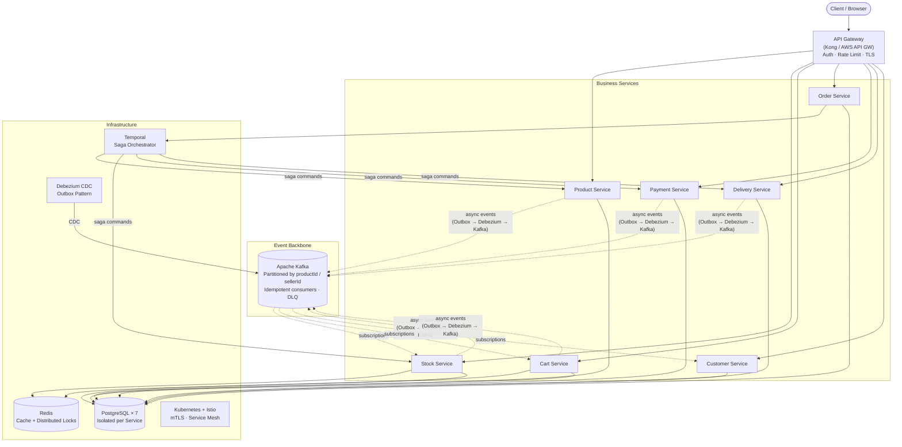

```mermaid
graph TB
    Client([Client / Browser])
    GW["API Gateway\n(Kong / AWS API GW)\nAuth · Rate Limit · TLS"]

    subgraph BIZ["Business Services"]
        PS[Product Service]
        SS[Stock Service]
        CS[Cart Service]
        OS[Order Service]
        PAY[Payment Service]
        DEL[Delivery Service]
        CUS[Customer Service]
    end

    subgraph EVT["Event Backbone"]
        KAFKA[("Apache Kafka\nPartitioned by productId / sellerId\nIdempotent consumers · DLQ")]
    end

    subgraph INFRA["Infrastructure"]
        REDIS[("Redis\nCache + Distributed Locks")]
        TEMPORAL["Temporal\nSaga Orchestrator"]
        DEBEZIUM["Debezium CDC\nOutbox Pattern"]
        PG[("PostgreSQL × 7\nIsolated per Service")]
        MESH["Kubernetes + Istio\nmTLS · Service Mesh"]
    end

    Client --> GW
    GW --> PS & SS & CS & OS & PAY & DEL & CUS

    PS & SS & CS & PAY & DEL -.->|"async events\n(Outbox → Debezium → Kafka)"| KAFKA
    KAFKA -.->|subscriptions| SS & CS & CUS

    OS --> TEMPORAL
    TEMPORAL -->|"saga commands"| PS & SS & PAY & DEL

    CS & SS --> REDIS
    DEBEZIUM -->|CDC| KAFKA

    PS & SS & CS & OS & PAY & DEL & CUS --> PG
```